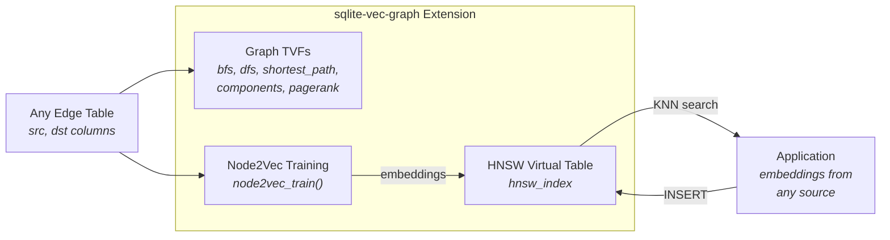

# sqlite-vec-graph

A zero-dependency C extension for SQLite that combines **HNSW vector similarity search**, **graph database primitives**, and **graph embedding generation** in a single shared library.

**[Documentation](https://neozenith.github.io/sqlite-vector-graph/)** | **[GitHub](https://github.com/neozenith/sqlite-vector-graph)**



## Features

- **HNSW Vector Index** &mdash; O(log N) approximate nearest neighbor search with incremental insert/delete
- **Graph Traversal** &mdash; BFS, DFS, shortest path, connected components, PageRank on any edge table
- **Node2Vec** &mdash; Learn structural node embeddings from graph topology, store in HNSW for similarity search
- **Zero dependencies** &mdash; Pure C11, compiles to a single `.dylib`/`.so`/`.dll`
- **SIMD accelerated** &mdash; ARM NEON and x86 SSE distance functions

## Build

Requires SQLite development headers and a C11 compiler.

```bash
# macOS (Homebrew SQLite recommended)
brew install sqlite
make all

# Linux
sudo apt-get install libsqlite3-dev
make all

# Run tests
make test        # C unit tests
make test-python # Python integration tests
make test-all    # Both
```

## Quick Start

```sql
.load ./vec_graph

-- Create an HNSW vector index
CREATE VIRTUAL TABLE my_vectors USING hnsw_index(
    dimensions=384, metric='cosine', m=16, ef_construction=200
);

-- Insert vectors
INSERT INTO my_vectors (rowid, vector) VALUES (1, ?);  -- 384-dim float32 blob

-- KNN search
SELECT rowid, distance FROM my_vectors
WHERE vector MATCH ?query AND k = 10 AND ef_search = 64;

-- Graph traversal on any edge table
SELECT node, depth FROM graph_bfs
WHERE edge_table = 'friendships' AND src_col = 'user_a'
  AND dst_col = 'user_b' AND start_node = 'alice' AND max_depth = 3
  AND direction = 'both';

-- Connected components
SELECT node, component_id, component_size FROM graph_components
WHERE edge_table = 'friendships' AND src_col = 'user_a' AND dst_col = 'user_b';

-- PageRank
SELECT node, rank FROM graph_pagerank
WHERE edge_table = 'citations' AND src_col = 'citing' AND dst_col = 'cited'
  AND damping = 0.85 AND iterations = 20;

-- Learn structural embeddings from graph topology
SELECT node2vec_train(
    'friendships', 'user_a', 'user_b', 'my_vectors',
    64, 1.0, 1.0, 10, 80, 5, 5, 0.025, 5
);
```

## Examples

Self-contained examples in the [`examples/`](examples/) directory:

| Example | Demonstrates |
|---------|-------------|
| [Semantic Search](examples/semantic_search/) | HNSW index, KNN queries, point lookup, delete |
| [Movie Recommendations](examples/movie_recommendations/) | Vector similarity for content-based recommendations |
| [Social Network](examples/social_network/) | Graph TVFs on a social graph (BFS, components, PageRank) |
| [Research Papers](examples/research_papers/) | Citation graph analysis with Node2Vec embeddings |
| [Transit Routes](examples/transit_routes/) | Shortest path and graph traversal on route networks |

```bash
make all
python examples/semantic_search/example.py
```

## API Reference

### HNSW Virtual Table (`hnsw_index`)

```sql
CREATE VIRTUAL TABLE name USING hnsw_index(
    dimensions=N,            -- vector dimensionality (required)
    metric='l2',             -- 'l2' | 'cosine' | 'inner_product'
    m=16,                    -- max connections per node per layer
    ef_construction=200      -- beam width during index construction
);
```

**Columns:**

| Column | Type | Hidden | Description |
|--------|------|--------|-------------|
| `rowid` | INTEGER | Yes | User-assigned ID for joining with application tables |
| `vector` | BLOB | No | `float32[dim]` &mdash; input for INSERT, MATCH constraint for search |
| `distance` | REAL | No | Computed distance (output only, during search) |
| `k` | INTEGER | Yes | Top-k parameter (search constraint) |
| `ef_search` | INTEGER | Yes | Search beam width (search constraint) |

**Operations:**

```sql
-- Insert
INSERT INTO t (rowid, vector) VALUES (42, ?blob);

-- KNN search
SELECT rowid, distance FROM t WHERE vector MATCH ?query AND k = 10;

-- Point lookup
SELECT vector FROM t WHERE rowid = 42;

-- Delete (with automatic neighbor reconnection)
DELETE FROM t WHERE rowid = 42;

-- Drop (removes index and all shadow tables)
DROP TABLE t;
```

**Shadow tables** (auto-managed):
- `{name}_config` &mdash; HNSW parameters
- `{name}_nodes` &mdash; stored vectors and level assignments
- `{name}_edges` &mdash; the proximity graph (usable by graph TVFs)

### Graph Table-Valued Functions

All graph TVFs work on **any** existing SQLite table with source/target columns. Table and column names are validated against SQL injection.

#### `graph_bfs` / `graph_dfs`

Breadth-first or depth-first traversal from a start node.

```sql
SELECT node, depth, parent FROM graph_bfs
WHERE edge_table = 'edges'
  AND src_col = 'src'
  AND dst_col = 'dst'
  AND start_node = 'node-42'
  AND max_depth = 5
  AND direction = 'forward';   -- 'forward' | 'reverse' | 'both'
```

| Output Column | Type | Description |
|---------------|------|-------------|
| `node` | TEXT | Node identifier |
| `depth` | INTEGER | Hop distance from start |
| `parent` | TEXT | Parent node in traversal tree (NULL for start) |

#### `graph_shortest_path`

Unweighted (BFS) or weighted (Dijkstra) shortest path.

```sql
-- Unweighted
SELECT node, distance, path_order FROM graph_shortest_path
WHERE edge_table = 'edges' AND src_col = 'src' AND dst_col = 'dst'
  AND start_node = 'A' AND end_node = 'Z' AND weight_col IS NULL;

-- Weighted (Dijkstra)
SELECT node, distance, path_order FROM graph_shortest_path
WHERE edge_table = 'edges' AND src_col = 'src' AND dst_col = 'dst'
  AND start_node = 'A' AND end_node = 'Z' AND weight_col = 'weight';
```

| Output Column | Type | Description |
|---------------|------|-------------|
| `node` | TEXT | Node on the path |
| `distance` | REAL | Cumulative distance from start |
| `path_order` | INTEGER | Position in path (0-indexed) |

#### `graph_components`

Connected components via Union-Find with path compression.

```sql
SELECT node, component_id, component_size FROM graph_components
WHERE edge_table = 'edges' AND src_col = 'src' AND dst_col = 'dst';
```

| Output Column | Type | Description |
|---------------|------|-------------|
| `node` | TEXT | Node identifier |
| `component_id` | INTEGER | Component index (0-based) |
| `component_size` | INTEGER | Number of nodes in this component |

#### `graph_pagerank`

Iterative power method PageRank with configurable damping and iterations.

```sql
SELECT node, rank FROM graph_pagerank
WHERE edge_table = 'edges' AND src_col = 'src' AND dst_col = 'dst'
  AND damping = 0.85        -- optional, default 0.85
  AND iterations = 20;      -- optional, default 20
```

| Output Column | Type | Description |
|---------------|------|-------------|
| `node` | TEXT | Node identifier |
| `rank` | REAL | PageRank score (sums to ~1.0) |

### `node2vec_train()`

Learn vector embeddings from graph structure using biased random walks (Node2Vec) and Skip-gram with Negative Sampling (SGNS).

```sql
SELECT node2vec_train(
    edge_table,       -- name of edge table
    src_col,          -- source column name
    dst_col,          -- destination column name
    output_table,     -- HNSW table to store embeddings (must exist)
    dimensions,       -- embedding size (must match HNSW table)
    p,                -- return parameter (1.0 = uniform/DeepWalk)
    q,                -- in-out parameter (1.0 = uniform/DeepWalk)
    num_walks,        -- walks per node
    walk_length,      -- max steps per walk
    window_size,      -- SGNS context window
    negative_samples, -- negative samples per positive
    learning_rate,    -- initial learning rate (decays linearly)
    epochs            -- training epochs
);
-- Returns: number of nodes embedded
```

**p, q parameter guide:**

| Setting | Walk Behavior | Best For |
|---------|--------------|----------|
| p=1, q=1 | Uniform (DeepWalk) | General structural similarity |
| Low p (0.25) | BFS-like, stays local | Community/cluster detection |
| Low q (0.5) | DFS-like, explores far | Structural role similarity |

## Benchmarks

The project includes a comprehensive benchmark suite comparing vec_graph against other SQLite extensions across real-world workloads.

**Vector search** benchmarks compare against [sqlite-vector](https://github.com/nicepkg/sqlite-vector), [sqlite-vec](https://github.com/asg017/sqlite-vec), and [vectorlite](https://github.com/nicepkg/vectorlite) using 3 embedding models (MiniLM, MPNet, BGE-Large) and 2 text datasets (AG News, Wealth of Nations) at scales up to 250K vectors.

**Graph traversal** benchmarks compare vec_graph TVFs against recursive CTEs and [GraphQLite](https://github.com/nicepkg/graphqlite) on synthetic graphs (Erdos-Renyi, Barabasi-Albert) at scales up to 100K nodes.

Results include interactive Plotly charts for insert throughput, search latency, recall, database size, and tipping-point analysis. See the [full benchmark results](https://neozenith.github.io/sqlite-vector-graph/benchmarks/) on the documentation site.

```bash
make -C benchmarks help       # List all benchmark targets
make -C benchmarks analyze    # Generate charts and reports from existing results
```

## Project Structure

```
src/                  C11 source (extension entry point, HNSW, graph TVFs, Node2Vec)
test/                 C unit tests (custom minimal framework)
pytests/              Python integration tests (pytest)
examples/             Self-contained usage examples
benchmarks/
  scripts/            Benchmark runners and analysis scripts
  charts/             Plotly JSON chart specs (committed for docs site)
  results/            JSONL benchmark data (generated, not committed)
docs/                 MkDocs documentation source
```

## Documentation

Full documentation is published at **[neozenith.github.io/sqlite-vector-graph](https://neozenith.github.io/sqlite-vector-graph/)** via MkDocs Material with interactive Plotly charts.

```bash
make docs-serve    # Local dev server with live reload
make docs-build    # Build static site
```

## Research References

| Feature | Paper |
|---------|-------|
| HNSW | Malkov & Yashunin, TPAMI 2020 |
| MN-RU insert repair | arXiv:2407.07871, 2024 |
| Patience early termination | SISAP 2025 |
| Node2Vec | Grover & Leskovec, KDD 2016 |
| SGNS | Mikolov et al., 2013 |

## License

MIT. See [LICENSE](LICENSE).
