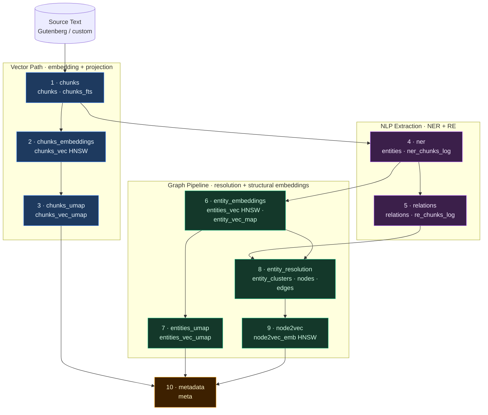
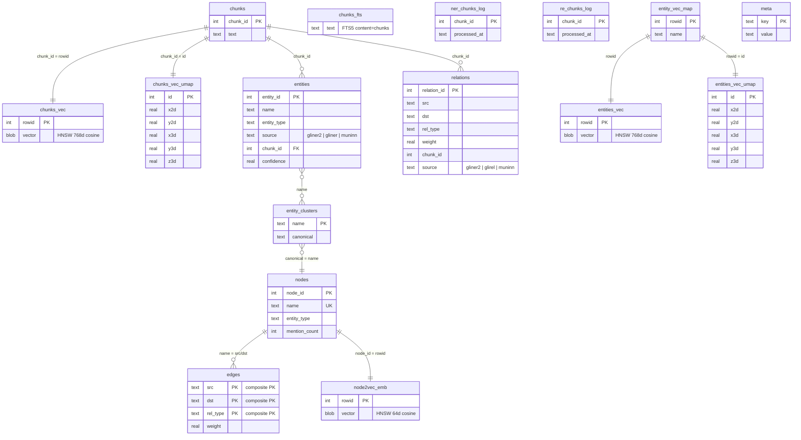

# Demo Database Builder

10-phase pipeline that generates self-contained SQLite demo databases for the viz app. Each database contains chunks, FTS5 index, HNSW vector index, NER entities, relations, entity resolution, UMAP projections, and Node2Vec embeddings.

## CLI Usage

```bash
# List available books and embedding models
uv run -m benchmarks.demo_builder list-books
uv run -m benchmarks.demo_builder list-models

# Show build status matrix (all book × model permutations)
uv run -m benchmarks.demo_builder manifest

# Generate runnable build commands for missing permutations
uv run -m benchmarks.demo_builder manifest --missing --commands

# Build a single demo database
uv run -m benchmarks.demo_builder build --book-id 3300 --embedding-model MiniLM

# Regenerate manifest.json from existing built DBs
uv run -m benchmarks.demo_builder write-manifest

# Override output folder (default: viz/frontend/public/demos)
uv run -m benchmarks.demo_builder build --output-folder /tmp/demos --book-id 3300 --embedding-model MiniLM
```

## Build Pipeline DAG

The pipeline is a directed acyclic graph with two parallel tracks branching from `chunks`:



- **Phase 1 forks**: `chunks` feeds both `chunks_embeddings` (vector path) and `ner` (NLP path) independently
- **UMAP phases are independent**: `chunks_umap` depends only on `chunks_embeddings`; `entities_umap` depends only on `entity_embeddings`
- **Phase 8 joins**: `entity_resolution` depends on both `relations` (P5) and `entity_embeddings` (P6)

## Build Phases

| # | Phase | Depends on | Description |
|---|-------|------------|-------------|
| 1 | **chunks** | source text | Split text into model-aware chunks, build FTS5 |
| 2 | **chunks_embeddings** | chunks | SentenceTransformer → HNSW vector index |
| 3 | **chunks_umap** | chunks_embeddings | UMAP 2D+3D projections for chunks |
| 4 | **ner** | chunks | Extract named entities (GLiNER2 / GLiNER / muninn) |
| 5 | **relations** | ner | Extract relations (GLiNER2 / GLiREL / muninn) |
| 6 | **entity_embeddings** | ner | SentenceTransformer → entity HNSW index |
| 7 | **entities_umap** | entity_embeddings | UMAP 2D+3D projections for entities |
| 8 | **entity_resolution** | relations + entity_embeddings | HNSW blocking + Jaro-Winkler + Leiden clustering |
| 9 | **node2vec** | entity_resolution | Node2Vec random walks + Skip-gram embeddings |
| 10 | **metadata** | chunks_umap + entities_umap + node2vec | Write meta table, validate all tables |

## Database Schema



## Prerequisites

```bash
# Build the muninn extension
make all

# Download Gutenberg texts
uv run -m benchmarks.harness prep texts

# Install ML dependencies
uv pip install gliner glirel spacy sentence-transformers umap-learn "numpy>=2.0,<2.4"
python -m spacy download en_core_web_lg
```

## Model-Aware Chunking

Chunk sizes are determined by the **tightest constraint** across all models in the pipeline. Each chunk passes through embedding, NER (GLiNER), and RE (GLiREL) models:

| Model | Max | Unit | Constraint |
|-------|-----|------|------------|
| MiniLM | 256 | subword tokens | 768 chars |
| NomicEmbed | 8,192 | subword tokens | 4,096 chars |
| GLiNER medium-v2.1 | 384 | word tokens | ~1,920 chars |
| GLiREL large-v0 | 384 | word tokens | ~1,920 chars |

The effective chunk size is `min(embedding_model_chars, NER_RE_cap)`:

| Embedding Model | Model Chars | NER/RE Cap | Effective |
|-----------------|-------------|------------|-----------|
| MiniLM | 768 | 1,920 | **768** (embedding is tighter) |
| NomicEmbed | 4,096 | 1,920 | **1,920** (NER/RE is tighter) |

Without this cap, NomicEmbed chunks (~725 word tokens) would be silently truncated by GLiNER/GLiREL at 384 tokens, losing entities and relations in the second half of each chunk.

Chunks overlap by ~10% and snap to sentence boundaries to avoid splitting mid-sentence.

## Output

Built databases are written to `viz/frontend/public/demos/` by default with a `manifest.json` index file:

```json
{
  "databases": [
    {
      "id": "3300_MiniLM",
      "book_id": 3300,
      "model": "MiniLM",
      "dim": 384,
      "file": "3300_MiniLM.db",
      "size_bytes": 32059392,
      "label": "Book 3300 + MiniLM (384d)"
    }
  ]
}
```
