# Benchmark Harness

Unified CLI for benchmark execution, tracking, and analysis using the **Treatment pattern**. Each benchmark permutation is a Treatment subclass that the harness executes in a consistent setup-run-teardown lifecycle, producing JSONL records and per-permutation SQLite databases.

## Table of Contents

<!--TOC-->

- [Quick Start](#quick-start)
- [CLI Reference](#cli-reference)
  - [prep -- Prepare data caches](#prep----prepare-data-caches)
  - [manifest -- Show completion status](#manifest----show-completion-status)
  - [benchmark -- Run a single permutation](#benchmark----run-a-single-permutation)
  - [analyse -- Generate charts and tables](#analyse----generate-charts-and-tables)
- [Architecture](#architecture)
  - [Flow Diagram](#flow-diagram)
  - [Treatment Pattern](#treatment-pattern)
  - [Registry](#registry)
  - [Harness Execution](#harness-execution)
  - [Analysis Pipeline](#analysis-pipeline)
- [Adding a New Treatment](#adding-a-new-treatment)
- [Directory Layout](#directory-layout)
- [Output Format](#output-format)
  - [JSONL Schema](#jsonl-schema)
  - [SQLite Databases](#sqlite-databases)
- [Development](#development)

<!--/TOC-->

## Quick Start

Build the muninn extension first, then run the full pipeline:

```bash
# 1. Build the C extension
make all

# 2. Prepare vector caches (downloads models + embeds datasets)
uv run -m benchmarks.harness.cli prep vectors

# 3. See what needs to run
uv run -m benchmarks.harness.cli manifest --missing

# 4. Run a single benchmark
uv run -m benchmarks.harness.cli benchmark --id vss_muninn-hnsw_MiniLM_ag-news_n1000

# 5. Generate analysis charts
uv run -m benchmarks.harness.cli analyse
```

To run all missing benchmarks in sequence:

```bash
uv run -m benchmarks.harness.cli manifest --missing --commands | sh
```

## CLI Reference

Invoke via `uv run -m benchmarks.harness.cli <subcommand>`.

### prep -- Prepare data caches

Downloads models, embeds text datasets, and builds `.npy` vector caches.

```bash
uv run -m benchmarks.harness.cli prep vectors              # Embed all models x datasets
uv run -m benchmarks.harness.cli prep vectors --model MiniLM  # One model only
uv run -m benchmarks.harness.cli prep texts                # Download Gutenberg texts
uv run -m benchmarks.harness.cli prep kg-chunks            # Chunk texts for KG extraction
uv run -m benchmarks.harness.cli prep er-datasets          # Prepare entity resolution datasets
uv run -m benchmarks.harness.cli prep all                  # Everything
```

### manifest -- Show completion status

Lists all registered permutations and their done/missing status.

```bash
uv run -m benchmarks.harness.cli manifest                  # Full status table
uv run -m benchmarks.harness.cli manifest --missing        # Only incomplete
uv run -m benchmarks.harness.cli manifest --category vss   # Filter by category
uv run -m benchmarks.harness.cli manifest --commands       # Print runnable commands
uv run -m benchmarks.harness.cli manifest --sort name      # Alphabetical (default: size)
```

### benchmark -- Run a single permutation

Executes one Treatment by its `permutation_id`:

```bash
uv run -m benchmarks.harness.cli benchmark --id vss_muninn-hnsw_MiniLM_ag-news_n5000
```

The harness creates `results/<permutation_id>/db.sqlite`, runs setup/run/teardown with timing, and appends a JSONL record to `results/<category>_<variant>.jsonl`.

### analyse -- Generate charts and tables

Aggregates JSONL results and renders Plotly charts:

```bash
uv run -m benchmarks.harness.cli analyse                   # All categories
uv run -m benchmarks.harness.cli analyse --category vss    # One category
uv run -m benchmarks.harness.cli analyse --render-docs     # Also render Jinja2 doc templates
```

## Architecture

### Flow Diagram

```mermaid
flowchart LR
    subgraph CLI ["CLI (cli.py)"]
        direction TB
        PREP["prep"]
        MANIFEST["manifest"]
        BENCHMARK["benchmark"]
        ANALYSE["analyse"]
    end

    subgraph Registry ["Registry (registry.py)"]
        direction TB
        REG["all_permutations()"]
        FILTER["filter_permutations()"]
        STATUS["permutation_status()"]
    end

    subgraph Treatments ["Treatments (treatments/)"]
        direction TB
        BASE["Treatment ABC"]
        VSS["VSSTreatment"]
        GRAPH["GraphTraversalTreatment"]
        CENT["GraphCentralityTreatment"]
        COMM["GraphCommunityTreatment"]
        ADJ["AdjacencyTreatment"]
        KGE["KGNerExtractionTreatment"]
        KGR["KGEntityResolutionTreatment"]
        KGRAG["KGGraphRAGTreatment"]
        N2V["Node2VecTreatment"]
    end

    subgraph Harness ["Harness (harness.py)"]
        direction TB
        RUN["run_treatment()"]
        SETUP["treatment.setup()"]
        EXEC["treatment.run()"]
        TEAR["treatment.teardown()"]
    end

    subgraph Output ["Output"]
        direction TB
        JSONL["JSONL records"]
        DB["SQLite databases"]
    end

    subgraph Analysis ["Analysis (analysis/)"]
        direction TB
        AGG["aggregator"]
        CHARTS["chart specs"]
        RENDER["renderer"]
    end

    BENCHMARK --> FILTER --> RUN
    MANIFEST --> STATUS
    RUN --> SETUP --> EXEC --> TEAR
    TEAR --> JSONL
    TEAR --> DB
    ANALYSE --> AGG --> CHARTS --> RENDER

    style CLI fill:#4a90d9,color:#fff
    style Registry fill:#7b68ee,color:#fff
    style Treatments fill:#e8a838,color:#000
    style Harness fill:#50c878,color:#000
    style Output fill:#dc143c,color:#fff
    style Analysis fill:#9370db,color:#fff
```



### Treatment Pattern

Every benchmark permutation is a subclass of `Treatment` (defined in `treatments/base.py`). The ABC enforces:

| Property / Method | Type | Purpose |
|---|---|---|
| `category` | `str` | Groups related permutations (e.g., `"vss"`, `"graph"`) |
| `permutation_id` | `str` | Unique slug, used as folder name and `--id` value |
| `label` | `str` | Human-readable description for manifest display |
| `sort_key` | `tuple` | Sorting within a category (primary scaling dimension first) |
| `setup(conn, db_path)` | `dict` | Create tables, load data; returns setup metrics |
| `run(conn)` | `dict` | Execute measurement; returns treatment-specific metrics |
| `teardown(conn)` | `None` | Release resources |
| `params_dict()` | `dict` | Flat dict of treatment parameters for JSONL serialization |

### Registry

`registry.py` enumerates all permutations by calling category-specific generator functions (e.g., `_vss_permutations()`, `_graph_traversal_permutations()`). Each generator creates Treatment instances for every combination of parameters. The public API:

- `all_permutations()` -- every registered Treatment
- `filter_permutations(category=, permutation_id=)` -- narrow down
- `permutation_status(results_dir=)` -- check done/missing via `db.sqlite` existence

### Harness Execution

`harness.py` orchestrates a single Treatment run:

1. Create `results/<permutation_id>/db.sqlite`
2. Open SQLite connection, load muninn extension
3. Record RSS before
4. Call `treatment.setup(conn, db_path)` with timing
5. Call `treatment.run(conn)` with timing
6. Call `treatment.teardown(conn)`
7. Record RSS after, measure DB file size
8. Merge common metrics + `params_dict()` + setup/run metrics
9. Append record to `results/<category>_<variant>.jsonl`

### Analysis Pipeline

The analysis system uses a `ChartSpec` dataclass to define chart configurations declaratively. Chart specs are defined in `analysis/charts_*.py` modules. The aggregation engine:

1. Loads JSONL records matching source patterns
2. Filters records by spec criteria
3. Groups by `repeat_fields` and aggregates (mean/median/min/max)
4. Builds `ChartSeries` grouped by `group_fields` + `variant_fields`
5. Renders Plotly JSON charts via `renderer.py`

## Adding a New Treatment

1. **Create the treatment file** at `treatments/<name>.py`:

```python
import logging

from benchmarks.harness.treatments.base import Treatment

log = logging.getLogger(__name__)


class MyTreatment(Treatment):

    def __init__(self, param_a, param_b):
        self._param_a = param_a
        self._param_b = param_b

    @property
    def category(self):
        return "my-category"

    @property
    def permutation_id(self):
        return f"my-category_{self._param_a}_{self._param_b}"

    @property
    def label(self):
        return f"My Category: {self._param_a} / {self._param_b}"

    @property
    def sort_key(self):
        return (self._param_b, self._param_a)

    def params_dict(self):
        return {"param_a": self._param_a, "param_b": self._param_b}

    def setup(self, conn, db_path):
        # Create tables, load data
        return {"rows_loaded": 100}

    def run(self, conn):
        # Execute benchmark measurement
        return {"latency_ms": 1.23, "throughput": 4567}

    def teardown(self, conn):
        pass
```

2. **Register permutations** in `registry.py`:

```python
def _my_category_permutations():
    from benchmarks.harness.treatments.my_treatment import MyTreatment
    perms = []
    for a in ["x", "y"]:
        for b in [100, 500, 1000]:
            perms.append(MyTreatment(a, b))
    return perms
```

Add `perms.extend(_my_category_permutations())` to `all_permutations()`.

3. **Add chart specs** (optional) in `analysis/charts_my_category.py` using `ChartSpec`, then import into `aggregator.py`.

4. **Verify** with:

```bash
uv run -m benchmarks.harness.cli manifest --category my-category
```

## Directory Layout

```
benchmarks/harness/
    __init__.py             Package init
    __main__.py             Entry point: python -m benchmarks.harness.cli
    cli.py                  Argparse CLI with prep/manifest/benchmark/analyse subcommands
    common.py               Shared utilities: pack_vector, load_muninn, graph generators, constants
    harness.py              Treatment execution engine (setup -> run -> teardown lifecycle)
    registry.py             Enumerates all permutations across all treatment categories
    Makefile                Dev tooling: format, lint, test, coverage, ci

    treatments/
        base.py             Treatment ABC
        vss.py              Vector similarity search (5 engines)
        graph_traversal.py  BFS, DFS, shortest path, components, PageRank
        graph_centrality.py Degree, betweenness, closeness centrality
        graph_community.py  Leiden community detection
        adjacency.py        CSR adjacency caching approaches
        kg_extract.py       KG NER extraction (GLiNER, spaCy, FTS5)
        kg_resolve.py       KG entity resolution
        kg_graphrag.py      KG GraphRAG retrieval quality
        node2vec.py         Node2Vec training

    analysis/
        aggregator.py       ChartSpec-driven aggregation engine
        renderer.py         Plotly chart rendering + Jinja2 doc templates
        color_system.py     Consistent color assignment across series
        charts_vss.py       VSS chart specifications
        charts_graph.py     Graph traversal chart specifications
        charts_adjacency.py Adjacency chart specifications
        charts_kg.py        KG chart specifications

    prep/
        vectors.py          Embed datasets with sentence-transformers, cache as .npy
        texts.py            Download Project Gutenberg texts
        kg_chunks.py        Chunk texts for KG extraction
        er_datasets.py      Prepare entity resolution datasets

    templates/
        vss.md.j2           Jinja2 template for VSS benchmark docs
        graph.md.j2         Jinja2 template for graph benchmark docs

    tests/
        conftest.py         Shared fixtures (tmp dirs, tiny vectors, mock connections)
        test_common.py      Tests for common.py utilities
        test_harness.py     Tests for harness execution
        test_registry.py    Tests for registry enumeration
        test_treatment_base.py  Tests for Treatment ABC contract
        test_treatments.py  Tests for treatment instantiation
        test_vss_treatment.py   Tests for VSS treatment specifics
        test_cli_manifest.py    Tests for manifest subcommand
        test_cli_benchmark.py   Tests for benchmark subcommand
        test_cli_analyse.py     Tests for analyse subcommand
        test_prep.py        Tests for prep pipeline
        test_analysis.py    Tests for aggregation engine
        test_docs.py        Tests for doc rendering
        test_makefile.py    Tests verifying Makefile targets exist
        test_phase0.py      Smoke tests for package structure
```

## Output Format

### JSONL Schema

Each benchmark run appends one JSON line to `results/<category>_<variant>.jsonl`. The record merges three sources:

**Common fields** (from harness.py):

```json
{
    "permutation_id": "vss_muninn-hnsw_MiniLM_ag-news_n5000",
    "category": "vss",
    "wall_time_setup_ms": 1234.567,
    "wall_time_run_ms": 89.012,
    "peak_rss_mb": 512.3,
    "rss_delta_mb": 45.6,
    "db_size_bytes": 10485760,
    "timestamp": "2026-02-20T10:30:00+00:00",
    "platform": "darwin-arm64",
    "python_version": "3.12.0"
}
```

**Treatment params** (from `params_dict()`):

```json
{
    "engine": "muninn",
    "search_method": "hnsw",
    "model_name": "MiniLM",
    "dim": 384,
    "dataset": "ag_news",
    "n": 5000,
    "k": 10,
    "n_queries": 100
}
```

**Treatment metrics** (from `setup()` + `run()` return dicts):

```json
{
    "n_vectors_loaded": 5000,
    "insert_rate_vps": 12345.6,
    "search_latency_ms": 0.42,
    "recall_at_k": 0.95
}
```

### SQLite Databases

Each permutation gets its own SQLite file at `results/<permutation_id>/db.sqlite`. This database contains the tables and indexes created during the benchmark (e.g., HNSW virtual tables, edge tables). The existence of `db.sqlite` is used by the manifest to determine completion status.

## Development

Run development tooling via `make -C benchmarks/harness <target>`:

```bash
make -C benchmarks/harness help       # Show all targets
make -C benchmarks/harness format     # Format with ruff
make -C benchmarks/harness lint       # Check lint (no auto-fix)
make -C benchmarks/harness fix        # Auto-fix lint + format
make -C benchmarks/harness typecheck  # mypy type checking
make -C benchmarks/harness test       # Run all tests (builds extension first)
make -C benchmarks/harness test-quick # Fast tests only (no extension build)
make -C benchmarks/harness coverage   # Tests with coverage report
make -C benchmarks/harness ci         # Full CI: lint + typecheck + test
```
