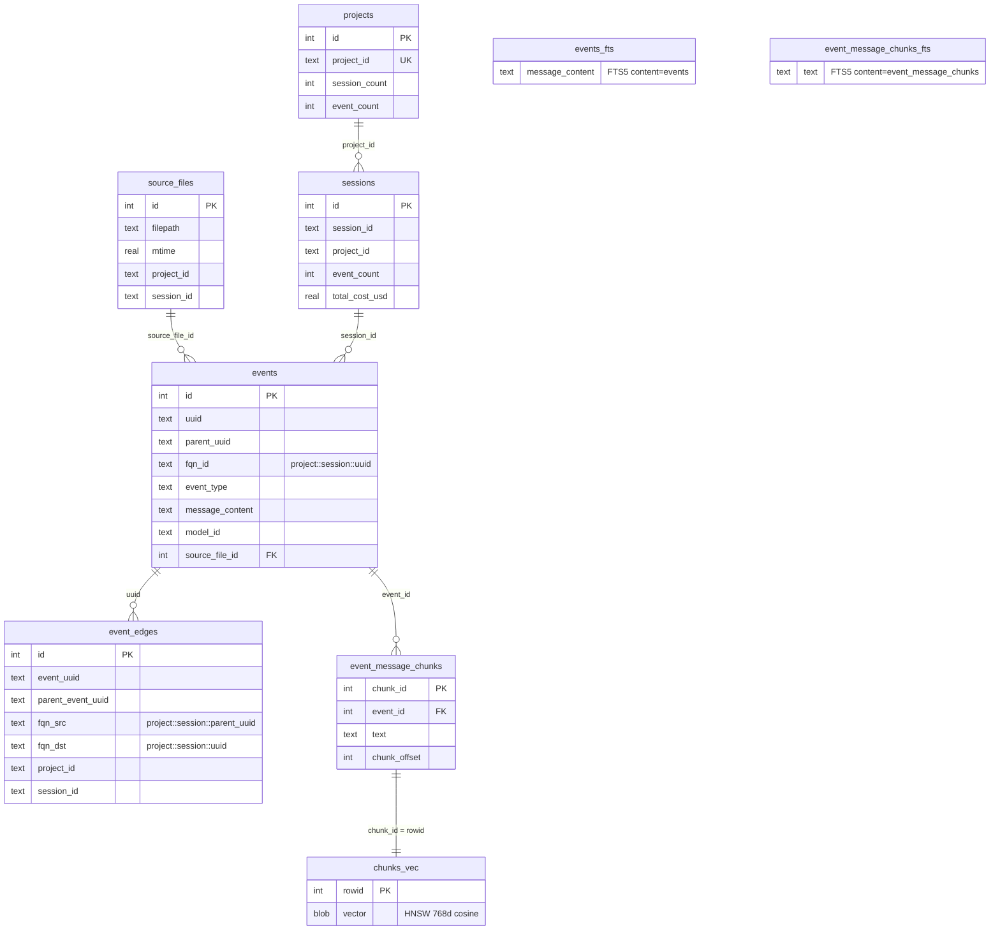

# Sessions Demo Builder

3-phase pipeline that builds a sessions demo SQLite database from Claude Code JSONL session logs (`~/.claude/projects/**/*.jsonl`). The output DB contains events with parent-child edges, FTS5 full-text search, message chunks, and HNSW vector embeddings via GGUF NomicEmbed.

## CLI Usage

```bash
# Full build pipeline (ingest + chunks + embeddings)
uv run -m benchmarks.sessions_demo build

# Cache management (ingest only, no ML)
uv run -m benchmarks.sessions_demo cache init
uv run -m benchmarks.sessions_demo cache update
uv run -m benchmarks.sessions_demo cache rebuild
uv run -m benchmarks.sessions_demo cache clear
uv run -m benchmarks.sessions_demo cache status

# Verbose logging
uv run -m benchmarks.sessions_demo -v build

# Custom output location
uv run -m benchmarks.sessions_demo --output-dir /tmp/sessions build
```

## Build Phases

| # | Phase | Description |
|---|-------|-------------|
| 1 | ingest | Parse JSONL files into `events` + `event_edges` + `events_fts`, rebuild `projects` and `sessions` aggregates |
| 2 | chunks | Split `events.message_content` into paragraph-based chunks (max 1920 chars / 384 word tokens), create `event_message_chunks` + FTS5 |
| 3 | embeddings | Embed chunks via GGUF NomicEmbed (768d) into `chunks_vec` HNSW index |

## Database Schema



## Fully Qualified Names (FQN)

Event UUIDs are only unique within a session. To enable cross-session graph traversal, every event and edge gets a globally unique FQN:

```
{project_id}::{session_id}::{event_uuid}
```

- `events.fqn_id` — globally unique node identifier
- `event_edges.fqn_src` — parent node FQN (edge source)
- `event_edges.fqn_dst` — child node FQN (edge destination)

All FQN columns are indexed for fast graph lookups.

## Chunking Strategy

Chunk size is constrained by the smallest model window in the pipeline:

| Model | Max Tokens | Token Type | Max Chars |
|-------|-----------|------------|-----------|
| NomicEmbed v1.5 | 2,048 | subword | ~8,192 |
| GLiNER medium-v2.1 | 384 | word | ~1,920 |
| GLiREL large-v0 | 384 | word | ~1,920 |

Effective chunk size: **1,920 chars** (384 word tokens x 5.0 chars/token), ensuring all chunks fit within every model's context window without truncation.

## Prerequisites

```bash
# Build the muninn C extension (includes embed_gguf subsystem)
make all

# Download GGUF model (if not already present)
# models/nomic-embed-text-v1.5.Q8_0.gguf should exist
```

No Python ML dependencies required — embedding is handled by the muninn C extension via GGUF.

## Development

```bash
# Run from project root:
make -C benchmarks/sessions_demo help       # Show all targets
make -C benchmarks/sessions_demo ci         # lint + typecheck + test
make -C benchmarks/sessions_demo fix        # Auto-fix formatting
make -C benchmarks/sessions_demo build      # Run full pipeline
make -C benchmarks/sessions_demo cache-status  # Check cache state
```

## Output

Built databases are written to `benchmarks/sessions_demo/output/` by default.
