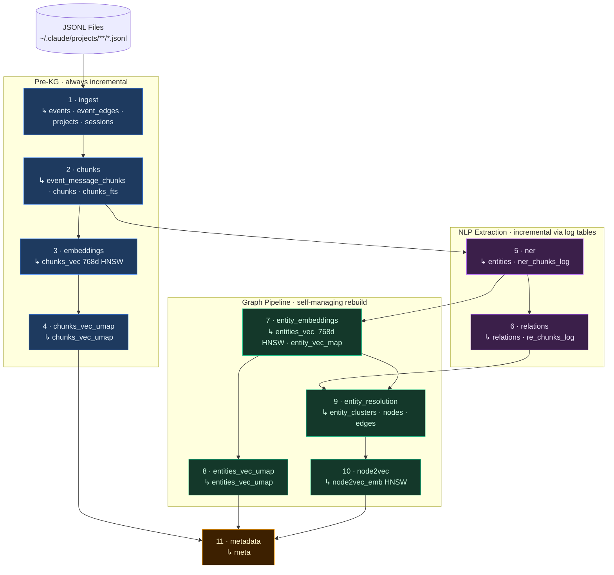
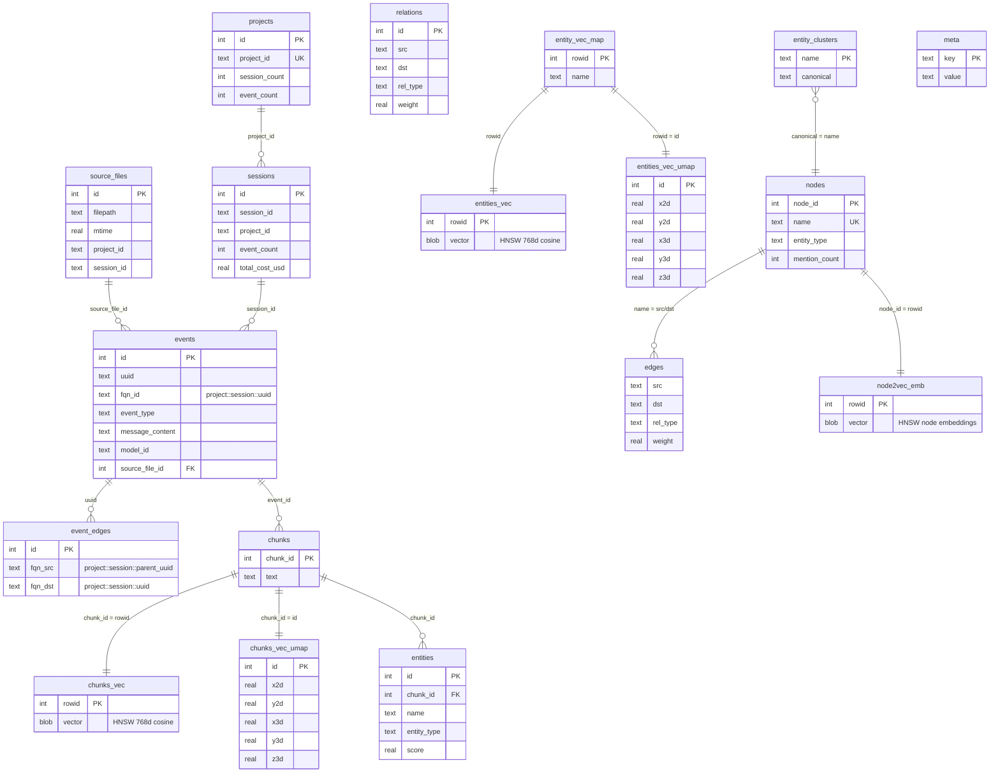

# Sessions Demo Builder

10-phase pipeline that builds a sessions demo SQLite database from Claude Code JSONL session logs (`~/.claude/projects/**/*.jsonl`). The output DB is fully compatible with the `viz/` frontend: it produces the same tables as `demo_builder` (chunks, entities, relations, nodes, edges, UMAP projections, node2vec embeddings) and is registered in `manifest.json` alongside other demo DBs.

## CLI Usage

```bash
# Full incremental build (only stale phases run)
uv run -m benchmarks.sessions_demo build

# Show build status and pending work without running anything
uv run -m benchmarks.sessions_demo build --status

# Custom output location
uv run -m benchmarks.sessions_demo --output-folder /tmp/demos build

# Cache management (ingest schema only, no ML)
uv run -m benchmarks.sessions_demo cache init
uv run -m benchmarks.sessions_demo cache update
uv run -m benchmarks.sessions_demo cache rebuild
uv run -m benchmarks.sessions_demo cache clear
uv run -m benchmarks.sessions_demo cache status

# Verbose logging
uv run -m benchmarks.sessions_demo -v build
```

## Build Pipeline DAG

The pipeline is a directed acyclic graph, not a linear sequence. The key structural points are:

- **Phase 2 forks**: `chunks` feeds both `embeddings` (vector path) and `ner` (NLP path) independently
- **UMAP phases are independent**: `chunks_vec_umap` depends only on `embeddings`; `entities_vec_umap` depends only on `entity_embeddings` — neither depends on the other
- **Phase 9 joins**: `entity_resolution` depends on both `relations` (P6) and `entity_embeddings` (P7)



## Build Phases

Each phase tracks its own staleness with `is_stale(conn)` — only stale phases execute. Up-to-date phases restore their context fields from the DB and are skipped entirely.

| # | Phase | Depends on | Staleness check | Outputs |
|---|-------|------------|-----------------|---------|
| 1 | **ingest** | JSONL files | Files changed on disk since `source_files.mtime` | `events`, `event_edges`, `events_fts`, `projects`, `sessions` |
| 2 | **chunks** | ingest | Events with content `NOT IN event_message_chunks` | `event_message_chunks`, `chunks`, `chunks_fts` |
| 3 | **embeddings** | chunks | `chunk_id NOT IN chunks_vec_nodes` | `chunks_vec` (HNSW 768d) |
| 4 | **chunks_vec_umap** | embeddings | `chunks_vec_umap` count ≠ `chunks_vec_nodes` count | `chunks_vec_umap`, `*_chunks_umap*.joblib` |
| 5 | **ner** | chunks | Chunks `NOT IN ner_chunks_log` | `entities`, `ner_chunks_log` |
| 6 | **relations** | ner | NER-processed chunks `NOT IN re_chunks_log` | `relations`, `re_chunks_log` |
| 7 | **entity_embeddings** | ner | Entity names `NOT IN entity_vec_map` | `entities_vec` (HNSW 768d), `entity_vec_map` |
| 8 | **entities_vec_umap** | entity_embeddings | `entities_vec_umap` count ≠ `entity_vec_map` count | `entities_vec_umap`, `*_entities_umap*.joblib` |
| 9 | **entity_resolution** | relations + entity_embeddings | `entity_clusters` count < distinct entity names | `entity_clusters`, `nodes`, `edges` |
| 10 | **node2vec** | entity_resolution | `node2vec_emb` count ≠ `nodes` count | `node2vec_emb` (HNSW) |
| 11 | **metadata** | all | Always re-runs (cheap count aggregation) | `meta` |

### Incrementality model

| Phase group | Strategy |
|-------------|----------|
| ingest, chunks, embeddings | Fully incremental — each run only processes new data |
| chunks_vec_umap, entities_vec_umap | Fit-once + `transform()` — independent joblib models, each reused for new vectors |
| ner, relations | Fully incremental via `*_chunks_log` tracking tables |
| entity_embeddings | Incremental — embeds only entity names not yet in `entity_vec_map` |
| entity_resolution, node2vec | Self-managing full rebuild — drops and recreates their own tables |
| metadata | Always re-runs (trivial `SELECT count(*)` aggregation) |

## Database Schema

The output DB is split into two logical layers: the **session layer** (events, chunks, embeddings) and the **KG layer** (entities, relations, graph, UMAP, node2vec).



## Fully Qualified Names (FQN)

Event UUIDs are only unique within a session. To enable cross-session graph traversal, every event and edge gets a globally unique FQN:

```
{project_id}::{session_id}::{event_uuid}
```

- `events.fqn_id` — globally unique node identifier
- `event_edges.fqn_src` — parent node FQN (edge source)
- `event_edges.fqn_dst` — child node FQN (edge destination)

All FQN columns are indexed for fast graph lookups.

## Chunking Strategy

Chunk size is constrained by the smallest model window in the pipeline:

| Model | Max Tokens | Token type | Max chars | Used by |
|-------|-----------|------------|-----------|---------|
| NomicEmbed v1.5 (GGUF) | 2,048 | subword | 1,500 (truncated) | embeddings |
| GLiNER medium-v2.1 | 384 | word | ~1,920 | ner |
| GLiREL large-v0 | 384 | word | ~1,920 | relations |

Chunks are split at **1,920 chars** by the chunks phase. Before embedding, text is truncated to **1,500 chars** (`EMBED_MAX_CHARS`) — Claude Code session logs are code-heavy and NomicEmbed's subword tokenizer encodes code at ~1.3 tokens/char, which can push 1,920-char chunks past the 2,048-token context window.

## Prerequisites

```bash
# Build the muninn C extension (includes embed_gguf + hnsw subsystems)
make all

# Install Python ML dependencies
uv pip install gliner glirel sentence-transformers umap-learn joblib numpy

# Download spaCy model for NER fallback
python -m spacy download en_core_web_sm

# GGUF model must exist at:
# models/nomic-embed-text-v1.5.Q8_0.gguf
```

## Output

Built databases are written to `viz/frontend/public/demos/` by default, where the viz frontend auto-discovers them via `manifest.json`. The DB is registered with ID `sessions_demo` and label `Claude Code Sessions (768d)`.

```
viz/frontend/public/demos/
├── manifest.json          ← updated after each build
├── sessions_demo.db       ← the built database
├── sessions_demo_umap2d.joblib  ← saved UMAP reducer (reused for incremental runs)
└── sessions_demo_umap3d.joblib
```
