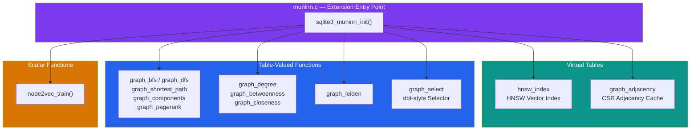
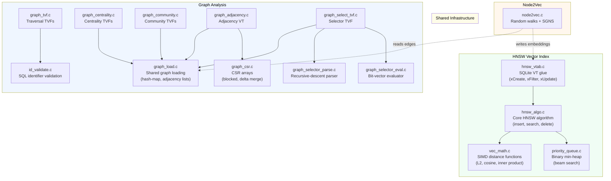

# Architecture

This page describes the internal architecture of the muninn SQLite extension — how the seven subsystems are organized, how data flows between them, and the key design patterns used throughout.

## Extension Overview

muninn is a single shared library (`.dylib`/`.so`/`.dll`) that registers seven subsystems with SQLite through one entry point: `sqlite3_muninn_init`. Each subsystem is independently useful, but they share common infrastructure for graph loading, identifier validation, and distance computation.



## Module Layering

Each subsystem has a clear separation between **SQLite integration** (virtual table glue, TVF wrappers) and **pure algorithm** (no SQLite dependency, testable in isolation).



## Two Execution Strategies

muninn offers two fundamentally different ways to run graph algorithms, each with different performance trade-offs:

### Strategy 1: Scan-on-Query (TVFs)

The original graph TVFs (`graph_bfs`, `graph_degree`, `graph_leiden`, etc.) load the graph from the edge table **on every query**. This is simple and always reflects the latest data, but has O(E) startup cost per query.

```
SQL Query → Load graph from edge table → Run algorithm → Return results
```

### Strategy 2: Cached Adjacency (Virtual Table)

The `graph_adjacency` virtual table maintains a **persistent CSR cache** in shadow tables. Triggers on the edge table track mutations, and the cache is lazily rebuilt (full or incremental) on the next query. Algorithm TVFs can read from the cache instead of scanning the edge table.

```
Edge mutation → Trigger logs delta → Next query detects stale cache
    → Incremental rebuild (small delta) or full rebuild (large delta)
    → Algorithm reads from CSR BLOBs (fast)
```

The crossover point where caching pays off depends on graph size and query frequency. For small graphs (< 1,000 edges), the scan-on-query approach is often faster. For larger graphs queried repeatedly, the CSR cache eliminates redundant edge-table scans.

## Data Structures

### GraphData — In-Memory Adjacency

The `GraphData` struct is the shared in-memory graph representation used by all graph algorithms. It provides:

- **O(1) node lookup** via an open-addressing hash map (`map_indices[]`)
- **Forward adjacency** (`out[]`) — outgoing edges per node
- **Reverse adjacency** (`in[]`) — incoming edges per node
- **Weighted edges** — optional `double` weights on each edge
- **Temporal filtering** — optional timestamp-based edge selection at load time

### CsrArray — Compressed Sparse Row

The `CsrArray` uses the [Compressed Sparse Row (CSR)](https://en.wikipedia.org/wiki/Sparse_matrix#Compressed_sparse_row_(CSR,_CRS_or_Yale_format)) format — a classic sparse matrix representation originating from the [Yale Sparse Matrix Package](https://en.wikipedia.org/wiki/Sparse_matrix#History) (Eisenstat et al., 1977). It stores adjacency compactly with three arrays:

- **`offsets[V+1]`** — cumulative edge counts; node `i`'s neighbors are `targets[offsets[i]..offsets[i+1])`
- **`targets[E]`** — neighbor node indices
- **`weights[E]`** — optional edge weights

CSR arrays support **blocked storage** (partitioned into 4,096-node blocks) for incremental updates — only blocks containing affected nodes are rewritten when edges change. This blocked variant is an engineering adaptation of standard CSR for database page alignment, similar in spirit to the [Block Compressed Sparse Row (BCSR)](https://www.usenix.org/system/files/login/articles/login_winter20_16_kelly.pdf) format used in high-performance sparse matrix libraries.

### HNSW Index — Vector Storage

The HNSW index implements the [Hierarchical Navigable Small World](https://arxiv.org/abs/1603.09320) algorithm (Malkov & Yashunin, 2018). It uses an open-addressing hash table mapping `int64_t` rowids to `HnswNode` structs. Each node stores:

- The raw `float32` vector
- A random level (drawn from geometric distribution, per the HNSW paper)
- Per-level neighbor lists
- A soft-delete flag for lazy deletion

## Shadow Table Patterns

Both virtual table modules (`hnsw_index` and `graph_adjacency`) use **shadow tables** to persist their state across database sessions:

| Module | Shadow Tables | Purpose |
|--------|--------------|---------|
| `hnsw_index` | `_config`, `_nodes`, `_edges` | Store index parameters, vectors, and layer connections |
| `graph_adjacency` | `_config`, `_nodes`, `_degree`, `_csr_fwd`, `_csr_rev`, `_delta` | Store CSR BLOBs, degree cache, and mutation deltas |

## SQL Injection Prevention

All TVFs accept table and column names as runtime parameters. These names are validated through `id_validate.c` which ensures they are safe SQL identifiers before being interpolated into dynamic queries. This prevents SQL injection attacks through malicious table/column name parameters.

## Build & Test Architecture

```
Makefile
├── make all            → muninn.dylib/.so (production build)
├── make debug          → muninn.dylib with ASan + UBSan
├── make test           → C unit tests (test_runner binary)
├── make test-python    → Python integration tests (pytest)
├── make test-all       → Both C and Python tests
└── make ci             → lint + format + typecheck + test + benchmarks + docs
```

- **C unit tests** (`test/`) use a minimal custom framework (`test_common.h`) that tests pure-algorithmic modules in isolation — no SQLite required for most tests.
- **Python integration tests** (`pytests/`) test the full extension through `sqlite3.load_extension()`, exercising the complete SQLite integration path.
- **Benchmarks** (`benchmarks/`) measure performance across graph sizes and storage strategies, producing JSONL results and Plotly charts.

## References

The algorithms and data structures in muninn are drawn from the following academic works:

| Concept | Reference |
|---------|-----------|
| HNSW vector index | Malkov, Y. A. & Yashunin, D. A. (2018). [Efficient and robust approximate nearest neighbor search using Hierarchical Navigable Small World graphs](https://arxiv.org/abs/1603.09320). *IEEE TPAMI*, 42(4), 824–836. |
| Betweenness centrality | Brandes, U. (2001). [A Faster Algorithm for Betweenness Centrality](https://doi.org/10.1080/0022250X.2001.9990249). *Journal of Mathematical Sociology*, 25(2), 163–177. |
| Closeness centrality | Wasserman, S. & Faust, K. (1994). *Social Network Analysis: Methods and Applications*. Cambridge University Press. |
| Leiden community detection | Traag, V. A., Waltman, L. & van Eck, N. J. (2019). [From Louvain to Leiden: guaranteeing well-connected communities](https://arxiv.org/abs/1810.08473). *Scientific Reports*, 9(1), 5233. |
| PageRank | Page, L., Brin, S., Motwani, R. & Winograd, T. (1999). [The PageRank Citation Ranking: Bringing Order to the Web](http://ilpubs.stanford.edu:8090/422/1/1999-66.pdf). Stanford InfoLab Technical Report. |
| Node2Vec | Grover, A. & Leskovec, J. (2016). [node2vec: Scalable Feature Learning for Networks](https://arxiv.org/abs/1607.00653). *KDD '16*. |
| Skip-gram (SGNS) | Mikolov, T. et al. (2013). [Distributed Representations of Words and Phrases and their Compositionality](https://arxiv.org/abs/1310.4546). *NeurIPS 2013*. |
| DeepWalk | Perozzi, B., Al-Rfou, R. & Skiena, S. (2014). [DeepWalk: Online Learning of Social Representations](https://arxiv.org/abs/1403.6652). *KDD '14*. |
| Compressed Sparse Row (CSR) | Eisenstat, S. C. et al. (1977). Yale Sparse Matrix Package. *Department of Computer Science, Yale University*. |
