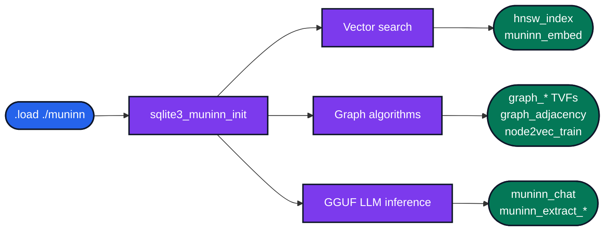
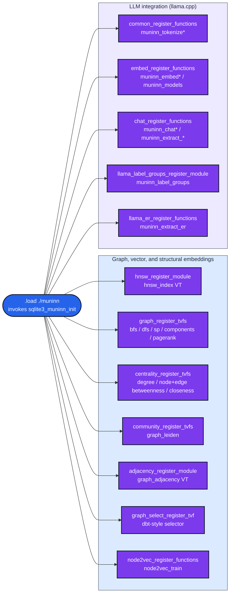
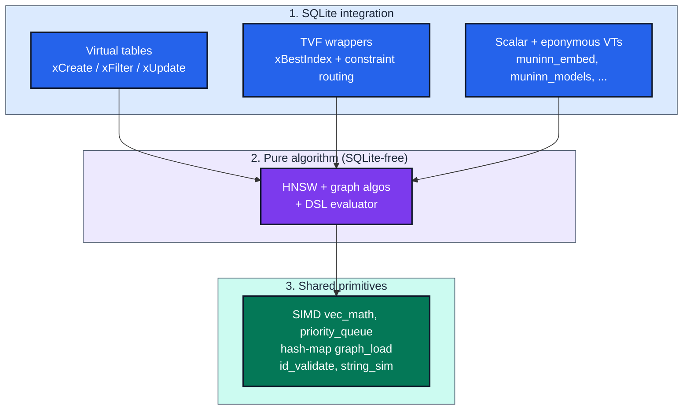
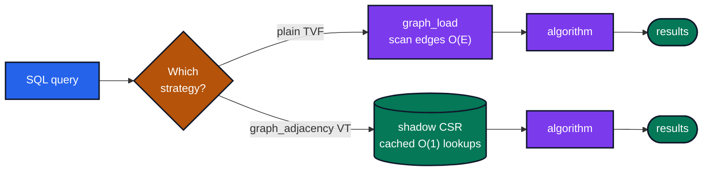
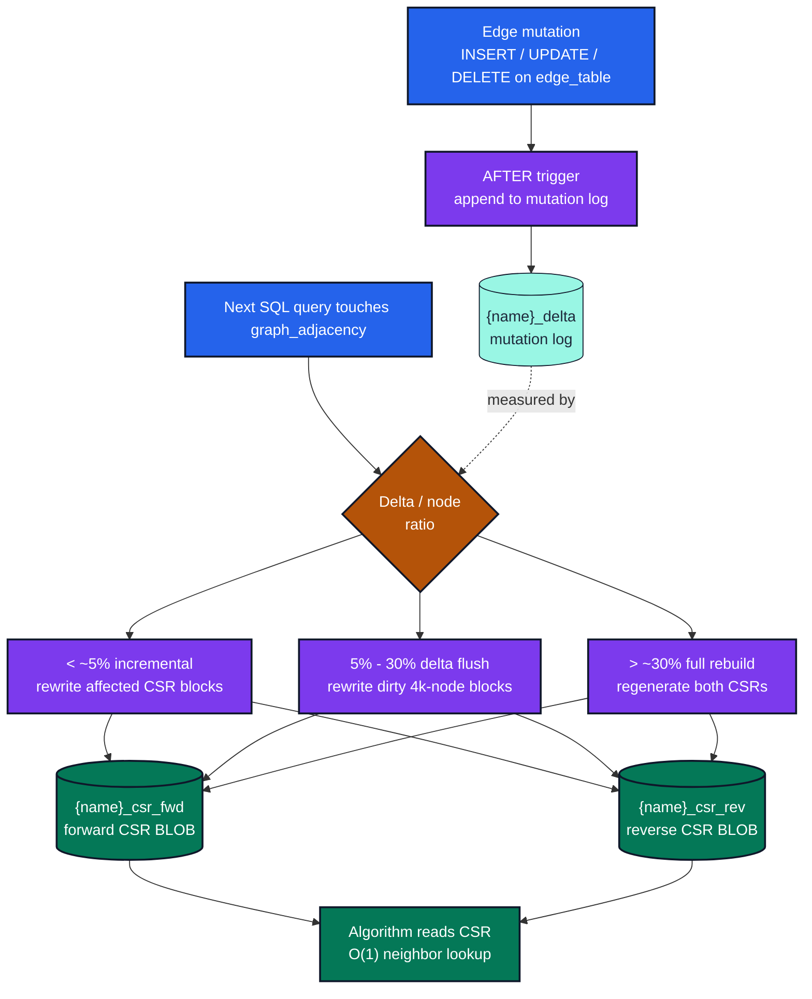
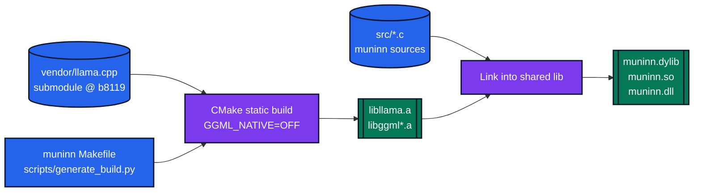
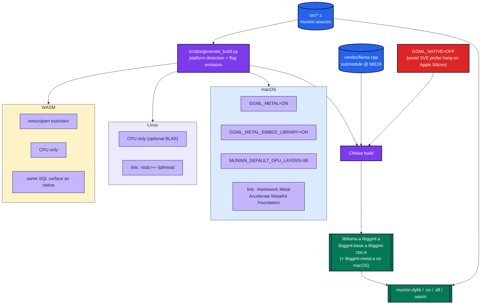

# Architecture

How the muninn extension is organized internally — the registration flow, the module layering, the shared infrastructure, and the design patterns that recur across every subsystem. Read this after [Getting Started](getting-started.md); it is aimed at contributors and integrators, not first-time users.

## Extension entry point

muninn is a single shared library (`muninn.dylib` / `.so` / `.dll`). `.load ./muninn` invokes `sqlite3_muninn_init` in [`src/muninn.c`](https://github.com/neozenith/sqlite-muninn/blob/main/src/muninn.c), which fans out into **twelve registration calls**:

| Call | Registers |
|------|-----------|
| `hnsw_register_module` | `hnsw_index` virtual table |
| `graph_register_tvfs` | `graph_bfs`, `graph_dfs`, `graph_shortest_path`, `graph_components`, `graph_pagerank` |
| `centrality_register_tvfs` | `graph_degree`, `graph_node_betweenness`, `graph_edge_betweenness`, `graph_closeness` |
| `community_register_tvfs` | `graph_leiden` |
| `adjacency_register_module` | `graph_adjacency` virtual table |
| `graph_select_register_tvf` | `graph_select` TVF |
| `node2vec_register_functions` | `node2vec_train` scalar |
| `common_register_functions` | `muninn_tokenize`, `muninn_tokenize_text`, `muninn_token_count` |
| `embed_register_functions` | `muninn_embed`, `muninn_embed_model`, `muninn_model_dim`, `muninn_models` |
| `chat_register_functions` | `muninn_chat`, `muninn_chat_model`, `muninn_summarize`, `muninn_extract_entities`, `muninn_extract_relations`, `muninn_extract_ner_re`, `muninn_extract_entities_batch`, `muninn_extract_ner_re_batch`, `muninn_chat_models` |
| `llama_label_groups_register_module` | `muninn_label_groups` TVF |
| `llama_er_register_functions` | `muninn_extract_er` scalar |

```mermaid
flowchart LR
    load([".load ./muninn"]):::ingressPrimary --> init["sqlite3_muninn_init"]:::computePrimary
    init --> vec_surface["Vector search"]:::computePrimary
    init --> graph_surface["Graph algorithms"]:::computePrimary
    init --> llm_surface["GGUF LLM inference"]:::computePrimary
    vec_surface --> v_out(["hnsw_index<br/>muninn_embed"]):::dataPrimary
    graph_surface --> g_out(["graph_* TVFs<br/>graph_adjacency<br/>node2vec_train"]):::dataPrimary
    llm_surface --> l_out(["muninn_chat<br/>muninn_extract_*"]):::dataPrimary

    classDef ingressPrimary fill:#2563eb,stroke:#0f172a,color:#fff,stroke-width:2px
    classDef computePrimary fill:#7c3aed,stroke:#0f172a,color:#fff,stroke-width:2px
    classDef dataPrimary fill:#047857,stroke:#0f172a,color:#fff,stroke-width:2px
```

*One `.load` invokes one init symbol that fans out into three capability surfaces.*

Complete registration tree (13 nodes, grouped by WASM gating)

```mermaid
flowchart LR
    load([".load ./muninn<br/>invokes sqlite3_muninn_init"]):::ingressPrimary

    subgraph core["Graph, vector, and structural embeddings"]
        hnsw["hnsw_register_module<br/>hnsw_index VT"]:::computePrimary
        gtvf["graph_register_tvfs<br/>bfs / dfs / sp / components / pagerank"]:::computePrimary
        cent["centrality_register_tvfs<br/>degree / node+edge betweenness / closeness"]:::computePrimary
        comm["community_register_tvfs<br/>graph_leiden"]:::computePrimary
        adj["adjacency_register_module<br/>graph_adjacency VT"]:::computePrimary
        sel["graph_select_register_tvf<br/>dbt-style selector"]:::computePrimary
        n2v["node2vec_register_functions<br/>node2vec_train"]:::computePrimary
    end

    subgraph llm_stack["LLM integration (llama.cpp)"]
        common["common_register_functions<br/>muninn_tokenize*"]:::computePrimary
        embed["embed_register_functions<br/>muninn_embed* / muninn_models"]:::computePrimary
        chat["chat_register_functions<br/>muninn_chat* / muninn_extract_*"]:::computePrimary
        labels["llama_label_groups_register_module<br/>muninn_label_groups"]:::computePrimary
        er["llama_er_register_functions<br/>muninn_extract_er"]:::computePrimary
    end

    load --> hnsw
    load --> gtvf
    load --> cent
    load --> comm
    load --> adj
    load --> sel
    load --> n2v
    load --> common
    load --> embed
    load --> chat
    load --> labels
    load --> er

    classDef ingressPrimary fill:#2563eb,stroke:#0f172a,color:#fff,stroke-width:2px
    classDef computePrimary fill:#7c3aed,stroke:#0f172a,color:#fff,stroke-width:2px
    classDef computeSecondary fill:#c4b5fd,stroke:#0f172a,color:#1e293b,stroke-width:1px
    classDef sgBlue fill:#dbeafe,stroke:#475569,color:#1e293b
    classDef sgViolet fill:#ede9fe,stroke:#475569,color:#1e293b

    class core sgBlue
    class llm_stack sgViolet
```

## Source tree and prefix convention

Every file in `src/` is grouped by prefix. The prefix signals which subsystem the file belongs to:

| Prefix | Subsystem |
|--------|-----------|
| `hnsw_` | HNSW vector search |
| `graph_` | Graph TVFs, centrality, community, adjacency cache, selector DSL |
| `llama_` | llama.cpp-backed LLM integration (embed, chat, extraction, ER, label groups) |
| (no prefix: `id_validate`, `vec_math`, `string_sim`, `priority_queue`, `node2vec`) | Shared primitives and cross-subsystem utilities |

Prefixes are a discoverability convention — `grep -l '^llama_'` is the fastest way to find all LLM-backed code. New files should keep the convention so the src/ layout remains navigable.

## Module layering

Each subsystem separates **SQLite integration** (virtual table glue, xBestIndex / xFilter, TVF wrappers) from **pure algorithm** (no SQLite dependency, unit-testable in isolation) from **shared primitives** (math, hash maps, validators).

```mermaid
flowchart TB
    subgraph api["1. SQLite integration"]
        s1["Virtual tables<br/>xCreate / xFilter / xUpdate"]:::ingressPrimary
        s2["TVF wrappers<br/>xBestIndex + constraint routing"]:::ingressPrimary
        s3["Scalar + eponymous VTs<br/>muninn_embed, muninn_models, ..."]:::ingressPrimary
    end

    subgraph algo["2. Pure algorithm (SQLite-free)"]
        a1["HNSW + graph algos<br/>+ DSL evaluator"]:::computePrimary
    end

    subgraph prim["3. Shared primitives"]
        p1["SIMD vec_math, priority_queue<br/>hash-map graph_load<br/>id_validate, string_sim"]:::dataPrimary
    end

    s1 --> a1
    s2 --> a1
    s3 --> a1
    a1 --> p1

    classDef ingressPrimary fill:#2563eb,stroke:#0f172a,color:#fff,stroke-width:2px
    classDef computePrimary fill:#7c3aed,stroke:#0f172a,color:#fff,stroke-width:2px
    classDef dataPrimary fill:#047857,stroke:#0f172a,color:#fff,stroke-width:2px
    classDef sgBlue fill:#dbeafe,stroke:#475569,color:#1e293b
    classDef sgViolet fill:#ede9fe,stroke:#475569,color:#1e293b
    classDef sgTeal fill:#ccfbf1,stroke:#475569,color:#1e293b

    class api sgBlue
    class algo sgViolet
    class prim sgTeal
```

*Three-layer stack: everything above layer 2 can be unit-tested without a SQLite database.*

Per-file dependency graph (22 nodes, grouped by subsystem)

```mermaid
flowchart TB
    subgraph hnsw["HNSW vector search"]
        hnsw_v["hnsw_vtab.c<br/>SQLite glue"]:::ingressPrimary
        hnsw_a["hnsw_algo.c<br/>insert / search / delete"]:::computePrimary
    end

    subgraph graph_sq["Graph scan-on-query"]
        g_tvf["graph_tvf.c<br/>bfs / dfs / sp / comp / pr"]:::ingressPrimary
        g_cent["graph_centrality.c<br/>degree / betweenness / closeness"]:::ingressPrimary
        g_comm["graph_community.c<br/>Leiden"]:::ingressPrimary
        g_load["graph_load.c<br/>hash-map loader + temporal"]:::computePrimary
    end

    subgraph cache["graph_adjacency cache"]
        g_adj["graph_adjacency.c<br/>CSR vtable + triggers"]:::ingressPrimary
        g_csr["graph_csr.c<br/>blocked CSR read/write"]:::computePrimary
    end

    subgraph select["graph_select DSL"]
        g_sel["graph_select_tvf.c"]:::ingressPrimary
        g_par["graph_selector_parse.c<br/>DSL parser"]:::computePrimary
        g_eval["graph_selector_eval.c<br/>AST evaluator"]:::computePrimary
    end

    subgraph llama["GGUF / llama.cpp (optional)"]
        l_c["llama_common.c<br/>registry + tokenizers"]:::ingressPrimary
        l_em["llama_embed.c<br/>muninn_embed family"]:::ingressPrimary
        l_ch["llama_chat.c<br/>muninn_chat + extract_*"]:::ingressPrimary
        l_lb["llama_label_groups.c"]:::ingressPrimary
        l_er["llama_er.c<br/>ER cascade"]:::ingressPrimary
        l_k["llama_constants.h<br/>GBNF + system prompts"]:::infraSecondary
    end

    subgraph prim["Shared primitives"]
        vm["vec_math.c<br/>NEON / SSE / scalar"]:::dataPrimary
        pq["priority_queue.c<br/>min-heap"]:::dataPrimary
        idv["id_validate.c<br/>SQL anti-injection"]:::dataPrimary
        ss["string_sim.c<br/>Jaro-Winkler"]:::dataPrimary
        n2v["node2vec.c<br/>walks + SGNS"]:::computePrimary
    end

    hnsw_v --> hnsw_a
    hnsw_a --> vm
    hnsw_a --> pq

    g_tvf --> g_load
    g_cent --> g_load
    g_comm --> g_load
    g_tvf --> idv
    g_adj --> idv
    g_sel --> idv

    g_adj --> g_csr
    g_sel --> g_par
    g_sel --> g_eval

    n2v --> hnsw_a

    l_em --> l_c
    l_ch --> l_c
    l_ch --> l_k
    l_lb --> l_ch
    l_er --> hnsw_a
    l_er --> g_comm
    l_er --> l_ch
    l_er --> ss

    classDef ingressPrimary fill:#2563eb,stroke:#0f172a,color:#fff,stroke-width:2px
    classDef computePrimary fill:#7c3aed,stroke:#0f172a,color:#fff,stroke-width:2px
    classDef dataPrimary fill:#047857,stroke:#0f172a,color:#fff,stroke-width:2px
    classDef infraSecondary fill:#cbd5e1,stroke:#0f172a,color:#1e293b,stroke-width:1px

    classDef sgBlue fill:#dbeafe,stroke:#475569,color:#1e293b
    classDef sgViolet fill:#ede9fe,stroke:#475569,color:#1e293b
    classDef sgTeal fill:#ccfbf1,stroke:#475569,color:#1e293b
    classDef sgAmber fill:#fef3c7,stroke:#475569,color:#1e293b
    classDef sgSlate fill:#f1f5f9,stroke:#475569,color:#334155
    classDef sgGreen fill:#d1fae5,stroke:#475569,color:#1e293b

    class hnsw sgBlue
    class graph_sq sgViolet
    class cache sgTeal
    class select sgAmber
    class llama sgSlate
    class prim sgGreen
```

Edge reading guide:
- Blue (ingressPrimary): SQLite-facing — vtable / TVF wrappers that SQLite's xCreate / xFilter call.
- Violet (computePrimary): pure-algorithm translation units — no SQLite dependency.
- Teal (dataPrimary): shared primitives — reused across subsystems.
- Slate (infraSecondary): build-time configuration asset (`llama_constants.h` — GBNF + prompts).

`llama_er.c` is the only module that crosses multiple subsystem boundaries (HNSW + graph + llama.cpp + string_sim) — it sits at the top of the dependency tree intentionally, orchestrating the full ER cascade.

## Shared infrastructure

### `GraphData` — in-memory adjacency

`graph_load.c` builds the canonical in-memory representation used by every non-adjacency graph TVF:

- Open-addressing hash map (`map_indices[]`) for O(1) node-ID → index lookup
- Forward adjacency (`out[]`) and reverse adjacency (`in[]`) arrays
- Optional `double` edge weights
- Optional timestamp-based edge filtering at load time

Every `graph_bfs` / `graph_degree` / `graph_leiden` call rebuilds `GraphData` from the edge table by default. For repeated queries on the same graph, `graph_adjacency` amortizes this by caching the CSR representation across calls.

### `CsrArray` — Compressed Sparse Row with blocked storage

`graph_csr.c` stores adjacency as three parallel arrays: `offsets[V+1]`, `targets[E]`, `weights[E]`. muninn extends standard CSR with **blocked storage** partitioned into 4,096-node blocks. When edges change, only blocks containing affected nodes are rewritten — enabling incremental updates without full rebuilds.

### HNSW index storage

`hnsw_algo.c` keeps nodes in an open-addressing hash table keyed by `int64_t` rowid. Each `HnswNode` stores the raw float32 vector, a geometric-distribution level, per-level neighbor lists, and a soft-delete flag. Power-of-two resizing.

### Model registry (llama_common)

`llama_common.c` maintains a single static array `g_models[MUNINN_MAX_MODELS=16]` shared by both embed and chat subsystems. Each slot carries a `type` tag (`MUNINN_MODEL_EMBED` / `MUNINN_MODEL_CHAT`) so the tokenizer functions work against either. `muninn_ensure_backend()` is idempotent — first call initializes the llama.cpp backend, subsequent calls are no-ops.

## Two execution strategies for graph queries

muninn offers two fundamentally different ways to run graph algorithms. The first is stateless and simple; the second trades setup complexity for amortized speed.

```mermaid
flowchart LR
    sql["SQL query"]:::ingressPrimary --> choose{"Which<br/>strategy?"}:::stateWaiting

    choose -->|plain TVF| load["graph_load<br/>scan edges O(E)"]:::computePrimary
    load --> algo1["algorithm"]:::computePrimary
    algo1 --> out1(["results"]):::dataPrimary

    choose -->|graph_adjacency VT| cache[("shadow CSR<br/>cached O(1) lookups")]:::dataPrimary
    cache --> algo2["algorithm"]:::computePrimary
    algo2 --> out2(["results"]):::dataPrimary

    classDef ingressPrimary fill:#2563eb,stroke:#0f172a,color:#fff,stroke-width:2px
    classDef computePrimary fill:#7c3aed,stroke:#0f172a,color:#fff,stroke-width:2px
    classDef dataPrimary fill:#047857,stroke:#0f172a,color:#fff,stroke-width:2px
    classDef stateWaiting fill:#b45309,stroke:#0f172a,color:#fff,stroke-width:2px
```

*Strategy 1 pays O(E) per query. Strategy 2 pays O(E) once, then amortizes.*

### Strategy 1 — scan-on-query (plain TVFs)

`graph_bfs`, `graph_leiden`, `graph_node_betweenness`, etc. load the graph from the edge table **on every call**. Simple; always reflects the latest data; O(E) startup cost per query.

### Strategy 2 — cached adjacency (`graph_adjacency` virtual table)

The `graph_adjacency` vtable maintains a persistent CSR in shadow tables. Triggers on the source edge table log deltas to `{name}_delta`. On the next query that needs the CSR, the cache rebuilds lazily — incrementally for small deltas (< ~5% of nodes), fully for large changes (> ~30%), with a middle band that does delta flushing.

Delta cascade — full mutation-to-read lifecycle (11 nodes)

```mermaid
flowchart TB
    edit["Edge mutation<br/>INSERT / UPDATE / DELETE on edge_table"]:::ingressPrimary
    trig["AFTER trigger<br/>append to mutation log"]:::computePrimary
    delta[("{name}_delta<br/>mutation log")]:::dataSecondary

    query["Next SQL query touches graph_adjacency"]:::ingressPrimary
    check{"Delta / node<br/>ratio"}:::stateWaiting

    small["&lt; ~5% incremental<br/>rewrite affected CSR blocks"]:::computePrimary
    mid["5% - 30% delta flush<br/>rewrite dirty 4k-node blocks"]:::computePrimary
    big["&gt; ~30% full rebuild<br/>regenerate both CSRs"]:::computePrimary

    csr_fwd[("{name}_csr_fwd<br/>forward CSR BLOB")]:::dataPrimary
    csr_rev[("{name}_csr_rev<br/>reverse CSR BLOB")]:::dataPrimary

    out["Algorithm reads CSR<br/>O(1) neighbor lookup"]:::dataPrimary

    edit --> trig --> delta
    query --> check
    delta -.->|measured by| check
    check --> small
    check --> mid
    check --> big
    small --> csr_fwd
    small --> csr_rev
    mid --> csr_fwd
    mid --> csr_rev
    big --> csr_fwd
    big --> csr_rev
    csr_fwd --> out
    csr_rev --> out

    classDef ingressPrimary fill:#2563eb,stroke:#0f172a,color:#fff,stroke-width:2px
    classDef computePrimary fill:#7c3aed,stroke:#0f172a,color:#fff,stroke-width:2px
    classDef dataPrimary fill:#047857,stroke:#0f172a,color:#fff,stroke-width:2px
    classDef dataSecondary fill:#99f6e4,stroke:#0f172a,color:#1e293b,stroke-width:1px
    classDef stateWaiting fill:#b45309,stroke:#0f172a,color:#fff,stroke-width:2px
```

Key design properties:

- **Triggers are cheap** — each DML on the source edge table only appends to `_delta`, never rebuilds CSR.
- **Rebuild is lazy** — CSR regeneration happens on the *read* path, so a write-heavy burst defers cost until the next query.
- **Blocked CSR** — 4096-node blocks let the 5%–30% middle band rewrite only dirty pages instead of the whole array.
- **Both directions** — forward (`out`) and reverse (`in`) CSRs rebuild together; algorithms that need reverse adjacency (e.g. reverse BFS, `direction='reverse'`) get O(1) access too.

The crossover point depends on graph size and query frequency. For graphs under ~1,000 edges, scan-on-query is often faster. For larger graphs queried repeatedly, caching pays off quickly.

## Shadow-table patterns

Both virtual table modules persist state across sessions via SQLite shadow tables:

| Module | Shadow tables | Purpose |
|--------|---------------|---------|
| `hnsw_index` | `_config`, `_nodes`, `_edges` | index params + vectors + layer connections |
| `graph_adjacency` | `_config`, `_nodes`, `_degree`, `_csr_fwd`, `_csr_rev`, `_delta` | CSR BLOBs + degree cache + mutation log |

## GGUF / llama.cpp integration

The vendored `vendor/llama.cpp` is a git submodule pinned to tag `b8119`. It builds as static libraries (`libllama.a`, `libggml.a`, `libggml-base.a`, `libggml-cpu.a`, plus `libggml-metal.a` on macOS).

```mermaid
flowchart LR
    submod[("vendor/llama.cpp<br/>submodule @ b8119")]:::ingressPrimary --> cmake["CMake static build<br/>GGML_NATIVE=OFF"]:::computePrimary
    make["muninn Makefile<br/>scripts/generate_build.py"]:::ingressPrimary --> cmake
    cmake --> libs[["libllama.a<br/>libggml*.a"]]:::dataPrimary
    src[("src/*.c<br/>muninn sources")]:::ingressPrimary --> link["Link into shared lib"]:::computePrimary
    libs --> link
    link --> out[["muninn.dylib<br/>muninn.so<br/>muninn.dll"]]:::dataPrimary

    classDef ingressPrimary fill:#2563eb,stroke:#0f172a,color:#fff,stroke-width:2px
    classDef computePrimary fill:#7c3aed,stroke:#0f172a,color:#fff,stroke-width:2px
    classDef dataPrimary fill:#047857,stroke:#0f172a,color:#fff,stroke-width:2px
```

*Two inputs (submodule + muninn sources) converge on one shared library.*

Per-platform build flags + WASM exclusion (16 nodes)

```mermaid
flowchart TB
    src[("src/*.c<br/>muninn sources")]:::ingressPrimary
    submod[("vendor/llama.cpp<br/>submodule @ b8119")]:::ingressPrimary
    gen["scripts/generate_build.py<br/>platform detection + flag emission"]:::computePrimary

    native["GGML_NATIVE=OFF<br/>(avoid SVE probe hang on Apple Silicon)"]:::danger

    subgraph mac["macOS"]
        m1["GGML_METAL=ON"]:::computeSecondary
        m2["GGML_METAL_EMBED_LIBRARY=ON"]:::computeSecondary
        m3["MUNINN_DEFAULT_GPU_LAYERS=99"]:::computeSecondary
        m4["link: -framework Metal<br/>Accelerate MetalKit Foundation"]:::computeSecondary
    end

    subgraph lin["Linux"]
        l1["CPU only (optional BLAS)"]:::computeSecondary
        l2["link: -lstdc++ -lpthread"]:::computeSecondary
    end

    subgraph wasm["WASM"]
        w1["emscripten toolchain"]:::computeSecondary
        w2["CPU only"]:::computeSecondary
        w3["same SQL surface as native"]:::computeSecondary
    end

    cmake["CMake build"]:::computePrimary
    libs[["libllama.a libggml.a<br/>libggml-base.a libggml-cpu.a<br/>(+ libggml-metal.a on macOS)"]]:::dataPrimary
    out[["muninn.dylib / .so / .dll / .wasm"]]:::dataPrimary

    src --> gen
    gen --> cmake
    gen --> mac
    gen --> lin
    gen --> wasm
    submod --> cmake
    native --> cmake
    cmake --> libs
    libs --> out
    src --> out

    classDef ingressPrimary fill:#2563eb,stroke:#0f172a,color:#fff,stroke-width:2px
    classDef computePrimary fill:#7c3aed,stroke:#0f172a,color:#fff,stroke-width:2px
    classDef computeSecondary fill:#c4b5fd,stroke:#0f172a,color:#1e293b,stroke-width:1px
    classDef dataPrimary fill:#047857,stroke:#0f172a,color:#fff,stroke-width:2px
    classDef danger fill:#dc2626,stroke:#0f172a,color:#fff,stroke-width:2px

    classDef sgBlue fill:#dbeafe,stroke:#475569,color:#1e293b
    classDef sgViolet fill:#ede9fe,stroke:#475569,color:#1e293b
    classDef sgAmber fill:#fef3c7,stroke:#475569,color:#1e293b

    class mac sgBlue
    class lin sgViolet
    class wasm sgAmber
```

Red `GGML_NATIVE=OFF` flag is the one non-obvious requirement: on Apple Silicon, the default `GGML_NATIVE=ON` triggers a SVE CPU-feature probe that hangs indefinitely. muninn's Makefile passes `OFF` unconditionally. If you bypass the Makefile, pass it manually.

The same shared-library output path covers every platform — the WASM build carries the same SQL surface as the native builds, just compiled for the emscripten toolchain and restricted to CPU execution.

Key build flags:

- `-DGGML_NATIVE=OFF` — **required** on Apple Silicon; `GGML_NATIVE=ON` triggers a hanging SVE feature probe.
- `-DGGML_METAL=ON -DGGML_METAL_EMBED_LIBRARY=ON` — macOS Metal GPU. ~2.5× speedup over CPU.
- `-DMUNINN_DEFAULT_GPU_LAYERS=99` — macOS default; overridable at runtime via `MUNINN_GPU_LAYERS`.
- Linker needs: `-lc++ -framework Accelerate -framework Metal -framework MetalKit -framework Foundation` on macOS, `-lstdc++ -lpthread` on Linux.

Grammar-constrained generation (`muninn_extract_*`) uses llama.cpp's GBNF sampler. Grammars live in `src/llama_constants.h` alongside the system prompts — six variants covering supervised and unsupervised NER, RE, and combined NER+RE. The GBNF sampler rejects invalid tokens during generation, so the output is **guaranteed** well-formed JSON — no post-hoc repair.

Batch inference (`muninn_extract_entities_batch`, `muninn_extract_ner_re_batch`) uses `llama_batch` multi-sequence processing: each prompt gets a unique `seq_id` in the KV cache, allowing 4–8 prompts to share a forward pass.

## SQL injection prevention

Every TVF that interpolates user-provided table or column names into dynamic SQL routes the names through `id_validate.c` first. The validator accepts only identifiers matching `[A-Za-z_][A-Za-z0-9_]*` and rejects everything else. After validation, names are safe to interpolate with bracket quoting (`[column_name]`).

## Build system

`scripts/generate_build.py` is the single source of truth for build configuration:

- Discovers `.c` / `.h` files and orders them by dependency
- Detects platform (Darwin / Linux / Windows) and emits the right CMake flags for llama.cpp
- Produces: `Makefile` variables, a Windows `.bat` build script, the amalgamation at `dist/muninn.c`, and the npm sub-package manifests
- Queried by the Makefile via `$(shell uv run scripts/generate_build.py query VAR)`

Make targets:

| Target | Produces |
|--------|----------|
| `make all` | Production build (Metal on macOS) |
| `make debug` | ASan + UBSan instrumented build |
| `make test` | C unit tests (custom framework in `test/test_common.h`) |
| `make test-python` | Python integration tests (pytest via `sqlite3.load_extension`) |
| `make test-all` | Both test suites |
| `make clean` | Remove `muninn.*` and `test_runner` binaries |

## References

| Concept | Reference |
|---------|-----------|
| HNSW | Malkov & Yashunin (2018). [arXiv:1603.09320](https://arxiv.org/abs/1603.09320) |
| Betweenness (Brandes) | Brandes (2001). [doi:10.1080/0022250X.2001.9990249](https://doi.org/10.1080/0022250X.2001.9990249) |
| Closeness (Wasserman-Faust) | Wasserman & Faust (1994). *Social Network Analysis*, CUP. |
| Leiden | Traag, Waltman & van Eck (2019). [arXiv:1810.08473](https://arxiv.org/abs/1810.08473) |
| PageRank | Page, Brin, Motwani & Winograd (1999). [Stanford InfoLab TR](http://ilpubs.stanford.edu:8090/422/1/1999-66.pdf) |
| Node2Vec | Grover & Leskovec (2016). [arXiv:1607.00653](https://arxiv.org/abs/1607.00653) |
| Skip-gram with Negative Sampling | Mikolov et al. (2013). [arXiv:1310.4546](https://arxiv.org/abs/1310.4546) |
| DeepWalk | Perozzi, Al-Rfou & Skiena (2014). [arXiv:1403.6652](https://arxiv.org/abs/1403.6652) |
| Compressed Sparse Row | Eisenstat et al. (1977). Yale Sparse Matrix Package. |
| dbt node selection | [dbt docs — node selection syntax](https://docs.getdbt.com/reference/node-selection/syntax) |
