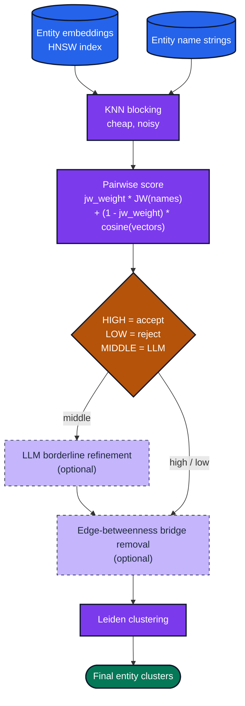

# Entity Resolution

`muninn_extract_er` runs a full entity-resolution cascade in one SQL call: KNN blocking → pairwise scoring (Jaro-Winkler × cosine) → LLM refinement in the borderline band → optional bridge-edge removal → Leiden clustering. This page walks through what each stage does, the parameter space, and how to build the inputs.

## The cascade



*Dashed stages are optional. HIGH/LOW scores skip the LLM entirely.*

Each stage trades compute for precision. The LLM stage is optional (and expensive); use it only when the borderline band is non-trivial.

## Signature

```sql
muninn_extract_er(
    hnsw_table TEXT,                  -- HNSW vtable holding entity embeddings
    name_col TEXT,                    -- entity name column on the source table
    k INTEGER,                        -- KNN neighbors per entity
    dist_threshold REAL,              -- max cosine distance for a candidate pair
    jw_weight REAL,                   -- 0..1, Jaro-Winkler contribution; cosine gets (1 - jw_weight)
    borderline_delta REAL,            -- width of borderline band; 0.0 disables LLM
    chat_model TEXT,                  -- required when borderline_delta > 0, else NULL
    edge_betweenness_threshold REAL,  -- bridge removal threshold; NULL to skip
    type_guard TEXT                   -- 'same_source' | 'diff_type' | NULL
) -> JSON                              -- {"clusters":{"<entity_id>": <cluster_id>, ...}}
```

The implicit decision boundary is `match_threshold = 1 - dist_threshold + borderline_delta`:

- Cosine distance ≤ `1 - match_threshold` → accepted outright
- Cosine distance in `[1 - match_threshold, 1 - match_threshold + borderline_delta]` → sent to the LLM
- Cosine distance > `dist_threshold` → rejected outright

## Prerequisites

You need two things in the database before `muninn_extract_er` can run:

1. An entity table with at least a name column
2. An `hnsw_index` containing one embedding per entity, with `rowid` matching the entity table's primary key

```sql
.load ./muninn

INSERT INTO temp.muninn_models(name, model)
  SELECT 'MiniLM', muninn_embed_model('models/all-MiniLM-L6-v2.Q8_0.gguf');

INSERT INTO temp.muninn_chat_models(name, model)
  SELECT 'Qwen3.5-4B',
         muninn_chat_model('models/Qwen3.5-4B-Instruct.Q4_K_M.gguf');

-- Entity table with duplicates to resolve
CREATE TABLE entities (
  id INTEGER PRIMARY KEY,
  name TEXT NOT NULL,
  source TEXT                    -- 'crm' / 'salesforce' / 'wikidata' — used by type_guard
);

INSERT INTO entities(name, source) VALUES
  ('Elon Musk',             'crm'),
  ('Elon R. Musk',          'salesforce'),
  ('Musk, Elon',            'wikidata'),
  ('Tesla, Inc.',           'crm'),
  ('Tesla Motors',          'salesforce'),
  ('Tesla',                 'wikidata'),
  ('SpaceX',                'crm'),
  ('Space Exploration Technologies', 'salesforce'),
  ('Apple',                 'wikidata'),
  ('Apple Inc.',            'crm');

-- HNSW index sized for MiniLM
CREATE VIRTUAL TABLE entity_emb USING hnsw_index(dimensions=384, metric='cosine');

INSERT INTO entity_emb(rowid, vector)
  SELECT id, muninn_embed('MiniLM', name) FROM entities;
```

## Basic call

```sql
SELECT muninn_extract_er(
  'entity_emb',   -- HNSW vtable
  'name',         -- name column on entities
  5,              -- k: top-5 KNN per entity
  0.3,            -- dist_threshold: cosine distance ≤ 0.3 considered
  0.7,            -- jw_weight: 70% name similarity, 30% embedding similarity
  0.05,           -- borderline_delta: LLM decides when score within ±0.05 of threshold
  'Qwen3.5-4B',   -- chat model for borderline decisions
  NULL,           -- skip bridge removal
  NULL            -- no type guard
) AS er_result;
```

```text
{"clusters":{
  "1":1, "2":1, "3":1,        -- Elon Musk variants
  "4":2, "5":2, "6":2,        -- Tesla variants
  "7":3, "8":3,                -- SpaceX variants
  "9":4, "10":4                -- Apple variants
}}
```

The result maps every entity's `rowid` (key) to a cluster ID (value). Entities sharing a cluster ID are considered the same real-world entity.

### Turning the result into a lookup table

```sql
WITH er AS (
  SELECT muninn_extract_er('entity_emb', 'name', 5, 0.3, 0.7, 0.05,
                           'Qwen3.5-4B', NULL, NULL) AS result
)
SELECT key   AS entity_id,
       value AS cluster_id
  FROM er, json_each(er.result, '$.clusters');
```

## Parameter tuning

### `k` — KNN blocking breadth

- **Low (3–5)**: Fast but misses non-obvious duplicates (similar name, distant embedding)
- **High (20–50)**: Catches more but inflates pairwise scoring cost quadratically

Start at `k = 10` for datasets up to 100k entities.

### `dist_threshold` — cosine cutoff

Anything beyond this distance is rejected without scoring. Values around 0.25–0.4 work for MiniLM; looser (0.5+) for larger/coarser models.

### `jw_weight` — name vs embedding

- `1.0` → pure string similarity (Jaro-Winkler)
- `0.0` → pure embedding cosine
- `0.6–0.8` → sweet spot for person/org names where string edits matter but context helps

Jaro-Winkler favors shared prefixes, so it's well suited to "Elon Musk" / "Elon R. Musk" but weaker on "Tesla" / "Tesla Motors". Blend with embeddings for robustness.

### `borderline_delta` — LLM band width

Controls the width of the "unsure" band that gets escalated to the chat model:

- `0.0` — disables LLM entirely (set `chat_model = NULL`). Fully deterministic pipeline.
- `0.02–0.05` — only ambiguous pairs go to the LLM; most decisions are made by the score alone. Typical starting point.
- `0.10+` — LLM sees most borderline pairs. Higher accuracy, much higher cost.

### `edge_betweenness_threshold` — bridge removal

When supplied (non-NULL), pairs whose connecting edge has edge-betweenness above this threshold are dropped before Leiden clustering. This prevents two real clusters from being merged through a single spurious bridge pair — the classic "Girvan-Newman" failure mode. Leave NULL unless you see over-merging.

### `type_guard` — pair filtering

| Value | Behavior | When |
|-------|----------|------|
| `'same_source'` | Only pairs from the **same** source column are considered | Record linkage *across* systems (you want to dedupe each source independently first — or match only across sources) |
| `'diff_type'` | Only pairs with **different** types are considered | Knowledge-graph ER where entities are pre-typed and cross-type matches are the target |
| `NULL` / `''` | No filtering | Default |

For the example above, `type_guard = 'same_source'` would prevent merging "Elon Musk" (CRM) with "Elon R. Musk" (Salesforce) — probably not what you want for cross-CRM deduplication.

## Without the LLM (fully deterministic)

If you want a reproducible pipeline with no LLM involvement:

```sql
SELECT muninn_extract_er(
  'entity_emb', 'name',
  10,             -- k
  0.35,           -- dist_threshold
  0.6,            -- jw_weight
  0.0,            -- borderline_delta = 0 disables LLM
  NULL,           -- chat_model not needed
  NULL,           -- no bridge removal
  NULL            -- no type guard
);
```

Every decision comes from the score alone. Useful for auditable pipelines or when the chat model would be the bottleneck.

## Without embeddings (name-only ER)

If you already have a name column but no embeddings, use `jw_weight = 1.0` and populate the HNSW with any valid 1-dim vectors — cosine will have zero weight so the vectors don't matter:

```sql
SELECT muninn_extract_er('entity_emb', 'name', 10, 1.0, 1.0, 0.0, NULL, NULL, NULL);
```

That said, embedding-augmented ER consistently outperforms name-only ER on real data — if you can afford the one-time embedding cost, do it.

## Naming the clusters

After ER, each cluster is just an integer. Use [`muninn_label_groups`](api.md#muninn_label_groups) to get a human-readable name:

```sql
-- 1. Materialize cluster membership
CREATE TABLE cluster_members AS
WITH er AS (
  SELECT muninn_extract_er('entity_emb', 'name', 5, 0.3, 0.7, 0.05,
                           'Qwen3.5-4B', NULL, NULL) AS result
)
SELECT e.id, e.name, CAST(je.value AS INTEGER) AS cluster_id
  FROM entities e
  JOIN er ON 1=1, json_each(er.result, '$.clusters') je
  WHERE je.key = CAST(e.id AS TEXT);

-- 2. Generate labels per cluster
SELECT group_id, label, member_count FROM muninn_label_groups
  WHERE model = 'Qwen3.5-4B'
    AND membership_table = 'cluster_members'
    AND group_col = 'cluster_id'
    AND member_col = 'name'
    AND min_group_size = 2
    AND max_members_in_prompt = 10
    AND system_prompt = 'Output ONLY a concise canonical name for this entity (1-5 words).';
```

```text
group_id  label                               member_count
--------  ----------------------------------  -------------
1         Elon Musk                           3
2         Tesla                               3
3         SpaceX                              2
4         Apple Inc                           2
```

## Performance notes

| Stage | Cost scales as | Tuning knob |
|-------|---------------|-------------|
| KNN blocking | `O(N log N)` | `k` |
| Pairwise scoring | `O(N × k)` | `dist_threshold` |
| LLM refinement | `O(borderline pairs)` × per-call LLM cost | `borderline_delta` |
| Bridge removal (betweenness) | `O(V × E)` | `edge_betweenness_threshold` |
| Leiden clustering | `O(E)` per iteration | implicit |

Dominant cost is usually the LLM stage. Start with `borderline_delta = 0` to see what the deterministic pipeline gives you, then expand the band only if precision is insufficient.

## See also

- [API Reference — `muninn_extract_er`](api.md#muninn_extract_er)
- [API Reference — `muninn_label_groups`](api.md#muninn_label_groups) — labeling ER clusters
- [Centrality and Community — bridge removal motivation](centrality-community.md#edge-betweenness)
- [Chat and Extraction](chat-and-extraction.md) — LLM-side extraction that feeds ER inputs
