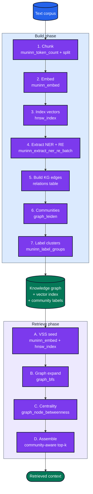

# GraphRAG Cookbook

A complete retrieval pipeline over a text corpus, end-to-end in SQL: chunk → embed → extract entities and relations → build a knowledge graph → detect communities → label them → retrieve via vector seed + graph expansion + centrality ranking.

Every step uses muninn's own functions — no external Python model server, no third-party extensions. The only external input is the text itself.

## The shape of the pipeline



*Build phase produces a knowledge graph + vector index + labelled communities. Retrieve phase composes four stages over that artefact set.*

## Prerequisites

Load the extension and register one embedding and one chat model:

```sql
.load ./muninn

INSERT INTO temp.muninn_models(name, model)
  SELECT 'MiniLM',
         muninn_embed_model('models/all-MiniLM-L6-v2.Q8_0.gguf');

INSERT INTO temp.muninn_chat_models(name, model)
  SELECT 'Qwen3.5-4B',
         muninn_chat_model('models/Qwen3.5-4B-Instruct.Q4_K_M.gguf');
```

For throughput on long corpora, use a 3B–7B chat model at Q4_K_M on Metal.

## Step 1 — Source corpus

```sql
CREATE TABLE documents (id INTEGER PRIMARY KEY, content TEXT);

INSERT INTO documents(content) VALUES
  ('Tesla acquired Maxwell Technologies in 2019 for $218 million to improve battery tech.'),
  ('SpaceX, founded by Elon Musk in 2002, launched Falcon 9 in 2010.'),
  ('Apple released the iPhone in 2007; Steve Jobs unveiled it at Macworld.'),
  ('Tim Cook succeeded Steve Jobs as Apple CEO in 2011.'),
  ('Elon Musk became CEO of Tesla in 2008.'),
  ('Maxwell Technologies was based in San Diego and made ultracapacitors.'),
  ('Steve Jobs co-founded Apple Computer in 1976 with Steve Wozniak.'),
  ('SpaceX is headquartered in Hawthorne, California.');
```

Short docs here for demonstration; the pipeline works on real long-form text.

## Step 2 — Chunk (if needed)

For documents longer than the embedding model's context, chunk before embedding. `muninn_token_count` tells you the length:

```sql
-- Skip chunking if everything fits in 512 tokens
SELECT id, muninn_token_count('MiniLM', content) AS tokens FROM documents;
```

For real corpora, chunk in Python or with a recursive CTE that splits on paragraph / sentence boundaries. The examples below treat each document as a single chunk.

## Step 3 — Embed and index

```sql
CREATE VIRTUAL TABLE doc_vec USING hnsw_index(
  dimensions=384, metric='cosine'
);

INSERT INTO doc_vec(rowid, vector)
  SELECT id, muninn_embed('MiniLM', content) FROM documents;
```

## Step 4 — Extract entities and relations

Batch all documents in a single multi-sequence call:

```sql
CREATE TEMP TABLE ner_re AS
WITH texts AS (
  SELECT json_group_array(content) AS arr FROM documents
),
results AS (
  SELECT muninn_extract_ner_re_batch(
           'Qwen3.5-4B',
           (SELECT arr FROM texts),
           'person,organization,product,location,date',
           'founded,acquired,ceo_of,released,headquartered_in,succeeded',
           4
         ) AS batch
)
SELECT (row_number() OVER () ) AS doc_id,
       value AS extraction
  FROM results, json_each(results.batch);
```

## Step 5 — Materialize the knowledge graph

```sql
-- Entities (deduplicated by text+type)
CREATE TABLE entities AS
SELECT DISTINCT
       e.value ->> 'text' AS name,
       e.value ->> 'type' AS type
  FROM ner_re, json_each(ner_re.extraction, '$.entities') e;

-- Relations — use head/tail directly; canonicalize later via ER if needed
CREATE TABLE relations AS
SELECT r.value ->> 'head' AS src,
       r.value ->> 'rel'  AS rel,
       r.value ->> 'tail' AS dst,
       CAST(r.value ->> 'score' AS REAL) AS weight
  FROM ner_re, json_each(ner_re.extraction, '$.relations') r;

SELECT * FROM relations;
```

```text
src         rel                 dst                     weight
----------  ------------------  ----------------------  ------
Tesla       acquired            Maxwell Technologies    0.98
SpaceX      founded             Elon Musk               0.94
Falcon 9    released            SpaceX                  0.88
Apple       released            iPhone                  0.95
Steve Jobs  ceo_of              Apple                   0.97
Tim Cook    succeeded           Steve Jobs              0.96
Elon Musk   ceo_of              Tesla                   0.97
...
```

At this point you have a queryable knowledge graph — every muninn graph TVF works on the `relations` table directly.

## Step 6 — Entity resolution (optional but recommended)

"Elon Musk" and "Musk" may appear as separate entities. Resolve duplicates with [`muninn_extract_er`](api.md#muninn_extract_er):

```sql
-- Embed entity names for ER
CREATE VIRTUAL TABLE entity_emb USING hnsw_index(dimensions=384, metric='cosine');
INSERT INTO entity_emb(rowid, vector)
  SELECT rowid, muninn_embed('MiniLM', name) FROM entities;

WITH er AS (
  SELECT muninn_extract_er(
           'entity_emb', 'name',
           5, 0.3, 0.7, 0.05, 'Qwen3.5-4B',
           NULL, 'diff_type'
         ) AS result
)
CREATE TABLE entity_clusters AS
SELECT e.rowid AS entity_id, e.name, e.type,
       CAST(je.value AS INTEGER) AS cluster_id
  FROM entities e, er, json_each(er.result, '$.clusters') je
  WHERE je.key = CAST(e.rowid AS TEXT);
```

See [Entity Resolution](entity-resolution.md) for the cascade details.

## Step 7 — Community detection

```sql
SELECT node, community_id FROM graph_leiden
  WHERE edge_table = 'relations' AND src_col = 'src' AND dst_col = 'dst'
    AND direction = 'both';
```

```text
node                    community_id
----------------------  ------------
Tesla                   0
Maxwell Technologies    0
Elon Musk               0
SpaceX                  0
Falcon 9                0
Apple                   1
iPhone                  1
Steve Jobs              1
Tim Cook                1
Steve Wozniak           1
```

Two natural communities: Musk's companies and Apple/Jobs/Cook.

## Step 8 — Label the communities

```sql
CREATE TABLE cluster_members AS
SELECT node, community_id FROM graph_leiden
  WHERE edge_table = 'relations' AND src_col = 'src' AND dst_col = 'dst'
    AND direction = 'both';

SELECT group_id, label, member_count FROM muninn_label_groups
  WHERE model = 'Qwen3.5-4B'
    AND membership_table = 'cluster_members'
    AND group_col = 'community_id'
    AND member_col = 'node'
    AND min_group_size = 2
    AND max_members_in_prompt = 10
    AND system_prompt = 'Output ONLY a concise label describing the theme of this group (3-6 words).';
```

```text
group_id  label                             member_count
--------  --------------------------------  -------------
0         Elon Musk companies               5
1         Apple and its leadership          5
```

---

## Retrieval

Now we have everything we need for GraphRAG retrieval: a vector index, a knowledge graph, and a community partition.

### Phase A — Vector similarity seed

```sql
SELECT d.id, d.content, round(v.distance, 4) AS dist
  FROM doc_vec v JOIN documents d ON d.id = v.rowid
  WHERE v.vector MATCH muninn_embed('MiniLM', 'Who runs Tesla?')
    AND v.k = 3;
```

```text
id   content                                     dist
---  ------------------------------------------  ------
5    Elon Musk became CEO of Tesla in 2008.      0.2121
1    Tesla acquired Maxwell Technologies ...     0.4018
2    SpaceX, founded by Elon Musk in 2002 ...    0.4522
```

### Phase B — Graph expansion from seed entities

For each seed document, pull the entities it mentioned, then expand via BFS on `relations`:

```sql
-- Expand 2 hops from 'Tesla' on the KG
SELECT node, depth FROM graph_bfs
  WHERE edge_table = 'relations' AND src_col = 'src' AND dst_col = 'dst'
    AND start_node = 'Tesla' AND max_depth = 2 AND direction = 'both';
```

```text
node                    depth
----------------------  -----
Tesla                   0
Maxwell Technologies    1
Elon Musk               1
Falcon 9                2
SpaceX                  2
```

### Phase C — Centrality-ranked context

Among the expanded set, rank by node betweenness to find the most cross-cutting concepts:

```sql
SELECT node, round(centrality, 3) AS c FROM graph_node_betweenness
  WHERE edge_table = 'relations' AND src_col = 'src' AND dst_col = 'dst'
    AND direction = 'both' AND normalized = 1
  ORDER BY c DESC;
```

High-betweenness entities bridge otherwise separate topic clusters — they're the most informative context additions.

### Phase D — Community-aware top-k

Prevent the final context from being dominated by one cluster: pick the top-centrality node from each community up to your context budget. See the SQL pattern in [Centrality and Community → Combining centrality with communities](centrality-community.md#combining-centrality-with-communities).

---

## Putting it together in Python

```python
import sqlite3, struct

db = sqlite3.connect("graphrag.db")
db.enable_load_extension(True)
db.load_extension("./muninn")

def retrieve(db, query: str, k_vec: int = 3, expand_depth: int = 2, top_n: int = 6):
    # A — VSS seed
    seeds = db.execute(
        "SELECT d.id, d.content FROM doc_vec v JOIN documents d ON d.id = v.rowid "
        "WHERE v.vector MATCH muninn_embed('MiniLM', ?) AND v.k = ?",
        (query, k_vec),
    ).fetchall()

    # B — extract entities from seed docs, expand each on the KG
    expanded = set()
    for doc_id, content in seeds:
        ents = db.execute(
            "SELECT value ->> 'text' FROM json_each("
            "  muninn_extract_entities('Qwen3.5-4B', ?, "
            "    'person,organization,product,location,date'), '$.entities')",
            (content,),
        ).fetchall()
        for (ent,) in ents:
            expanded.add(ent)
            for row in db.execute(
                "SELECT node FROM graph_bfs "
                "WHERE edge_table='relations' AND src_col='src' AND dst_col='dst' "
                "  AND start_node=? AND max_depth=? AND direction='both'",
                (ent, expand_depth),
            ):
                expanded.add(row[0])

    # C — centrality rank
    cent = dict(db.execute(
        "SELECT node, centrality FROM graph_node_betweenness "
        "WHERE edge_table='relations' AND src_col='src' AND dst_col='dst' "
        "  AND direction='both' AND normalized=1"
    ))

    # D — community-aware top-N
    comm = dict(db.execute(
        "SELECT node, community_id FROM graph_leiden "
        "WHERE edge_table='relations' AND src_col='src' AND dst_col='dst' "
        "  AND direction='both'"
    ))

    ranked = sorted(expanded, key=lambda n: cent.get(n, 0), reverse=True)
    selected, seen = [], set()
    for n in ranked:
        c = comm.get(n)
        if c not in seen or len(selected) < top_n:
            selected.append(n)
            seen.add(c)
        if len(selected) >= top_n:
            break
    return selected
```

## Performance planning

| Stage | Cost per query | Amortization |
|-------|---------------|--------------|
| VSS seed | O(log N) HNSW | — |
| Entity extraction of seeds | LLM-bound, ~1 sec per seed | Cache by doc ID |
| Graph expansion | O(E) within depth | Consider `graph_adjacency` cache |
| Betweenness | O(VE) | Compute nightly into a table |
| Leiden | O(E) per iteration | Compute nightly into a table |

**Rule of thumb**: Node betweenness and Leiden are the expensive steps. For production, precompute them nightly and store in regular tables. Recompute only when the graph changes by > ~5%. The adjacency cache ([`graph_adjacency`](api.md#graph_adjacency)) handles the trigger + delta bookkeeping for you.

## Variant — structural similarity via Node2Vec

Content embeddings capture *what a node talks about*. Node2Vec captures *where a node sits in the graph*. The two can be combined for hybrid retrieval:

```sql
CREATE VIRTUAL TABLE entity_struct_vec USING hnsw_index(
  dimensions=64, metric='cosine'
);

SELECT node2vec_train(
  'relations', 'src', 'dst', 'entity_struct_vec',
  64, 0.5, 1.0,         -- slightly BFS-biased walks for community signal
  10, 80, 5, 5,
  0.025, 5
);
```

Seed with Node2Vec for structural neighbors (nodes with similar graph roles, regardless of content), seed with `muninn_embed`-over-HNSW for semantic neighbors. Merge the two seed sets before graph expansion.

## Next steps

- [Entity Resolution](entity-resolution.md) — clean up duplicate mentions before building the KG
- [Centrality and Community](centrality-community.md) — parameter tuning for the retrieval ranking stages
- [Chat and Extraction](chat-and-extraction.md) — alternate prompting and batch strategies
- [Node2Vec](node2vec.md) — deeper treatment of structural embeddings
- [API Reference](api.md) — every function called above, in its canonical form
