# Muninn Logo Processing Pipeline

Initial logo design came from generating a logo using Google's Nano Banana.

The problem is that is had a white background and I wanted the background transparent.

I am NOT going to keep hitting nano banana with that refinement requirement when there are free models and offline tooling to get there.

Source image: `muninn_20260212_005558_0.png`

Each row shows a pipeline stage with three views:

- **Mask / Filter** — the greyscale signal computed at this step
- **This Step** — original image with only this step's mask as transparency
- **Cumulative** — original with all filters combined up to this point

| # | Step | Mask / Filter | This Step | Cumulative |
|--:|------|:-------------:|:---------:|:----------:|
| 0 | Original input image |  | 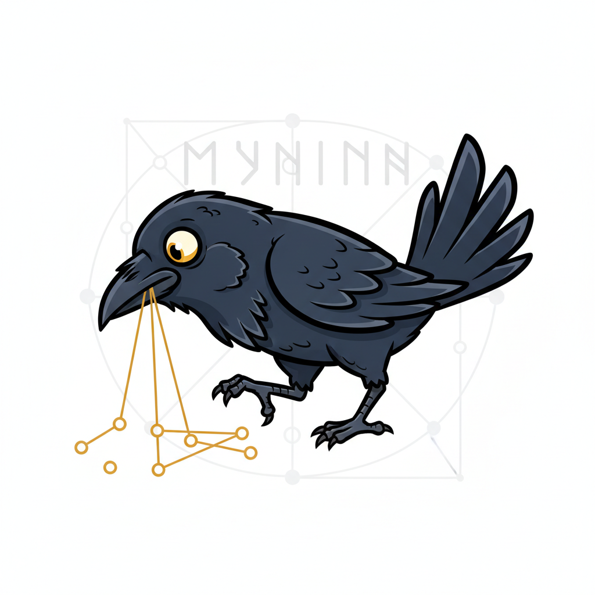 |  |
| 1 | U2-Net semantic segmentation — AI model identifies foreground subject | 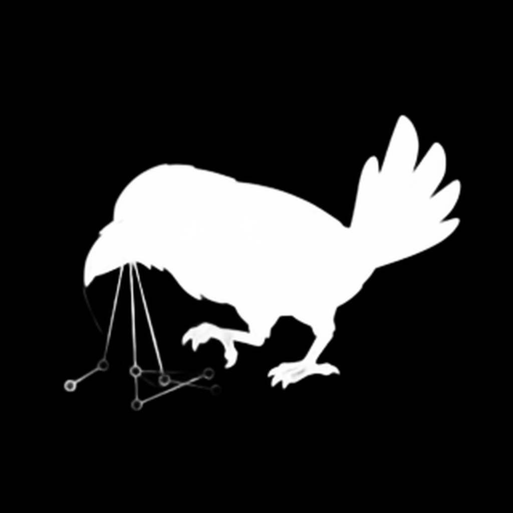 |  | 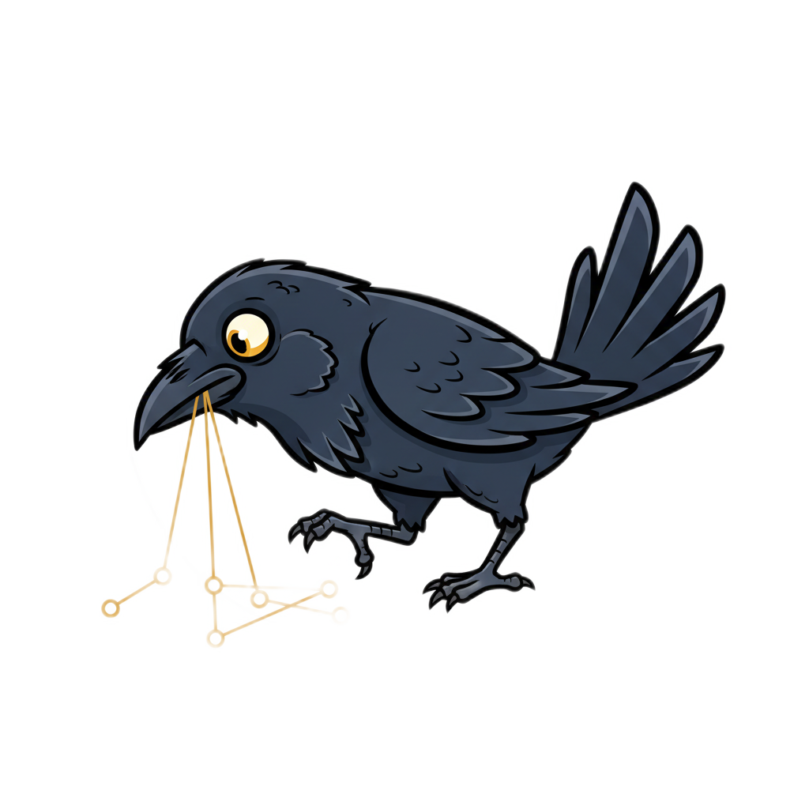 |
| 2 | Color distance from white — pixels far from pure white are kept | 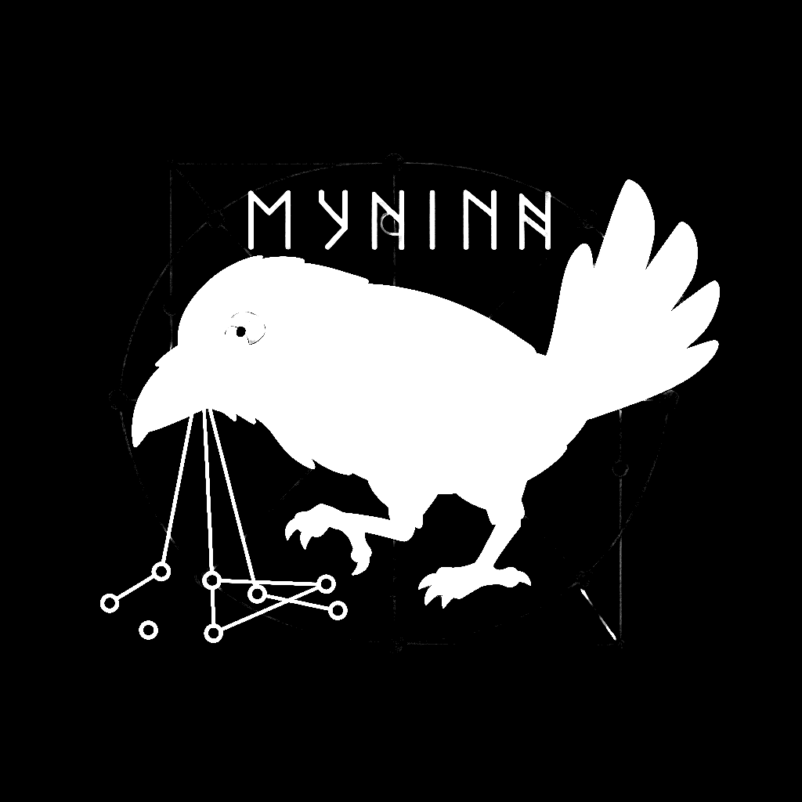 |  |  |
| 3 | Scharr edge detection — gradient magnitude reveals structural edges (4x amplified) | 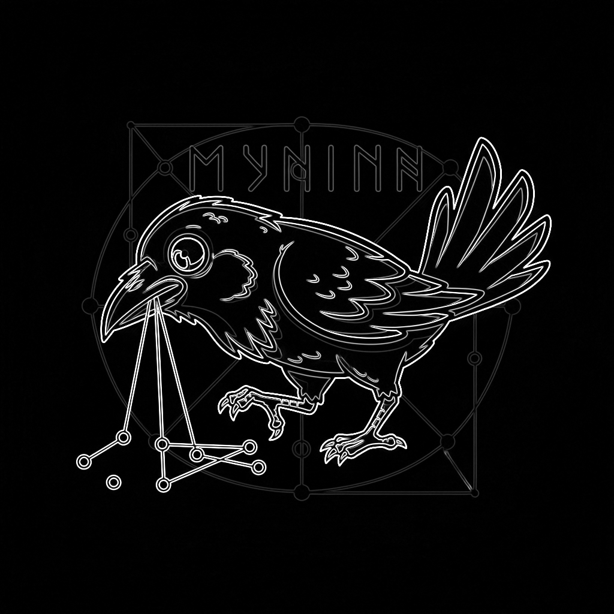 | 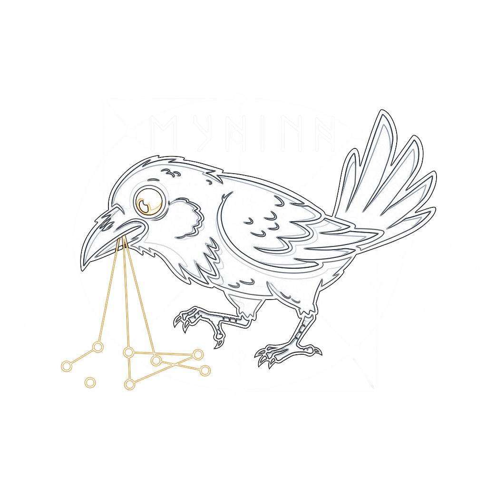 |  |
| 4 | Edge dilation — binary threshold + 5px MaxFilter creates spatial envelope | 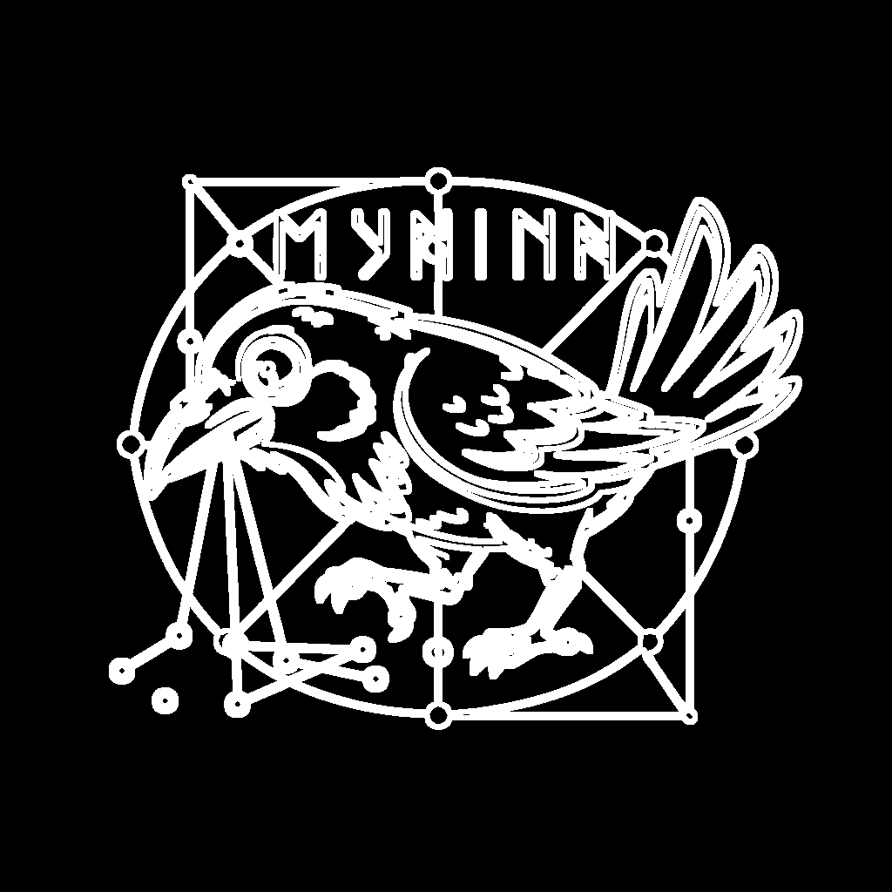 |  |  |
| 5 | Edge refinement — edge envelope weighted by max(grey, warmth, darkness) alpha | 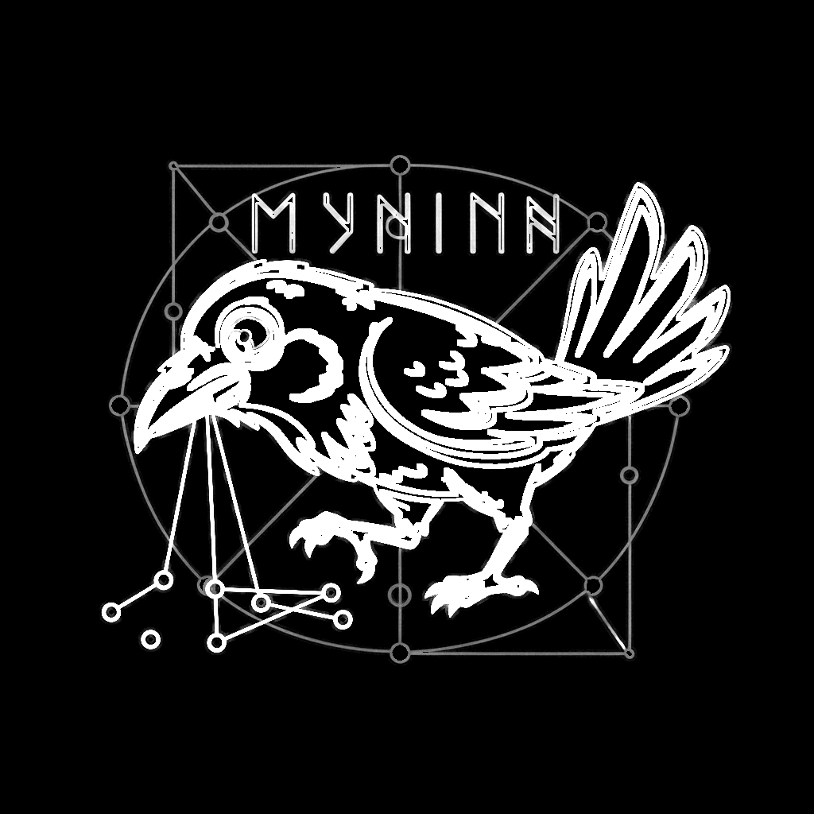 |  |  |
| 6 | Combined mask — pixel-wise max of semantic, color, and edge signals |  | 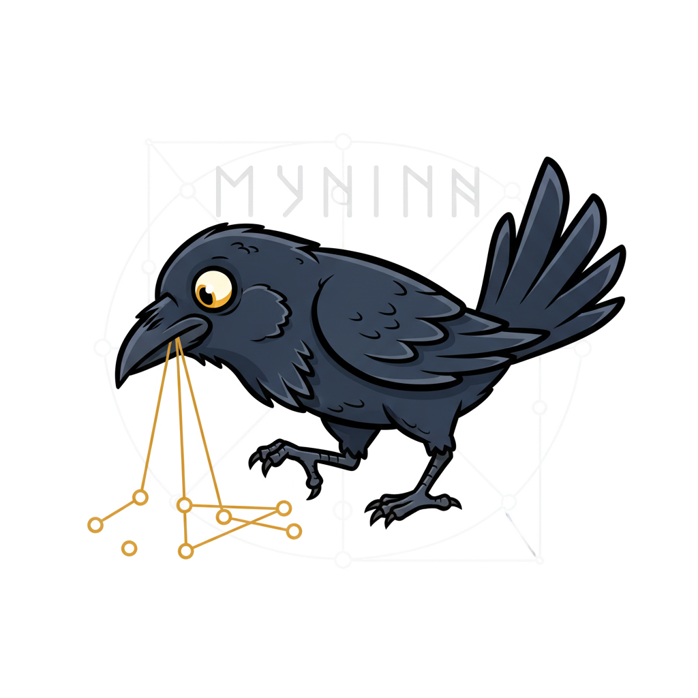 |  |
| 7 | Sigmoid contrast sharpening (k=12) — pushes soft alpha toward 0 or 1 | 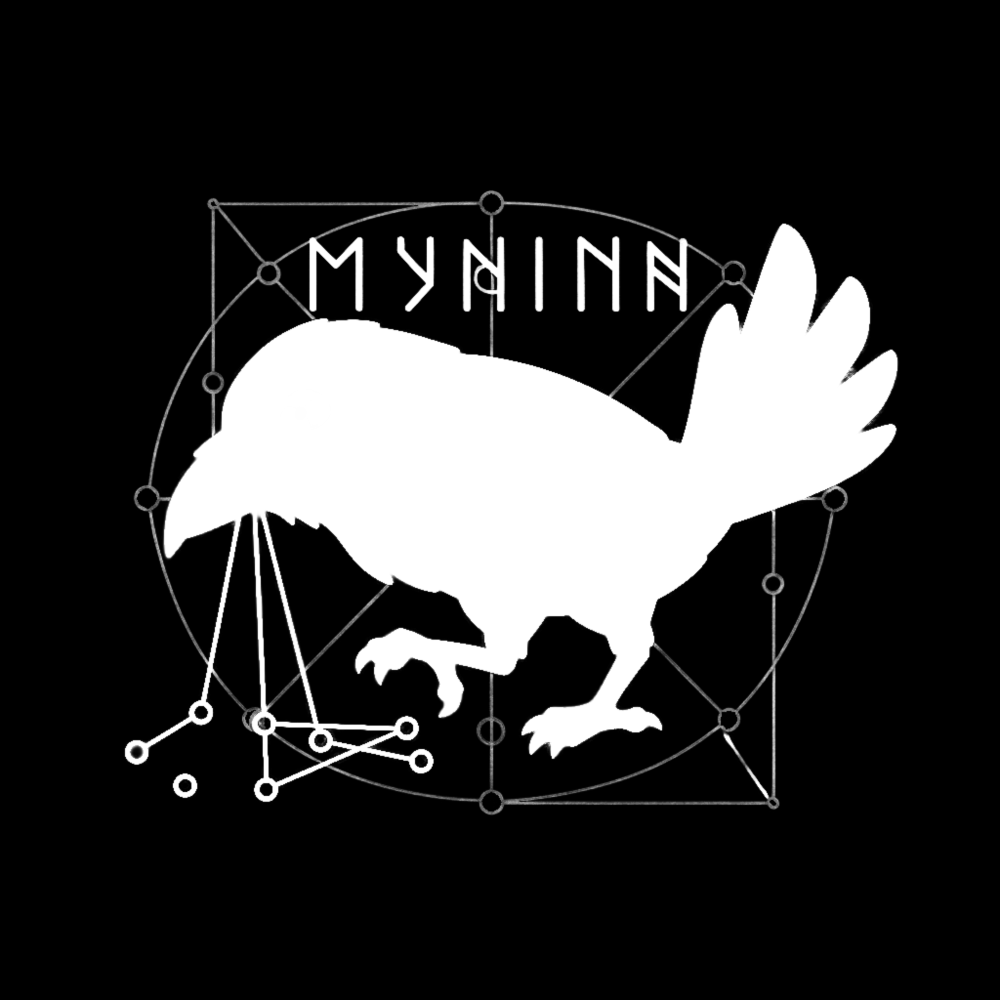 |  |  |
| 8 | Final result — mask applied and auto-cropped to bounding box |  | 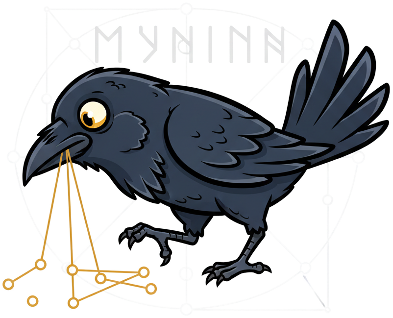 |  |

---

*Generated by `uv run scripts/process_logo.py steps`*

## How This Pipeline Was Built

This pipeline wasn't designed upfront — it emerged through iterative human-in-the-loop
refinement across three Claude Code sessions. Each stage was driven by visual inspection
of the previous output, with the user identifying what was missing and requesting a fix.

Below are the exact user prompts that shaped each stage, extracted from session transcripts
via `/introspect`.

### Session 1: `7c3d3208` — Feb 11 (Initial Script)

**Deterministic editing pipeline concept:**

> *"I do wonder if we could augment out helper script or make a new one for some
> deterministic image editting pipeline where:
> \- we leverage HuggingFace models for background removal
> \- We leverage the PIL library to add in whatever text we want [...]
> Then we could save some money (API costs for each image gen which is
> non-deterministic) for deterministic workflows that add in text overlays and some
> custom vector artwork."*

**Config file + normalized positioning:**

> *"maybe it would benefit from a JSON file as a config file for some defaults we can
> tweak and then CLI flags still allow overrides. Then if we normalise the width and
> height to 1.0, I can give relative positioning arguments like (0.0, 0.0) to mean
> hard top-left or (0.5, 0.5) for centered and (1.0, 1.0) for hard bottom right."*

**Background removal tuning:**

> *"run more testing cycle iterations on docs/logo/muninn\_20260211\_235216\_0.png to
> actually remove all of the white background and leave just the raven. I don't think
> the BG removal is tuned in well."*

### Session 2: `783c57a8` — Feb 12 (Segmentation Pipeline)

This session built the multi-signal pipeline through 7 iterative feedback cycles.

**Step 1 — Initial BG removal:**

> *"crop it to a bounding box \- reliable remove the white background. careful there
> are some spots inside the golden graph between the edges and node circles that need
> to get removed too and produce a PNG with transparency so the logo works better on
> either light or dark mode theme providers."*

**Step 2 — U2-Net model-based approach:**

> *"I honestly think you dismissed using huggingface background removal models too soon
> in scripts/process\_logo.py"*

**Step 3 — Segmentation + intermediate layer visualization:**

> *"Could we use perhaps an image segmentation model to generate masks for the different
> parts of the image and then use that to subtract the parts of the background I do not
> want?*
>
> *Feel free to also generate image output of the image segments intermediate layers for
> visual inspection and refinement."*

**Step 4 — Scharr edge detection:**

> *"What if we run something real simple like a Scharr edge detection filter or something
> in that category to help us better form a segmentation mask?"*

**Step 5 — Grey-to-white alpha interpolation:**

> *"Could we linearly interpolate the grey level as 100% opacity and white as 0% opacity
> and apply that to softening the dilated edge since we have a mask which is a good
> bounding box with clear margins to capture it. It is now fine tuning the separation of
> the white from light grey"*

**Step 6 — Multi-channel alpha (gold + black):**

> *"we need the same treatment for the gold on the gold graph and I think the black outer
> lines for the raven too."*

**Step 7 — Sigmoid sharpening:**

> *"I think we need to take stage 07 and sharpen the edges on the resulting mask and then
> apply it to get that crisp rotoscoped look."*

### Session 3: `d2064a6b` — Feb 18 (Steps Visualization)

**Pipeline step visualization command:**

> *"Can you please produce an updated version of scripts/process\_logo.py and when it runs
> I want it to output to docs/logo/steps/ [...]
> For each stage/step:
> \- produce the intermediate masking filters
> \- produce a copy of the original image with that masking filter applied
> I want to have pairs of side by side steps to visually illustrate the pipeline
> The docs/logo/steps/ should have a README.md that curates these images as a table."*

**Real transparency + cumulative column:**

> *"the result image is not applying an actual transaparency
> Can we have a third column which has the result of the accumulative filters being
> applied too please"*
