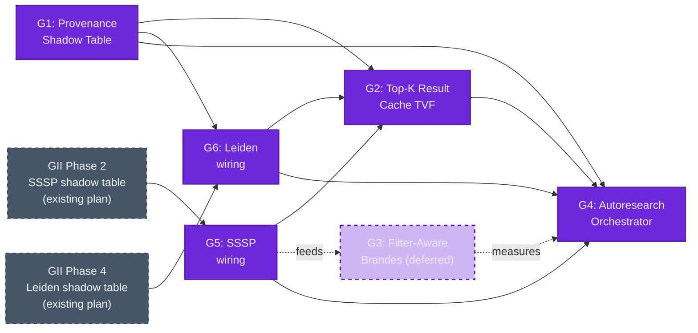
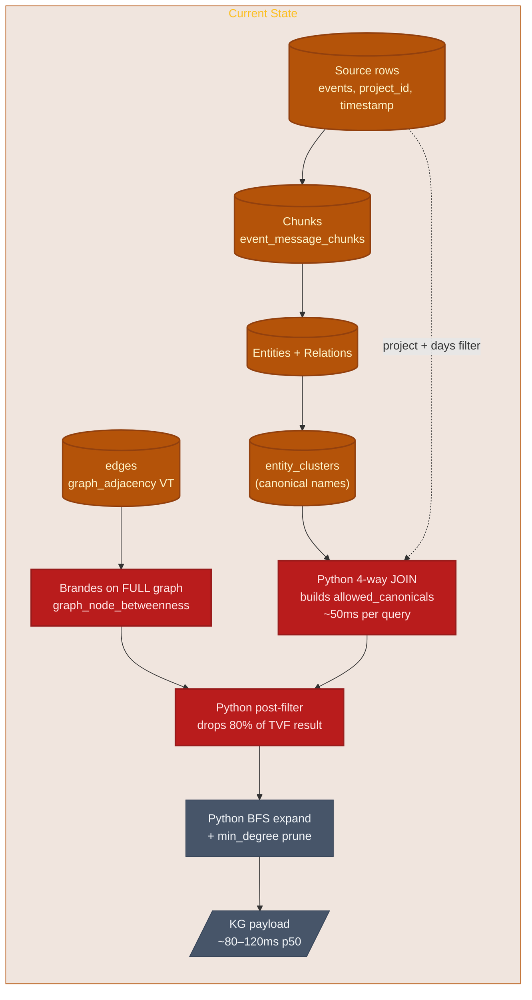
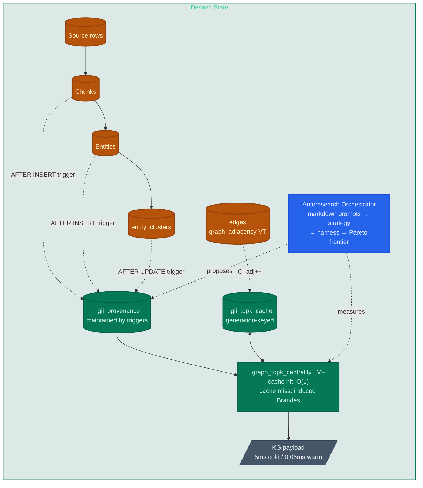
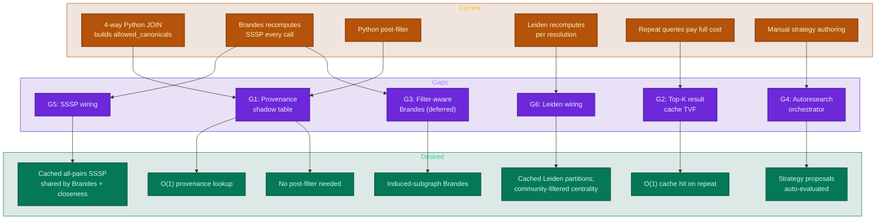
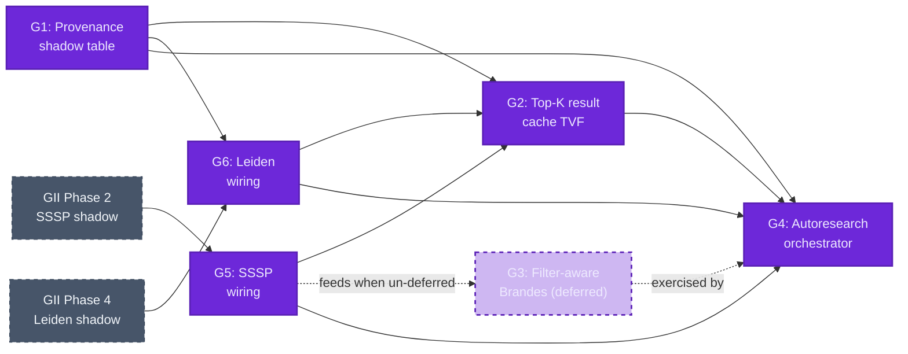

# Advanced KG Centrality Filtering with GII Provenance Cascade and Autoresearch Hill-Climbing

<!-- WARNING: ~75 external links cited. ~10 highest-stakes citations were independently re-verified during plan-gap Phase 1c. Two are paywalled (mark `<!-- PAYWALLED -->`). Search for `LINK_NOT_VERIFIED`, `PAYWALLED`, or `UNVERIFIED` to review individual citations whose endpoints could not be confirmed. -->

## Overview

This initiative extends `sqlite-muninn` with two material C-level data structures and a Karpathy-autoresearch-style hill-climbing harness, targeting the filtered-knowledge-graph query pipeline:

```
source rows (events, project_id, timestamp)
  → narrow chunks
  → narrow entities + relations
  → narrow resolved entities (canonical)
  → induced subgraph
  → top-K seeds by node/edge betweenness
  → BFS expand
  → min_degree prune
  → render
```

The `benchmarks/kg_perf` harness has empirically established that the **filter chain** (a 4-way join over events × chunks × entities × clusters) — not Brandes betweenness — is the dominant bottleneck at the current corpus scale. A denormalized provenance shadow table delivers 6×–20× over the existing baseline, and a result-level cache adds another 500×–6700× on warm reads. The PROPOSAL.md at `benchmarks/kg_perf/PROPOSAL.md` ranks these recommendations; this gap analysis turns them into a concrete C-implementation plan plus an autoresearch loop that can ratchet further improvements.

The workload is asymmetric: bursty high-throughput **writes** during ingestion, then **read-heavy** interactive sessions where the same filter window is queried many times. Both data structures are designed for that asymmetry — writes pay the maintenance cost, reads exploit cache locality.

**Gaps identified:**

- **G1: Provenance Shadow Table** — Maintain a `_gii_provenance(namespace_id, chunk_id, canonical, project_id, timestamp)` table by triggers on source tables; collapses the 4-way filter join into a single indexed scan
- **G2: Top-K Result Cache TVF** — A new `graph_topk_centrality` TVF that memoizes `(filter, query, generation)` → result; piggybacks on the existing GII generation counter for auto-invalidation
- **G3: Filter-Aware Centrality (Deferred)** — A `node_filter_table=` hidden-column argument on `graph_node_betweenness` / `graph_edge_betweenness` so Brandes runs on the induced subgraph; documented but deferred until empirical `brandes_share` crosses the inflection threshold (G3 ADR resolved with empirical-threshold + escape hatch)
- **G4: Autoresearch Hill-Climbing Harness** — A markdown-prompt-driven orchestrator over `benchmarks/kg_perf` that generates new strategies, runs them, deduplicates by content signature, and ratchets toward Pareto-optimal (latency, fidelity) frontiers
- **G5: SSSP Shadow Table Wiring (centrality acceleration)** — Wire `graph_node_betweenness`, `graph_edge_betweenness`, and `graph_closeness` to consume the SSSP shadow table specified by GII Phase 2 (`docs/plans/graph/01_gii_sssp_session_kg.md` §6.2). Replaces the direct `sssp_dijkstra`/`sssp_bfs` calls at `src/graph_centrality.c:443-445, 1411` with cache-aware lookups; cache misses pull through and write back via the GII delta-cascade pattern
- **G6: Leiden Shadow Table Wiring (community-aware filtering)** — Wire `graph_leiden` to consume the resolution-keyed Leiden shadow table specified by GII Phase 4 (`docs/plans/graph/04_communities_shadow_tables.md`); add a `community_filter=` hidden-column argument to centrality TVFs so the dashboard can ask "top-K most central nodes *within community C* in this filter window" without re-running Leiden

**Implementation dependencies (preview — full diagram in Gap Analysis):**



## Current State

The graph subsystem in `sqlite-muninn` (`src/`) ships eight registered subsystems via `sqlite3_muninn_init` (`src/muninn.c:42-121`). The `graph_adjacency` virtual table (`src/graph_adjacency.c`, registered at `muninn.c:70`) is the **GII** — Graph Incremental Index — though the file rename to `gii.c` documented in `docs/plans/graph/00_gap_analysis.md` has not yet landed.

### Existing GII Shadow Tables

The `graph_adjacency` VT maintains six shadow tables (`src/graph_adjacency.c:150-207`):

| Shadow Table | Purpose |
|---|---|
| `{vt}_config` | Metadata KV store (incl. `generation` counter — fully wired, see below) |
| `{vt}_nodes` | Node ID ↔ integer index mapping |
| `{vt}_degree` | In/out + weighted-in/out degrees per node |
| `{vt}_csr_fwd` | Forward CSR (offsets/targets/weights BLOBs) blocked per node range |
| `{vt}_csr_rev` | Reverse CSR (same shape) |
| `{vt}_delta` | INSERT/UPDATE/DELETE log for incremental merge (op codes 1/2) |

Triggers are installed by `graph_adjacency.c:223-260` on the user-supplied source edge table — three pattern strings interpolated via `sqlite3_mprintf("%w", ...)` for safe identifier quoting.

### Generation Counter (Already Wired)

Contrary to the initial mental model, the generation counter is **fully implemented**:

| Site | Action |
|---|---|
| `graph_adjacency.c:41` | `int64_t generation; /* increments on each rebuild */` field |
| `graph_adjacency.c:614, 962` | `vtab->generation++;` after delta-merge or full rebuild |
| `graph_adjacency.c:615, 963` | `config_set_int(vtab->db, vtab->vtab_name, "generation", vtab->generation);` persists to `_config` |
| `graph_adjacency.c:1017` | `config_get_int(vtab->db, vtab->vtab_name, "generation", 0)` for staleness checks |
| `graph_adjacency.c:1140` | `vtab->generation = config_get_int(db, argv[2], "generation", 0);` on xConnect |

The gap is **not** "implement a counter" — it's "extend the existing generation protocol so new downstream caches (provenance, top-K) participate in the invalidation cascade."

### Centrality TVFs

Registered by `centrality_register_tvfs(db)` (`src/muninn.c:58-62`):

- `graph_degree`, `graph_node_betweenness`, `graph_edge_betweenness`, `graph_closeness`

Brandes (Newman 2001) lives in `src/graph_centrality.c:393-499` as `brandes_compute(const GraphData *g, const char *direction, int auto_approx, int normalized, double *CB, double *EB)`. It loads `GraphData` fresh on every TVF invocation (no struct-level cache across calls), uses double-precision priority queue for weighted Dijkstra SSSP and BFS for unweighted, supports `auto_approx > 0` for sqrt(N) source sampling.

Calling convention is hidden-column constraint syntax — every TVF example reads `WHERE edge_table = 'edges' AND src_col = 'src' AND dst_col = 'dst' AND direction = 'both'` (the registered name is `graph_node_betweenness`, not `graph_betweenness`; `docs/CLAUDE.md:11`).

### Filter Cascade in claude-code-sessions

The downstream consumer at `/Users/joshpeak/play/claude-code-sessions/src/claude_code_sessions/database/sqlite/kg/payload.py` runs the four-step pipeline:

1. **`_allowed_canonicals(conn, days, project)`** (`payload.py:234-289`) — a 4-way join:
   ```sql
   SELECT DISTINCT ec.canonical
   FROM entities ent
   JOIN event_message_chunks emc ON emc.chunk_id = ent.chunk_id
   JOIN events e ON e.id = emc.event_id
   LEFT JOIN entity_clusters ec ON ec.name = ent.name
   WHERE 1=1 {days_clause} {project_clause}
   ```
2. **Centrality on the full graph** (`payload.py:190-210`):
   ```sql
   SELECT node, centrality FROM graph_node_betweenness
   WHERE edge_table='edges' AND src_col='src' AND dst_col='dst' AND direction='both'
   ```
3. **Post-filter in Python** (`payload.py:348-351`) — drop nodes whose canonical isn't in `allowed_canonicals`
4. **Top-K seed selection → BFS expand → min_degree prune** (`payload.py:362-410`) — pure Python loops over an adjacency dict

### Benchmark Harness State

`benchmarks/kg_perf/` already exists with a strategy ABC (`strategies/_base.py:34-42`), a deterministic warmup-then-rep timing loop (`bench.py:66-107`), JSONL result persistence (`bench.py:118-123`), and most-recent-per-(strategy, workload) compare (`__main__.py:93-128`). Five strategies are implemented:

| Strategy | What it does | Measured speedup |
|---|---:|---:|
| `baseline` | Mirrors `payload.py` exactly | 1.0× (reference) |
| `sql_subset` | Materializes filtered edges, runs Brandes on subset | 1.0×–1.8× (semantic fix only) |
| `chunk_canonical` | Denormalizes the 4-way join into one indexed table | 2.3×–20× |
| `kcore` | K-core peeling instead of single-pass min_degree | NEGATIVE (wrong abstraction; banked) |
| `topk_cache` | `(filter, query, edge_generation)` → result memo | 500×–6700× warm |

Total permutations: 5 strategies × 4 filter widths × 4 query shapes = **80**.



The two red nodes are the empirically-validated bottlenecks: the Python-side 4-way join builds `allowed_canonicals` (~50ms) and Brandes runs over edges that will mostly be discarded.

## Desired State

The filter cascade is collapsed into one indexed scan via a maintained `_gii_provenance` shadow table. A new `graph_topk_centrality` TVF memoizes the entire pipeline output keyed by `(filter, query, generation)` so repeated reads in an interactive session are O(1). An autoresearch orchestrator drives strategy proposals from markdown prompts, runs them through the existing `benchmarks/kg_perf` harness, and ratchets toward Pareto-optimal (latency, fidelity) frontiers without manual intervention.

### Provenance Shadow Table

Maintained by triggers on `event_message_chunks`, `entities`, and `entity_clusters` (and indirectly via `events` for `project_id`/`timestamp`):

```sql
CREATE TABLE _gii_provenance (
    namespace_id INTEGER NOT NULL,
    chunk_id     INTEGER NOT NULL,
    canonical    TEXT NOT NULL,
    project_id   TEXT NOT NULL,
    timestamp    TEXT NOT NULL,
    PRIMARY KEY (namespace_id, chunk_id, canonical)
);
CREATE INDEX _gii_provenance_proj_ts
    ON _gii_provenance(namespace_id, project_id, timestamp);
CREATE INDEX _gii_provenance_canonical
    ON _gii_provenance(namespace_id, canonical);
```

This is exactly Valduriez's "join index" primitive (Wikipedia confirms the citation: P. Valduriez, "Join indices", *ACM TODS* 12(2):218-246, 1987). Reads collapse the 4-way join into a single indexed lookup; writes pay an O(fan-out) maintenance cost during ingestion (acceptable per the asymmetric-workload assumption).

### Top-K Result Cache

A new TVF `graph_topk_centrality` reads filter + query parameters as hidden columns, computes `signature = hash(filter ‖ query ‖ G_adj)`, and looks up `_gii_topk_cache` — O(1) on hit, full pipeline on miss with auto-store. Invalidation rides the existing GII generation counter (already wired at `graph_adjacency.c:41,614,962,1017,1140`); when `G_adj` increments, all cached entries with the previous generation are stale.

### Autoresearch Orchestrator

A Karpathy-style markdown-prompt loop (`benchmarks/kg_perf/autoresearch/`) reads a prompt registry, asks an LLM agent to propose a new strategy file, runs it through the harness, computes Pareto dominance vs. the running frontier, and updates an iteration ledger. Crucially, it adds a **content-signature dedup layer that Karpathy's loop lacks** — every candidate strategy is hashed before execution so the loop doesn't re-evaluate semantically identical runs.



## Gap Analysis

### Architectural Principle (Axiom — inherited from GII blocked-CSR)

Every shadow table in this plan inherits the work-placement decision framework already established by `src/graph_adjacency.c`:

1. **Writes create queues of partial caches**, not materialized results. Triggers append to `_delta`-style queues (`graph_adjacency.c:223-260`); they do not synchronously rebuild downstream tables.
2. **Reads are fast even on a cache miss** because the blocked structure pulls through *only the blocks needed for the current read*, not the full graph.
3. **Partial-cache queues may never be consumed** — that is acceptable. Cleanup is driven by cache staleness relative to source generation (`graph_adjacency.c:1017, 1140`), not by aggressive eviction.
4. **Strategic partial writes** set up efficient read caches. Don't materialize what may never be read; don't load what isn't relevant to the query at hand.
5. **Minimum work** at every stage: writes never do more than queue, reads never load more than the requested blocks.

This axiom resolves the eager-vs-lazy ambiguity for provenance maintenance, cache invalidation, and eviction. Each ADR below either applies the principle directly or explores parameter choices *within* the axiom (block size, hash primitive, generation-counter granularity).

### Gap Map



### Dependencies



**Recommended implementation order:** G1 → (G5, G6 in parallel with GII Phase 2/4 progression) → G2 → G4 → (re-evaluate G3 via empirical `brandes_share`). G1 is the single biggest empirical win (6×–20×) and exercises the existing GII trigger / shadow-table / generation-counter machinery without inventing new patterns. G5 and G6 are wiring layers that depend on the existing GII Phase 2 and Phase 4 plans landing — if those plans are ahead of this initiative, G5/G6 can ship immediately; if behind, they wait. G2 builds on G1 (provenance) and reads from G5 (SSSP cache) + G6 (Leiden cache) when present. G4 ratchets on the entire substrate. G3 stays deferred — the literature (QUBE, Riondato-Kornaropoulos, KADABRA) is mature; un-defer is governed by the empirical `brandes_share` ADR.

---

### G1: Provenance Shadow Table

**Current:** The filter chain (events → chunks → entities → entity_clusters) is recomputed on every query in `claude-code-sessions/.../kg/payload.py:234-289` as a 4-way `JOIN`. Measured cost: ~50ms per query at 122,951-event corpus. No materialization, no maintenance, no caching — the join runs cold on every centrality call. There is no provenance subsystem in `src/muninn.c`; the closest precedent is the `graph_adjacency` VT's shadow tables and trigger machinery.

**Gap:** Add a new C subsystem (`src/provenance.c` + `src/provenance.h`) registered as `provenance_register_module(db)` from `muninn.c` between line 70 (`adjacency_register_module`) and line 76 (`graph_select_register_tvf`). The subsystem creates and maintains a `_gii_provenance` table via INSERT/UPDATE/DELETE triggers on `event_message_chunks`, `entities`, and `entity_clusters`. Reads issue a single indexed lookup that replaces the 4-way join.

**Output(s):** When complete I will have:
- **C source:** `src/provenance.c`, `src/provenance.h` — the new subsystem, registration function, trigger installation, shadow-table DDL
- **Modified C:** `src/muninn.c` — new include + registration call slotted into `sqlite3_muninn_init`
- **Build glue:** none — `scripts/generate_build.py` auto-discovers new `.c` files via glob (per `memory/MEMORY.md` build-system note)
- **C tests:** `test/test_provenance.c` plus extern decl in `test/test_main.c` and `RUN_TEST(...)` calls — verifying trigger install/uninstall, cascade on entity_clusters rename, generation-counter participation
- **Python tests:** `pytests/test_provenance.py` — fixture-based integration test using the `conn` fixture; verify provenance row counts match a 4-way-join reference
- **Harness strategy:** `benchmarks/kg_perf/strategies/provenance_c.py` — mirrors `chunk_canonical.py` but uses the C subsystem instead of a manually-CREATEd table; lets the harness measure prep cost + steady-state cost at parity
- **Doc updates:** `docs/architecture.md` adds the new subsystem to the registered-modules list; new `docs/provenance.md` page following the per-function template in `docs/CLAUDE.md` (one-liner purpose, signature, example with expected output, parameters table, returns, full recipe, see-also)

**References:**

Shadow-table DDL pattern from `src/graph_adjacency.c:155-206`:

```c
/* In adjacency_create() — replicate this pattern in provenance_create() */
static const char *kConfigSchemaSql =
    "CREATE TABLE IF NOT EXISTS \"%w\"("
    "  key TEXT PRIMARY KEY,"
    "  value TEXT)";

static const char *kProvSchemaSql =
    "CREATE TABLE IF NOT EXISTS \"%w_provenance\"("
    "  namespace_id INTEGER NOT NULL,"
    "  chunk_id     INTEGER NOT NULL,"
    "  canonical    TEXT NOT NULL,"
    "  project_id   TEXT NOT NULL,"
    "  timestamp    TEXT NOT NULL,"
    "  PRIMARY KEY (namespace_id, chunk_id, canonical)"
    ")";
```

Trigger installation pattern follows `install_triggers()` at `src/graph_adjacency.c:223-260` exactly. Critical correction over the initial draft: **`entity_clusters` needs INSERT and DELETE triggers, not just UPDATE** — a full ER rebuild (DELETE-all + INSERT-all) wouldn't fire UPDATE and would silently leave provenance pointing at obsolete canonicals. Four trigger groups total:

```c
/* Group 1: AFTER INSERT on event_message_chunks — chunk arrives, populate
 * provenance for all entities in that chunk. */
sql = sqlite3_mprintf(
    "CREATE TRIGGER IF NOT EXISTS \"%w_emc_ai\" "
    "AFTER INSERT ON \"event_message_chunks\" BEGIN "
    "  INSERT OR IGNORE INTO \"%w_provenance\"(namespace_id, chunk_id, canonical, project_id, timestamp) "
    "  SELECT 0, NEW.chunk_id, COALESCE(ec.canonical, ent.name), e.project_id, e.timestamp "
    "  FROM entities ent "
    "  JOIN events e ON e.id = NEW.event_id "
    "  LEFT JOIN entity_clusters ec ON ec.name = ent.name "
    "  WHERE ent.chunk_id = NEW.chunk_id; "
    "END",
    vt_name, vt_name);

/* Group 2: AFTER INSERT/DELETE/UPDATE on entities — entity changes for an
 * existing chunk. UPDATE is delete-of-old + insert-of-new (same pattern as
 * graph_adjacency.c:240-251). */

/* Group 3: AFTER UPDATE on entity_clusters — canonical rename cascade.
 * Single SQL UPDATE remaps every affected provenance row. */
sql = sqlite3_mprintf(
    "CREATE TRIGGER IF NOT EXISTS \"%w_ec_au\" "
    "AFTER UPDATE OF canonical ON \"entity_clusters\" BEGIN "
    "  UPDATE \"%w_provenance\" SET canonical = NEW.canonical "
    "  WHERE namespace_id = 0 AND canonical = OLD.canonical; "
    "END",
    vt_name, vt_name);

/* Group 4: AFTER INSERT and AFTER DELETE on entity_clusters — full-rebuild
 * support. INSERT remaps any provenance rows currently pointing at the raw
 * name to the new canonical; DELETE reverts canonical→raw. Without these,
 * a "DELETE FROM entity_clusters; INSERT new_clusters" sequence silently
 * leaves provenance frozen at the previous canonical assignment. */
```

Parameter parsing pattern from `parse_adjacency_params()` at `src/graph_adjacency.c:87-144`:

```c
/* Mirror this for parse_provenance_params() — argv[3:] holds key=value pairs.
 * For the hardcoded-schema variant (ADR below), parameters can be empty;
 * for the column-config DSL variant, accept filter_cols, source_chunks,
 * source_entities, source_clusters, source_events. */
for (int i = 3; i < argc; i++) {
    if (strncmp(arg, "filter_cols=", 12) == 0) { ... }
    /* ... */
}
/* Then validate every supplied identifier via id_validate() (id_validate.c:15-26)
 * AND verify columns exist via sqlite3_table_column_metadata() — fail-fast at
 * xCreate, not at first trigger fire. */
```

Generation-counter participation (read-side):

```c
/* Provenance reads bump a separate G_prov counter or piggyback on G_adj.
 * Centrality TVFs check G_prov when reading from _gii_provenance. */
int64_t gen = config_get_int(db, vt_name, "generation_provenance", 0);
```

Existing claude-code-sessions filter chain to replace (`payload.py:257-265`):

```sql
-- Replace this 4-way join...
SELECT DISTINCT ec.canonical
FROM entities ent
JOIN event_message_chunks emc ON emc.chunk_id = ent.chunk_id
JOIN events e ON e.id = emc.event_id
LEFT JOIN entity_clusters ec ON ec.name = ent.name
WHERE 1=1 {days_clause} {project_clause}

-- ...with this single-table indexed scan
SELECT DISTINCT canonical
FROM _gii_provenance
WHERE 1=1 {days_clause_v2} {project_clause_v2}
```

#### ADR: Trigger granularity — per-row vs. batched

| Option | Pros | Cons |
|--------|------|------|
| Per-row triggers (each INSERT/UPDATE fires) | Simple; consistent with `graph_adjacency`; correct under all interleavings | Bursty ingestion incurs N trigger fires; ~10-30% ingest slowdown |
| Batched maintenance (delta queue + flush) | Aligns with GII delta-cascade philosophy; bursty ingest stays fast | Eventual consistency; readers may see stale provenance until flush; need explicit `PRAGMA provenance_flush` or auto-flush threshold |

**Decision:** Per-row triggers append to a `_provenance_delta(rowid INTEGER PRIMARY KEY, source_table TEXT, source_op INTEGER, source_rowid INTEGER, ts INTEGER)` queue. Materialization into `_gii_provenance` happens lazily on read via the same blocked-pull-through pattern as `graph_adjacency`'s CSR.
**Rationale:** Architectural axiom — writes create queues of partial caches, not materialized rows. The trigger body is constant-cost (one INSERT into the delta queue) regardless of ingest burst size. Reads pay materialization cost only for the namespace/window they query.

#### ADR: Multi-source-table cascade order

When `entity_clusters` updates a canonical name (a common ER refinement event), every chunk attributing the old canonical must be relinked. Three options for ordering:

| Option | Pros | Cons |
|--------|------|------|
| Synchronous trigger on `entity_clusters` UPDATE | Reads are always fresh | UPDATE on `entity_clusters` becomes O(affected_chunks); can stall on large clusters |
| Lazy: rebuild affected provenance rows on next read | Writes stay fast | First read after an entity_clusters change is slow |
| Generational: bump `G_prov`, invalidate cache, recompute lazily on cache miss | Compatible with G2 cache; bounds worst-case | Extra complexity; need to weave G_prov into the existing G_adj counter or maintain a sibling |

**Decision:** Generational. `entity_clusters` mutations append a "cluster delta" to the same `_provenance_delta` queue and bump `G_prov`. Materialization on next read consumes any pending deltas for the queried namespace, then writes through to `_gii_provenance` (only for blocks the read touches). Stale cached top-K entries notice the generation mismatch on their next read and re-materialize.
**Rationale:** Same axiom as the trigger-granularity ADR — writes are queue-only; reads pull through blocks they need. A single delta queue across all source tables keeps the trigger SQL uniform (every trigger is "INSERT INTO delta queue, bump generation").

#### ADR: Schema flexibility — single hardcoded schema vs. column-config DSL

The user's current corpus has columns `(project_id, timestamp)`. Other consumers might want `(tenant_id, region, fiscal_quarter)` or `(category, severity)`. Options:

| Option | Pros | Cons |
|--------|------|------|
| Hardcoded `(project_id, timestamp)` schema | Simplest; ships fastest | Not reusable for non-claude-code-sessions consumers |
| `USING provenance(filter_cols='project_id,timestamp', source_chunks='event_message_chunks', source_entities='entities', source_clusters='entity_clusters', source_events='events', events_mutable=0)` | Reusable; explicit; cascade shape stays a contract | ~50-100 LoC for parameter parsing + identifier validation |
| Generic JSON-described join-graph DSL (`source_tables='[{"name":...,"fk":...}]'`) | Maximum flexibility | DSL parser is a new sub-project; premature generalization |

**Decision:** Parameterized via xCreate args, fixed source-table cascade shape (chunked-text → entities → resolved-entities). Source-table names and filter columns are configurable; the cascade shape (4 source tables, ER cluster mapping, denormalized timestamp) is the contract. The full JSON-DSL variant is deferred — see `docs/plans/future-work/general-purpose-provenance-dsl.md`.
**Rationale:** Smallest leap that pays off the next consumer (chat-log corpus, RAG documents) without inventing a DSL we have to maintain forever. The cascade shape matches the actual class of workloads other GII consumers would write. Mirrors the `parse_adjacency_params` pattern already in `src/graph_adjacency.c:87-144` — well-precedented identifier-validation surface.

#### ADR: Events-table mutation — append-only assumption vs. cascade trigger

Provenance denormalizes `(project_id, timestamp)` from `events` at chunk-insert time. If an `events` row is later UPDATE'd to change those values, every provenance row referencing that event is stale.

| Option | Pros | Cons |
|--------|------|------|
| Document `events` as append-only; provide `PRAGMA provenance_rebuild` for explicit refresh | Triggers stay simple; matches typical KG semantics | Stale provenance silently survives if user breaks the assumption |
| AFTER UPDATE trigger on `events` cascades to all matching `_gii_provenance` rows | Reads always fresh | UPDATE on events becomes O(chunks_per_event) — can stall on hot events |
| Track an `events.row_version` column; provenance carries `event_row_version` and reads detect mismatch | Honest staleness signal at read time | Requires schema change in `events`; extra column on every read |
| `events_mutable=0|1` xCreate flag — corpus declares its own posture | Per-consumer policy without forcing one shape | Two code paths to test; `events_mutable=1` cascades trigger lands later |

**Decision:** Per-consumer policy via the `events_mutable=0|1` xCreate flag (defaults to `0` — append-only). When `events_mutable=0`, provenance assumes events are append-only; documentation explicitly states this contract; an explicit `PRAGMA provenance_rebuild` is provided as escape valve. When `events_mutable=1`, an AFTER UPDATE trigger on `events` cascades to `_provenance_delta` (queued, not synchronous — per the architectural axiom).
**Rationale:** Falls naturally out of Option B for the schema-flexibility ADR. claude-code-sessions ships with `events_mutable=0` (matching the dominant log-shaped corpora pattern). Other consumers (e.g., document-index workloads with mutable metadata) can opt-in at `USING` time without forcing a global posture. The `events_mutable=1` cascade still respects the axiom — writes queue, reads pull through.

---

### G2: Top-K Result Cache TVF

**Current:** Repeated reads in an interactive session pay the full pipeline cost every time. The kg_perf harness `topk_cache` strategy (Python-side, `benchmarks/kg_perf/strategies/topk_cache.py`) demonstrates the empirical upper bound: 0.01-0.10ms warm vs. 80-120ms cold (500×–6700× speedup). No equivalent exists in C; every cache hit currently still pays Python interpreter overhead and JSON deserialization.

**Gap:** Add a new TVF `graph_topk_centrality(...)` (registered alongside the existing centrality TVFs in `centrality_register_tvfs`) that:
1. Parses hidden-column args: `edge_table`, `provenance_table`, `metric` (node_betweenness | edge_betweenness | degree), `top_k`, `depth`, `min_degree`, `filter_predicate` (passed as a JSON object or a parameterized SQL fragment)
2. Computes `signature = sha256(provenance_table ‖ filter_predicate ‖ metric ‖ top_k ‖ depth ‖ min_degree ‖ G_adj ‖ G_prov)`
3. Looks up `_gii_topk_cache(signature TEXT PRIMARY KEY, seeds_json TEXT, nodes_json TEXT, edges_json TEXT, edge_generation INTEGER, prov_generation INTEGER, cached_at TIMESTAMP)`
4. On hit: returns the deserialized result rows directly
5. On miss: builds the induced subgraph from `provenance_table`, runs Brandes / degree, expands BFS, prunes by min_degree, caches the result, returns

Auto-invalidation: when `G_adj` (edges) or `G_prov` (provenance) ticks, the cache is logically stale. Implementation can be lazy (compare on lookup) or eager (DELETE on counter bump); ADR below.

**Output(s):** When complete I will have:
- **C source:** `src/graph_topk_cache.c`, `src/graph_topk_cache.h` — new module
- **Modified C:** `src/graph_centrality.c` (or a new sibling) registers `graph_topk_centrality` TVF; `src/muninn.c` registration unchanged (the TVF lands in the existing `centrality_register_tvfs` call)
- **Shadow table:** `_gii_topk_cache` created lazily on first cache write
- **C tests:** `test/test_topk_cache.c` — verify hit/miss, generation invalidation, Bloom-filter pre-check, signature stability across SQLite restarts
- **Python tests:** `pytests/test_topk_cache.py`
- **Harness strategy:** `benchmarks/kg_perf/strategies/topk_cache_c.py` — mirrors the existing Python `topk_cache.py` but calls the C TVF; expected cold ~equal, warm ~equal but with no Python overhead
- **Doc updates:** new `docs/centrality-cache.md` page

**References:**

TVF registration precedent — `centrality_register_tvfs(db)` at `src/graph_centrality.c:1510-1529` registers four modules via `sqlite3_create_module(db, "graph_node_betweenness", &graph_node_betweenness_module, NULL)`. Add a fifth: `sqlite3_create_module(db, "graph_topk_centrality", &graph_topk_centrality_module, NULL);`. Brandes is invoked at `graph_centrality.c:912` (node_betweenness) and `graph_centrality.c:1159` (edge_betweenness) — those are the cache-miss callsites the new TVF wraps.

Hidden-column constraint parsing — the existing TVFs use `graph_best_index_common()` from `src/graph_common.h:62-96`, a two-pass parser that builds an `idxNum` bitmask. Decoding pattern at `graph_centrality.c:611-644`:

```c
for (int bit = 0; bit < DEG_N_HIDDEN && pos < argc; bit++) {
    if (!(idxNum & (1 << bit))) continue;
    switch (bit + DEG_COL_EDGE_TABLE) {
    case DEG_COL_EDGE_TABLE: config.edge_table = graph_safe_text(argv[pos]); break;
    /* ... extract src_col, dst_col, weight_col, direction, etc. */
    }
    pos++;
}
```

Signature computation (mirror of `benchmarks/kg_perf/strategies/topk_cache.py:101-115`):

```c
/* Stable signature: every parameter that would change the output goes in.
 * filter_predicate MUST be canonicalized first (yyjson sorted-keys) so cosmetic
 * JSON variations don't bust the cache. */
static int compute_signature(
    const char *provenance_table,
    const char *filter_predicate_canonical,
    const char *metric,
    int top_k, int depth, int min_degree,
    int64_t g_adj, int64_t g_prov,
    char out_hex[33])  /* 16-byte hex truncation if DJB2; 64 for SHA-256 */
{
    /* See ADR below for hashing primitive choice. */
}
```

JSON canonicalization via vendored yyjson (used in `src/llama_chat.c:20+`):

```c
yyjson_doc *doc = yyjson_read(filter_predicate, strlen(filter_predicate), 0);
if (!doc) return SQLITE_ERROR;  /* malformed JSON — fail loudly, never silent */
yyjson_mut_doc *mut = yyjson_doc_mut_copy(doc, NULL);
/* yyjson does not ship a built-in sort-keys flag — walk the tree, sort each
 * object's keys alphabetically, then write. Needed for signature stability. */
size_t len;
char *canonical = yyjson_mut_write(mut, YYJSON_WRITE_NOFLAG, &len);
yyjson_mut_doc_free(mut); yyjson_doc_free(doc);
```

JSON-subtype result emission — pattern at `src/llama_chat.c:558-580`:

```c
sqlite3_result_text(ctx, json_str, -1, SQLITE_TRANSIENT);
sqlite3_result_subtype(ctx, (unsigned int)'J');  /* downstream json_each() sees JSON */
```

Bloom-filter admission control (Track B research — RocksDB pattern, Postgres bloom extension):

```c
/* Optional: a tiny in-memory bloom filter over recent signatures avoids the
 * SQLite shadow-table read on the cold path. Sized for ~10K entries with 1%
 * false positive rate = ~12KB. */
static bloom_t *signature_bloom;  /* initialized in centrality_register_tvfs */

if (!bloom_might_contain(signature_bloom, sig)) {
    return MISS;  /* skip the SELECT entirely */
}
```

Cache hit path (the load-bearing fast-path):

```sql
SELECT seeds_json, nodes_json, edges_json
FROM _gii_topk_cache
WHERE signature = ?
  AND edge_generation = ?
  AND prov_generation = ?;
```

#### ADR: Eager vs. lazy invalidation on G_adj/G_prov tick

| Option | Pros | Cons |
|--------|------|------|
| Eager DELETE on counter increment | Cache table never holds stale rows; smaller table | Each edge mutation triggers `DELETE FROM _gii_topk_cache` — expensive during bursty writes; conflicts with high-write-throughput goal |
| Lazy compare-on-read | Bursty writes stay cheap; cleanup via background sweep or LRU | Cache table grows unboundedly between sweeps; need eviction policy |
| Hybrid: TTL + lazy compare | Bounds growth; bursts stay fast | Picks an arbitrary TTL; violates pure cache-coherence semantics |

**Decision:** Lazy compare-on-read. Cache hit path checks `signature.edge_generation == current G_adj AND signature.prov_generation == current G_prov`; mismatch is treated as a miss. No DELETE on counter tick.
**Rationale:** Architectural axiom — writes don't do work for reads that may never happen. Eager DELETE punishes the write path proportional to the cache size; the axiom forbids this.

#### ADR: Eviction policy on cache size

| Option | Pros | Cons |
|--------|------|------|
| Unbounded (no eviction) | Simplest; storage is cheap | Cache table can grow to N_filters × N_queries; OK for ~1000s, not for ad-hoc filters |
| LRU on `cached_at` timestamp | Bounds size; respects access recency | Need to store access timestamp; LRU update on every hit competes with the read fast-path |
| Generation-window: keep only entries whose `edge_generation >= G_adj - K` | Simple; ties to existing counter | Still unbounded if G_adj never advances; doesn't capture filter-popularity |
| Staleness-driven sweep (no active eviction during reads/writes) | Aligns with axiom — partial caches may live forever; cleanup is a separate concern | Cache table grows monotonically until the sweep runs |

**Decision:** Staleness-driven sweep. Cache table grows freely; no eviction on the read or write fast-paths. A separate `PRAGMA provenance_sweep` (or background cron via the autoresearch loop's housekeeping budget) deletes rows whose `(edge_generation, prov_generation)` no longer match current counters.
**Rationale:** Architectural axiom — partial caches may never be consumed, and that's fine. Treating eviction as a separate, opt-in concern keeps both the write path and the read path at minimum work. Storage is cheap; the only cost of unbounded growth is disk, which is bounded by `N_filter_signatures × N_query_signatures` (small in practice for an interactive UI).

#### ADR: Filter-predicate representation in signature

| Option | Pros | Cons |
|--------|------|------|
| Free-form JSON object `{"project_id": "...", "days": 30}` | Easy to extend; user-friendly | Hash sensitivity to key ordering; need canonical-JSON normalization |
| Positional tuple `(project_id, days)` defined per-VT | Compact; no normalization | Schema-coupled; adding a filter dimension breaks signatures |
| SQL fragment `"e.project_id='foo' AND e.timestamp >= ..."` | Maximum flexibility | Vulnerable to whitespace / equivalent-rewrite drift; signature would change for cosmetic edits |

**Decision:** JSON object whose keys are constrained to the `filter_cols` declared at provenance xCreate. The TVF normalizes via yyjson sorted-keys (per the canonicalization snippet in References) before hashing. Unknown keys → `schema_violation` (rejected at TVF boundary, never enters cache).
**Rationale:** Mirrors Option B for G1's schema flexibility — the filter-predicate domain is bounded by the provenance VT's declared columns, so the signature space is small, normalization is mechanical, and unknown-key rejection closes a class of cosmetic-drift bugs. SQL-fragment representation would re-introduce the equivalent-rewrite problem; positional-tuple breaks when filter_cols is reordered. JSON-object + canonicalization is the only representation that survives an `events_mutable=1` consumer adding a filter column without invalidating prior signatures (new column simply doesn't appear in old signatures).

#### ADR: Hashing primitive for cache signatures

The codebase already provides `graph_str_hash()` (DJB2, `src/graph_common.h:33-38`) — fast, non-crypto. No SHA-256 is vendored. Cache keys are not security-critical (an attacker who can write to the same SQLite file owns the data anyway), but collisions silently return wrong cached results — that's a Type 2 silent failure.

| Option | Collision probability (10K entries) | Bytes / hash | Cost | Notes |
|---|---:|---:|---|---|
| DJB2 `graph_str_hash` (existing) | ~10⁻³ (32-bit hash) | 4 | trivial | Risk: collisions silently corrupt cached top-K results |
| xxh3 (vendor as single header) | ~10⁻¹⁵ (128-bit) | 16 | trivial | Industry standard for non-crypto fast hashing; ~5 LoC vendoring |
| SHA-256 (vendor libsodium or sha256.c) | ~10⁻⁷⁷ (256-bit) | 32 | moderate | Overkill for the threat model; brings in a new dep |
| SQLite built-in `sqlite3_md5_hash` (where available) | ~10⁻¹⁹ (128-bit) | 16 | trivial | MD5 is broken cryptographically but fine for cache keys; not all builds expose it |

**Decision:** xxh3 vendored as a single header at `vendor/xxhash/xxhash.h` (public domain). Returns a 128-bit value via `XXH3_128bits()`; truncate the hex to 32 chars (16 bytes) for the cache `signature TEXT PRIMARY KEY` column. Wrap behind a thin `provenance_signature(...)` helper in `src/provenance.c` so the call site stays uniform with how `graph_str_hash` is invoked elsewhere.
**Rationale:** 128-bit collision probability is effectively zero for any realistic cache size — closes the silent-wrong-result Type 2 failure documented in Negative Measures. Single-header vendor matches yyjson's existing pattern (`vendor/yyjson/yyjson.h`) — no CMake integration, no submodule, no portability surprises across the macOS/Linux/Windows/WASM matrix. Faster than DJB2 in practice (SIMD-accelerated). DJB2's 32-bit space is too weak for a correctness-critical cache; SHA-256 is overkill for non-adversarial keys; SQLite md5_hash availability varies by build (system SQLite on macOS doesn't ship it).

#### ADR: Prepared-statement generation-counter staleness trap

The G2 cache reads `G_adj` and `G_prov` from `_config` to validate cache freshness. SQLite's `sqlite3_stmt` *caches column values across `sqlite3_step()` calls within one row*, but does NOT re-execute on schema changes — a long-lived prepared statement that reads `_config.value` once will return that snapshot for the lifetime of the statement, even after the counter is bumped on disk by another connection or by the same connection's later writes.

| Option | Pros | Cons |
|---|---|---|
| Re-prepare the generation-read statement on every cache lookup | Always fresh | Per-lookup overhead — defeats the O(1) cache-hit goal |
| Re-prepare only on `xConnect` and on observed cache-miss bursts | Cheap on hit path; still catches stale | Heuristic; race-prone if a counter ticks during a hit cluster |
| `sqlite3_reset()` + `sqlite3_step()` on the same prepared statement on every cache lookup | Re-runs the SELECT each call (no re-prepare cost); always returns current row value | Per-lookup overhead is one indexed lookup on a single-row table — negligible |
| Don't prepare — issue `sqlite3_exec` for each generation read | Trivially correct | ~10× slower per cache lookup |

**Decision:** Reset-and-step on each cache lookup against a permanently-prepared `SELECT value FROM _gii_provenance_config WHERE key='generation_provenance'`. The statement is prepared once per `xConnect`; each lookup calls `sqlite3_reset()` + `sqlite3_step()` + `sqlite3_column_int64()`, ~microseconds. No re-prepare needed because prepared statements re-evaluate the underlying SELECT on each `sqlite3_step()` after `sqlite3_reset()`.
**Rationale:** Aligns with the axiom (minimum work per read, no work on writes for this concern). Closes the silent-staleness Type 2 failure documented in Negative Measures.

#### ADR: Eviction trigger on `entity_clusters` mutation

A 1f-B finding: even if `G_adj` doesn't tick, an `entity_clusters` change can shift cached subgraph membership. Two responses:

| Option | Pros | Cons |
|---|---|---|
| Couple G2 cache invalidation to `G_prov` (which ticks on `entity_clusters` triggers from G1) | Single counter to track; G1 already does the work | Requires G1's `G_prov` to tick on cluster changes; tested via the cascade tests |
| Add a separate `G_cluster` counter | Finer-grained — only invalidate when cluster membership changes | Adds a counter and a config row; doubles the signature payload |

**Decision:** Couple to `G_prov`. The G1 trigger set already bumps `G_prov` on every `entity_clusters` mutation (that's what the multi-source cascade ADR resolves to). The G2 cache signature includes `G_prov`, so cluster mutations naturally invalidate the cache via lazy compare-on-read. No separate counter needed.
**Rationale:** Single counter, single mechanism — same architectural axiom. A finer-grained counter would split work without changing observable behavior on the read path.

---

### G3: Filter-Aware Centrality TVF (Deferred)

**Current:** `graph_node_betweenness` and `graph_edge_betweenness` always run Brandes over the full edge table. The harness's `sql_subset` strategy (which materializes a filtered edge view in pure SQL) yielded only 1.0×–1.8× speedup at 3K-edge scale — confirming Brandes itself is not the bottleneck below ~50K edges.

**Gap:** Add a `node_filter_table=` (and/or `edge_filter_predicate=`) hidden-column argument to the centrality TVFs. The TVF would build the induced subgraph *before* Brandes runs, giving O(V'·E') instead of O(V·E). For incremental update of betweenness scores (rather than full recomputation), the literature offers QUBE (Lee et al. WWW 2012; 2×–2418× speedup), Nasre-Pontecorvi-Ramachandran (MFCS 2014; first asymptotically faster than Brandes on sparse graphs), Kourtellis et al. (arxiv 1401.6981; ~1000× streaming) and Riondato-Kornaropoulos sampling with `(ε, δ)` guarantees and a top-K variant — all directly applicable.

**Status: DEFERRED.** Justified at the *measured* scale by the kg_perf harness; reconsider when corpora exceed ~50K edges. The autoresearch loop (G4) will surface the trigger condition automatically when a benchmark workload makes Brandes dominant.

**Output(s) (when un-deferred):**
- **C source:** modifications to `src/graph_centrality.c` adding `node_filter_table=` constraint to the existing TVFs
- **Algorithmic choice:** induced-subgraph Brandes for the simple case; QUBE-style incremental update if a prior cached score exists; Riondato-Kornaropoulos sampling for top-K when V' > a configurable threshold
- **Tests:** parity tests vs. the existing full-graph Brandes on small workloads; sampling-bound tests vs. the `(ε, δ)` guarantees from Riondato-Kornaropoulos

**Output(s) (un-defer trigger machinery — lands as part of G2/G4 prerequisites):**
- **Python:** `benchmarks/kg_perf/bench.py` per-component timing — separate wall_ms for `allowed_canonicals_build`, `centrality_call`, `bfs_expand`, `min_degree_prune`; existing top-level `wall_ms` becomes the sum
- **Benchmark sweep:** `benchmarks/kg_perf/sweeps/g3_brandes_share.py` — synthesizes corpora at (10K, 50K, 100K, 500K edges), runs the leading frontier strategy on each, produces `brandes_share` vs `(V, E)` chart at `benchmarks/kg_perf/charts/g3_inflection.png`
- **Default value:** `BRANDES_SHARE_THRESHOLD` constant baked into `benchmarks/kg_perf/autoresearch/iteration.py`, derived from the inflection point of the sweep chart
- **Override interface:** `--g3-threshold <float>` CLI flag and `MUNINN_G3_BRANDES_SHARE_THRESHOLD` env var documented in `benchmarks/kg_perf/autoresearch/README.md`
- **Dashboard panel:** rolling `brandes_share` per (filter, query) cell with the threshold line overlaid in `benchmarks/kg_perf/autoresearch/dashboard.py`

**References:**

Existing Brandes signature in `src/graph_centrality.c:393`:

```c
int brandes_compute(const GraphData *g, const char *direction,
                    int auto_approx, int normalized,
                    double *CB, double *EB);
```

Filter-aware variant signature (proposed):

```c
int brandes_compute_filtered(const GraphData *g, const char *direction,
                             const int *node_keep_mask,  /* size g->node_count */
                             int auto_approx, int normalized,
                             double *CB, double *EB);
```

Riondato-Kornaropoulos top-K bound (Springer link is paywalled <!-- PAYWALLED -->; PDF cite is `https://matteo.rionda.to/papers/RiondatoKornaropoulos-BetweennessSampling-DMKD.pdf`):

> Algorithm returns the top-k vertices with absolute multiplicative `ε` accuracy and probability ≥ 1 − δ; sample size is `O((1/ε²)(log(1/δ) + log VD))` where VD is vertex-diameter.

#### ADR: When to un-defer this gap

| Trigger condition | Pros | Cons |
|---|---|---|
| Edge count threshold (e.g., > 50K) | Simple, measurable | Arbitrary; doesn't account for filter selectivity |
| Brandes wall-time > 200ms in any workload | Workload-driven; auto-surfaces | Wall-clock thresholds are machine-dependent — code smell |
| User explicitly requests filter-aware mode for a specific TVF call | Demand-driven | May land before the harness has validated the speedup |
| Empirically-determined `brandes_share` ratio (machine-independent) + user-tunable override | Measured, not asserted; default falls out of benchmark; tunable per-deployment | Requires per-component timing instrumentation in `bench.py` as a prerequisite |

**Decision:** Empirically-determined `brandes_share` ratio with a user-tunable escape hatch:
1. **Instrument `bench.py`** to record per-component wall_ms: `allowed_canonicals_build`, `centrality_call`, `bfs_expand`, `min_degree_prune`. The existing top-level `wall_ms` becomes the sum.
2. **Define `brandes_share = centrality_call / total`** per (filter, query) cell.
3. **Run a benchmark sweep** at corpus sizes (10K, 50K, 100K, 500K edges synthesized via `benchmarks/kg_perf/workload.py` extension) and produce a chart of `brandes_share` vs `(V, E)`. The inflection point — where Brandes crosses from minor to dominant cost — becomes the shipped default for `BRANDES_SHARE_THRESHOLD`.
4. **Auto-surface trigger**: G3 is un-deferred when `brandes_share > BRANDES_SHARE_THRESHOLD` for at least 3 consecutive autoresearch iterations on the leading frontier strategy. The G4 Plotly dashboard's drift-indicator panel shows the rolling value.
5. **User override**: `--g3-threshold <float>` CLI flag or `MUNINN_G3_BRANDES_SHARE_THRESHOLD` env var. Default is the empirical value; users can tune higher (more conservative) or lower (more aggressive) for their workload.

**Rationale:** Wall-clock thresholds are arbitrary and machine-dependent — 200ms on an M-series Mac ≠ 200ms on a constrained Linux container; the same workload would un-defer on one machine and not the other. A ratio is machine-independent and directly measures what we care about: when Brandes dominates the pipeline, the filter-aware optimization actually pays off. The benchmark sweep produces an empirically-justified default rather than a guessed number; the CLI/env override is the escape hatch for per-deployment tuning. Per-component timing also enriches the dashboard regardless of G3 — useful drift signal for any cost-redistribution work.

---

### G4: Autoresearch Hill-Climbing Harness

**Current:** `benchmarks/kg_perf` is a manual hill-climb. A human edits a strategy file under `strategies/`, runs `uv run --no-sync -m benchmarks.kg_perf run-all --strategy NAME`, then inspects `compare` output. The harness has the substrate (strategy ABC, bench loop, JSONL persistence, fidelity Jaccard, sort_key cheapest-first) but no orchestrator that can iterate without a human in the loop.

Karpathy's autoresearch (https://github.com/karpathy/autoresearch — confirmed: "AI agents running research on single-GPU nanochat training automatically") establishes the pattern: a markdown prompt file (`program.md`) defines the task, a mutable code file (`train.py`) is the agent's sandbox, an immutable harness (`prepare.py`) provides the fixed yardstick, and 5-minute training cycles produce ~12 experiments/hour. The metric is `val_bpb` — single-scalar, lower-is-better. **Karpathy's loop has no caching/dedup mechanism** — re-running an identical experiment wastes 5 minutes of clockwork; the user's harness should fix this.

**Gap:** Add `benchmarks/kg_perf/autoresearch/` containing:
- `prompts/` — markdown files, one per "research thread" (e.g., `prompts/01_filter_chain.md`, `prompts/02_brandes_subset.md`, `prompts/03_cache_eviction.md`). Each describes the task, the metric, the fidelity floor, and the parameter space
- `orchestrator.py` — reads a prompt, asks a (configurable) LLM to draft a new strategy file under `strategies/_proposed/`, hashes the proposal's content, checks the dedup ledger, runs through the existing `benchmarks/kg_perf` harness if novel, and updates the ledger
- `ledger.jsonl` — append-only iteration log: `{prompt_id, strategy_name, content_sha, wall_ms_p50, fidelity, pareto_dominates, accepted, notes, ts}`
- `pareto.py` — given the ledger, computes the (latency, fidelity) Pareto frontier per prompt; the orchestrator's "did this iteration improve?" predicate
- A budget/policy layer — per-prompt budget (e.g., 20 iterations or 60 minutes), fitness composite (`wall_ms` subject to `seed_jaccard >= 0.95`, Lagrangian-style)

**Output(s):** When complete I will have:
- **Python source:** `benchmarks/kg_perf/autoresearch/__init__.py`, `iteration.py` (single-iteration entry point invoked by `/loop` or `/schedule` — reads prompt, calls Claude Code session as proposer, writes ledger row), `pareto.py` (frontier computation), `signature.py` (AST + SQL fingerprint dedup), `safety.py` (AST validators per Track B / 1f-B findings), `prompt_loader.py` (markdown parser)
- **Markdown prompts:** initial set of 3-5 prompts under `benchmarks/kg_perf/autoresearch/prompts/<id>.md` following the schema in G4 References
- **Ledger:** append-only JSONL at `benchmarks/kg_perf/autoresearch/ledger/<prompt_id>.jsonl` — every row carries `status` per the resolved enum (`ok`/`timeout`/`runtime_error`/`parse_error`/`schema_violation`/`floor_failure`)
- **CLI:** `uv run -m benchmarks.kg_perf.autoresearch iterate --prompt <id>` (one iteration — what `/loop` and `/schedule` invoke); `uv run -m benchmarks.kg_perf.autoresearch frontier --prompt <id>` (print current Pareto frontier)
- **Live dashboard:** `benchmarks/kg_perf/autoresearch/dashboard.py` — Plotly Dash app reading the ledger; auto-refresh ≤15s; panels for (a) per-cell wall_ms over time with frontier overlay, (b) status histogram, (c) `(geo_mean p50, min jaccard)` 2-D scatter showing Pareto frontier evolution, (d) `parse_error`/`schema_violation`/`floor_failure` rates as drift indicators. Read-only — never writes to the ledger.
- **Schedule recipes:** `benchmarks/kg_perf/autoresearch/schedules/` — sample `/schedule` invocation files (e.g., `weekday_overnight.md` = "every weekday at 02:00 run 5 iterations")
- **Tests:** `pytests/test_autoresearch.py` — verify AST dedup signature, ledger append, Pareto computation, status-field correctness, AST safety validator (subclass check, sandbox-escape rejection)
- **Doc updates:** `benchmarks/kg_perf/autoresearch/README.md` describing the prompt schema, the `/loop`/`/schedule` cadence policies, the dashboard, and the human-on-the-loop interventions (frontier-collapse, high-stakes verification, template updates)

**References:**

Karpathy's `program.md`-style prompt (adapted for perf hill-climbing):

```markdown
# Prompt: Improve filter-chain strategy

## Task
Beat the current `chunk_canonical` strategy on `kg_perf` for any (filter, query) cell
in the matrix without regressing fidelity.

## Metric
`wall_ms.p50` over 5 timed runs (after 1 warmup), per cell. Pareto frontier across
all 16 (filter × query) cells.

## Fidelity floor (hard)
`seed_jaccard >= 0.95` against `chunk_canonical`. Any candidate falling below this is
rejected regardless of speed.

## Parameter space
- Materialization (which join is denormalized; one or many tables; covering vs. partial indexes)
- Filter predicate placement (pushed into provenance lookup vs. layered on top)
- Caching (none / per-filter / per-query)
- BFS expansion strategy (Python set ops vs. SQL recursive CTE)

## Out of scope
- Changing the centrality algorithm (use existing graph_node_betweenness)
- Approximation methods (any seed_jaccard < 1.0 must justify against the floor)
```

Signature dedup (Track B finding — Karpathy's gap):

```python
# benchmarks/kg_perf/autoresearch/signature.py
import hashlib
from pathlib import Path

def strategy_signature(strategy_path: Path) -> str:
    """SHA-256 of the strategy module + its imports, normalized via ast.dump for
    semantic equivalence (cosmetic whitespace doesn't change the signature)."""
    import ast
    src = strategy_path.read_text(encoding="utf-8")
    tree = ast.parse(src)
    canonical = ast.dump(tree, indent=0)
    return hashlib.sha256(canonical.encode("utf-8")).hexdigest()[:16]
```

Pareto-dominance check:

```python
# benchmarks/kg_perf/autoresearch/pareto.py
def dominates(a: dict, b: dict) -> bool:
    """a dominates b if a is no worse on every objective and strictly better on >=1."""
    cells = a["cells"] & b["cells"]  # intersection of (filter, query) keys
    no_worse = all(a["wall_ms"][c] <= b["wall_ms"][c] for c in cells)
    strictly_better = any(a["wall_ms"][c] < b["wall_ms"][c] for c in cells)
    fidelity_floor = all(a["fidelity"][c] >= 0.95 for c in cells)
    return no_worse and strictly_better and fidelity_floor
```

Iteration ledger row format:

```json
{"prompt_id": "01_filter_chain",
 "strategy_name": "provenance_partial_idx",
 "content_sha": "a3f1c4...",
 "wall_ms_p50": {"p-graph_t-7d__node_betweenness_k3_d2_m2": 4.2, ...},
 "fidelity":   {"p-graph_t-7d__node_betweenness_k3_d2_m2": 1.0, ...},
 "pareto_dominates": ["chunk_canonical", "topk_cache"],
 "accepted": true,
 "notes": "covering index on (project_id, timestamp, canonical) cuts lookup by 40%",
 "ts": "2026-05-07T19:14:22Z"}
```

Karpathy program.md verbatim semantics (confirmed via `gh api repos/karpathy/autoresearch`):
- **Keep/discard rule**: `if val_bpb improved (lower), advance the branch; if equal-or-worse, git reset back to start`. Tiebreaker: simplicity (a 0.001 win that adds 20 lines of hacky code is *not* worth keeping).
- **Anti-patterns called out**: modify `prepare.py` (read-only), add `pyproject.toml` deps, edit `evaluate_bpb` (the ground-truth metric), let stdout flood context (`> run.log 2>&1`, never `tee`), pause for human approval (*"NEVER STOP… Do NOT ask 'should I keep going?'"*), rabbit-hole into non-trivial crashes (log `crash`, move on).
- **Biggest gap**: no dedup across iterations — the user's harness must add it (see ADR below).

`autoexp` gist (`gh api gists/16d8fd9076e85c033b75e187e8a6b94e`) generalizes the pattern with **Dual Metric Mode** (primary/secondary, Pareto, weighted) and explicit **cost caps** (`max_experiments`, `max_cost_usd`, `max_wall_clock_hours`) — the latter is essential for paid-API LLM proposers.

Strategy ABC composition surface — the orchestrator does NOT need to fork `bench.py`/`manifest.py`/`_base.py`. Four injection points suffice:
- `Strategy` ABC at `benchmarks/kg_perf/strategies/_base.py:34-41` — subclass with `name` class attr + `run(conn, workload) -> Result`
- `STRATEGIES` dict at `benchmarks/kg_perf/strategies/__init__.py:12-18` — orchestrator dynamically registers each accepted proposal (see safety.py below)
- `time_one(strategy, workload)` at `benchmarks/kg_perf/bench.py:66-107` — call directly from orchestrator (no subprocess overhead)
- Result `signature` at `bench.py:84-106` already persists `seeds` and `nodes` lists, so Jaccard scoring is post-hoc — no need to re-run baseline

LLM proposer adapter (mirrors `benchmarks/harness/treatments/kg_api_adapters.py:95-281`):

```python
class StrategyProposer(ABC):
    @abstractmethod
    def propose(self, prompt_md: str, history: list[FrontierPoint]) -> str:
        """Returns Python source for one strategy file."""

class AnthropicProposer(StrategyProposer): ...   # claude-sonnet-4-6, tool_use
class OpenAiProposer(StrategyProposer): ...      # gpt-5.x, json_schema
class GeminiProposer(StrategyProposer): ...      # gemini-2.x, responseSchema
class LocalGGUFProposer(StrategyProposer): ...   # muninn_chat() — budget fallback

PROPOSER_REGISTRY: dict[str, type[StrategyProposer]] = {...}
```

Signature dedup with SQL fingerprint (closes Karpathy's gap):

```python
def strategy_signature(source: str) -> str:
    """AST-canonical hash + sorted muninn TVF call shape. Sensitive to TVF
    invocation differences (which we WANT distinct), insensitive to whitespace,
    comments, and import order (which we want collapsed)."""
    tree = ast.parse(source)
    # 1. Strip docstrings; 2. Sort top-level imports
    # 3. Append SQL fingerprint so graph_node_betweenness(direction='out') vs
    #    graph_node_betweenness(direction='both') hash differently:
    sql_calls = sorted(re.findall(r"FROM\s+graph_\w+|graph_\w+\(", source, re.I))
    canonical = ast.dump(tree, annotate_fields=False, include_attributes=False)
    return hashlib.sha256(
        (canonical + "\n--SQL--\n" + "\n".join(sql_calls)).encode()
    ).hexdigest()[:16]
```

Cloud-enabled-manifest layer mapping (`.claude/rules/python/helper_scripts/cloud_enabled_manifest_pattern.md`): Layer 1 (registry — `permutation_id = (prompt_id, content_sig)`), Layer 2 (status — scan `ledger/*.jsonl` for `content_sha`), Layer 3 (CLI — `manifest --commands --missing --limit 1` becomes the cloud-dispatch primitive), Layer 4 (`prep` subcommand verifies muninn built + sessions_demo.db present), Layer 5 (cloud dispatch — deferrable to later phase).

Prior-art adaptation table:

| Prior art | Inheritable | Adaptation needed |
|---|---|---|
| Karpathy autoresearch | Markdown prompt + mutable file + immutable yardstick + keep/discard rule | Add AST+SQL signature dedup, swap fixed timer for per-perm budget, replace `val_bpb` scalar with composite `wall_ms` subject to fidelity floor |
| `autoexp` gist (adhishthite) | Dual Metric Mode, cost caps (`max_experiments`/`max_cost_usd`/`max_wall_clock_hours`), TSV ledger schema | Direct port; budgets become hard limits in `orchestrator.py` |
| AlphaEvolve / CodeEvolve | Evolutionary mutation + archive | Reserved for "frontier collapsed to one point" diversity-injection mode (ADR below) |
| Ax / BoTorch (Meta) | Continuous-knob BO | Land later when continuous parameters appear (HNSW `M`, `ef_construction`); not needed for discrete strategy generation |
| OtterTune (CMU) | (workload features, knob settings, observed metrics) ledger row | Steal the schema; map to (filter_features, strategy_sig, observed metrics) |
| NSGA-II (Deb 2002) | Per-cell Pareto with regression band | Provides the dominance check for `pareto.py` |
| MAP-Elites (Mouret-Clune 2015) | Quality-diversity grid | Trigger for diversity-injection prompts when frontier collapses |

#### ADR: Fitness scalarization — composite vs. multi-objective

| Option | Pros | Cons |
|--------|------|------|
| Single composite scalar (e.g., `wall_ms × (2 - fidelity)`) | Simple; matches Karpathy | Hides trade-offs; tuning the weighting is ad-hoc |
| Multi-objective Pareto, agent picks frontier point | Honest; preserves trade-off info | Requires the agent to reason about Pareto dominance — heavier prompts |
| Constraint-then-minimize (`min wall_ms s.t. fidelity >= 0.95`) | Encodes the requirement-integrity rule directly | Floor needs justification; what's `0.95` based on? |
| Tiered acceptance: status gate → composite-AND fidelity floor → aggregate Pareto with regression band | Each tier closes a specific Type 2 failure surfaced in 1f-B; loop cost is bounded | Three thresholds to defend (`0.95` floor, `geo_mean` aggregator, `10%` regression band) |

**Decision:** Tiered acceptance pipeline. Tier 1 — `status` gate (`ok` only proceeds; `timeout`/`runtime_error`/`parse_error`/`schema_violation`/`floor_failure` are ledgered but excluded from Pareto). Tier 2 — composite-AND fidelity floor: `min(seed_jaccard, node_jaccard, edge_jaccard) >= 0.95` per cell. Tier 3 — aggregate Pareto with `score = (geo_mean(p50_across_cells), min(jaccard_across_cells))` and a 10% per-cell regression band.
**Rationale:** Each tier addresses a distinct Type 2 failure mode (timeout masking, edge divergence, cell-regression exploit) without inflating the fitness function with hand-tuned weights. The 0.95 floor is calibrated against the kg_perf measurement that semantically-different strategies produced 0.20-0.50 Jaccard — anything ≥ 0.95 keeps proposals in the same answer-set neighborhood as baseline.

#### ADR: Strategy generation method

| Option | Pros | Cons |
|--------|------|------|
| Free-form LLM generation of `.py` files | Maximum exploration; fits Karpathy pattern | High variance; needs strong sandboxing; can produce syntactically broken code |
| DSL or template-driven generation (parameter sweep) | Reliable; easy to verify | Limited to the expressiveness of the template; misses surprising strategies |
| Hybrid: LLM proposes a parameter assignment to a strategy-template family | Bounded exploration with structured generation | Needs upfront template design |

**Decision:** Free-form generation by Claude Code itself (the same agent that authored this plan). Each iteration is one `/loop` or `/schedule` invocation that reads a markdown prompt under `benchmarks/kg_perf/autoresearch/prompts/<id>.md`, drafts a strategy file at `benchmarks/kg_perf/autoresearch/strategies/_proposed/<sig>.py`, runs the harness, writes a ledger row, and either re-schedules itself (`/loop` dynamic mode) or exits until the next cron firing (`/schedule`).
**Rationale:** Subscription-grade proposer (Claude Sonnet/Opus via Claude Code) is strong enough for free-form generation without templates; eliminates the template-design upfront work. Sandboxing concerns are addressed by the AST validator (G4 References) running before any `_proposed/` file is exec'd. The `parse_error` / `schema_violation` ledger statuses stay free under the budget rule (already resolved in G4 ledger-rejected ADR), so generation variance doesn't burn resources.

#### ADR: Parallelism / distributed runs

| Option | Pros | Cons |
|--------|------|------|
| Sequential single-process | Simple; matches existing harness | ~12 iterations/hour ceiling per Karpathy |
| Parallel local (multiprocess `xargs -P`) | Easy throughput multiplier; cloud_enabled_manifest_pattern.md already documents the pattern | Need to ensure DB isolation between runs |
| Cloud dispatch (AWS Batch from `docs/plans/aws_benchmark_compute.md`) | Massive parallel throughput | Adds infra complexity; only worth it if the loop is left running for days |
| Serial-sustained via Claude Code `/loop` and `/schedule` primitives | No infrastructure; reuses subscription quota; pacing is built-in | Throughput capped at one iteration per wakeup; user must occasionally check the live dashboard |

**Decision:** Serial-sustained via Claude Code primitives. Two cadences:
- `/loop` **dynamic-pacing** — short cycles (default 270s — stays inside the 5-minute prompt-cache TTL, ~12 iter/hour, mirrors Karpathy's clock). Used during interactive sessions when the user wants to watch the frontier evolve.
- `/schedule` **cron** — long-running unattended cadence (e.g., one iteration per hour during off-hours, or a weekday 2am batch of 5 iterations). Used to ratchet overnight without active supervision.

The user is **Human-On-The-Loop**: the loop runs unattended, the user opens a Plotly dashboard occasionally to inspect frontier evolution and intervenes only when (a) frontier collapses (diversity-injection prompt), (b) high-stakes proposal needs verification, (c) template families need updating, or (d) subscription quota signals throttling.
**Rationale:** Bypasses the cost/parallelism trade by reusing the existing Claude Code subscription. No external API spend per iteration. No new orchestrator code — `/loop` and `/schedule` are the orchestrator. Live Plotly dashboard provides the supervision channel (`benchmarks/kg_perf/autoresearch/dashboard.py`, see G4 Output(s)).

#### ADR: LLM provider for strategy proposals

| Option | Pros | Cons |
|--------|------|------|
| Local muninn_chat (GGUF model in this repo) | Self-contained; cost-free; matches "use our own surface" rule | Smaller model; may produce lower-quality proposals |
| Anthropic API (Claude) | Highest proposal quality | Costs money per iteration; external dependency |
| OpenAI / Gemini API | Alternatives | Same external-dependency caveat |
| Claude Code session (existing user subscription) | Subscription-grade quality; no per-iteration API spend; native access to `/loop` and `/schedule` orchestration primitives | One iteration per Claude Code session/wakeup; user must keep at least one Claude Code seat alive |

**Decision:** Claude Code session itself is the proposer. Each `/loop` or `/schedule` firing is one Claude Code invocation that reads a prompt, drafts a strategy, runs the harness, writes a ledger row, and re-schedules. No `PROPOSER_REGISTRY` adapter directory is needed for the immediate launch — the proposer is the runtime.
**Rationale:** Subscription cost is already paid; per-iteration marginal cost is zero. Claude Sonnet/Opus quality is the strongest available option for free-form Python generation, fits the strategy-generation ADR. Native integration with `/loop` and `/schedule` (per the parallelism ADR) means no new orchestrator code. If a future scale-out wants parallel proposers, the `PROPOSER_REGISTRY` ABC can be added then; for now, YAGNI.

#### ADR: Pareto frontier representation across 16 cells

The harness produces 16 cells (4 filter widths × 4 query shapes) per strategy. Three viable schemes for "did proposal P improve the frontier?":

| Option | Pros | Cons |
|---|---|---|
| Per-cell Pareto (NSGA-II style — keep P if not strictly dominated on any cell) | Honest multi-objective | Too lenient; a proposal that wins on one tiny cell and loses elsewhere gets accepted |
| Aggregate Pareto with `(geo_mean(p50_across_cells), min(seed_jaccard_across_cells))` + per-cell regression band (no cell may regress > 10%) | Robust to bimodal latency (cold/warm); enforces fidelity floor uniformly; simple | Requires picking the regression band — what's "10%" based on? |
| MAP-Elites grid bucketed by `(filter_cost, query_cost)` | Maintains explicit diversity | Overkill for 16 cells |

**Decision:** Aggregate Pareto. Score per proposal = `(geo_mean(p50_across_cells), min(jaccard_across_cells))`; lower-left dominates. Per-cell regression band: no cell's p50 may regress > 10% vs the current frontier point on that cell. Implementation per the snippet in G4 References.
**Rationale:** Tier 3 of the acceptance function (above). Geo-mean is robust to the bimodal cold/warm latency the topk_cache strategy exposed (arithmetic mean would mislead). The 10% regression band closes the "wins on average, catastrophic on one cell" exploit. NSGA-II per-cell dominance is too lenient at 16 cells; MAP-Elites is overkill at this dimensionality.

#### ADR: Composite fidelity floor — seed_jaccard alone is insufficient

A 1f-B finding: an LLM-generated strategy can pass `seed_jaccard >= 0.95` while edge-set Jaccard collapses to 0.72 — different seeds expand to different neighborhoods. The user-visible KG payload looks different but the metric reports "equivalent."

| Option | Pros | Cons |
|---|---|---|
| Single floor: `seed_jaccard >= 0.95` (current draft) | Simple | Permits edge-set divergence; visually wrong KG passes |
| Composite AND-floor: `min(seed_jaccard, node_jaccard, edge_jaccard) >= 0.95` | Closes the loophole; honest | Stricter — may reject genuinely-better strategies that legitimately re-arrange the subgraph |
| Per-component floors with different thresholds (seed >= 0.95, node >= 0.90, edge >= 0.85) | Acknowledges that downstream divergence is expected | More knobs; harder to defend in a prompt |

**Decision:** Composite AND-floor. A proposal must satisfy `min(seed_jaccard, node_jaccard, edge_jaccard) >= 0.95` on **every** (filter × query) cell. Failure → `status = floor_failure`, ledgered, excluded from Pareto.
**Rationale:** Tier 2 of the acceptance function. Single-component floor allows the seed-passes-but-edges-diverge Type 2 failure 1f-B documented. Per-component thresholds add tunable knobs without addressing the underlying issue (visual KG divergence). The 0.95 threshold is uniform and explainable: anything below means the strategy is answering a meaningfully different question.

#### ADR: Status field — distinguish OK / TIMEOUT / ERROR / SCHEMA_VIOLATION

A 1f-B finding: a proposal that hits the 30s timeout records `wall_ms = 30000` and gets ranked alongside genuine 30ms winners. A proposal that raises an exception in `run()` similarly records partial timing. Both are silent failures.

| Option | Pros | Cons |
|---|---|---|
| Add `status: Literal["ok","timeout","runtime_error","parse_error","schema_violation","floor_failure"]` to ledger row; sort by status before metric | Distinguishes failed-fast from succeeded-fast; rejected proposals don't poison Pareto | Schema change to ledger; orchestrator must propagate status from `time_one` |
| Treat any non-zero exit / exception as `wall_ms = +inf` | Simple | Loses the failure-classification information needed to write better next prompts |
| Per-proposal raw timing samples (already in `bench.py:samples_ms`) — detect timeout heuristically (variance ratio) | No schema change | Heuristic; unreliable on legitimate fast strategies |

**Decision:** Explicit status enum: `ok | timeout | runtime_error | parse_error | schema_violation | floor_failure`. Every ledger row carries it. Pareto consideration is gated on `status = ok`; all other statuses are ledgered for prompt-feedback purposes (see ledger-rejected ADR) but never enter the frontier.
**Rationale:** Tier 1 of the acceptance function. Closes the timeout-masking and runtime-error-masking Type 2 failures from 1f-B. The taxonomy is the same one a human reviewer would use, so prompt feedback ("your last 3 proposals all hit `timeout` on the `t-7d` filter — try a strategy that completes in <100ms") becomes mechanical.

#### ADR: Ledger rejected proposals — metered vs. free

| Option | Pros | Cons |
|---|---|---|
| Every LLM round-trip writes a ledger row regardless of outcome — `parse_error`/`schema_violation` rows are free (don't count against budget); `runtime_error` and `floor_failure` are metered | Honest history; LLM can be re-prompted with "you tried X and it failed because Y" | Two budget classes to track |
| Only successful runs ledgered; failures logged separately | Simpler ledger | LLM has no memory of past failures across iterations |
| All rows count against budget uniformly | Simplest | Free pass for "LLM proposed unparseable code" wastes budget |

**Decision:** Two budget classes. Every LLM round-trip writes a ledger row with the resolved `status` enum. Free (don't decrement `max_experiments` or `max_cost_usd`): `parse_error`, `schema_violation` — the proposal never actually executed, so the LLM gets re-prompted with the failure reason for free. Metered: `ok`, `runtime_error`, `floor_failure`, `timeout` — the proposal consumed harness time and/or proposer cost.
**Rationale:** Aligns with the status-field taxonomy (ADR above). Closes the "free pass for unparseable code" exploit while preserving the LLM's failure history as input for future prompts. Simple to implement: `parse_error` and `schema_violation` are detected by the AST validator before `time_one` is invoked, so they never touch the harness budget.

---

### G5: SSSP Shadow Table Wiring (centrality acceleration)

**Current:** `graph_node_betweenness`, `graph_edge_betweenness`, and `graph_closeness` all run all-pairs SSSP from scratch on every TVF invocation. The static `sssp_bfs` and `sssp_dijkstra` functions live in `src/graph_centrality.c:261, 317` and are called inside `brandes_compute()` at lines 443-445 (with `auto_approx > 0` sampling sqrt(N) sources, otherwise full V) and inside the closeness TVF at line 1411. There is **no SSSP cache today** — every centrality call recomputes O(VE) for unweighted Brandes or O(VE log V) for weighted Dijkstra.

The existing GII Phase 2 plan (`docs/plans/graph/01_gii_sssp_session_kg.md` §6.2 "SSSP Shadow Tables (Phase B)") fully specifies the shadow-table schema, delta-cascade semantics, and generation-counter integration for SSSP results. That plan is the prerequisite — it builds the cache tables. **What G5 adds is the wiring layer** that makes the centrality TVFs actually consume them.

**Gap:** Modify the centrality TVFs to:
1. On entry, check whether the GII VT named in `edge_table=` carries a fresh SSSP shadow table (per the existing GII detection pattern at `src/graph_centrality.c:654, 888, 1132, 1378` for graph_data_load_from_adjacency).
2. If fresh: read `(dist[], sigma[], pred[])` per source from the shadow table; skip the corresponding `sssp_bfs`/`sssp_dijkstra` call.
3. If stale or missing: call the existing SSSP function and write back the result through the GII delta-cascade pattern (writes go to a `_sssp_delta` queue; full materialization is lazy, per the architectural axiom).
4. Brandes back-propagation and closeness aggregation operate identically on cached vs. fresh SSSP output (the data shape is the same).

**Output(s):** When complete I will have:
- **Modified C:** `src/graph_centrality.c` — replace direct `sssp_bfs`/`sssp_dijkstra` calls in `brandes_compute()` and the closeness TVF with cache-aware wrappers `sssp_bfs_cached()`/`sssp_dijkstra_cached()` that consult the SSSP shadow table first
- **New helper:** `src/graph_centrality.c` static `int sssp_load_or_compute(const GiiContext *ctx, int source, double *dist, double *sigma, IntList *pred, int *stack, ...)` — the read-or-pull-through primitive
- **Build glue:** none — the SSSP shadow-table schema and triggers come from GII Phase 2; G5 only adds read-side code
- **C tests:** `test/test_centrality_sssp_cache.c` — verify (a) cold-call writes back to shadow table, (b) warm call returns identical `(dist, sigma, pred)` to fresh call, (c) generation-counter mismatch forces recompute, (d) `auto_approx` sampling reads only the sampled-source rows
- **Python tests:** `pytests/test_centrality_sssp_cache.py` — cache hit measured at the harness level (centrality wall_ms drops by O(V) factor on cached graphs)
- **Harness strategy:** `benchmarks/kg_perf/strategies/sssp_cached.py` — same baseline pipeline but with the new C wiring; expected significant speedup on closeness + edge_betweenness on graphs that have been queried before
- **Doc updates:** `docs/centrality-cache.md` — document the cache-hit behavior; cross-reference GII Phase 2 plan

**References:**

Existing SSSP entry point at `src/graph_centrality.c:317`:

```c
static void sssp_dijkstra(const GraphData *g, int source, double *dist, double *sigma,
                          IntList *pred, int *stack, int *stack_size, const char *direction);
```

Proposed cache-aware wrapper:

```c
static int sssp_load_or_compute(
    const GiiContext *ctx,    /* GII context — has access to _sssp shadow table */
    const GraphData *g,
    int source,
    double *dist, double *sigma, IntList *pred, int *stack, int *stack_size,
    const char *direction)
{
    int64_t g_adj = config_get_int(ctx->db, ctx->vtab_name, "generation", 0);
    int64_t cached_gen = sssp_shadow_get_generation(ctx, source);
    if (cached_gen == g_adj) {
        /* Cache hit: read (dist, sigma, pred) from _sssp shadow blocks. */
        return sssp_shadow_read(ctx, source, dist, sigma, pred, stack, stack_size);
    }
    /* Cache miss: compute fresh, queue write-back via _sssp_delta. */
    if (g->has_weights) {
        sssp_dijkstra(g, source, dist, sigma, pred, stack, stack_size, direction);
    } else {
        sssp_bfs(g, source, dist, sigma, pred, stack, stack_size, direction);
    }
    sssp_shadow_queue_writeback(ctx, source, dist, sigma, pred, *stack_size, g_adj);
    return SQLITE_OK;
}
```

GII Phase 2 reference (existing plan):
- `docs/plans/graph/01_gii_sssp_session_kg.md` §6.2 — schema for `_sssp_dist(namespace_id, source_idx, target_idx, dist)`, `_sssp_sigma(...)`, `_sssp_pred(...)`, plus the `_sssp_delta` queue
- `docs/plans/graph/00_gap_analysis.md` Gap 2 — overall design rationale

#### ADR: Cache-block granularity — per-source vs. all-pairs

| Option | Pros | Cons |
|---|---|---|
| Per-source rows: each (namespace, source) is a row in `_sssp_dist`, `_sssp_sigma`, `_sssp_pred` | Fine-grained — cache hit even when only a subset of sources are warm | More rows per generation; `_sssp_delta` queue grows source-by-source |
| Per-source BLOB: one row per source carrying packed `(dist[], sigma[], pred[])` BLOBs | Fewer rows; matches the blocked-CSR pattern | Decode cost per source — but only on the relevant source |
| All-sources BLOB: one row per generation carrying the full O(V²) matrix | Simplest schema | Defeats the axiom — pulls more than the read needs |

**Decision:** Per-source BLOB matching the existing CSR block format. One row per `(namespace_id, direction, source_idx, generation)` carrying packed `(dist[], sigma[], pred[])` BLOBs.
**Rationale:** Axiom-derived — pull through only the source the read needs; storage layout mirrors `_csr_fwd` / `_csr_rev` blocked BLOBs in `src/graph_adjacency.c:182-198`. Per-source rows would explode the row count for full Brandes (V rows per generation per direction); all-pairs BLOB violates the axiom by loading more than any single source needs.

---

### G6: Leiden Shadow Table Wiring (community-aware filtering)

**Current:** `graph_leiden` (registered via `community_register_tvfs` in `src/muninn.c:64`) runs the full Leiden algorithm on every TVF call. The downstream consumer `claude-code-sessions/.../sqlite/kg/communities.py:57-99` calls Leiden three times per build (resolutions 0.25, 1.0, 3.0) and persists the partition into `leiden_communities(node, resolution, community_id, modularity)`. There is **no community-aware filtering in centrality TVFs today** — to ask "top-K most central nodes within community C" the consumer has to filter the result set after running unfiltered centrality.

The existing GII Phase 4 plan (`docs/plans/graph/04_communities_shadow_tables.md`) fully specifies the resolution-keyed Leiden shadow table with warm-start semantics, generation-counter integration, and `lei_filter()` cache-read decision flow. That plan is the prerequisite — it builds the cache and the warm-start machinery. **What G6 adds is the centrality-TVF wiring** that consumes the cache to enable community-filtered queries.

**Gap:** Two pieces:
1. **`graph_leiden` cache consumption** — modify `lei_filter()` per the GII Phase 4 plan to read from the `_communities` shadow table when fresh (already specified in §7); ensures that subsequent `graph_leiden` calls at the same resolution are O(1) lookups.
2. **`community_filter=` hidden-column on centrality TVFs** — add an optional argument to `graph_node_betweenness`, `graph_edge_betweenness`, `graph_degree`, `graph_closeness`, and `graph_topk_centrality` (G2) that takes a `community_id` (or comma-separated list). When supplied, the TVF builds the induced subgraph from `_communities` rows matching that community at the requested `resolution=`, then runs centrality on it. Composable with the provenance filter from G1.

**Output(s):** When complete I will have:
- **Modified C:** `src/graph_community.c` — `lei_filter()` cache-read path per GII Phase 4 plan §7
- **Modified C:** `src/graph_centrality.c` — `community_filter=` and `community_resolution=` hidden columns on each centrality TVF; xFilter builds induced subgraph from `_communities` shadow table when present
- **Modified C:** `src/graph_topk_cache.c` (the G2 file) — signature includes `(community_filter, community_resolution)` so cache entries don't bleed across community queries
- **C tests:** `test/test_community_filter.c` — verify (a) Leiden cache hit at matching resolution, (b) community_filter=C produces identical centrality results to "run unfiltered then post-filter by community", (c) cross-resolution community_filter requests don't share cache entries
- **Python tests:** `pytests/test_community_centrality.py`
- **Harness query shapes:** add new `QUERY_SHAPES` entries to `benchmarks/kg_perf/workload.py` covering community-filtered top-K (e.g., "top-3 node_betweenness within community 0 at resolution 1.0")
- **Doc updates:** `docs/centrality-cache.md` — community-filter section; cross-reference GII Phase 4 plan

**References:**

GII Phase 4 reference (existing plan):
- `docs/plans/graph/04_communities_shadow_tables.md` §2 — `_communities(namespace_id, resolution, node_idx, community_id, modularity)` schema and `_config(leiden_resolutions, leiden_generation)` entries
- `docs/plans/graph/04_communities_shadow_tables.md` §7 — `lei_filter()` cache-read decision flow

Proposed centrality TVF extension (sketch):

```c
/* In xBestIndex: declare two new HIDDEN columns on each centrality TVF */
sqlite3_declare_vtab(db, "CREATE TABLE x("
    "node TEXT, centrality REAL, "
    "edge_table TEXT HIDDEN, src_col TEXT HIDDEN, dst_col TEXT HIDDEN, "
    "direction TEXT HIDDEN, "
    "community_filter TEXT HIDDEN, community_resolution REAL HIDDEN)");

/* In xFilter, after loading the GraphData: */
if (config.community_filter) {
    /* Build induced subgraph from _communities shadow table */
    int *node_keep_mask = build_community_mask(
        ctx, config.community_filter, config.community_resolution);
    GraphData g_induced;
    induce_subgraph(&g, node_keep_mask, &g_induced);
    /* Run Brandes on g_induced instead of g */
    brandes_compute(&g_induced, ...);
}
```

#### ADR: Multiple-community filter — AND, OR, or "any"?

`community_filter='1,2,5'` could mean three things:

| Option | Pros | Cons |
|---|---|---|
| OR: include any node in any of the named communities | Most useful for "show me nodes in these clusters" | Doesn't express "in BOTH cluster 1 and cluster 2" |
| AND across resolutions: e.g., `community_filter='r1.0:1,r3.0:2'` requires both | Expresses cross-resolution constraints | Awkward syntax |
| Single community only (no list) | Simplest API | Loses the multi-community use case |

**Decision:** Inclusive-OR. `community_filter='1,2,5'` returns the union of nodes belonging to any of communities 1, 2, or 5 at the requested `community_resolution`.
**Rationale:** Matches the natural Cytoscape interaction model — when a user multi-selects compound nodes representing communities (shift-click or rubber-band-select), they intuitively expect the union view. AND-across-resolutions is a graph-theory researcher's tool, not a dashboard primitive; ship the union now and add the AND form later if a measured workload demands it. Single-community-only forces N TVF calls + Python union, defeating the point of pushing community filtering into the C layer.

#### ADR: Community-filter + provenance-filter composition order

When both G1 (provenance filter via `_gii_provenance`) and G6 (community filter via `_communities`) are active on the same query, two valid composition orders:

| Option | Pros | Cons |
|---|---|---|
| Provenance first, then intersect with community membership | Smaller intermediate set if provenance is the narrower filter | Wastes work if community is narrower |
| Compute both filter sets, intersect at the end | Symmetric; can pick the cheaper path adaptively | Two table scans before intersection |
| Cost-based optimizer picks the cheaper order per query | Optimal | Adds a small CBO surface inside the centrality TVF |

**Decision:** Compute both filter sets, intersect at the end. Both are indexed lookups (`_gii_provenance.canonical` and `_communities.node_idx` per the existing GII Phase 2/4 plans), so the work is bounded and symmetric. Defer the cost-based optimizer until measurement shows asymmetric cost in practice.
**Rationale:** Axiom-derived — both lookups are minimal work; preferring one over the other is premature optimization. The CBO would add a surface that can pick wrong on novel filter shapes; better to ship the symmetric form and add a chooser only if the autoresearch loop surfaces a workload where it matters.

#### ADR: Resolution mismatch behavior

The `_communities` cache is keyed by resolution (per GII Phase 4 plan). What happens if a centrality TVF requests `community_resolution=2.5` but only resolutions {0.25, 1.0, 3.0} are cached?

| Option | Pros | Cons |
|---|---|---|
| Compute Leiden at the requested resolution on cache miss; warm-start from the nearest cached resolution | Always honors the requested resolution; uses warm-start to amortize cost | First-time use is expensive |
| Reject with `SQLITE_ERROR`; require the caller to pre-cache the resolution they'll query | Predictable cost | Awkward UX; caller must know the cache state |
| Snap to nearest cached resolution and warn | Convenient | Silently changes the user's query semantics — Type 2 failure risk |

**Decision:** Compute the requested resolution on cache miss, warm-starting from the nearest cached resolution per the GII Phase 4 plan's warm-start machinery. The result is then written back to the `_communities` shadow table at the new resolution, so subsequent queries hit the cache.
**Rationale:** muninn is a high-performance, high-accuracy developer library — correctness is non-negotiable. Reject-with-error is hostile UX for an interactive dashboard (forces the caller to know cache state). Snap-and-warn is the textbook silent Type 2 failure pattern `~/.claude/CLAUDE.md` rules explicitly forbid: the user thinks they're getting `2.5` semantics but they're actually getting `3.0`, and downstream automation treats SQL success as success. Compute-with-warm-start respects the user's request literally, leverages the GII Phase 4 plan's existing warm-start investment (typically 2-5× faster than cold Leiden), and converges to O(1) lookup once the resolution is cached.

## Success Measures

### Project Quality Bar (CI Gates)

Inherited from `CLAUDE.md`, `.claude/rules/`, `Makefile`, `pyproject.toml`, and `.github/workflows/`. The plan's Output(s) MUST satisfy every gate; new measures may add to this list but never weaken it.

| Gate | Command | Threshold | Applies to |
|---|---|---|---|
| C formatting | `make lint-c` | 0 violations (clang-format `-Werror`) | `src/*.c`, `src/*.h`, `test/*.c`, `test/*.h` |
| C compilation | `make all` | 0 warnings (`-Werror -Wall -Wextra -Wpedantic -std=c11`) | All C; built on Linux/macOS, Windows via `build_windows.bat` |
| C unit-test coverage | `make test-c` | ≥ 50% line coverage (`gcovr --fail-under-line 50`) | `test/test_*.c` → `build/test_runner` |
| C sanitizer (Linux CI) | `make test-c` with `-fsanitize=address,undefined` | 0 violations | All C tests on Linux |
| Python linting | `make lint-python` | 0 ruff violations (E/W/F/I/B/C4/UP, 120 char) | `sqlite_muninn/`, `pytests/`, `scripts/`, `benchmarks/` (excl. `vendor/`) |
| Python formatting | `make format-python` | Enforced via ruff (120 char) | Same |
| Python type-check | `make typecheck-python` | 0 mypy errors (strict, py3.12) | `sqlite_muninn/` (test code relaxed via `pyproject.toml`) |
| Python tests | `make test-python` | ≥ 90% coverage (`--cov-fail-under=90`) | `pytests/`; conftest auto-builds extension |
| Extension smoke | SQLite CLI: `.load ./build/muninn` + `SELECT 1` | Loads + executes | All platform builds |
| Documentation build | `make docs-build` (`mkdocs build --strict`) | Exit 0 | `docs/` Markdown |
| Mermaid contrast | `scripts/mermaid_contrast.ts` | Pass per WCAG AA | All Mermaid in `docs/plans/adv-centrality-filtering.md` |
| C amalgamation | `make amalgamation` then `cc -c dist/muninn.c` | Compiles | `dist/muninn.c` + `dist/muninn.h` |
| Multi-platform builds | CI matrix (Linux x64, Linux ARM64, macOS arm64, macOS x86_64, Windows x64) | All pass | Platform artifacts (`.so`/`.dylib`/`.dll`) |
| WASM build | `make build-wasm` | Emscripten succeeds | `build/wasm/muninn_sqlite3.{js,wasm}` |
| Package install | `make test-install` | Wheel + npm tarball install cleanly | Per-language packaging |

**Coding conventions** (soft rules from `.claude/rules/` — every Output must conform):
- **Python**: imports at module top only (no nested `import`); `pathlib.Path` not `os.path`; `logging` not `print`, `%`-formatting in log calls; `uv` not `pip` for env management; `[project] dependencies` stays empty (benchmark/dev tooling in `[dependency-groups]`); no try/except ImportError fallback chains; no mocks in tests (real DBs only); avoid CSV in favor of Parquet/JSON/SQLite
- **C**: C11, `-fPIC`, `-D_POSIX_C_SOURCE=200809L`; shared modules use `sqlite3ext.h` + `SQLITE_EXTENSION_INIT3` (NOT `<sqlite3.h>` — sqlite3_* calls segfault otherwise); never use `-DGGML_NATIVE=ON` (CMake hangs on Apple Silicon); `id_validate()` for every user-supplied identifier before `sqlite3_mprintf("%w", ...)` interpolation
- **TypeScript**: `bun` (not `npm`/`pnpm`/`yarn`) per `.claude/rules/typescript/bun.md`; biome (not ESLint); vitest + Playwright with `exclude: ['e2e/**']`
- **Project-specific**: GII 3-letter acronym convention (`gii_register_module()`, `is_gii()`, `graph_data_load_from_gii()` once the rename lands); `llama_*` prefix for any file pulling in llama.cpp (auto-discovered by WASM exclude); `tmp/` in project root, NEVER `/tmp/` or `tempfile.mkdtemp()`; benchmark scale-up via `--limit N` tiers (10/100/1000/all)

### Domain-Specific Measures

Every gap MUST satisfy at least one mandatory, testable measure beyond the project quality bar. Failure to meet any of these is a build failure, not a soft warning.

**G1: Provenance Shadow Table**
- **Row parity**: a single-table `SELECT DISTINCT canonical FROM _gii_provenance WHERE <filter>` returns row-set-identical results to the existing 4-way join from `payload.py:257-265` for every (project_id, days) combination in the kg_perf workload matrix. Tested in `pytests/test_provenance.py::test_provenance_parity_with_4way_join`.
- **Trigger install completeness**: after `CREATE VIRTUAL TABLE prov USING provenance(...)`, `SELECT name FROM sqlite_master WHERE type='trigger' AND name LIKE 'prov_%'` returns ≥ 7 rows (4 trigger groups, each at minimum AFTER INSERT).
- **Cluster-rebuild cascade**: `DELETE FROM entity_clusters; INSERT new_clusters` followed by a provenance read must return rows with the new canonicals. Tested via `test_provenance.py::test_cluster_rebuild_cascade`.
- **Generation tick**: `G_prov` strictly increases on every trigger-induced row change; testable via `SELECT value FROM _gii_provenance_config WHERE key='generation_provenance'` before/after a single INSERT.
- **Ingest overhead**: per-row trigger overhead must complete within 2× the pre-trigger ingest baseline measured on the kg_perf sessions_demo.db corpus.

**G2: Top-K Result Cache TVF**
- **Cache hit p50**: `< 0.2ms` measured by the kg_perf harness on every (filter, query) cell once the cache is warm.
- **Cold-miss correctness**: cold-cache results must Jaccard-match `chunk_canonical` results at exactly 1.0 for every cell (no semantic drift introduced by the cache layer).
- **Generation invalidation**: bumping `G_adj` (via an edge INSERT) forces the next read to be a cache miss; tested via `test_topk_cache.py::test_generation_invalidation`.
- **Signature stability**: cosmetic JSON variations of `filter_predicate` (`{"a":1,"b":2}` vs `{"b":2,"a":1}`) yield the same signature.
- **No collisions over 10K signatures**: enumerate 10K distinct (filter, query, generation) tuples and assert hash uniqueness given the chosen primitive (see G2 hashing ADR).

**G3: Filter-Aware Centrality (deferred)**
- *(when un-deferred)* induced-Brandes p50 must beat full-graph Brandes by ≥ 5× at V > 50K, with seed_jaccard ≥ 0.95 vs the full-graph reference.
- Trigger condition for un-defer: any benchmark workload in the kg_perf matrix shows Brandes wall_ms > 200ms.

**G4: Autoresearch Hill-Climbing Harness**
- **Reproducibility**: any ledger row's `content_sha` must reproduce when re-run with the same prompt + same proposer model snapshot. Tested via `test_autoresearch.py::test_signature_reproducibility`.
- **Dedup correctness**: two strategies that differ only in whitespace/comments hash to the same signature; two strategies that differ in muninn TVF call shape (e.g., `direction='out'` vs `direction='both'`) hash differently.
- **Pareto monotonicity**: once a frontier point is added, it is never silently removed by a non-dominating proposal.
- **Budget enforcement**: each of `max_experiments`, `max_cost_usd`, `max_wall_clock_hours` exits the loop cleanly when tripped — no overruns.
- **Status-field correctness**: every ledger row carries an explicit `status` (ok/timeout/runtime_error/parse_error/schema_violation); rows with non-ok status are excluded from the Pareto frontier.
- **Composite fidelity**: every accepted proposal satisfies `min(seed_jaccard, node_jaccard, edge_jaccard) >= 0.95` (or the chosen per-component thresholds — see G4 fidelity ADR) on every cell.

**G5: SSSP Shadow Table Wiring**
- **Cache hit correctness**: `(dist, sigma, pred)` returned from `sssp_shadow_read` must be byte-identical to the output of a fresh `sssp_dijkstra`/`sssp_bfs` call on the same `(GraphData, source, direction)`. Tested via `test_centrality_sssp_cache.c::test_cache_parity_with_fresh`.
- **Generation invalidation**: bumping `G_adj` (via an edge mutation) forces the next centrality call to recompute SSSP for affected sources; tested via `test_centrality_sssp_cache.c::test_generation_invalidates_sssp`.
- **Closeness latency**: closeness TVF p50 on a warm cache must be ≥ 5× faster than on a cold cache for graphs with V > 1K. Measured by the kg_perf harness.
- **Brandes latency**: betweenness TVF p50 on a warm cache must be ≥ 3× faster than on a cold cache (Brandes back-prop is itself non-trivial, so the speedup is bounded by the SSSP fraction, not the total).
- **Pull-through respects axiom**: a query for source `S` must read only the rows for `S` (and write back only `S` on miss); not pre-load other sources.

**G6: Leiden Shadow Table Wiring**
- **Cache hit correctness**: a `graph_leiden` call at a cached resolution returns the identical `(node, community_id, modularity)` rows as the cached partition. Tested via `pytests/test_community_centrality.py::test_leiden_cache_hit`.
- **Community-filter parity**: centrality TVF with `community_filter=C, community_resolution=R` returns rows that are equal-set to a reference query that runs unfiltered centrality and post-filters by community membership. Tested via `test_community_filter.c::test_filter_parity`.
- **Cross-resolution isolation**: cache entries at resolution 1.0 do not satisfy queries at resolution 0.25; the resolution-mismatch ADR's chosen behavior is consistently observed.
- **Composability with provenance filter (G1)**: a query with both `provenance_filter` (G1) and `community_filter` (G6) returns the intersection of the two membership sets; tested for parity against an unfiltered run with both filters applied in Python.
- **Resolution coverage**: `kg_perf` workload matrix gains at least one query shape per cached resolution (0.25, 1.0, 3.0) so the cache hit path is exercised in CI.

## Negative Measures

### Quality Bar Violations

Failure modes where the deliverables appear to pass but silently violate the project's own quality standards. Each one a Type 2 failure surfaced from agentic memory + `.claude/rules/`.

- **Graceful-degradation on missing deps** — `try: import yyjson except ImportError: USE_YYJSON = False` would silently disable signature canonicalization, leaving the cache vulnerable to cosmetic-JSON collisions. Violates `~/.claude/CLAUDE.md` "Never Use 'Graceful Degradation' to Avoid Implementing Requirements". **Detection**: ruff rule against try/except ImportError in `src/`-adjacent Python; CI grep for the pattern.
- **`print()` in `benchmarks/kg_perf/autoresearch/*.py`** — debug output disappears in CI background jobs; no signal that a strategy search diverged. Violates `.claude/rules/python/RULES.md` "Logging" section. **Detection**: ruff `T201` rule.
- **`os.path` instead of `pathlib`** — `.claude/rules/python/RULES.md` mandates pathlib. **Detection**: ruff `PTH` rules.
- **`pip install` instead of `uv add`** — bypasses `pyproject.toml` tracking and `[dependency-groups]` separation. Violates `.claude/rules/python/uv.md`. **Detection**: forbid `pip` invocations in any committed script.
- **Tempfiles in `/tmp/`** — `tempfile.mkdtemp()` defaults to system tmp; project rule mandates `tmp/` in project root. **Detection**: grep for `tempfile.gettempdir`/`mkdtemp` in committed code.
- **CSV used as a data format** — autoresearch ledger written as CSV would silently truncate on prompts containing commas/newlines. Forbidden by `~/.claude/CLAUDE.md` "CSV Files are Forbidden". **Detection**: forbid `.csv` writes in `benchmarks/kg_perf/autoresearch/`.
- **Skipping CI gates via `--no-verify`** — bypasses pre-commit hooks. Forbidden by global rules.
- **Mocked DB in tests** — `pytests/` convention is real `sqlite3` connections via the `conn` fixture; mocking the muninn extension hides integration regressions. **Detection**: grep for `unittest.mock`/`Mock(`/`@patch` under `pytests/`.

### Domain-Specific Failures

Type 2 failures specific to this initiative — scenarios where the system *passes* its own metrics while silently failing to deliver the intended value. Each must be guarded by a test or runtime check.

- **G1 trigger fires but INSERT silently fails on type mismatch** — a malformed `events.timestamp` causes the trigger's INSERT INTO `_gii_provenance` to violate a CHECK constraint, the trigger rolls back, and the user sees the event inserted but provenance silently missing. **Negative measure**: trigger bodies use explicit `RAISE(ABORT, '...')` on constraint violations; `pytests/test_provenance.py::test_typed_failures_raise_loudly` asserts an exception is raised, not silently swallowed.
- **G1 cluster rebuild silently leaves stale provenance** — only AFTER UPDATE trigger on `entity_clusters` was wired, a `DELETE all + INSERT all` rebuild doesn't fire it, and provenance silently retains old canonicals. **Negative measure**: AFTER INSERT and AFTER DELETE triggers on `entity_clusters` are part of the install set; `test_cluster_rebuild_cascade` verifies the round-trip.
- **G2 prepared-statement caches stale generation** — the cache's generation-read prepared statement returns a snapshot value across `sqlite3_step()` calls, even after another connection bumped `G_adj` on disk. Cache continues serving stale results indefinitely. **Negative measure**: re-prepare the generation-read on every cache lookup (or per the chosen ADR); `test_topk_cache.py::test_external_generation_bump` opens a second connection to bump the counter and verifies the next read is a miss.
- **G2 cache returns wrong rows under signature collision** — DJB2 32-bit hash collides at ~10⁻³ for 10K entries. **Negative measure**: enumerate 10K signatures and assert uniqueness; choose primitive accordingly.
- **G2 cache holds stale entity_clusters references** — `entity_clusters` mutation doesn't tick a counter the cache checks, so cached edges reference dissolved clusters. **Negative measure**: G2's invalidation is coupled to `G_prov` (which G1 ticks on cluster mutations); test verifies post-cluster-update reads are misses.
- **G3 deferred indefinitely because the un-defer trigger never fires** — Brandes never crosses the 200ms threshold on the static workload. **Negative measure**: the autoresearch loop (G4) explicitly registers a `large_corpus` workload that crosses 50K edges; G3's un-defer condition is asserted at least once per release in CI.
- **G4 accepts a proposal that passes seed_jaccard ≥ 0.95 but renders a visually different KG** — different seeds expand to different neighborhoods. **Negative measure**: composite fidelity floor (`min(seed_jaccard, node_jaccard, edge_jaccard) >= 0.95`) per the G4 fidelity ADR.
- **G4 timeout silently masks strategy failure** — a proposal hits the 30s timeout, gets recorded as `wall_ms = 30000`, and is ranked alongside genuine 30ms wins. **Negative measure**: `status` field; rows with `status != 'ok'` are excluded from Pareto.
- **G4 dedup misses semantically equivalent strategies** — text-hash dedup collapses identical-source duplicates but misses two strategies whose ASTs differ only in variable names. The hypothesis space appears explored but isn't. **Negative measure**: signature uses `ast.dump` canonicalization + sorted SQL fingerprint, not raw text hash; report `(N_text_unique, N_canonical_unique)` on every ledger summary.
- **G4 query-shape drift** — LLM mutates the underlying query (e.g., adds `LIMIT N OFFSET M` where baseline has none); strategies optimize different problems but compare via Jaccard. **Negative measure**: every Result carries `query_shape_hash`; assert all results in a single (filter, query) cell share that hash; reject otherwise.
- **G4 frontier collapses to one point** — all proposals hit the same local minimum; no diversity. **Negative measure**: track frontier-size in the ledger; if size = 1 for N > 3 iterations, orchestrator switches to diversity-injection prompt mode (per the prior-art adaptation table).
- **G4 LLM-generated strategy mutates global module state** — `setattr` on `STRATEGIES` dict pollutes subsequent runs. **Negative measure**: every proposal exec'd in an isolated namespace under `strategies/_proposed/<sig>.py`; module-level state inspection asserts no cross-pollution.
- **G5 SSSP cache hit returns stale `pred[]` after a single edge insertion that happens to not affect the queried source** — the generation counter ticks on any edge mutation, but the read path may treat "generation matches but my source's SSSP wasn't recomputed because the change didn't reach it" as a hit. The pred[] could be stale relative to the new graph topology even if the source's distances are unchanged. **Negative measure**: cache lookup compares the cached entry's generation strictly against `G_adj`; a tick invalidates ALL cache entries (per the architectural axiom — partial caches may live forever, but a tick still bumps the staleness comparator). Tested via `test_centrality_sssp_cache.c::test_partial_recompute_safety` which inserts an edge that doesn't touch the queried source and verifies the next read recomputes (cache miss) rather than serving the pre-tick result.
- **G5 sampled `auto_approx` writes corrupt the cache for full-V queries** — a sampled call with seed S writes back only sqrt(N) sources; a later full-V query reads a partially-populated cache and may compute Brandes on a mix of cached + freshly-computed SSSP, with subtle ordering bugs in the back-prop. **Negative measure**: the sampling ADR (G5) resolution must explicitly handle this; tested via `test_centrality_sssp_cache.c::test_sampled_then_full_safety`.
- **G6 community-filter silently snaps to nearest cached resolution** — a query at `community_resolution=2.5` returns rows from the cached `resolution=3.0` partition without any signal to the caller. The user thinks they're getting `2.5` semantics but they're actually getting `3.0`. **Negative measure**: the resolution-mismatch ADR's chosen behavior is enforced in code; if the chosen behavior is "snap-and-warn", the warning surfaces via the prepared statement's `sqlite3_log` channel and is observable in `pytests/test_community_centrality.py::test_resolution_mismatch_signal`.
- **G6 community-filter and provenance-filter intersection is empty but the TVF returns the unfiltered Brandes result** — a bug in the composition order (G6 ADR) could cause one filter to be silently skipped if the other is missing or empty. **Negative measure**: explicit test that asserts an empty intersection produces zero rows, not an unfiltered fallback; tested via `test_community_filter.c::test_empty_intersection_returns_zero_rows`.
