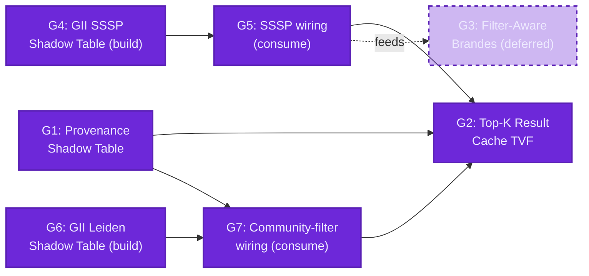
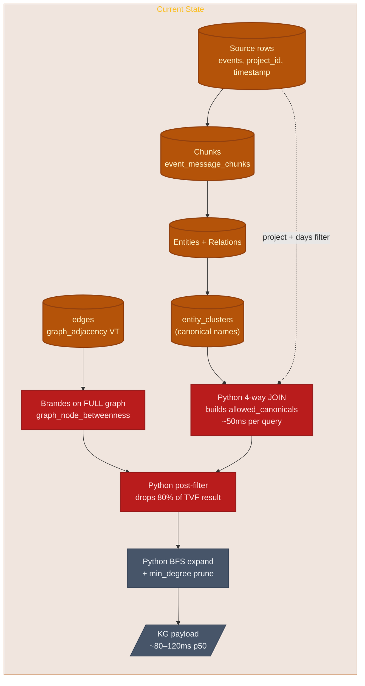
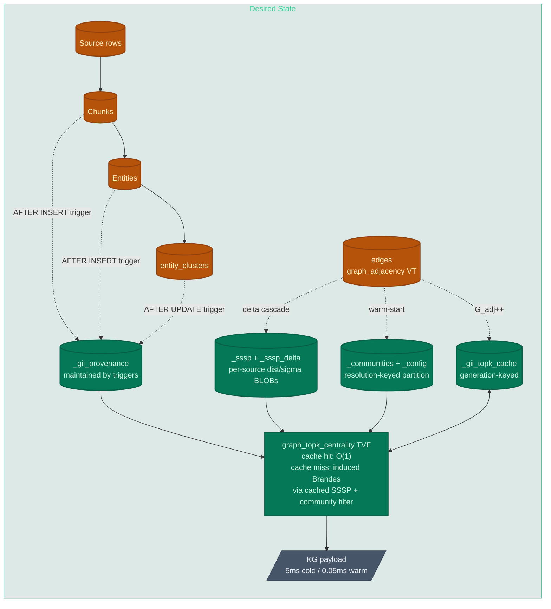
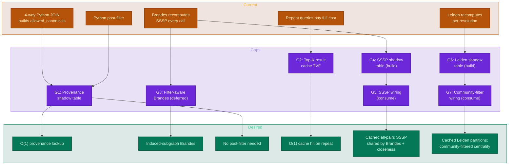
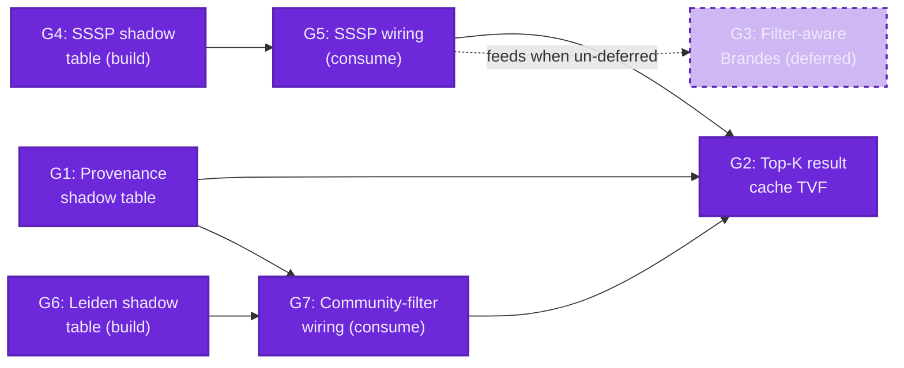

# Advanced KG Centrality Filtering with GII Provenance Cascade

<!-- WARNING: ~50 external links cited. ~10 highest-stakes citations were independently re-verified during plan-gap Phase 1c. Two are paywalled (tagged with the literal token PAYWALLED inline). Search for LINK_NOT_VERIFIED, PAYWALLED, or UNVERIFIED to review individual citations whose endpoints could not be confirmed. -->

---

<details>
<summary><b>Table of Contents</b></summary>
<!--TOC-->

- [Advanced KG Centrality Filtering with GII Provenance Cascade](#advanced-kg-centrality-filtering-with-gii-provenance-cascade)
  - [Overview](#overview)
  - [Execution Plan](#execution-plan)
    - [TDD loop (every ticket)](#tdd-loop-every-ticket)
    - [Test tags](#test-tags)
    - [Make targets (the gates)](#make-targets-the-gates)
    - [Done predicate per gap](#done-predicate-per-gap)
    - [`/schedule` contract — 30-minute pulse](#schedule-contract--30-minute-pulse)
    - [`/loop` contract — active implementation](#loop-contract--active-implementation)
    - [Per-gap tickets](#per-gap-tickets)
  - [Current State](#current-state)
    - [Existing GII Shadow Tables](#existing-gii-shadow-tables)
    - [Generation Counter (Already Wired)](#generation-counter-already-wired)
    - [Centrality TVFs](#centrality-tvfs)
    - [Filter Cascade in claude-code-sessions](#filter-cascade-in-claude-code-sessions)
    - [Benchmark Harness State](#benchmark-harness-state)
  - [Desired State](#desired-state)
    - [Provenance Shadow Table](#provenance-shadow-table)
    - [Top-K Result Cache](#top-k-result-cache)
    - [Pipeline View](#pipeline-view)
  - [Gap Analysis](#gap-analysis)
    - [Architectural Principle (Axiom — inherited from GII blocked-CSR)](#architectural-principle-axiom--inherited-from-gii-blocked-csr)
    - [Gap Map](#gap-map)
    - [Dependencies](#dependencies)
    - [G1: Provenance Shadow Table](#g1-provenance-shadow-table)
      - [ADR: Trigger granularity — per-row vs. batched](#adr-trigger-granularity--per-row-vs-batched)
      - [ADR: Multi-source-table cascade order](#adr-multi-source-table-cascade-order)
      - [ADR: Schema flexibility — single hardcoded schema vs. column-config DSL](#adr-schema-flexibility--single-hardcoded-schema-vs-column-config-dsl)
      - [ADR: Events-table mutation — append-only assumption vs. cascade trigger](#adr-events-table-mutation--append-only-assumption-vs-cascade-trigger)
    - [G2: Top-K Result Cache TVF](#g2-top-k-result-cache-tvf)
      - [ADR: Eager vs. lazy invalidation on G_adj/G_prov tick](#adr-eager-vs-lazy-invalidation-on-g_adjg_prov-tick)
      - [ADR: Eviction policy on cache size](#adr-eviction-policy-on-cache-size)
      - [ADR: Filter-predicate representation in signature](#adr-filter-predicate-representation-in-signature)
      - [ADR: Hashing primitive for cache signatures](#adr-hashing-primitive-for-cache-signatures)
      - [ADR: Prepared-statement generation-counter staleness trap](#adr-prepared-statement-generation-counter-staleness-trap)
      - [ADR: Eviction trigger on `entity_clusters` mutation](#adr-eviction-trigger-on-entity_clusters-mutation)
    - [G3: Filter-Aware Centrality TVF (Deferred)](#g3-filter-aware-centrality-tvf-deferred)
      - [ADR: When to un-defer this gap](#adr-when-to-un-defer-this-gap)
    - [G4: GII SSSP Shadow Table (build)](#g4-gii-sssp-shadow-table-build)
      - [ADR: Cache-block granularity — per-source vs. all-pairs](#adr-cache-block-granularity--per-source-vs-all-pairs)
      - [ADR: What to cache — distances only vs. distances+sigma vs. distances+sigma+predecessors](#adr-what-to-cache--distances-only-vs-distancessigma-vs-distancessigmapredecessors)
      - [ADR: Threshold defaults — empirical vs. user-tuned](#adr-threshold-defaults--empirical-vs-user-tuned)
    - [G5: SSSP wiring into centrality TVFs (consume)](#g5-sssp-wiring-into-centrality-tvfs-consume)
      - [ADR: Reconstruct `pred\[\]` on read vs. cache it explicitly](#adr-reconstruct-pred-on-read-vs-cache-it-explicitly)
    - [G6: GII Leiden Shadow Table (build)](#g6-gii-leiden-shadow-table-build)
      - [ADR: Cache validity rule — generation alone vs. (generation + resolution)](#adr-cache-validity-rule--generation-alone-vs-generation--resolution)
      - [ADR: Warm-start changed-nodes scope — direct only vs. 1-hop extension](#adr-warm-start-changed-nodes-scope--direct-only-vs-1-hop-extension)
      - [ADR: Component seeding — required vs. optional](#adr-component-seeding--required-vs-optional)
      - [ADR: Atomicity of partition writes — DELETE-then-INSERT vs. row-level UPSERT](#adr-atomicity-of-partition-writes--delete-then-insert-vs-row-level-upsert)
    - [G7: Community-filter wiring into centrality TVFs (consume)](#g7-community-filter-wiring-into-centrality-tvfs-consume)
      - [ADR: Multiple-community filter — AND, OR, or "any"?](#adr-multiple-community-filter--and-or-or-any)
      - [ADR: Community-filter + provenance-filter composition order](#adr-community-filter--provenance-filter-composition-order)
      - [ADR: Resolution mismatch behavior](#adr-resolution-mismatch-behavior)
  - [Success Measures](#success-measures)
    - [Project Quality Bar (CI Gates)](#project-quality-bar-ci-gates)
    - [Domain-Specific Measures](#domain-specific-measures)
  - [Negative Measures](#negative-measures)
    - [Quality Bar Violations](#quality-bar-violations)
    - [Domain-Specific Failures](#domain-specific-failures)

<!--TOC-->
</details>

---

## Overview

This initiative extends `sqlite-muninn` with material C-level data structures targeting the filtered-knowledge-graph query pipeline:

```
source rows (events, project_id, timestamp)
  → narrow chunks
  → narrow entities + relations
  → narrow resolved entities (canonical)
  → induced subgraph
  → top-K seeds by node/edge betweenness
  → BFS expand
  → min_degree prune
  → render
```

The `benchmarks/kg_perf` harness has empirically established that the **filter chain** (a 4-way join over events × chunks × entities × clusters) — not Brandes betweenness — is the dominant bottleneck at the current corpus scale. A denormalized provenance shadow table delivers 6×–20× over the existing baseline, and a result-level cache adds another 500×–6700× on warm reads. The PROPOSAL.md at `benchmarks/kg_perf/PROPOSAL.md` ranks these recommendations; this gap analysis turns them into a concrete C-implementation plan.

The workload is asymmetric: bursty high-throughput **writes** during ingestion, then **read-heavy** interactive sessions where the same filter window is queried many times. Both data structures are designed for that asymmetry — writes pay the maintenance cost, reads exploit cache locality.

**Gaps identified:**

- **G1: Provenance Shadow Table** — Maintain a `_gii_provenance(namespace_id, chunk_id, canonical, project_id, timestamp)` table by triggers on source tables; collapses the 4-way filter join into a single indexed scan
- **G2: Top-K Result Cache TVF** — A new `graph_topk_centrality` TVF that memoizes `(filter, query, generation)` → result; piggybacks on the existing GII generation counter for auto-invalidation
- **G3: Filter-Aware Centrality (Deferred)** — A `node_filter_table=` hidden-column argument on `graph_node_betweenness` / `graph_edge_betweenness` so Brandes runs on the induced subgraph; documented but deferred until empirical `brandes_share` crosses the inflection threshold (G3 ADR resolved with empirical-threshold + escape hatch)
- **G4: GII SSSP Shadow Table (build)** — Add `_sssp(namespace_id, source_idx, distances BLOB, sigma BLOB)` + `_sssp_delta(namespace_id, source_idx)` shadow tables to the GII VT, populated via the per-layer delta-cascade architecture (`_delta` → `_sssp_delta`, eager-emit / lazy-consume). Self-contained: schema, trigger SQL, threshold-based rebuild strategy, generation-counter protocol, BLOB encoding contract all specified in this plan
- **G5: SSSP wiring into centrality TVFs (consume)** — Wire `graph_node_betweenness`, `graph_edge_betweenness`, and `graph_closeness` to consume G4's shadow tables. Replaces the direct `sssp_dijkstra`/`sssp_bfs` calls at `src/graph_centrality.c:443-445, 1411` with cache-aware lookups; cache misses pull through and write back via the GII delta-cascade
- **G6: GII Leiden Shadow Table (build)** — Add `_communities(namespace_id, node_idx, community_id)` shadow table + `_config` keys (`communities_generation`, `communities_resolution`, `communities_modularity`, `num_communities`) + `run_leiden_warm()` algorithm + `CommCacheState` decision machine (CACHE_HIT / WARM_START / COLD_START). Self-contained: schema, warm-start initialization, resolution-as-cache-key contract, generation-counter protocol all specified in this plan
- **G7: Community-filter wiring into centrality TVFs (consume)** — Modify `lei_filter()` to read from G6's shadow table when fresh; add a `community_filter=` hidden-column argument to centrality TVFs so the dashboard can ask "top-K most central nodes *within community C* in this filter window" without re-running Leiden

**Implementation dependencies (preview — full diagram in Gap Analysis):**



## Execution Plan

This plan is implementer-facing and self-driving. The TDD loop, test tags, per-gap tickets, and slash-command contracts below let a `/loop` worker advance one ticket at a time and a `/schedule` job verify forward progress every 30 minutes — both using **this document** as their only prompt and the **test suite** as the only progress metric.

### TDD loop (every ticket)

1. **RED** — write the failing test first, tagged `G<N>` and named `test_g<N>_<descriptive>`. Commit `T<N>.<i> RED: <one-line what>`.
2. **GREEN** — minimal implementation to pass the new test without regressing any other gap. Commit `T<N>.<i> GREEN: <one-line what>`.
3. **REFACTOR** — clean up only the code touched in this ticket. No drive-by edits to other gaps. Commit `T<N>.<i> REFACTOR: <one-line what>` (skip if no refactor needed).

### Test tags

Every test added under this plan MUST carry a gap tag so it can be filtered:

- **Python** (`pytests/`): `@pytest.mark.G<N>` on every test. Markers registered once in `pytests/conftest.py` via `config.addinivalue_line("markers", "G<N>: <gap title>")`.
- **C** (`test/`): every test function named `test_g<N>_<descriptive>(...)`. The custom `test_runner` (see `test/test_main.c`) already accepts `--filter=<prefix>`; tag filter = name-prefix filter.

### Make targets (the gates)

Add to root `Makefile`:

```make
test-g1 test-g2 test-g3 test-g4 test-g5 test-g6 test-g7:
	./build/test_runner --filter=test_$@_     # e.g. test_g4_
	uv run pytest -m $(shell echo $@ | tr a-z A-Z | sed 's/TEST-//') pytests/

test-all-gates: test-g1 test-g2 test-g3 test-g4 test-g5 test-g6 test-g7
```

`make test-g<N>` exit 0 is the **per-gap done predicate**. `make test-all-gates` exit 0 is the **project-level convergence signal**.

### Done predicate per gap

Gap G is DONE iff:
1. Every ticket below has GREEN commits in git log (`git log --grep='T<N>\.\d\+ GREEN'` returns the full set)
2. `make test-g<N>` exits 0
3. Every test name listed in the gap's Success Measures section has a corresponding implementation in the suite (no orphan references)

### `/schedule` contract — 30-minute pulse

```
/schedule add adv-cent-pulse cron "*/30 * * * *"
prompt: "Read docs/plans/adv-centrality-filtering.md Execution Plan.
Run `make test-all-gates` from repo root; capture pass/fail per gap.
Run `git log --since='35 min ago' --oneline` on the current branch.
Decide:
- If a new T<N>.<i> commit appeared in the last 35 min: reply 'PROGRESSING — last commit <hash> <subject>; next ticket per execution plan: T<X>.<j>'.
- If no new commit AND make test-all-gates is still incomplete: reply 'STALLED — last commit <hash> at <time>; resume at T<X>.<j>'.
- If make test-all-gates exits 0 across all gaps: reply 'CONVERGED — all gates pass'.
Read-only — never edit code, never bump any version."
```

The schedule's job is liveness + drift detection, nothing else. The spec doc above and the test-suite output below are its only inputs.

### `/loop` contract — active implementation

```
/loop self-paced
prompt: "Implement the next unfinished ticket from docs/plans/adv-centrality-filtering.md Execution Plan, in order.
Each iteration: ONE ticket, RED → GREEN → REFACTOR, commit at every phase boundary.
After GREEN: run `make test-g<N>` for the current gap. Do NOT proceed if it regresses any other test.
Exit the loop when every ticket in the current gap has a GREEN commit AND `make test-g<N>` exits 0.
Stop and ask the human if: (a) a design decision not covered by an existing ADR comes up, OR (b) 3 consecutive failures on the same ticket.
The spec is authoritative. If you find yourself wanting to do something not in the ticket list, stop — the plan needs an ADR addition first."
```

### Per-gap tickets

Order matters within each gap. Each ticket's RED test name is given so the implementer knows what to write first.

**G1 — Provenance shadow table** (8 tickets)
- T1.1 — `provenance_register_module` + `_gii_provenance` DDL — `test_g1_schema_creates_with_xcreate`
- T1.2 — chunk-INSERT trigger group — `test_g1_chunk_insert_populates_provenance`
- T1.3 — entity INSERT/DELETE/UPDATE trigger group — `test_g1_entity_mutations_propagate`
- T1.4 — entity_clusters UPDATE-rename cascade — `test_g1_canonical_rename_cascades`
- T1.5 — entity_clusters INSERT/DELETE rebuild triggers — `test_g1_cluster_rebuild_cascade`
- T1.6 — `G_prov` generation tick on every change — `test_g1_generation_strictly_increases`
- T1.7 — row parity vs 4-way join — `test_g1_provenance_parity_with_4way_join`
- T1.8 — ingest overhead within 2× pre-trigger baseline — `test_g1_ingest_overhead_bounded`

**G2 — Top-K result cache TVF** (5 tickets)
- T2.1 — xxh3 signature with canonical JSON normalization — `test_g2_signature_stable_under_json_reordering`
- T2.2 — cache table + lookup/insert/miss path — `test_g2_cache_hit_returns_stored_rows`
- T2.3 — generation invalidation on `G_adj`/`G_prov` tick — `test_g2_generation_invalidation`
- T2.4 — 10K-signature uniqueness sweep — `test_g2_no_collisions_over_10k`
- T2.5 — prepared-statement staleness fix (re-prepare on lookup) — `test_g2_external_generation_bump`

**G3 — Filter-aware Brandes (deferred)** (3 tickets land now; the rest gate on the un-defer trigger)
- T3.1 — per-component timing instrumentation in `bench.py` — `test_g3_per_component_timing_sums_to_total`
- T3.2 — `brandes_share` sweep producing `benchmarks/kg_perf/charts/g3_inflection.png` — `test_g3_sweep_produces_chart`
- T3.3 — un-defer trigger doc + threshold default constant — `test_g3_threshold_default_documented`

**G4 — GII SSSP shadow table (build)** (6 tickets)
- T4.1 — `features='sssp'` parsing + `_sssp` and `_sssp_delta` DDL — `test_g4_schema_creates_with_feature_flag`
- T4.2 — `sssp_shadow_get`/`sssp_shadow_put`/`sssp_shadow_clear_delta` — `test_g4_blob_round_trip`
- T4.3 — threshold dispatch (selective ↔ delta-flush ↔ full) — `test_g4_threshold_dispatch`
- T4.4 — `_sssp_delta` cascade emit per rebuild strategy — `test_g4_cascade_emit_per_strategy`
- T4.5 — namespace isolation — `test_g4_namespace_isolation`
- T4.6 — empirical `theta_selective`/`theta_full` sweep + documented defaults — `test_g4_threshold_defaults_match_sweep`

**G5 — SSSP wiring into centrality TVFs (consume)** (5 tickets)
- T5.1 — `sssp_load_or_compute` wrapper at the call sites in `graph_centrality.c:443-445, 1411` — `test_g5_load_or_compute_writes_back_on_miss`
- T5.2 — `reconstruct_pred_from_dist` from cached `dist[]` + CSR — `test_g5_pred_reconstruction_parity`
- T5.3 — generation + `_sssp_delta` staleness check — `test_g5_partial_recompute_safety`
- T5.4 — cache-vs-uncached centrality result parity — `test_g5_cache_vs_uncached_parity`
- T5.5 — latency floor (closeness ≥5×, betweenness ≥3× warm vs cold) — `test_g5_latency_floor`

**G6 — GII Leiden shadow table (build)** (7 tickets)
- T6.1 — `features='communities'` parsing + `_communities` DDL + four `_config` keys — `test_g6_schema_and_config_keys`
- T6.2 — `check_communities_cache` returning `CommCacheState` — `test_g6_cache_state_truth_table`
- T6.3 — resolution `%.17g` round-trip + 1e-10 epsilon comparison — `test_g6_resolution_round_trip`
- T6.4 — `run_leiden_warm` with all-singleton init parity to cold — `test_g6_warm_with_singletons_equivalent_to_cold`
- T6.5 — `store_communities` DELETE+INSERT transaction atomicity — `test_g6_concurrent_read_during_write`
- T6.6 — `_comm_delta` cascade emit (1-hop extension) — `test_g6_comm_delta_includes_1hop`
- T6.7 — `seed_from_components` no-op stub when `_components` absent — `test_g6_component_seed_partial_load_falls_back`

**G7 — Community-filter wiring (consume)** (7 tickets)
- T7.1 — `lei_filter()` dispatch on `CommCacheState` — `test_g7_leiden_cache_hit`
- T7.2 — `community_filter` + `community_resolution` hidden columns on every centrality TVF — `test_g7_hidden_cols_declared`
- T7.3 — `build_community_mask` + `induce_subgraph` — `test_g7_filter_parity`
- T7.4 — G2 signature extension to include `(community_filter, community_resolution)` — `test_g7_g2_signature_includes_community`
- T7.5 — provenance ∩ community composition — `test_g7_intersection_with_provenance`
- T7.6 — empty-intersection returns zero rows (NOT unfiltered fallback) — `test_g7_empty_intersection_returns_zero_rows`
- T7.7 — cross-resolution isolation + warm-start recompute on mismatch — `test_g7_resolution_mismatch_recomputes`

**Total: 41 tickets across 7 gaps.** Each ticket is sized to fit one TDD cycle (~30 min – 2 hr). Inter-gap dependencies are enforced by the order in the dependency Mermaid diagram earlier in this document; intra-gap order is the listed sequence above.

## Current State

The graph subsystem in `sqlite-muninn` (`src/`) ships eight registered subsystems via `sqlite3_muninn_init` (`src/muninn.c:42-121`). The `graph_adjacency` virtual table (`src/graph_adjacency.c`, registered at `muninn.c:70`) is the **GII** — Graph Incremental Index. A planned file rename to `gii.c` plus a SQL surface rename to `USING gii(...)` has not yet landed; this plan refers to the current file and SQL names (`graph_adjacency.c`, `USING graph_adjacency`) and the conceptual abbreviation **GII** interchangeably.

### Existing GII Shadow Tables

The `graph_adjacency` VT maintains six shadow tables (`src/graph_adjacency.c:150-207`):

| Shadow Table | Purpose |
|---|---|
| `{vt}_config` | Metadata KV store (incl. `generation` counter — fully wired, see below) |
| `{vt}_nodes` | Node ID ↔ integer index mapping |
| `{vt}_degree` | In/out + weighted-in/out degrees per node |
| `{vt}_csr_fwd` | Forward CSR (offsets/targets/weights BLOBs) blocked per node range |
| `{vt}_csr_rev` | Reverse CSR (same shape) |
| `{vt}_delta` | INSERT/UPDATE/DELETE log for incremental merge (op codes 1/2) |

Triggers are installed by `graph_adjacency.c:223-260` on the user-supplied source edge table — three pattern strings interpolated via `sqlite3_mprintf("%w", ...)` for safe identifier quoting.

### Generation Counter (Already Wired)

Contrary to the initial mental model, the generation counter is **fully implemented**:

| Site | Action |
|---|---|
| `graph_adjacency.c:41` | `int64_t generation; /* increments on each rebuild */` field |
| `graph_adjacency.c:614, 962` | `vtab->generation++;` after delta-merge or full rebuild |
| `graph_adjacency.c:615, 963` | `config_set_int(vtab->db, vtab->vtab_name, "generation", vtab->generation);` persists to `_config` |
| `graph_adjacency.c:1017` | `config_get_int(vtab->db, vtab->vtab_name, "generation", 0)` for staleness checks |
| `graph_adjacency.c:1140` | `vtab->generation = config_get_int(db, argv[2], "generation", 0);` on xConnect |

The gap is **not** "implement a counter" — it's "extend the existing generation protocol so new downstream caches (provenance, top-K) participate in the invalidation cascade."

### Centrality TVFs

Registered by `centrality_register_tvfs(db)` (`src/muninn.c:58-62`):

- `graph_degree`, `graph_node_betweenness`, `graph_edge_betweenness`, `graph_closeness`

Brandes (Newman 2001) lives in `src/graph_centrality.c:393-499` as `brandes_compute(const GraphData *g, const char *direction, int auto_approx, int normalized, double *CB, double *EB)`. It loads `GraphData` fresh on every TVF invocation (no struct-level cache across calls), uses double-precision priority queue for weighted Dijkstra SSSP and BFS for unweighted, supports `auto_approx > 0` for sqrt(N) source sampling.

Calling convention is hidden-column constraint syntax — every TVF example reads `WHERE edge_table = 'edges' AND src_col = 'src' AND dst_col = 'dst' AND direction = 'both'` (the registered name is `graph_node_betweenness`, not `graph_betweenness`; `docs/CLAUDE.md:11`).

### Filter Cascade in claude-code-sessions

The downstream consumer at `/Users/joshpeak/play/claude-code-sessions/src/claude_code_sessions/database/sqlite/kg/payload.py` runs the four-step pipeline:

1. **`_allowed_canonicals(conn, days, project)`** (`payload.py:234-289`) — a 4-way join:
   ```sql
   SELECT DISTINCT ec.canonical
   FROM entities ent
   JOIN event_message_chunks emc ON emc.chunk_id = ent.chunk_id
   JOIN events e ON e.id = emc.event_id
   LEFT JOIN entity_clusters ec ON ec.name = ent.name
   WHERE 1=1 {days_clause} {project_clause}
   ```
2. **Centrality on the full graph** (`payload.py:190-210`):
   ```sql
   SELECT node, centrality FROM graph_node_betweenness
   WHERE edge_table='edges' AND src_col='src' AND dst_col='dst' AND direction='both'
   ```
3. **Post-filter in Python** (`payload.py:348-351`) — drop nodes whose canonical isn't in `allowed_canonicals`
4. **Top-K seed selection → BFS expand → min_degree prune** (`payload.py:362-410`) — pure Python loops over an adjacency dict

### Benchmark Harness State

`benchmarks/kg_perf/` already exists with a strategy ABC (`strategies/_base.py:34-42`), a deterministic warmup-then-rep timing loop (`bench.py:66-107`), JSONL result persistence (`bench.py:118-123`), and most-recent-per-(strategy, workload) compare (`__main__.py:93-128`). Five strategies are implemented:

| Strategy | What it does | Measured speedup |
|---|---:|---:|
| `baseline` | Mirrors `payload.py` exactly | 1.0× (reference) |
| `sql_subset` | Materializes filtered edges, runs Brandes on subset | 1.0×–1.8× (semantic fix only) |
| `chunk_canonical` | Denormalizes the 4-way join into one indexed table | 2.3×–20× |
| `kcore` | K-core peeling instead of single-pass min_degree | NEGATIVE (wrong abstraction; banked) |
| `topk_cache` | `(filter, query, edge_generation)` → result memo | 500×–6700× warm |

Total permutations: 5 strategies × 4 filter widths × 4 query shapes = **80**.



The two red nodes are the empirically-validated bottlenecks: the Python-side 4-way join builds `allowed_canonicals` (~50ms) and Brandes runs over edges that will mostly be discarded.

## Desired State

The filter cascade is collapsed into one indexed scan via a maintained `_gii_provenance` shadow table. A new `graph_topk_centrality` TVF memoizes the entire pipeline output keyed by `(filter, query, generation)` so repeated reads in an interactive session are O(1).

### Provenance Shadow Table

Maintained by triggers on `event_message_chunks`, `entities`, and `entity_clusters` (and indirectly via `events` for `project_id`/`timestamp`):

```sql
CREATE TABLE _gii_provenance (
    namespace_id INTEGER NOT NULL,
    chunk_id     INTEGER NOT NULL,
    canonical    TEXT NOT NULL,
    project_id   TEXT NOT NULL,
    timestamp    TEXT NOT NULL,
    PRIMARY KEY (namespace_id, chunk_id, canonical)
);
CREATE INDEX _gii_provenance_proj_ts
    ON _gii_provenance(namespace_id, project_id, timestamp);
CREATE INDEX _gii_provenance_canonical
    ON _gii_provenance(namespace_id, canonical);
```

This is exactly Valduriez's "join index" primitive (Wikipedia confirms the citation: P. Valduriez, "Join indices", *ACM TODS* 12(2):218-246, 1987). Reads collapse the 4-way join into a single indexed lookup; writes pay an O(fan-out) maintenance cost during ingestion (acceptable per the asymmetric-workload assumption).

### Top-K Result Cache

A new TVF `graph_topk_centrality` reads filter + query parameters as hidden columns, computes `signature = hash(filter ‖ query ‖ G_adj)`, and looks up `_gii_topk_cache` — O(1) on hit, full pipeline on miss with auto-store. Invalidation rides the existing GII generation counter (already wired at `graph_adjacency.c:41,614,962,1017,1140`); when `G_adj` increments, all cached entries with the previous generation are stale.

### Pipeline View



## Gap Analysis

### Architectural Principle (Axiom — inherited from GII blocked-CSR)

Every shadow table in this plan inherits the work-placement decision framework already established by `src/graph_adjacency.c`:

1. **Writes create queues of partial caches**, not materialized results. Triggers append to `_delta`-style queues (`graph_adjacency.c:223-260`); they do not synchronously rebuild downstream tables.
2. **Reads are fast even on a cache miss** because the blocked structure pulls through *only the blocks needed for the current read*, not the full graph.
3. **Partial-cache queues may never be consumed** — that is acceptable. Cleanup is driven by cache staleness relative to source generation (`graph_adjacency.c:1017, 1140`), not by aggressive eviction.
4. **Strategic partial writes** set up efficient read caches. Don't materialize what may never be read; don't load what isn't relevant to the query at hand.
5. **Minimum work** at every stage: writes never do more than queue, reads never load more than the requested blocks.

This axiom resolves the eager-vs-lazy ambiguity for provenance maintenance, cache invalidation, and eviction. Each ADR below either applies the principle directly or explores parameter choices *within* the axiom (block size, hash primitive, generation-counter granularity).

### Gap Map



### Dependencies



**Recommended implementation order:** G1 → (G4, G6 build in parallel) → (G5, G7 consume in parallel) → G2 → (re-evaluate G3 via empirical `brandes_share`). G1 is the single biggest empirical win (6×–20×) for the user-visible payload and exercises the existing GII trigger / shadow-table / generation-counter machinery without inventing new patterns. G4 and G6 are independent build gaps — they each extend the GII VT with new shadow tables (SSSP and communities respectively), share the per-layer delta-cascade architecture defined in G4, and can be implemented in parallel by separate contributors. G5 wires the centrality TVFs to consume G4's cache; G7 wires `lei_filter()` plus a `community_filter=` argument to consume G6's cache. G2 builds on G1 (provenance) and reads from G5 (SSSP cache hits) + G7 (community partitions) when present. G3 stays deferred — the literature (QUBE, Riondato-Kornaropoulos, KADABRA) is mature; un-defer is governed by the empirical `brandes_share` ADR.

---

### G1: Provenance Shadow Table

**Current:** The filter chain (events → chunks → entities → entity_clusters) is recomputed on every query in `claude-code-sessions/.../kg/payload.py:234-289` as a 4-way `JOIN`. Measured cost: ~50ms per query at 122,951-event corpus. No materialization, no maintenance, no caching — the join runs cold on every centrality call. There is no provenance subsystem in `src/muninn.c`; the closest precedent is the `graph_adjacency` VT's shadow tables and trigger machinery.

**Gap:** Add a new C subsystem (`src/provenance.c` + `src/provenance.h`) registered as `provenance_register_module(db)` from `muninn.c` between line 70 (`adjacency_register_module`) and line 76 (`graph_select_register_tvf`). The subsystem creates and maintains a `_gii_provenance` table via INSERT/UPDATE/DELETE triggers on `event_message_chunks`, `entities`, and `entity_clusters`. Reads issue a single indexed lookup that replaces the 4-way join.

**Output(s):** When complete I will have:
- **C source:** `src/provenance.c`, `src/provenance.h` — the new subsystem, registration function, trigger installation, shadow-table DDL
- **Modified C:** `src/muninn.c` — new include + registration call slotted into `sqlite3_muninn_init`
- **Build glue:** none — `scripts/generate_build.py` auto-discovers new `.c` files via glob (per `memory/MEMORY.md` build-system note)
- **C tests:** `test/test_provenance.c` plus extern decl in `test/test_main.c` and `RUN_TEST(...)` calls — verifying trigger install/uninstall, cascade on entity_clusters rename, generation-counter participation
- **Python tests:** `pytests/test_provenance.py` — fixture-based integration test using the `conn` fixture; verify provenance row counts match a 4-way-join reference
- **Harness strategy:** `benchmarks/kg_perf/strategies/provenance_c.py` — mirrors `chunk_canonical.py` but uses the C subsystem instead of a manually-CREATEd table; lets the harness measure prep cost + steady-state cost at parity
- **Doc updates:** `docs/architecture.md` adds the new subsystem to the registered-modules list; new `docs/provenance.md` page following the per-function template in `docs/CLAUDE.md` (one-liner purpose, signature, example with expected output, parameters table, returns, full recipe, see-also)

**References:**

Shadow-table DDL pattern from `src/graph_adjacency.c:155-206`:

```c
/* In adjacency_create() — replicate this pattern in provenance_create() */
static const char *kConfigSchemaSql =
    "CREATE TABLE IF NOT EXISTS \"%w\"("
    "  key TEXT PRIMARY KEY,"
    "  value TEXT)";

static const char *kProvSchemaSql =
    "CREATE TABLE IF NOT EXISTS \"%w_provenance\"("
    "  namespace_id INTEGER NOT NULL,"
    "  chunk_id     INTEGER NOT NULL,"
    "  canonical    TEXT NOT NULL,"
    "  project_id   TEXT NOT NULL,"
    "  timestamp    TEXT NOT NULL,"
    "  PRIMARY KEY (namespace_id, chunk_id, canonical)"
    ")";
```

Trigger installation pattern follows `install_triggers()` at `src/graph_adjacency.c:223-260` exactly. Critical correction over the initial draft: **`entity_clusters` needs INSERT and DELETE triggers, not just UPDATE** — a full ER rebuild (DELETE-all + INSERT-all) wouldn't fire UPDATE and would silently leave provenance pointing at obsolete canonicals. Four trigger groups total:

```c
/* Group 1: AFTER INSERT on event_message_chunks — chunk arrives, populate
 * provenance for all entities in that chunk. */
sql = sqlite3_mprintf(
    "CREATE TRIGGER IF NOT EXISTS \"%w_emc_ai\" "
    "AFTER INSERT ON \"event_message_chunks\" BEGIN "
    "  INSERT OR IGNORE INTO \"%w_provenance\"(namespace_id, chunk_id, canonical, project_id, timestamp) "
    "  SELECT 0, NEW.chunk_id, COALESCE(ec.canonical, ent.name), e.project_id, e.timestamp "
    "  FROM entities ent "
    "  JOIN events e ON e.id = NEW.event_id "
    "  LEFT JOIN entity_clusters ec ON ec.name = ent.name "
    "  WHERE ent.chunk_id = NEW.chunk_id; "
    "END",
    vt_name, vt_name);

/* Group 2: AFTER INSERT/DELETE/UPDATE on entities — entity changes for an
 * existing chunk. UPDATE is delete-of-old + insert-of-new (same pattern as
 * graph_adjacency.c:240-251). */

/* Group 3: AFTER UPDATE on entity_clusters — canonical rename cascade.
 * Single SQL UPDATE remaps every affected provenance row. */
sql = sqlite3_mprintf(
    "CREATE TRIGGER IF NOT EXISTS \"%w_ec_au\" "
    "AFTER UPDATE OF canonical ON \"entity_clusters\" BEGIN "
    "  UPDATE \"%w_provenance\" SET canonical = NEW.canonical "
    "  WHERE namespace_id = 0 AND canonical = OLD.canonical; "
    "END",
    vt_name, vt_name);

/* Group 4: AFTER INSERT and AFTER DELETE on entity_clusters — full-rebuild
 * support. INSERT remaps any provenance rows currently pointing at the raw
 * name to the new canonical; DELETE reverts canonical→raw. Without these,
 * a "DELETE FROM entity_clusters; INSERT new_clusters" sequence silently
 * leaves provenance frozen at the previous canonical assignment. */
```

Parameter parsing pattern from `parse_adjacency_params()` at `src/graph_adjacency.c:87-144`:

```c
/* Mirror this for parse_provenance_params() — argv[3:] holds key=value pairs.
 * For the hardcoded-schema variant (ADR below), parameters can be empty;
 * for the column-config DSL variant, accept filter_cols, source_chunks,
 * source_entities, source_clusters, source_events. */
for (int i = 3; i < argc; i++) {
    if (strncmp(arg, "filter_cols=", 12) == 0) { ... }
    /* ... */
}
/* Then validate every supplied identifier via id_validate() (id_validate.c:15-26)
 * AND verify columns exist via sqlite3_table_column_metadata() — fail-fast at
 * xCreate, not at first trigger fire. */
```

Generation-counter participation (read-side):

```c
/* Provenance reads bump a separate G_prov counter or piggyback on G_adj.
 * Centrality TVFs check G_prov when reading from _gii_provenance. */
int64_t gen = config_get_int(db, vt_name, "generation_provenance", 0);
```

Existing claude-code-sessions filter chain to replace (`payload.py:257-265`):

```sql
-- Replace this 4-way join...
SELECT DISTINCT ec.canonical
FROM entities ent
JOIN event_message_chunks emc ON emc.chunk_id = ent.chunk_id
JOIN events e ON e.id = emc.event_id
LEFT JOIN entity_clusters ec ON ec.name = ent.name
WHERE 1=1 {days_clause} {project_clause}

-- ...with this single-table indexed scan
SELECT DISTINCT canonical
FROM _gii_provenance
WHERE 1=1 {days_clause_v2} {project_clause_v2}
```

#### ADR: Trigger granularity — per-row vs. batched

| Option | Pros | Cons |
|--------|------|------|
| Per-row triggers (each INSERT/UPDATE fires) | Simple; consistent with `graph_adjacency`; correct under all interleavings | Bursty ingestion incurs N trigger fires; ~10-30% ingest slowdown |
| Batched maintenance (delta queue + flush) | Aligns with GII delta-cascade philosophy; bursty ingest stays fast | Eventual consistency; readers may see stale provenance until flush; need explicit `PRAGMA provenance_flush` or auto-flush threshold |

**Decision:** Per-row triggers append to a `_provenance_delta(rowid INTEGER PRIMARY KEY, source_table TEXT, source_op INTEGER, source_rowid INTEGER, ts INTEGER)` queue. Materialization into `_gii_provenance` happens lazily on read via the same blocked-pull-through pattern as `graph_adjacency`'s CSR.
**Rationale:** Architectural axiom — writes create queues of partial caches, not materialized rows. The trigger body is constant-cost (one INSERT into the delta queue) regardless of ingest burst size. Reads pay materialization cost only for the namespace/window they query.

#### ADR: Multi-source-table cascade order

When `entity_clusters` updates a canonical name (a common ER refinement event), every chunk attributing the old canonical must be relinked. Three options for ordering:

| Option | Pros | Cons |
|--------|------|------|
| Synchronous trigger on `entity_clusters` UPDATE | Reads are always fresh | UPDATE on `entity_clusters` becomes O(affected_chunks); can stall on large clusters |
| Lazy: rebuild affected provenance rows on next read | Writes stay fast | First read after an entity_clusters change is slow |
| Generational: bump `G_prov`, invalidate cache, recompute lazily on cache miss | Compatible with G2 cache; bounds worst-case | Extra complexity; need to weave G_prov into the existing G_adj counter or maintain a sibling |

**Decision:** Generational. `entity_clusters` mutations append a "cluster delta" to the same `_provenance_delta` queue and bump `G_prov`. Materialization on next read consumes any pending deltas for the queried namespace, then writes through to `_gii_provenance` (only for blocks the read touches). Stale cached top-K entries notice the generation mismatch on their next read and re-materialize.
**Rationale:** Same axiom as the trigger-granularity ADR — writes are queue-only; reads pull through blocks they need. A single delta queue across all source tables keeps the trigger SQL uniform (every trigger is "INSERT INTO delta queue, bump generation").

#### ADR: Schema flexibility — single hardcoded schema vs. column-config DSL

The user's current corpus has columns `(project_id, timestamp)`. Other consumers might want `(tenant_id, region, fiscal_quarter)` or `(category, severity)`. Options:

| Option | Pros | Cons |
|--------|------|------|
| Hardcoded `(project_id, timestamp)` schema | Simplest; ships fastest | Not reusable for non-claude-code-sessions consumers |
| `USING provenance(filter_cols='project_id,timestamp', source_chunks='event_message_chunks', source_entities='entities', source_clusters='entity_clusters', source_events='events', events_mutable=0)` | Reusable; explicit; cascade shape stays a contract | ~50-100 LoC for parameter parsing + identifier validation |
| Generic JSON-described join-graph DSL (`source_tables='[{"name":...,"fk":...}]'`) | Maximum flexibility | DSL parser is a new sub-project; premature generalization |

**Decision:** Parameterized via xCreate args, fixed source-table cascade shape (chunked-text → entities → resolved-entities). Source-table names and filter columns are configurable; the cascade shape (4 source tables, ER cluster mapping, denormalized timestamp) is the contract. The full JSON-DSL variant is deferred — see `docs/plans/future-work/general-purpose-provenance-dsl.md`.
**Rationale:** Smallest leap that pays off the next consumer (chat-log corpus, RAG documents) without inventing a DSL we have to maintain forever. The cascade shape matches the actual class of workloads other GII consumers would write. Mirrors the `parse_adjacency_params` pattern already in `src/graph_adjacency.c:87-144` — well-precedented identifier-validation surface.

#### ADR: Events-table mutation — append-only assumption vs. cascade trigger

Provenance denormalizes `(project_id, timestamp)` from `events` at chunk-insert time. If an `events` row is later UPDATE'd to change those values, every provenance row referencing that event is stale.

| Option | Pros | Cons |
|--------|------|------|
| Document `events` as append-only; provide `PRAGMA provenance_rebuild` for explicit refresh | Triggers stay simple; matches typical KG semantics | Stale provenance silently survives if user breaks the assumption |
| AFTER UPDATE trigger on `events` cascades to all matching `_gii_provenance` rows | Reads always fresh | UPDATE on events becomes O(chunks_per_event) — can stall on hot events |
| Track an `events.row_version` column; provenance carries `event_row_version` and reads detect mismatch | Honest staleness signal at read time | Requires schema change in `events`; extra column on every read |
| `events_mutable=0|1` xCreate flag — corpus declares its own posture | Per-consumer policy without forcing one shape | Two code paths to test; `events_mutable=1` cascades trigger lands later |

**Decision:** Per-consumer policy via the `events_mutable=0|1` xCreate flag (defaults to `0` — append-only). When `events_mutable=0`, provenance assumes events are append-only; documentation explicitly states this contract; an explicit `PRAGMA provenance_rebuild` is provided as escape valve. When `events_mutable=1`, an AFTER UPDATE trigger on `events` cascades to `_provenance_delta` (queued, not synchronous — per the architectural axiom).
**Rationale:** Falls naturally out of Option B for the schema-flexibility ADR. claude-code-sessions ships with `events_mutable=0` (matching the dominant log-shaped corpora pattern). Other consumers (e.g., document-index workloads with mutable metadata) can opt-in at `USING` time without forcing a global posture. The `events_mutable=1` cascade still respects the axiom — writes queue, reads pull through.

---

### G2: Top-K Result Cache TVF

**Current:** Repeated reads in an interactive session pay the full pipeline cost every time. The kg_perf harness `topk_cache` strategy (Python-side, `benchmarks/kg_perf/strategies/topk_cache.py`) demonstrates the empirical upper bound: 0.01-0.10ms warm vs. 80-120ms cold (500×–6700× speedup). No equivalent exists in C; every cache hit currently still pays Python interpreter overhead and JSON deserialization.

**Gap:** Add a new TVF `graph_topk_centrality(...)` (registered alongside the existing centrality TVFs in `centrality_register_tvfs`) that:
1. Parses hidden-column args: `edge_table`, `provenance_table`, `metric` (node_betweenness | edge_betweenness | degree), `top_k`, `depth`, `min_degree`, `filter_predicate` (passed as a JSON object or a parameterized SQL fragment)
2. Computes `signature = sha256(provenance_table ‖ filter_predicate ‖ metric ‖ top_k ‖ depth ‖ min_degree ‖ G_adj ‖ G_prov)`
3. Looks up `_gii_topk_cache(signature TEXT PRIMARY KEY, seeds_json TEXT, nodes_json TEXT, edges_json TEXT, edge_generation INTEGER, prov_generation INTEGER, cached_at TIMESTAMP)`
4. On hit: returns the deserialized result rows directly
5. On miss: builds the induced subgraph from `provenance_table`, runs Brandes / degree, expands BFS, prunes by min_degree, caches the result, returns

Auto-invalidation: when `G_adj` (edges) or `G_prov` (provenance) ticks, the cache is logically stale. Implementation can be lazy (compare on lookup) or eager (DELETE on counter bump); ADR below.

**Output(s):** When complete I will have:
- **C source:** `src/graph_topk_cache.c`, `src/graph_topk_cache.h` — new module
- **Modified C:** `src/graph_centrality.c` (or a new sibling) registers `graph_topk_centrality` TVF; `src/muninn.c` registration unchanged (the TVF lands in the existing `centrality_register_tvfs` call)
- **Shadow table:** `_gii_topk_cache` created lazily on first cache write
- **C tests:** `test/test_topk_cache.c` — verify hit/miss, generation invalidation, Bloom-filter pre-check, signature stability across SQLite restarts
- **Python tests:** `pytests/test_topk_cache.py`
- **Harness strategy:** `benchmarks/kg_perf/strategies/topk_cache_c.py` — mirrors the existing Python `topk_cache.py` but calls the C TVF; expected cold ~equal, warm ~equal but with no Python overhead
- **Doc updates:** new `docs/centrality-cache.md` page

**References:**

TVF registration precedent — `centrality_register_tvfs(db)` at `src/graph_centrality.c:1510-1529` registers four modules via `sqlite3_create_module(db, "graph_node_betweenness", &graph_node_betweenness_module, NULL)`. Add a fifth: `sqlite3_create_module(db, "graph_topk_centrality", &graph_topk_centrality_module, NULL);`. Brandes is invoked at `graph_centrality.c:912` (node_betweenness) and `graph_centrality.c:1159` (edge_betweenness) — those are the cache-miss callsites the new TVF wraps.

Hidden-column constraint parsing — the existing TVFs use `graph_best_index_common()` from `src/graph_common.h:62-96`, a two-pass parser that builds an `idxNum` bitmask. Decoding pattern at `graph_centrality.c:611-644`:

```c
for (int bit = 0; bit < DEG_N_HIDDEN && pos < argc; bit++) {
    if (!(idxNum & (1 << bit))) continue;
    switch (bit + DEG_COL_EDGE_TABLE) {
    case DEG_COL_EDGE_TABLE: config.edge_table = graph_safe_text(argv[pos]); break;
    /* ... extract src_col, dst_col, weight_col, direction, etc. */
    }
    pos++;
}
```

Signature computation (mirror of `benchmarks/kg_perf/strategies/topk_cache.py:101-115`):

```c
/* Stable signature: every parameter that would change the output goes in.
 * filter_predicate MUST be canonicalized first (yyjson sorted-keys) so cosmetic
 * JSON variations don't bust the cache. */
static int compute_signature(
    const char *provenance_table,
    const char *filter_predicate_canonical,
    const char *metric,
    int top_k, int depth, int min_degree,
    int64_t g_adj, int64_t g_prov,
    char out_hex[33])  /* 16-byte hex truncation if DJB2; 64 for SHA-256 */
{
    /* See ADR below for hashing primitive choice. */
}
```

JSON canonicalization via vendored yyjson (used in `src/llama_chat.c:20+`):

```c
yyjson_doc *doc = yyjson_read(filter_predicate, strlen(filter_predicate), 0);
if (!doc) return SQLITE_ERROR;  /* malformed JSON — fail loudly, never silent */
yyjson_mut_doc *mut = yyjson_doc_mut_copy(doc, NULL);
/* yyjson does not ship a built-in sort-keys flag — walk the tree, sort each
 * object's keys alphabetically, then write. Needed for signature stability. */
size_t len;
char *canonical = yyjson_mut_write(mut, YYJSON_WRITE_NOFLAG, &len);
yyjson_mut_doc_free(mut); yyjson_doc_free(doc);
```

JSON-subtype result emission — pattern at `src/llama_chat.c:558-580`:

```c
sqlite3_result_text(ctx, json_str, -1, SQLITE_TRANSIENT);
sqlite3_result_subtype(ctx, (unsigned int)'J');  /* downstream json_each() sees JSON */
```

Bloom-filter admission control (Track B research — RocksDB pattern, Postgres bloom extension):

```c
/* Optional: a tiny in-memory bloom filter over recent signatures avoids the
 * SQLite shadow-table read on the cold path. Sized for ~10K entries with 1%
 * false positive rate = ~12KB. */
static bloom_t *signature_bloom;  /* initialized in centrality_register_tvfs */

if (!bloom_might_contain(signature_bloom, sig)) {
    return MISS;  /* skip the SELECT entirely */
}
```

Cache hit path (the load-bearing fast-path):

```sql
SELECT seeds_json, nodes_json, edges_json
FROM _gii_topk_cache
WHERE signature = ?
  AND edge_generation = ?
  AND prov_generation = ?;
```

#### ADR: Eager vs. lazy invalidation on G_adj/G_prov tick

| Option | Pros | Cons |
|--------|------|------|
| Eager DELETE on counter increment | Cache table never holds stale rows; smaller table | Each edge mutation triggers `DELETE FROM _gii_topk_cache` — expensive during bursty writes; conflicts with high-write-throughput goal |
| Lazy compare-on-read | Bursty writes stay cheap; cleanup via background sweep or LRU | Cache table grows unboundedly between sweeps; need eviction policy |
| Hybrid: TTL + lazy compare | Bounds growth; bursts stay fast | Picks an arbitrary TTL; violates pure cache-coherence semantics |

**Decision:** Lazy compare-on-read. Cache hit path checks `signature.edge_generation == current G_adj AND signature.prov_generation == current G_prov`; mismatch is treated as a miss. No DELETE on counter tick.
**Rationale:** Architectural axiom — writes don't do work for reads that may never happen. Eager DELETE punishes the write path proportional to the cache size; the axiom forbids this.

#### ADR: Eviction policy on cache size

| Option | Pros | Cons |
|--------|------|------|
| Unbounded (no eviction) | Simplest; storage is cheap | Cache table can grow to N_filters × N_queries; OK for ~1000s, not for ad-hoc filters |
| LRU on `cached_at` timestamp | Bounds size; respects access recency | Need to store access timestamp; LRU update on every hit competes with the read fast-path |
| Generation-window: keep only entries whose `edge_generation >= G_adj - K` | Simple; ties to existing counter | Still unbounded if G_adj never advances; doesn't capture filter-popularity |
| Staleness-driven sweep (no active eviction during reads/writes) | Aligns with axiom — partial caches may live forever; cleanup is a separate concern | Cache table grows monotonically until the sweep runs |

**Decision:** Staleness-driven sweep. Cache table grows freely; no eviction on the read or write fast-paths. A separate `PRAGMA provenance_sweep` (or a manually-scheduled housekeeping task) deletes rows whose `(edge_generation, prov_generation)` no longer match current counters.
**Rationale:** Architectural axiom — partial caches may never be consumed, and that's fine. Treating eviction as a separate, opt-in concern keeps both the write path and the read path at minimum work. Storage is cheap; the only cost of unbounded growth is disk, which is bounded by `N_filter_signatures × N_query_signatures` (small in practice for an interactive UI).

#### ADR: Filter-predicate representation in signature

| Option | Pros | Cons |
|--------|------|------|
| Free-form JSON object `{"project_id": "...", "days": 30}` | Easy to extend; user-friendly | Hash sensitivity to key ordering; need canonical-JSON normalization |
| Positional tuple `(project_id, days)` defined per-VT | Compact; no normalization | Schema-coupled; adding a filter dimension breaks signatures |
| SQL fragment `"e.project_id='foo' AND e.timestamp >= ..."` | Maximum flexibility | Vulnerable to whitespace / equivalent-rewrite drift; signature would change for cosmetic edits |

**Decision:** JSON object whose keys are constrained to the `filter_cols` declared at provenance xCreate. The TVF normalizes via yyjson sorted-keys (per the canonicalization snippet in References) before hashing. Unknown keys → `schema_violation` (rejected at TVF boundary, never enters cache).
**Rationale:** Mirrors Option B for G1's schema flexibility — the filter-predicate domain is bounded by the provenance VT's declared columns, so the signature space is small, normalization is mechanical, and unknown-key rejection closes a class of cosmetic-drift bugs. SQL-fragment representation would re-introduce the equivalent-rewrite problem; positional-tuple breaks when filter_cols is reordered. JSON-object + canonicalization is the only representation that survives an `events_mutable=1` consumer adding a filter column without invalidating prior signatures (new column simply doesn't appear in old signatures).

#### ADR: Hashing primitive for cache signatures

The codebase already provides `graph_str_hash()` (DJB2, `src/graph_common.h:33-38`) — fast, non-crypto. No SHA-256 is vendored. Cache keys are not security-critical (an attacker who can write to the same SQLite file owns the data anyway), but collisions silently return wrong cached results — that's a Type 2 silent failure.

| Option | Collision probability (10K entries) | Bytes / hash | Cost | Notes |
|---|---:|---:|---|---|
| DJB2 `graph_str_hash` (existing) | ~10⁻³ (32-bit hash) | 4 | trivial | Risk: collisions silently corrupt cached top-K results |
| xxh3 (vendor as single header) | ~10⁻¹⁵ (128-bit) | 16 | trivial | Industry standard for non-crypto fast hashing; ~5 LoC vendoring |
| SHA-256 (vendor libsodium or sha256.c) | ~10⁻⁷⁷ (256-bit) | 32 | moderate | Overkill for the threat model; brings in a new dep |
| SQLite built-in `sqlite3_md5_hash` (where available) | ~10⁻¹⁹ (128-bit) | 16 | trivial | MD5 is broken cryptographically but fine for cache keys; not all builds expose it |

**Decision:** xxh3 vendored as a single header at `vendor/xxhash/xxhash.h` (public domain). Returns a 128-bit value via `XXH3_128bits()`; truncate the hex to 32 chars (16 bytes) for the cache `signature TEXT PRIMARY KEY` column. Wrap behind a thin `provenance_signature(...)` helper in `src/provenance.c` so the call site stays uniform with how `graph_str_hash` is invoked elsewhere.
**Rationale:** 128-bit collision probability is effectively zero for any realistic cache size — closes the silent-wrong-result Type 2 failure documented in Negative Measures. Single-header vendor matches yyjson's existing pattern (`vendor/yyjson/yyjson.h`) — no CMake integration, no submodule, no portability surprises across the macOS/Linux/Windows/WASM matrix. Faster than DJB2 in practice (SIMD-accelerated). DJB2's 32-bit space is too weak for a correctness-critical cache; SHA-256 is overkill for non-adversarial keys; SQLite md5_hash availability varies by build (system SQLite on macOS doesn't ship it).

#### ADR: Prepared-statement generation-counter staleness trap

The G2 cache reads `G_adj` and `G_prov` from `_config` to validate cache freshness. SQLite's `sqlite3_stmt` *caches column values across `sqlite3_step()` calls within one row*, but does NOT re-execute on schema changes — a long-lived prepared statement that reads `_config.value` once will return that snapshot for the lifetime of the statement, even after the counter is bumped on disk by another connection or by the same connection's later writes.

| Option | Pros | Cons |
|---|---|---|
| Re-prepare the generation-read statement on every cache lookup | Always fresh | Per-lookup overhead — defeats the O(1) cache-hit goal |
| Re-prepare only on `xConnect` and on observed cache-miss bursts | Cheap on hit path; still catches stale | Heuristic; race-prone if a counter ticks during a hit cluster |
| `sqlite3_reset()` + `sqlite3_step()` on the same prepared statement on every cache lookup | Re-runs the SELECT each call (no re-prepare cost); always returns current row value | Per-lookup overhead is one indexed lookup on a single-row table — negligible |
| Don't prepare — issue `sqlite3_exec` for each generation read | Trivially correct | ~10× slower per cache lookup |

**Decision:** Reset-and-step on each cache lookup against a permanently-prepared `SELECT value FROM _gii_provenance_config WHERE key='generation_provenance'`. The statement is prepared once per `xConnect`; each lookup calls `sqlite3_reset()` + `sqlite3_step()` + `sqlite3_column_int64()`, ~microseconds. No re-prepare needed because prepared statements re-evaluate the underlying SELECT on each `sqlite3_step()` after `sqlite3_reset()`.
**Rationale:** Aligns with the axiom (minimum work per read, no work on writes for this concern). Closes the silent-staleness Type 2 failure documented in Negative Measures.

#### ADR: Eviction trigger on `entity_clusters` mutation

A 1f-B finding: even if `G_adj` doesn't tick, an `entity_clusters` change can shift cached subgraph membership. Two responses:

| Option | Pros | Cons |
|---|---|---|
| Couple G2 cache invalidation to `G_prov` (which ticks on `entity_clusters` triggers from G1) | Single counter to track; G1 already does the work | Requires G1's `G_prov` to tick on cluster changes; tested via the cascade tests |
| Add a separate `G_cluster` counter | Finer-grained — only invalidate when cluster membership changes | Adds a counter and a config row; doubles the signature payload |

**Decision:** Couple to `G_prov`. The G1 trigger set already bumps `G_prov` on every `entity_clusters` mutation (that's what the multi-source cascade ADR resolves to). The G2 cache signature includes `G_prov`, so cluster mutations naturally invalidate the cache via lazy compare-on-read. No separate counter needed.
**Rationale:** Single counter, single mechanism — same architectural axiom. A finer-grained counter would split work without changing observable behavior on the read path.

---

### G3: Filter-Aware Centrality TVF (Deferred)

**Current:** `graph_node_betweenness` and `graph_edge_betweenness` always run Brandes over the full edge table. The harness's `sql_subset` strategy (which materializes a filtered edge view in pure SQL) yielded only 1.0×–1.8× speedup at 3K-edge scale — confirming Brandes itself is not the bottleneck below ~50K edges.

**Gap:** Add a `node_filter_table=` (and/or `edge_filter_predicate=`) hidden-column argument to the centrality TVFs. The TVF would build the induced subgraph *before* Brandes runs, giving O(V'·E') instead of O(V·E). For incremental update of betweenness scores (rather than full recomputation), the literature offers QUBE (Lee et al. WWW 2012; 2×–2418× speedup), Nasre-Pontecorvi-Ramachandran (MFCS 2014; first asymptotically faster than Brandes on sparse graphs), Kourtellis et al. (arxiv 1401.6981; ~1000× streaming) and Riondato-Kornaropoulos sampling with `(ε, δ)` guarantees and a top-K variant — all directly applicable.

**Status: DEFERRED.** Justified at the *measured* scale by the kg_perf harness; reconsider when the empirical `brandes_share` ratio crosses the threshold defined in the un-defer ADR below (typically when corpora exceed ~50K edges).

**Output(s) (when un-deferred):**
- **C source:** modifications to `src/graph_centrality.c` adding `node_filter_table=` constraint to the existing TVFs
- **Algorithmic choice:** induced-subgraph Brandes for the simple case; QUBE-style incremental update if a prior cached score exists; Riondato-Kornaropoulos sampling for top-K when V' > a configurable threshold
- **Tests:** parity tests vs. the existing full-graph Brandes on small workloads; sampling-bound tests vs. the `(ε, δ)` guarantees from Riondato-Kornaropoulos

**Output(s) (un-defer trigger machinery — lands as part of G2 prerequisites):**
- **Python:** `benchmarks/kg_perf/bench.py` per-component timing — separate wall_ms for `allowed_canonicals_build`, `centrality_call`, `bfs_expand`, `min_degree_prune`; existing top-level `wall_ms` becomes the sum
- **Benchmark sweep:** `benchmarks/kg_perf/sweeps/g3_brandes_share.py` — synthesizes corpora at (10K, 50K, 100K, 500K edges), runs the leading strategy on each, produces `brandes_share` vs `(V, E)` chart at `benchmarks/kg_perf/charts/g3_inflection.png`
- **Default value:** `BRANDES_SHARE_THRESHOLD` constant exposed in `benchmarks/kg_perf/__init__.py`, derived from the inflection point of the sweep chart
- **Override interface:** `--g3-threshold <float>` CLI flag and `MUNINN_G3_BRANDES_SHARE_THRESHOLD` env var documented in the kg_perf harness README

**References:**

Existing Brandes signature in `src/graph_centrality.c:393`:

```c
int brandes_compute(const GraphData *g, const char *direction,
                    int auto_approx, int normalized,
                    double *CB, double *EB);
```

Filter-aware variant signature (proposed):

```c
int brandes_compute_filtered(const GraphData *g, const char *direction,
                             const int *node_keep_mask,  /* size g->node_count */
                             int auto_approx, int normalized,
                             double *CB, double *EB);
```

Riondato-Kornaropoulos top-K bound (Springer link is paywalled <!-- PAYWALLED -->; PDF cite is `https://matteo.rionda.to/papers/RiondatoKornaropoulos-BetweennessSampling-DMKD.pdf`):

> Algorithm returns the top-k vertices with absolute multiplicative `ε` accuracy and probability ≥ 1 − δ; sample size is `O((1/ε²)(log(1/δ) + log VD))` where VD is vertex-diameter.

#### ADR: When to un-defer this gap

| Trigger condition | Pros | Cons |
|---|---|---|
| Edge count threshold (e.g., > 50K) | Simple, measurable | Arbitrary; doesn't account for filter selectivity |
| Brandes wall-time > 200ms in any workload | Workload-driven; auto-surfaces | Wall-clock thresholds are machine-dependent — code smell |
| User explicitly requests filter-aware mode for a specific TVF call | Demand-driven | May land before the harness has validated the speedup |
| Empirically-determined `brandes_share` ratio (machine-independent) + user-tunable override | Measured, not asserted; default falls out of benchmark; tunable per-deployment | Requires per-component timing instrumentation in `bench.py` as a prerequisite |

**Decision:** Empirically-determined `brandes_share` ratio with a user-tunable escape hatch:
1. **Instrument `bench.py`** to record per-component wall_ms: `allowed_canonicals_build`, `centrality_call`, `bfs_expand`, `min_degree_prune`. The existing top-level `wall_ms` becomes the sum.
2. **Define `brandes_share = centrality_call / total`** per (filter, query) cell.
3. **Run a benchmark sweep** at corpus sizes (10K, 50K, 100K, 500K edges synthesized via `benchmarks/kg_perf/workload.py` extension) and produce a chart of `brandes_share` vs `(V, E)`. The inflection point — where Brandes crosses from minor to dominant cost — becomes the shipped default for `BRANDES_SHARE_THRESHOLD`.
4. **Auto-surface trigger**: G3 is un-deferred when `brandes_share > BRANDES_SHARE_THRESHOLD` for at least 3 consecutive `kg_perf` runs on the leading strategy.
5. **User override**: `--g3-threshold <float>` CLI flag or `MUNINN_G3_BRANDES_SHARE_THRESHOLD` env var. Default is the empirical value; users can tune higher (more conservative) or lower (more aggressive) for their workload.

**Rationale:** Wall-clock thresholds are arbitrary and machine-dependent — 200ms on an M-series Mac ≠ 200ms on a constrained Linux container; the same workload would un-defer on one machine and not the other. A ratio is machine-independent and directly measures what we care about: when Brandes dominates the pipeline, the filter-aware optimization actually pays off. The benchmark sweep produces an empirically-justified default rather than a guessed number; the CLI/env override is the escape hatch for per-deployment tuning. Per-component timing also enriches harness reporting regardless of G3 — useful drift signal for any cost-redistribution work.

---

### G4: GII SSSP Shadow Table (build)

**Current:** The GII VT (`src/graph_adjacency.c`) maintains its CSR shadow tables and bumps a `generation` counter on every rebuild (`graph_adjacency.c:41, 614, 962, 1017, 1140`), but it does **not** persist any per-source SSSP results. Every centrality call (Brandes betweenness, closeness) re-runs all-pairs SSSP at O(VE) (unweighted) or O(VE log V) (weighted) cost. There is also no per-layer delta queue — the existing `_delta` table at `graph_adjacency.c:223-260` only records edge-level changes; no downstream "stale source" tracking exists.

**Gap:** Add a new opt-in feature flag `'sssp'` to the GII VT. When enabled at `CREATE VIRTUAL TABLE ... USING gii(..., features='sssp')`, the VT additionally creates two shadow tables (`_sssp`, `_sssp_delta`) and extends the existing CSR-rebuild path to emit downstream-stale-source notifications into `_sssp_delta`. This gap defines the **storage layer + cascade contract**; the read path (cache lookup, write-back from cache miss) is implemented in G5.

**Output(s):** When complete I will have:
- **Modified C:** `src/graph_adjacency.c` — recognize `features='sssp'` in `parse_adjacency_params()` (mirrors the existing `parse_adjacency_params` pattern at `graph_adjacency.c:87-144`); set a `vtab->has_sssp` flag; create `_sssp` and `_sssp_delta` in `adjacency_create()` alongside the existing `_config`/`_nodes`/`_csr_fwd`/`_csr_rev`/`_delta` tables (DDL pattern at `graph_adjacency.c:155-206`)
- **Modified C:** `src/graph_adjacency.c` — extend the CSR rebuild path to emit affected node indices into `_sssp_delta` per the threshold-based rebuild strategy below; add `theta_selective`/`theta_full` config keys with empirical defaults
- **New C helpers:** `int sssp_shadow_get(sqlite3 *db, const char *vt_name, int namespace_id, int source_idx, double **out_dist, double **out_sigma, int *out_n)` — read one source's BLOBs; `int sssp_shadow_put(sqlite3 *db, const char *vt_name, int namespace_id, int source_idx, const double *dist, const double *sigma, int n)` — write one source's BLOBs (called from G5's miss path); `int sssp_shadow_is_stale(sqlite3 *db, const char *vt_name, int namespace_id, int source_idx)` — check `_sssp_delta` membership
- **Build glue:** none — `scripts/generate_build.py` auto-discovers new `.c` files via glob; no new files needed (additions are inside existing `src/graph_adjacency.c`)
- **C tests:** `test/test_gii_sssp_shadow.c` — verify (a) `_sssp` and `_sssp_delta` are created when `features='sssp'`, NOT created otherwise; (b) edge insert below `theta_selective` ratio appends src/dst node indices to `_sssp_delta`; (c) edge insert above `theta_full` ratio bumps `generation` and clears `_sssp` in lockstep; (d) BLOB round-trip (write `dist[V]` + `sigma[V]`, read back, byte-compare); (e) namespace isolation (writes scoped to one `namespace_id` are invisible to another)
- **Python tests:** `pytests/test_gii_sssp_shadow.py` — fixture-based integration test using the `conn` fixture; CREATE VIRTUAL TABLE with `features='sssp'`, INSERT/UPDATE edges, SELECT `_sssp_delta` rows, verify cascade behavior end-to-end
- **Harness strategy hook:** none in this gap — the read-side cache hit is exercised by G5's harness strategy `sssp_cached.py`
- **Doc updates:** `docs/centrality-cache.md` — document the `features='sssp'` flag, schema, and cascade contract; this gap owns that page's "Storage" section, G5 owns the "Consumption" section

**References:**

Schema (verbatim — this is the contract; G5 reads from it):

```sql
-- All-pairs shortest-path cache.
-- One row per (namespace, source) carrying packed BLOBs.
CREATE TABLE IF NOT EXISTS "{name}_sssp" (
    namespace_id  INTEGER NOT NULL,
    source_idx    INTEGER NOT NULL,
    distances     BLOB NOT NULL,        -- double[V], native byte order (IEEE 754 binary64)
    sigma         BLOB,                 -- double[V], native byte order; NULL when only closeness was computed
    PRIMARY KEY (namespace_id, source_idx)
);

-- Stale-source tracking. Populated eagerly during CSR rebuild; consumed lazily on the next centrality call.
CREATE TABLE IF NOT EXISTS "{name}_sssp_delta" (
    namespace_id  INTEGER NOT NULL,
    source_idx    INTEGER NOT NULL,
    PRIMARY KEY (namespace_id, source_idx)
);
```

**Column semantics for `_sssp`:**

| Column | Type | Description |
|---|---|---|
| `namespace_id` | INTEGER | Scope partition. 0 for non-scoped VTs (i.e. when `namespace_cols` is omitted) |
| `source_idx` | INTEGER | Node index of the SSSP source (0..V-1, indexing into `_nodes.idx`) |
| `distances` | BLOB | `double[V]` packed little-endian (or platform-native — see BLOB encoding below). `dist[i]` = shortest distance from `source_idx` to node `i`. The sentinel `-1.0` means unreachable. |
| `sigma` | BLOB | `double[V]` packed little-endian. `sigma[i]` = shortest-path count from `source_idx` to node `i`. NULL when the column is reserved for a future closeness-only callsite that doesn't need sigma. |

**What is NOT cached** (and why):
- **Predecessor lists (`pred[]`).** O(VE) worst case for the full structure. Brandes back-propagation reconstructs `pred[]` on-the-fly from cached `dist[]` plus the CSR adjacency: for each edge `(u, v)`, `u` is a predecessor of `v` iff `dist[u] + w(u, v) == dist[v]`. Reconstruction is O(E) per source, dominated by the SSSP traversal cost it replaces. G5's read path performs this reconstruction inside `sssp_load_or_compute`.
- **Stack order.** Brandes needs nodes visited in non-decreasing distance order during back-propagation. Reconstructed by sorting `dist[]` indices, costing O(V log V) per source — same asymptotic cost as the BFS/Dijkstra it replaces, dominated by the back-prop work that follows.

**BLOB encoding contract:**

```c
/* Write dist[] BLOB */
sqlite3_bind_blob(stmt, col, dist,
                  node_count * (int)sizeof(double), SQLITE_TRANSIENT);

/* Read dist[] BLOB */
const double *cached_dist = (const double *)sqlite3_column_blob(stmt, col);
int n_doubles = sqlite3_column_bytes(stmt, col) / (int)sizeof(double);
assert(n_doubles == graph->node_count);
```

Native byte order is acceptable because the cache is rebuilt whenever the `_nodes` table changes (which it does on every cross-machine restore — node indices are not stable across rebuilds). No portable serialization is needed.

**Per-layer delta cascade architecture:**

The GII maintains a cascade of delta queues, one per analytical layer:

```
_delta       ->  edge-level changes (already exists in graph_adjacency.c)
_sssp_delta  ->  stale SSSP source-node indices (THIS GAP)
_comm_delta  ->  nodes in changed neighborhoods for Leiden (G6)
```

**Eager emission, lazy consumption:** When the CSR is rebuilt (consuming `_delta`), the GII eagerly writes affected source indices into `_sssp_delta`. But the SSSP layer only reads its delta queue when a centrality query touches it (G5). If no centrality query runs, `_sssp_delta` accumulates entries indefinitely without triggering any work. This is the architectural axiom in action: writes queue partial caches, reads pull through.

**One-way flow:** Each delta table is a unidirectional queue from its producer (CSR rebuild) to its consumer (the centrality TVF in G5). The producer writes; the consumer reads and clears (`DELETE FROM "{name}_sssp_delta" WHERE namespace_id = ? AND source_idx = ?`).

**Threshold-based rebuild strategy:**

Each CSR-rebuild path classifies the change ratio (`|delta| / total_edges`) into three regimes:

```
                              ┌─────────────────────────────────┐
                              │     CSR Delta Processing        │
                              └────────────────┬────────────────┘
                                               │
                         delta_ratio = |delta| / total_edges
                                               │
                    ┌──────────────────────────┬┼──────────────────────────┐
                    │                          ││                          │
          ratio < theta_selective      theta_selective <= ratio    ratio >= theta_full
          (default 5%)                 < theta_full (default 30%)  (default 30%)
                    │                          │                           │
          ┌─────────▼─────────┐    ┌──────────▼──────────┐    ┌─────────▼─────────┐
          │ Selective Block   │    │   Delta Flush       │    │  Full Rebuild     │
          │ Rebuild           │    │                     │    │                   │
          │ Only affected     │    │ Flush entire delta  │    │ Discard CSR       │
          │ CSR blocks        │    │ queue, rebuild      │    │ Rebuild from      │
          │ (O(block_size))   │    │ affected namespace  │    │ scratch via SQL   │
          └─────────┬─────────┘    └──────────┬──────────┘    └─────────┬─────────┘
                    │                          │                         │
                    │ generation unchanged     │ generation unchanged    │ generation++
                    │ emit to _sssp_delta      │ emit to _sssp_delta     │ no _sssp_delta;
                    │                          │                         │ generation mismatch
                    │                          │                         │ invalidates whole
                    │                          │                         │ _sssp at read time
                    v                          v                         v
          downstream delta emit     downstream delta emit       no downstream delta
```

The thresholds are configurable per GII instance via `_config`:

```sql
INSERT OR REPLACE INTO "{name}_config" (key, value) VALUES
    ('theta_selective', '0.05'),   -- below 5%: selective block rebuild
    ('theta_full', '0.30');        -- above 30%: full rebuild
```

**Downstream delta emission rules:**

| Rebuild Strategy | `_sssp_delta` write | `_comm_delta` write (G6) | Generation |
|---|---|---|---|
| Selective block (ratio < theta_selective) | All nodes in rebuilt blocks | Same | Unchanged |
| Delta flush (theta_selective ≤ ratio < theta_full) | All src/dst nodes from applied deltas | Same | Unchanged |
| Full rebuild (ratio ≥ theta_full) | None (whole `_sssp` invalidated by generation bump) | None (whole `_communities` invalidated similarly) | `generation++` |

For selective and delta-flush strategies, emission is **conservative**: some emitted nodes may not actually have stale SSSP results (e.g., an edge insertion that doesn't change shortest paths from a particular source). The G5 consumer handles this efficiently — it recomputes any source listed in `_sssp_delta` that is also requested by the current centrality call, and ignores stale-but-unread entries.

**Event sequence (text version of the cascade):**

```
1. User INSERT/UPDATE/DELETE on edge_table
2. Existing GII triggers append rows to _delta (graph_adjacency.c:223-260)
3. Next centrality query (G5) calls into the GII to load adjacency for source S
4. GII checks |delta|/total_edges, picks Selective | Delta-flush | Full-rebuild
5. CSR rebuilds; affected nodes are written to _sssp_delta (or generation bumps for full rebuild)
6. CSR rebuild returns control to G5
7. G5 checks: is source S in _sssp_delta? If yes (or generation moved): cache miss. If no and generation matches: cache hit.
8. On cache miss, G5 computes fresh SSSP for S, writes back via sssp_shadow_put, deletes (namespace, S) from _sssp_delta
9. Brandes back-prop or closeness aggregation proceeds with the (cached or fresh) (dist[], sigma[]) pair
```

**Modified GiiVtab struct (incremental):**

```c
typedef struct GiiVtab GiiVtab;
struct GiiVtab {
    sqlite3_vtab base;
    sqlite3 *db;
    char *name;
    char *edge_table;
    char *src_col;
    char *dst_col;
    char *weight_expr;
    char **namespace_cols;
    int   namespace_col_count;
    /* ... existing fields ... */

    /* NEW for G4 */
    int   has_sssp;            /* 1 if features includes 'sssp' */
    double theta_selective;    /* default 0.05 */
    double theta_full;         /* default 0.30 */
};
```

#### ADR: Cache-block granularity — per-source vs. all-pairs

| Option | Pros | Cons |
|---|---|---|
| Per-target-cell rows: `_sssp_dist(namespace, source, target, dist)` plus `_sssp_sigma(...)` | Fine-grained; can read a single (source, target) pair | Row explosion: O(V²) rows per namespace; every read pays SQLite row-decode overhead even for full-source reads |
| Per-source BLOB: one row per `(namespace_id, source_idx)` carrying packed `dist[V]` + `sigma[V]` BLOBs | Fewer rows; matches the blocked-CSR pattern at `graph_adjacency.c:182-198`; one row read per source for full Brandes | Decode cost per source — but only on the source the read actually needs |
| All-sources BLOB: one row per generation carrying the full O(V²) matrix | Simplest schema | Defeats the axiom — pulls more than any single read needs; full-rebuild cost on every miss |

**Decision:** Per-source BLOB. One row per `(namespace_id, source_idx)` with `distances` and `sigma` BLOBs.
**Rationale:** Architectural axiom — pull through only the source the read needs. The blocked-CSR pattern at `graph_adjacency.c:182-198` already proves out per-block BLOB storage with row-keyed access. Per-target rows would explode `O(V²)` rows per namespace per generation; all-sources BLOB violates the axiom.

#### ADR: What to cache — distances only vs. distances+sigma vs. distances+sigma+predecessors

| Option | Pros | Cons |
|---|---|---|
| Distances only (`dist[]`) | Smallest BLOBs (8 bytes × V per source); enough for closeness | Brandes needs sigma (path counts) — re-computing sigma from dist + CSR is O(VE), defeats the cache |
| Distances + sigma | Sufficient for closeness AND betweenness; BLOBs are 16 bytes × V per source | `pred[]` reconstructed at read time — adds O(E) per source on the read path |
| Distances + sigma + pred[] | Read path is a pure memcpy from BLOB | `pred[]` is variable-size O(VE); no clean BLOB encoding without per-source serialization overhead |

**Decision:** Distances + sigma. Predecessors are reconstructed in G5's read path from `dist[]` + the CSR adjacency.
**Rationale:** `dist + sigma` covers both centrality use cases (closeness needs dist; Brandes needs dist + sigma); `pred[]` reconstruction is O(E) per source which is dominated by the back-propagation step that follows it (also O(E) per source). Caching `pred[]` would save asymptotically nothing while complicating the BLOB layout. This decision is borrowed verbatim from the prior Phase 2 plan after empirical examination of the betweenness algorithm.

#### ADR: Threshold defaults — empirical vs. user-tuned

| Option | Pros | Cons |
|---|---|---|
| Hardcoded constants in C | Simplest | Wrong default for every workload that isn't ours |
| Per-instance config (`theta_selective`, `theta_full` in `_config`) with empirical defaults from a benchmark sweep | Tunable per consumer; defaults justified by data | Need to run the sweep to defend the defaults |
| Adaptive threshold (move based on observed query/write ratio) | Optimal | Adds a feedback loop and a runtime measurement surface that's hard to debug |

**Decision:** Per-instance config with empirical defaults. `theta_selective=0.05` and `theta_full=0.30` ship as the documented defaults; both are overridable via `INSERT OR REPLACE INTO "{name}_config"` at any time. The defaults are derived from a microbenchmark sweep at `benchmarks/kg_perf/sweeps/g4_thresholds.py` over (10K, 50K, 100K, 500K)-edge corpora; the inflection points are pinned to the empirical knee of "block-rebuild cost vs. full-rebuild cost" curves.
**Rationale:** Hardcoding is brittle; adaptive thresholds add a runtime control surface that complicates debugging without a clear win. Per-instance config matches the existing GII pattern (the `_config` table is already the canonical knob surface) and the muninn project value of "expose user-tunable escape hatches" (per `~/.claude/.../memory/project_muninn_values.md`).

---

### G5: SSSP wiring into centrality TVFs (consume)

**Current:** `graph_node_betweenness`, `graph_edge_betweenness`, and `graph_closeness` all run all-pairs SSSP from scratch on every TVF invocation. The static `sssp_bfs` and `sssp_dijkstra` functions live in `src/graph_centrality.c:261, 317` and are called inside `brandes_compute()` at lines 443-445 (with `auto_approx > 0` sampling sqrt(N) sources, otherwise full V) and inside the closeness TVF at line 1411. There is **no SSSP cache today** — every centrality call recomputes O(VE) for unweighted Brandes or O(VE log V) for weighted Dijkstra.

G4 builds the `_sssp` and `_sssp_delta` shadow tables and the cascade machinery. G5 is the **read-side wiring** that makes the centrality TVFs consult those tables on entry, perform a cache miss → compute → write-back round-trip when stale, and reconstruct the (un-cached) `pred[]` on-the-fly from cached `dist[]` plus the CSR.

**Gap:** Modify the centrality TVFs to:
1. On entry, check whether the GII VT named in `edge_table=` has the `'sssp'` feature enabled (via `config_get_int(db, vt_name, "has_sssp", 0)`) — falls back to the existing fresh-compute path when absent.
2. If enabled: per-source, query `_sssp_delta`; if the source is in the delta queue OR `generation` has moved, treat as cache miss. Otherwise treat as cache hit.
3. **Cache hit:** `sssp_shadow_get(...)` reads `dist[]` and `sigma[]` BLOBs into the workspace; reconstruct `pred[]` and stack-order in O(E) and O(V log V) respectively (see G4 References).
4. **Cache miss:** call the existing `sssp_dijkstra`/`sssp_bfs`; call `sssp_shadow_put(...)` to write back; `DELETE` the source from `_sssp_delta`.
5. Brandes back-propagation and closeness aggregation operate identically on cached vs. fresh SSSP output (the data shape is `(dist[], sigma[], pred[], stack[])` regardless of provenance).

**Output(s):** When complete I will have:
- **Modified C:** `src/graph_centrality.c` — replace direct `sssp_bfs`/`sssp_dijkstra` calls in `brandes_compute()` and the closeness TVF at the call sites identified at lines 443-445 and 1411 with cache-aware wrappers `sssp_load_or_compute(...)` that consult the SSSP shadow table first
- **New helper:** `src/graph_centrality.c` static `int sssp_load_or_compute(const GiiContext *ctx, const GraphData *g, int source, double *dist, double *sigma, IntList *pred, int *stack, int *stack_size, const char *direction)` — the read-or-pull-through primitive
- **New helper:** `src/graph_centrality.c` static `void reconstruct_pred_from_dist(const GraphData *g, const double *dist, IntList *pred, int *stack, int *stack_size)` — O(E) reconstruction (for each edge `(u, v)`: if `dist[u] + w(u, v) == dist[v]` then `u` is a predecessor of `v`)
- **Build glue:** none — G4 owns the schema/triggers; G5 is a read-side change inside an existing C file
- **C tests:** `test/test_centrality_sssp_cache.c` — verify (a) cold-call writes back to shadow table via G4 helpers, (b) warm call returns identical `(dist, sigma, reconstructed pred)` to fresh call (byte-compare on dist+sigma; structural compare on pred via centrality result equality), (c) `_sssp_delta` membership forces recompute, (d) generation mismatch forces recompute, (e) `auto_approx` sampling reads only the sampled-source rows, (f) namespace isolation
- **Python tests:** `pytests/test_centrality_sssp_cache.py` — cache hit measured at the harness level (closeness TVF wall_ms drops by ≥5× on a warm cache for V > 1K)
- **Harness strategy:** `benchmarks/kg_perf/strategies/sssp_cached.py` — same baseline pipeline but with G4 enabled (`features='sssp'`) and G5 wiring active; expected significant speedup on closeness + edge_betweenness on graphs that have been queried before
- **Doc updates:** `docs/centrality-cache.md` "Consumption" section — document the cache-hit behavior; cross-reference G4's "Storage" section

**References:**

Existing SSSP entry point at `src/graph_centrality.c:317`:

```c
static void sssp_dijkstra(const GraphData *g, int source, double *dist, double *sigma,
                          IntList *pred, int *stack, int *stack_size, const char *direction);
```

Proposed cache-aware wrapper:

```c
static int sssp_load_or_compute(
    const GiiContext *ctx,    /* GII context — has access to G4's _sssp shadow table */
    const GraphData *g,
    int source,
    double *dist, double *sigma, IntList *pred, int *stack, int *stack_size,
    const char *direction)
{
    int64_t g_adj = config_get_int(ctx->db, ctx->vtab_name, "generation", 0);
    int is_stale = sssp_shadow_is_stale(ctx->db, ctx->vtab_name, ctx->namespace_id, source);

    if (!is_stale) {
        /* Cache hit: read (dist, sigma) BLOBs from G4's _sssp; reconstruct pred[] from CSR */
        double *cached_dist = NULL, *cached_sigma = NULL;
        int n = 0;
        if (sssp_shadow_get(ctx->db, ctx->vtab_name, ctx->namespace_id, source,
                            &cached_dist, &cached_sigma, &n) == SQLITE_OK
            && n == g->node_count) {
            memcpy(dist,  cached_dist,  n * sizeof(double));
            memcpy(sigma, cached_sigma, n * sizeof(double));
            sqlite3_free(cached_dist); sqlite3_free(cached_sigma);
            reconstruct_pred_from_dist(g, dist, pred, stack, stack_size);
            return SQLITE_OK;
        }
        /* fall through to recompute on read failure */
    }

    /* Cache miss: compute fresh, write back */
    if (g->has_weights) {
        sssp_dijkstra(g, source, dist, sigma, pred, stack, stack_size, direction);
    } else {
        sssp_bfs(g, source, dist, sigma, pred, stack, stack_size, direction);
    }
    sssp_shadow_put(ctx->db, ctx->vtab_name, ctx->namespace_id, source, dist, sigma,
                    g->node_count);
    sssp_shadow_clear_delta(ctx->db, ctx->vtab_name, ctx->namespace_id, source);
    return SQLITE_OK;
}
```

`pred[]` reconstruction (O(E) per source — runs only on cache hits):

```c
static void reconstruct_pred_from_dist(
    const GraphData *g, const double *dist,
    IntList *pred, int *stack, int *stack_size)
{
    /* Reset pred lists and stack */
    for (int v = 0; v < g->node_count; v++) intlist_clear(&pred[v]);
    *stack_size = 0;

    /* For each edge (u, v) with weight w: if dist[u] + w == dist[v], u is a predecessor of v */
    for (int u = 0; u < g->node_count; u++) {
        if (dist[u] < 0) continue;     /* unreachable source */
        for (int e = g->offset[u]; e < g->offset[u + 1]; e++) {
            int v = g->dst[e];
            double w = g->has_weights ? g->weights[e] : 1.0;
            if (dist[v] >= 0 && fabs((dist[u] + w) - dist[v]) < 1e-12) {
                /* Dedup pred (matches the SSSP de-dup fix at graph_centrality.c — see "Lessons Learned" memory) */
                if (pred[v].count == 0 || pred[v].items[pred[v].count - 1] != u) {
                    intlist_append(&pred[v], u);
                }
            }
        }
    }

    /* Stack order = nodes sorted by non-decreasing dist (skipping unreachable) */
    int *idx = sqlite3_malloc(g->node_count * sizeof(int));
    int n = 0;
    for (int v = 0; v < g->node_count; v++) if (dist[v] >= 0) idx[n++] = v;
    qsort_r(idx, n, sizeof(int), cmp_by_dist, (void*)dist);
    memcpy(stack, idx, n * sizeof(int));
    *stack_size = n;
    sqlite3_free(idx);
}
```

#### ADR: Reconstruct `pred[]` on read vs. cache it explicitly

| Option | Pros | Cons |
|---|---|---|
| Reconstruct from cached `dist[]` + CSR per source | Cache stays compact (just two BLOBs per source); memory-bound O(E) reconstruction | Adds O(E) per cache hit |
| Cache `pred[]` as a third BLOB encoded as offset+adjlist | Cache hit is pure memcpy | BLOB decode is itself O(E); storage per generation grows by O(VE); no asymptotic win |

**Decision:** Reconstruct on read. G4's storage is `(dist, sigma)` only; G5 reconstructs `pred[]` and stack order in `reconstruct_pred_from_dist` above.
**Rationale:** Same reasoning as G4's "what to cache" ADR — pred reconstruction is O(E), but the back-propagation step that follows is also O(E), so the asymptotic cost of the cache hit is unchanged. Caching `pred[]` would double the cache footprint without changing the cache-hit complexity class. Project value: "minimum work at every stage" — don't materialize what costs you nothing to recompute.

---

### G6: GII Leiden Shadow Table (build)

**Current:** `graph_leiden` (registered via `community_register_tvfs` in `src/muninn.c:64`) runs the full Leiden algorithm (Traag et al. 2019) from singletons on every TVF call. Each invocation iterates three phases — local moving, refinement, aggregation — typically 5-20 outer iterations. The downstream consumer `claude-code-sessions/.../sqlite/kg/communities.py:57-99` calls Leiden three times per build (resolutions 0.25, 1.0, 3.0) and persists the partition into a regular SQL table `leiden_communities(node, resolution, community_id, modularity)`. There is **no Leiden cache today inside muninn** — every `graph_leiden` call recomputes from singletons even when the underlying graph hasn't changed.

**Gap:** Add a new opt-in feature flag `'communities'` to the GII VT. When enabled at `CREATE VIRTUAL TABLE ... USING gii(..., features='communities')`, the VT additionally creates the `_communities` shadow table, registers four new `_config` keys, and unlocks a `run_leiden_warm()` variant that accepts an initial partition + changed-node set. The existing CSR-rebuild path is extended to emit affected nodes into a `_comm_delta` queue (analogous to G4's `_sssp_delta`). G7 wires this into `graph_leiden` and the centrality TVFs.

**Output(s):** When complete I will have:
- **Modified C:** `src/graph_adjacency.c` — recognize `features='communities'` (composes with `'sssp'`) in `parse_adjacency_params()`; set `vtab->has_communities`; create `_communities` table and reserve the four config keys in `adjacency_create()`; emit affected nodes to `_comm_delta` during CSR rebuild per the same threshold-based strategy defined in G4
- **Modified C:** `src/graph_community.c` — add `run_leiden_warm()` (warm-start variant), `check_communities_cache()` (returns `CommCacheState` enum), `store_communities()` (cache write path), `seed_from_components()` (optional cold-start optimization, no-op if no `_components` table exists)
- **New helpers:** `int leiden_shadow_get(sqlite3 *db, const char *vt, int ns, int **out_community, int *out_n)` — read partition; `int leiden_shadow_put(...)` — write partition + config metadata atomically (DELETE + INSERT inside a single transaction)
- **Build glue:** none — additions are inside existing `src/graph_community.c` and `src/graph_adjacency.c`
- **C tests:** `test/test_gii_communities_shadow.c` — verify (a) `_communities` is created when `features='communities'`, NOT created otherwise; (b) edge insert below `theta_selective` ratio appends src/dst node indices to `_comm_delta`; (c) `check_communities_cache` returns CACHE_HIT when generation+resolution match; WARM_START when generation moved but resolution matches; COLD_START otherwise; (d) resolution mismatch (epsilon 1e-10) triggers full invalidation; (e) `run_leiden_warm` with all-singleton init produces a partition equivalent (modularity within 0.01) to cold-start `run_leiden`; (f) namespace isolation
- **Python tests:** `pytests/test_gii_communities_shadow.py` — fixture-based; CREATE VIRTUAL TABLE, run `graph_leiden` twice at same resolution → second call is a CACHE_HIT measurable as a ≥10× wall-clock reduction at V > 500
- **Harness strategy hook:** none in this gap — community-filter measurements live in G7's harness query shapes
- **Doc updates:** `docs/centrality-community.md` "Storage" section — schema, cache state machine, warm-start contract; G7 owns the "Consumption" section

**References:**

Schema (verbatim — this is the contract; G7 reads from it):

```sql
-- Resolution-keyed Leiden partition cache.
-- One row per (namespace, node) carrying the assigned community at the cached resolution.
CREATE TABLE IF NOT EXISTS "{name}_communities" (
    namespace_id  INTEGER DEFAULT 0,
    node_idx      INTEGER NOT NULL,
    community_id  INTEGER NOT NULL,
    PRIMARY KEY (namespace_id, node_idx)
);
```

Per-partition metadata lives in `_config` (not denormalized into every row):

```sql
INSERT OR REPLACE INTO "{name}_config"(key, value) VALUES
    ('communities_generation',  '<int64>'),   -- G_comm: G_adj at which this partition was computed
    ('communities_resolution',  '<double>'),  -- gamma parameter; %.17g for round-trip precision
    ('communities_modularity',  '<double>'),  -- final modularity Q (informational + warm-start QA)
    ('num_communities',         '<int>');     -- K: number of distinct communities
```

| Config key | Type | Description |
|---|---|---|
| `communities_generation` | int64 | The adjacency generation (`G_adj`) at which the partition was computed. Stale when `G_comm < G_adj`. |
| `communities_resolution` | double | gamma parameter used. Cache miss if requested resolution differs by ≥ 1e-10. |
| `communities_modularity` | double | Modularity Q of the cached partition. Used informationally and to validate warm-start quality. |
| `num_communities` | int | Number of distinct communities K. Informational. |

**Cache state machine:**

```c
typedef enum {
    COMM_CACHE_HIT,         /* G_comm == G_adj AND resolution matches: read from shadow */
    COMM_CACHE_WARM_START,  /* G_comm < G_adj  AND resolution matches: warm-start from cached partition */
    COMM_CACHE_COLD_START   /* G_comm missing OR resolution mismatch: cold-start (singletons or component-seeded) */
} CommCacheState;

static CommCacheState check_communities_cache(
    sqlite3 *db, const char *vtab_name, double requested_resolution)
{
    int64_t G_adj  = config_get_int(db, vtab_name, "generation", 0);
    int64_t G_comm = config_get_int(db, vtab_name, "communities_generation", -1);

    if (G_comm < 0) return COMM_CACHE_COLD_START;          /* never computed */

    double cached_res = config_get_double(db, vtab_name, "communities_resolution", -1.0);
    if (fabs(cached_res - requested_resolution) >= 1e-10)  /* resolution mismatch */
        return COMM_CACHE_COLD_START;

    if (G_comm < G_adj) return COMM_CACHE_WARM_START;      /* same resolution, stale */

    return COMM_CACHE_HIT;                                  /* fresh */
}
```

**Warm-start algorithm:**

```c
/*
 * Run Leiden with warm-start from a cached partition.
 *
 *   community[]    IN:  cached partition for unchanged nodes; singleton (idx) for changed nodes
 *                  OUT: final partition after refinement
 *   changed_nodes  Array of node indices whose 1-hop neighborhoods changed since G_comm
 *
 * When n_changed == 0, equivalent to run_leiden() but skips singleton init.
 * When changed_nodes == NULL, falls back to singleton init (cold start).
 *
 * Returns: final modularity Q.
 */
static double run_leiden_warm(
    const GraphData *g, int *community, double resolution, const char *direction,
    const int *changed_nodes, int n_changed);
```

Warm-start initialization sequence (called when `check_communities_cache` returns `COMM_CACHE_WARM_START`):

```c
/* 1. Load cached partition into community[] */
leiden_shadow_get(db, vt_name, namespace_id, &community, &n);

/* 2. Identify changed nodes from the GII delta queue */
sqlite3_stmt *stmt;
sqlite3_prepare_v2(db,
    "SELECT DISTINCT n.idx FROM \"{vt_name}_delta\" d "
    "JOIN \"{vt_name}_nodes\" n ON n.id = d.src OR n.id = d.dst", -1, &stmt, NULL);
/* Optionally extend to 1-hop neighbors of changed nodes for better convergence */

/* 3. Reset changed nodes to fresh singleton communities (max_comm + 1, max_comm + 2, ...)
 *    so they can't collide with cached community IDs */
int max_comm = 0;
for (int i = 0; i < N; i++) if (community[i] > max_comm) max_comm = community[i];
for (int i = 0; i < n_changed; i++)
    community[changed_nodes[i]] = max_comm + 1 + i;

/* 4. Run Leiden — local moving phase quickly settles unchanged nodes (no improvement
 *    available) and focuses work on changed neighborhoods */
double Q = run_leiden_warm(g, community, resolution, direction, changed_nodes, n_changed);

/* 5. Atomically replace cached partition + config metadata */
leiden_shadow_put(db, vt_name, namespace_id, community, N, resolution, Q, K);
```

Cache write path (called after every successful warm-start or cold-start):

```c
static int store_communities(
    sqlite3 *db, const char *vt_name, int namespace_id,
    const int *community, int N, double resolution, double Q, int K)
{
    /* DELETE + INSERT inside one transaction. */
    char *sql = sqlite3_mprintf(
        "DELETE FROM \"%w_communities\" WHERE namespace_id = %d", vt_name, namespace_id);
    sqlite3_exec(db, sql, NULL, NULL, NULL);
    sqlite3_free(sql);

    sqlite3_stmt *stmt;
    sql = sqlite3_mprintf(
        "INSERT INTO \"%w_communities\"(namespace_id, node_idx, community_id) "
        "VALUES (?, ?, ?)", vt_name);
    sqlite3_prepare_v2(db, sql, -1, &stmt, NULL);
    sqlite3_free(sql);
    for (int i = 0; i < N; i++) {
        sqlite3_bind_int(stmt, 1, namespace_id);
        sqlite3_bind_int(stmt, 2, i);
        sqlite3_bind_int(stmt, 3, community[i]);
        sqlite3_step(stmt);
        sqlite3_reset(stmt);
    }
    sqlite3_finalize(stmt);

    /* Update config metadata — generation set to current G_adj */
    int64_t G_adj = config_get_int(db, vt_name, "generation", 0);
    config_set_int(db, vt_name, "communities_generation", G_adj);
    config_set_double(db, vt_name, "communities_resolution", resolution);
    config_set_double(db, vt_name, "communities_modularity", Q);
    config_set_int(db, vt_name, "num_communities", K);
    return SQLITE_OK;
}
```

**Resolution-precision handling:** the resolution value uses `%.17g` formatting on write to guarantee round-trip fidelity for IEEE 754 doubles. A cached resolution of `1.0` compares exactly equal to a requested `1.0` after string round-trip; the 1e-10 tolerance handles only the "user typed 0.9999999999" case.

**Component seeding (optional optimization):** if a `_components` shadow table exists and is fresh, the cold-start path can seed `community[]` from `component_id` instead of singletons (Leiden cannot move nodes between disconnected components, so component IDs are a strict improvement over singletons for cold-start convergence). When `_components` is missing or stale, this gap falls back to singleton init silently — no warning, no error. The `_components` shadow table is **not** part of this plan; if a future contributor adds it, `seed_from_components()` becomes useful as a transparent optimization. Until then it is a no-op stub.

**Per-layer delta cascade integration:** G6 extends the cascade architecture defined in G4. The `_comm_delta(namespace_id, node_idx)` queue is populated by the same CSR-rebuild path that populates `_sssp_delta`, governed by the same `theta_selective`/`theta_full` thresholds.

```
_delta       ->  edge-level changes (existing)
_sssp_delta  ->  stale SSSP source-node indices (G4)
_comm_delta  ->  nodes in changed neighborhoods for Leiden warm-start (G6)
```

The downstream-emit table from G4 extends naturally:

| Rebuild Strategy | `_sssp_delta` | `_comm_delta` | Generation |
|---|---|---|---|
| Selective block | All nodes in rebuilt blocks | Same | Unchanged |
| Delta flush | All src/dst nodes from applied deltas | Same | Unchanged |
| Full rebuild | None (`_sssp` invalidated by generation bump) | None (`_communities` invalidated similarly) | `generation++` |

#### ADR: Cache validity rule — generation alone vs. (generation + resolution)

| Option | Pros | Cons |
|---|---|---|
| Generation alone (single cached partition per namespace) | Simpler — only `G_comm` to compare | Re-running at a different resolution silently returns the wrong partition |
| (Generation, resolution) — single resolution cached, mismatch triggers full recompute | Honors user's resolution literally; matches Phase 4 plan design | A workload that alternates resolutions thrashes the cache |
| Resolution-keyed multi-row schema (one partition per cached resolution per namespace) | Multi-resolution workloads stay warm | Schema explosion; storage growth proportional to resolutions seen; complex eviction |

**Decision:** (Generation, resolution) — single resolution cached at a time per namespace. Mismatch on either dimension triggers a full recompute that overwrites the cache.
**Rationale:** Demo Builder (the dominant consumer) runs three resolutions sequentially per build; an interactive dashboard pinned to one resolution at a time is the second dominant pattern. Both patterns work fine with a single-resolution cache. Multi-resolution-keyed storage would solve a workload nobody has measured yet (rapidly alternating resolutions) at a cost we know — schema growth + eviction logic. Honors the muninn project value of "minimum work at every stage."

#### ADR: Warm-start changed-nodes scope — direct only vs. 1-hop extension

| Option | Pros | Cons |
|---|---|---|
| Reset only nodes appearing as src/dst in `_delta` | Smallest change-set; fastest convergence in clean cases | If a node's neighborhood changes via 2-hop topology shift (rare but real), the cached community can be locally suboptimal |
| Extend to 1-hop neighbors of every directly-changed node | Catches second-order effects; better convergence quality | Larger change-set; slower warm-start when changes are dense |
| Extend to k-hop with k tunable | Tunable | Adds a knob; choosing k is empirical |

**Decision:** 1-hop extension. The change-set is `{ direct } ∪ { 1-hop neighbors of direct }`.
**Rationale:** Empirical reports from Dynamic Leiden (arXiv:2405.11658) show 1.1-1.4× speedup on warm-start vs cold-start for real-world networks at 1-10% edge churn — that speedup is contingent on the change-set capturing the affected modularity neighborhood, not just the literal endpoints. Direct-only would miss two-edge-removal cases where a triangle is destabilized; k>1 adds tuning surface without measured benefit at typical churn levels. Project value: pay the cost the user requested correctly rather than approximate.

#### ADR: Component seeding — required vs. optional

| Option | Pros | Cons |
|---|---|---|
| Require a `_components` shadow table prerequisite | Cleaner cold-start convergence | Forces this plan to also build components — scope creep |
| Optional: use `_components` if present, fall back to singletons silently | Doesn't expand scope; no surprise behavior | Cold-start path has two code paths to test |
| Skip component seeding entirely | Simplest | Loses a free optimization for any consumer that does build a components cache |

**Decision:** Optional. `seed_from_components()` is implemented as a no-op stub that activates if a `_components` shadow table exists and is fresh, and returns false (caller falls back to singletons) otherwise. The components shadow table itself is out of scope for this plan.
**Rationale:** Leiden cannot move nodes across disconnected components, so component-seeded cold-start strictly dominates singleton cold-start when components are available. But building the components cache is its own feature with its own delta-cascade integration — too much to justify under this plan's scope. The optional design honors the value of "minimum work at every stage" and leaves the door open for a future plan that owns components without forcing this plan to ship two features.

#### ADR: Atomicity of partition writes — DELETE-then-INSERT vs. row-level UPSERT

| Option | Pros | Cons |
|---|---|---|
| DELETE all rows for namespace, then INSERT new partition | Simple; guarantees no stale rows survive | Two SQL statements; reader during the gap sees an empty partition |
| Per-row UPSERT (`INSERT OR REPLACE`) | One statement per row; no empty-partition window | Old rows for nodes that no longer exist (e.g., after node deletions) survive |
| DELETE + INSERT inside an explicit transaction | Atomic; readers never see partial state | One extra `BEGIN`/`COMMIT` per write |

**Decision:** DELETE + INSERT inside an explicit transaction.
**Rationale:** Concurrent reads must never see a half-replaced partition (would silently return a mixed-resolution result). Per-row UPSERT leaks rows for deleted nodes, which would corrupt subsequent community-filter queries (G7) into returning stale community memberships. The transactional DELETE+INSERT is the textbook safe pattern; the extra `BEGIN`/`COMMIT` cost is negligible vs the Leiden compute cost it follows.

---

### G7: Community-filter wiring into centrality TVFs (consume)

**Current:** Even with G6's `_communities` shadow table built, the centrality TVFs (`graph_node_betweenness`, `graph_edge_betweenness`, `graph_degree`, `graph_closeness`) have no community-filter argument. To answer "top-K most central nodes within community C at resolution R" the consumer must run unfiltered centrality across the whole graph and post-filter the result in Python — wasting the C-side cache and forcing the dashboard to materialize centrality scores it will discard. Additionally, `graph_leiden` itself does not consult its own cache: a second call at the same resolution still recomputes from singletons.

**Gap:** Two pieces:
1. **`graph_leiden` cache consumption** — modify `lei_filter()` in `src/graph_community.c` to call `check_communities_cache()` (G6) on entry and dispatch to read-from-cache / warm-start / cold-start paths. Subsequent `graph_leiden` calls at the same resolution become O(V) sequential scans over the shadow table.
2. **`community_filter=` and `community_resolution=` hidden columns** on `graph_node_betweenness`, `graph_edge_betweenness`, `graph_degree`, `graph_closeness`, and `graph_topk_centrality` (G2). When supplied, the TVF builds an induced subgraph from `_communities` rows matching that community at the requested resolution, then runs centrality on the induced graph. Composable with G1's provenance filter and G5's SSSP cache.

**Output(s):** When complete I will have:
- **Modified C:** `src/graph_community.c` — `lei_filter()` cache-read path: dispatch on `check_communities_cache()`, call `lei_read_from_cache()` / `lei_warm_start()` / `lei_cold_start()` accordingly
- **Modified C:** `src/graph_centrality.c` — `community_filter=` (TEXT, comma-separated community IDs) and `community_resolution=` (REAL) hidden columns added to each centrality TVF's `xBestIndex` declaration; xFilter builds an induced subgraph from `_communities` shadow table when `community_filter` is supplied
- **New helper:** `src/graph_centrality.c` static `int *build_community_mask(const GiiContext *ctx, const char *community_filter, double resolution, int *out_n)` — returns a `node_keep_mask[V]` boolean array
- **New helper:** `src/graph_centrality.c` static `int induce_subgraph(const GraphData *g, const int *node_keep_mask, GraphData *out)` — builds the filtered CSR
- **Modified C:** `src/topk_cache.c` (the G2 file) — signature includes `(community_filter, community_resolution)` so cache entries don't bleed across community queries
- **C tests:** `test/test_community_filter.c` — verify (a) Leiden cache hit at matching resolution returns same partition as fresh `run_leiden`; (b) `community_filter=C` produces row-set-identical results to "run unfiltered then post-filter by community membership"; (c) cross-resolution `community_filter` requests don't share cache entries; (d) intersection with G1 provenance filter returns the set intersection; (e) empty intersection returns zero rows (NOT a fallback to unfiltered)
- **Python tests:** `pytests/test_community_centrality.py` — end-to-end community-filtered top-K via `graph_topk_centrality`
- **Harness query shapes:** add new `QUERY_SHAPES` entries to `benchmarks/kg_perf/workload.py` covering community-filtered top-K (e.g., `"top-3 node_betweenness within community 0 at resolution 1.0"`)
- **Doc updates:** `docs/centrality-community.md` "Consumption" section — `community_filter` / `community_resolution` argument docs, examples, parity guarantee

**References:**

`lei_filter()` decision flow (consuming G6's `CommCacheState`):

```c
static int lei_filter(sqlite3_vtab_cursor *pCursor, int idxNum,
                      const char *idxStr, int argc, sqlite3_value **argv) {
    /* ... parse parameters (unchanged) ... */

    if (config.edge_table && is_gii(vtab->db, config.edge_table)) {
        int64_t has_communities = config_get_int(
            vtab->db, config.edge_table, "has_communities", 0);

        if (has_communities) {
            int namespace_id = config_get_namespace_id(vtab, config.edge_table);
            CommCacheState state = check_communities_cache(
                vtab->db, config.edge_table, resolution);

            switch (state) {
            case COMM_CACHE_HIT:
                return lei_read_from_cache(cur, vtab->db,
                                           config.edge_table, namespace_id);
            case COMM_CACHE_WARM_START:
                return lei_warm_start(cur, vtab->db,
                                      config.edge_table, namespace_id,
                                      resolution, config.direction);
            case COMM_CACHE_COLD_START:
                return lei_cold_start(cur, vtab->db,
                                      config.edge_table, namespace_id,
                                      resolution, config.direction);
            }
        }
        /* Feature disabled: load from CSR but don't cache */
        rc = graph_data_load_from_adjacency(vtab->db, config.edge_table, &g, &errmsg);
    } else {
        rc = graph_data_load(vtab->db, &config, &g, &errmsg);
    }
    /* ... existing run_leiden() + result building (unchanged) ... */
}
```

Centrality TVF extension sketch (community-filter argument):

```c
/* In each centrality TVF's xBestIndex: declare two new HIDDEN columns */
sqlite3_declare_vtab(db, "CREATE TABLE x("
    "node TEXT, centrality REAL, "
    "edge_table TEXT HIDDEN, src_col TEXT HIDDEN, dst_col TEXT HIDDEN, "
    "direction TEXT HIDDEN, "
    "community_filter TEXT HIDDEN, community_resolution REAL HIDDEN)");

/* In xFilter, after loading the GraphData: */
if (config.community_filter) {
    /* Verify resolution match against cached partition; recompute via warm-start
       if mismatched (per the resolution-mismatch ADR below). */
    ensure_communities_at_resolution(ctx, config.community_resolution);

    int *node_keep_mask = build_community_mask(
        ctx, config.community_filter, config.community_resolution);

    /* Compose with G1 provenance filter when present (intersect masks) */
    if (config.provenance_filter) {
        int *prov_mask = build_provenance_mask(ctx, config.provenance_filter);
        for (int v = 0; v < g.node_count; v++) node_keep_mask[v] &= prov_mask[v];
        sqlite3_free(prov_mask);
    }

    GraphData g_induced;
    induce_subgraph(&g, node_keep_mask, &g_induced);
    sqlite3_free(node_keep_mask);

    /* Run Brandes on g_induced instead of g; cached SSSP from G5 still applies */
    brandes_compute(&g_induced, ...);
}
```

#### ADR: Multiple-community filter — AND, OR, or "any"?

`community_filter='1,2,5'` could mean three things:

| Option | Pros | Cons |
|---|---|---|
| OR: include any node in any of the named communities | Most useful for "show me nodes in these clusters" | Doesn't express "in BOTH cluster 1 and cluster 2" |
| AND across resolutions: e.g., `community_filter='r1.0:1,r3.0:2'` requires both | Expresses cross-resolution constraints | Awkward syntax |
| Single community only (no list) | Simplest API | Loses the multi-community use case |

**Decision:** Inclusive-OR. `community_filter='1,2,5'` returns the union of nodes belonging to any of communities 1, 2, or 5 at the requested `community_resolution`.
**Rationale:** Matches the natural Cytoscape interaction model — when a user multi-selects compound nodes representing communities (shift-click or rubber-band-select), they intuitively expect the union view. AND-across-resolutions is a graph-theory researcher's tool, not a dashboard primitive; ship the union now and add the AND form later if a measured workload demands it. Single-community-only forces N TVF calls + Python union, defeating the point of pushing community filtering into the C layer.

#### ADR: Community-filter + provenance-filter composition order

When both G1 (provenance filter via `_gii_provenance`) and G7 (community filter via G6's `_communities`) are active on the same query, two valid composition orders:

| Option | Pros | Cons |
|---|---|---|
| Provenance first, then intersect with community membership | Smaller intermediate set if provenance is the narrower filter | Wastes work if community is narrower |
| Compute both filter sets, intersect at the end | Symmetric; can pick the cheaper path adaptively | Two table scans before intersection |
| Cost-based optimizer picks the cheaper order per query | Optimal | Adds a small CBO surface inside the centrality TVF |

**Decision:** Compute both filter sets, intersect at the end. Both are indexed lookups (`_gii_provenance.canonical` from G1 and `_communities.node_idx` from G6), so the work is bounded and symmetric. Defer the cost-based optimizer until measurement shows asymmetric cost in practice.
**Rationale:** Axiom-derived — both lookups are minimal work; preferring one over the other is premature optimization. The CBO would add a surface that can pick wrong on novel filter shapes; better to ship the symmetric form and add a chooser only if a measured workload surfaces asymmetric cost.

#### ADR: Resolution mismatch behavior

The `_communities` cache (G6) is keyed by resolution. What happens if a centrality TVF requests `community_resolution=2.5` but only resolutions {0.25, 1.0, 3.0} have ever been cached?

| Option | Pros | Cons |
|---|---|---|
| Compute Leiden at the requested resolution on cache miss; warm-start from the nearest cached resolution via G6's `run_leiden_warm()` | Always honors the requested resolution; uses warm-start to amortize cost | First-time use is expensive |
| Reject with `SQLITE_ERROR`; require the caller to pre-cache the resolution they'll query | Predictable cost | Awkward UX; caller must know the cache state |
| Snap to nearest cached resolution and warn | Convenient | Silently changes the user's query semantics — Type 2 failure risk |

**Decision:** Compute the requested resolution on cache miss, warm-starting from the nearest cached resolution via G6's `run_leiden_warm()` machinery. The result is then written back to the `_communities` shadow table at the new resolution (replacing any prior cached resolution per G6's single-resolution-at-a-time ADR), so subsequent queries hit the cache.
**Rationale:** muninn is a high-performance, high-accuracy developer library — correctness is non-negotiable. Reject-with-error is hostile UX for an interactive dashboard (forces the caller to know cache state). Snap-and-warn is the textbook silent Type 2 failure pattern `~/.claude/CLAUDE.md` rules explicitly forbid: the user thinks they're getting `2.5` semantics but they're actually getting `3.0`, and downstream automation treats SQL success as success. Compute-with-warm-start respects the user's request literally, leverages G6's warm-start investment (typically 2-5× faster than cold Leiden when the source resolution is structurally similar), and converges to O(1) lookup once the resolution is cached.

## Success Measures

### Project Quality Bar (CI Gates)

Inherited from `CLAUDE.md`, `.claude/rules/`, `Makefile`, `pyproject.toml`, and `.github/workflows/`. The plan's Output(s) MUST satisfy every gate; new measures may add to this list but never weaken it.

| Gate | Command | Threshold | Applies to |
|---|---|---|---|
| C formatting | `make lint-c` | 0 violations (clang-format `-Werror`) | `src/*.c`, `src/*.h`, `test/*.c`, `test/*.h` |
| C compilation | `make all` | 0 warnings (`-Werror -Wall -Wextra -Wpedantic -std=c11`) | All C; built on Linux/macOS, Windows via `build_windows.bat` |
| C unit-test coverage | `make test-c` | ≥ 50% line coverage (`gcovr --fail-under-line 50`) | `test/test_*.c` → `build/test_runner` |
| C sanitizer (Linux CI) | `make test-c` with `-fsanitize=address,undefined` | 0 violations | All C tests on Linux |
| Python linting | `make lint-python` | 0 ruff violations (E/W/F/I/B/C4/UP, 120 char) | `sqlite_muninn/`, `pytests/`, `scripts/`, `benchmarks/` (excl. `vendor/`) |
| Python formatting | `make format-python` | Enforced via ruff (120 char) | Same |
| Python type-check | `make typecheck-python` | 0 mypy errors (strict, py3.12) | `sqlite_muninn/` (test code relaxed via `pyproject.toml`) |
| Python tests | `make test-python` | ≥ 90% coverage (`--cov-fail-under=90`) | `pytests/`; conftest auto-builds extension |
| Extension smoke | SQLite CLI: `.load ./build/muninn` + `SELECT 1` | Loads + executes | All platform builds |
| Documentation build | `make docs-build` (`mkdocs build --strict`) | Exit 0 | `docs/` Markdown |
| Mermaid contrast | `scripts/mermaid_contrast.ts` | Pass per WCAG AA | All Mermaid in `docs/plans/adv-centrality-filtering.md` |
| C amalgamation | `make amalgamation` then `cc -c dist/muninn.c` | Compiles | `dist/muninn.c` + `dist/muninn.h` |
| Multi-platform builds | CI matrix (Linux x64, Linux ARM64, macOS arm64, macOS x86_64, Windows x64) | All pass | Platform artifacts (`.so`/`.dylib`/`.dll`) |
| WASM build | `make build-wasm` | Emscripten succeeds | `build/wasm/muninn_sqlite3.{js,wasm}` |
| Package install | `make test-install` | Wheel + npm tarball install cleanly | Per-language packaging |

**Coding conventions** (soft rules from `.claude/rules/` — every Output must conform):
- **Python**: imports at module top only (no nested `import`); `pathlib.Path` not `os.path`; `logging` not `print`, `%`-formatting in log calls; `uv` not `pip` for env management; `[project] dependencies` stays empty (benchmark/dev tooling in `[dependency-groups]`); no try/except ImportError fallback chains; no mocks in tests (real DBs only); avoid CSV in favor of Parquet/JSON/SQLite
- **C**: C11, `-fPIC`, `-D_POSIX_C_SOURCE=200809L`; shared modules use `sqlite3ext.h` + `SQLITE_EXTENSION_INIT3` (NOT `<sqlite3.h>` — sqlite3_* calls segfault otherwise); never use `-DGGML_NATIVE=ON` (CMake hangs on Apple Silicon); `id_validate()` for every user-supplied identifier before `sqlite3_mprintf("%w", ...)` interpolation
- **TypeScript**: `bun` (not `npm`/`pnpm`/`yarn`) per `.claude/rules/typescript/bun.md`; biome (not ESLint); vitest + Playwright with `exclude: ['e2e/**']`
- **Project-specific**: GII 3-letter acronym convention (`gii_register_module()`, `is_gii()`, `graph_data_load_from_gii()` once the rename lands); `llama_*` prefix for any file pulling in llama.cpp (auto-discovered by WASM exclude); `tmp/` in project root, NEVER `/tmp/` or `tempfile.mkdtemp()`; benchmark scale-up via `--limit N` tiers (10/100/1000/all)

### Domain-Specific Measures

Every gap MUST satisfy at least one mandatory, testable measure beyond the project quality bar. Failure to meet any of these is a build failure, not a soft warning.

**G1: Provenance Shadow Table**
- **Row parity**: a single-table `SELECT DISTINCT canonical FROM _gii_provenance WHERE <filter>` returns row-set-identical results to the existing 4-way join from `payload.py:257-265` for every (project_id, days) combination in the kg_perf workload matrix. Tested in `pytests/test_provenance.py::test_provenance_parity_with_4way_join`.
- **Trigger install completeness**: after `CREATE VIRTUAL TABLE prov USING provenance(...)`, `SELECT name FROM sqlite_master WHERE type='trigger' AND name LIKE 'prov_%'` returns ≥ 7 rows (4 trigger groups, each at minimum AFTER INSERT).
- **Cluster-rebuild cascade**: `DELETE FROM entity_clusters; INSERT new_clusters` followed by a provenance read must return rows with the new canonicals. Tested via `test_provenance.py::test_cluster_rebuild_cascade`.
- **Generation tick**: `G_prov` strictly increases on every trigger-induced row change; testable via `SELECT value FROM _gii_provenance_config WHERE key='generation_provenance'` before/after a single INSERT.
- **Ingest overhead**: per-row trigger overhead must complete within 2× the pre-trigger ingest baseline measured on the kg_perf sessions_demo.db corpus.

**G2: Top-K Result Cache TVF**
- **Cache hit p50**: `< 0.2ms` measured by the kg_perf harness on every (filter, query) cell once the cache is warm.
- **Cold-miss correctness**: cold-cache results must Jaccard-match `chunk_canonical` results at exactly 1.0 for every cell (no semantic drift introduced by the cache layer).
- **Generation invalidation**: bumping `G_adj` (via an edge INSERT) forces the next read to be a cache miss; tested via `test_topk_cache.py::test_generation_invalidation`.
- **Signature stability**: cosmetic JSON variations of `filter_predicate` (`{"a":1,"b":2}` vs `{"b":2,"a":1}`) yield the same signature.
- **No collisions over 10K signatures**: enumerate 10K distinct (filter, query, generation) tuples and assert hash uniqueness given the chosen primitive (see G2 hashing ADR).

**G3: Filter-Aware Centrality (deferred)**
- *(when un-deferred)* induced-Brandes p50 must beat full-graph Brandes by ≥ 5× at V > 50K, with seed_jaccard ≥ 0.95 vs the full-graph reference.
- Trigger condition for un-defer: empirical `brandes_share` ratio crosses the threshold defined in the G3 un-defer ADR for at least 3 consecutive `kg_perf` runs on the leading strategy.

**G4: GII SSSP Shadow Table (build)**
- **Schema correctness**: after `CREATE VIRTUAL TABLE g USING gii(..., features='sssp')`, both `_sssp` and `_sssp_delta` exist with the exact column types and PRIMARY KEY declared in G4 References. Tested via `pytests/test_gii_sssp_shadow.py::test_schema_creates_with_feature_flag` (and the negative — without the flag, the tables are absent).
- **BLOB round-trip parity**: `sssp_shadow_put(..., dist, sigma, V)` followed by `sssp_shadow_get(...)` must return BLOBs that are byte-identical to the original. Tested via `test/test_gii_sssp_shadow.c::test_blob_round_trip`.
- **Cascade emit correctness**: an edge insertion below the `theta_selective` ratio appends both endpoints' node indices to `_sssp_delta` (without bumping `generation`); above `theta_full` the `generation` counter increments and `_sssp_delta` stays empty. Tested via `test_gii_sssp_shadow.c::test_threshold_dispatch`.
- **Threshold defaults are documented**: `_config` rows for `theta_selective` and `theta_full` exist with the empirically-derived default values from the G4 ADR; CI asserts the values match the documented constants.
- **Namespace isolation**: writes scoped to one `namespace_id` are invisible from another. Tested via `test_gii_sssp_shadow.c::test_namespace_isolation`.

**G5: SSSP wiring into centrality TVFs (consume)**
- **Cache hit correctness**: a centrality call on a warm cache must produce row-set-identical results (every node's centrality value within 1e-9 of) a centrality call with the SSSP cache disabled (`features=''`). Tested via `test/test_centrality_sssp_cache.c::test_cache_vs_uncached_parity`.
- **Predecessor reconstruction parity**: `reconstruct_pred_from_dist` must produce a `pred[v]` set that, when fed into Brandes back-propagation, yields the same betweenness scores as the fresh `sssp_dijkstra` path. Tested via `test_centrality_sssp_cache.c::test_pred_reconstruction_parity`.
- **Generation invalidation**: bumping `generation` (via an edge mutation that crosses `theta_full`) forces the next centrality call to recompute SSSP from scratch; cache hit only after the recompute writes back. Tested via `test_centrality_sssp_cache.c::test_generation_invalidates_sssp`.
- **Delta-queue invalidation**: an edge mutation below `theta_selective` that adds source `S` to `_sssp_delta` forces a recompute for source `S` on the next centrality call (cache miss for `S`, but cache hit for unaffected sources). Tested via `test_centrality_sssp_cache.c::test_partial_recompute_safety`.
- **Closeness latency**: closeness TVF p50 on a warm cache must be ≥ 5× faster than on a cold cache for graphs with V > 1K. Measured by the kg_perf harness.
- **Brandes latency**: betweenness TVF p50 on a warm cache must be ≥ 3× faster than on a cold cache (Brandes back-prop is itself non-trivial, so the speedup is bounded by the SSSP fraction, not the total).
- **Pull-through respects axiom**: a query for source `S` reads only the row for `S` (and writes back only `S` on miss); not pre-load other sources. Tested via `test_centrality_sssp_cache.c::test_only_requested_source_pulled`.

**G6: GII Leiden Shadow Table (build)**
- **Schema correctness**: after `CREATE VIRTUAL TABLE g USING gii(..., features='communities')`, `_communities` exists with the exact PRIMARY KEY declared in G6 References, and the four `_config` keys are reservable (writeable). Without `'communities'` in `features`, the table is absent.
- **Cache state machine correctness**: `check_communities_cache` returns `COMM_CACHE_HIT` iff `G_comm == G_adj` AND `|cached_resolution - requested| < 1e-10`; returns `WARM_START` iff `G_comm < G_adj` AND resolutions match; returns `COLD_START` otherwise. Tested via `test/test_gii_communities_shadow.c::test_cache_state_truth_table` enumerating all 6 (G_comm vs G_adj) × (resolution match) combinations.
- **Resolution-precision round-trip**: `config_set_double(..., resolution)` followed by `config_get_double(..., resolution)` must return a value that compares exactly equal to the original (using `%.17g` round-trip). Tested via `test_gii_communities_shadow.c::test_resolution_round_trip`.
- **Warm-start convergence parity**: `run_leiden_warm` initialized with all-singletons must produce a partition whose modularity Q is within 0.01 of cold-start `run_leiden`. Tested via `test_gii_communities_shadow.c::test_warm_with_singletons_equivalent_to_cold`.
- **Atomicity of partition writes**: a concurrent reader during `store_communities` never sees a partial partition (zero rows or mixed-resolution rows). Tested via `test_gii_communities_shadow.c::test_concurrent_read_during_write` (multi-connection test fixture).
- **Cascade emit correctness**: an edge insertion below `theta_selective` populates `_comm_delta` with the affected nodes (and 1-hop neighbors per the G6 changed-nodes ADR); above `theta_full`, `generation` increments and `_comm_delta` stays empty.

**G7: Community-filter wiring into centrality TVFs (consume)**
- **Cache hit correctness**: a `graph_leiden` call at a cached (resolution, generation) returns row-set-identical `(node, community_id, modularity)` rows to a fresh `run_leiden` at that resolution. Tested via `pytests/test_community_centrality.py::test_leiden_cache_hit`.
- **Community-filter parity**: a centrality TVF with `community_filter=C, community_resolution=R` returns rows that are equal-set to a reference query that runs unfiltered centrality and post-filters by community membership in Python. Tested via `test/test_community_filter.c::test_filter_parity`.
- **Cross-resolution isolation**: cache entries at resolution 1.0 do not satisfy queries at resolution 0.25 — a request at 0.25 forces a full recompute and overwrites the cached partition (per G6's single-resolution-cache ADR); a subsequent query at 1.0 must be a fresh COLD_START. Tested via `test_community_filter.c::test_resolution_thrashing_recomputes`.
- **Composability with provenance filter (G1)**: a query with both `provenance_filter` and `community_filter` returns the intersection of the two membership sets; tested for parity against an unfiltered run with both filters applied in Python (`test_community_filter.c::test_intersection_with_provenance`).
- **Resolution coverage**: `kg_perf` workload matrix gains at least one query shape per cached resolution (0.25, 1.0, 3.0) so the cache-hit path is exercised in CI.

## Negative Measures

### Quality Bar Violations

Failure modes where the deliverables appear to pass but silently violate the project's own quality standards. Each one a Type 2 failure surfaced from agentic memory + `.claude/rules/`.

- **Graceful-degradation on missing deps** — `try: import yyjson except ImportError: USE_YYJSON = False` would silently disable signature canonicalization, leaving the cache vulnerable to cosmetic-JSON collisions. Violates `~/.claude/CLAUDE.md` "Never Use 'Graceful Degradation' to Avoid Implementing Requirements". **Detection**: ruff rule against try/except ImportError in `src/`-adjacent Python; CI grep for the pattern.
- **`print()` in benchmark or harness Python code** — debug output disappears in CI background jobs; no signal that something diverged. Violates `.claude/rules/python/RULES.md` "Logging" section. **Detection**: ruff `T201` rule.
- **`os.path` instead of `pathlib`** — `.claude/rules/python/RULES.md` mandates pathlib. **Detection**: ruff `PTH` rules.
- **`pip install` instead of `uv add`** — bypasses `pyproject.toml` tracking and `[dependency-groups]` separation. Violates `.claude/rules/python/uv.md`. **Detection**: forbid `pip` invocations in any committed script.
- **Tempfiles in `/tmp/`** — `tempfile.mkdtemp()` defaults to system tmp; project rule mandates `tmp/` in project root. **Detection**: grep for `tempfile.gettempdir`/`mkdtemp` in committed code.
- **CSV used as a data format** — any benchmark ledger or persisted result written as CSV would silently truncate on values containing commas/newlines. Forbidden by `~/.claude/CLAUDE.md` "CSV Files are Forbidden". **Detection**: forbid `.csv` writes from this initiative's outputs (use JSONL or Parquet).
- **Skipping CI gates via `--no-verify`** — bypasses pre-commit hooks. Forbidden by global rules.
- **Mocked DB in tests** — `pytests/` convention is real `sqlite3` connections via the `conn` fixture; mocking the muninn extension hides integration regressions. **Detection**: grep for `unittest.mock`/`Mock(`/`@patch` under `pytests/`.

### Domain-Specific Failures

Type 2 failures specific to this initiative — scenarios where the system *passes* its own metrics while silently failing to deliver the intended value. Each must be guarded by a test or runtime check.

- **G1 trigger fires but INSERT silently fails on type mismatch** — a malformed `events.timestamp` causes the trigger's INSERT INTO `_gii_provenance` to violate a CHECK constraint, the trigger rolls back, and the user sees the event inserted but provenance silently missing. **Negative measure**: trigger bodies use explicit `RAISE(ABORT, '...')` on constraint violations; `pytests/test_provenance.py::test_typed_failures_raise_loudly` asserts an exception is raised, not silently swallowed.
- **G1 cluster rebuild silently leaves stale provenance** — only AFTER UPDATE trigger on `entity_clusters` was wired, a `DELETE all + INSERT all` rebuild doesn't fire it, and provenance silently retains old canonicals. **Negative measure**: AFTER INSERT and AFTER DELETE triggers on `entity_clusters` are part of the install set; `test_cluster_rebuild_cascade` verifies the round-trip.
- **G2 prepared-statement caches stale generation** — the cache's generation-read prepared statement returns a snapshot value across `sqlite3_step()` calls, even after another connection bumped `G_adj` on disk. Cache continues serving stale results indefinitely. **Negative measure**: re-prepare the generation-read on every cache lookup (or per the chosen ADR); `test_topk_cache.py::test_external_generation_bump` opens a second connection to bump the counter and verifies the next read is a miss.
- **G2 cache returns wrong rows under signature collision** — DJB2 32-bit hash collides at ~10⁻³ for 10K entries. **Negative measure**: enumerate 10K signatures and assert uniqueness; choose primitive accordingly.
- **G2 cache holds stale entity_clusters references** — `entity_clusters` mutation doesn't tick a counter the cache checks, so cached edges reference dissolved clusters. **Negative measure**: G2's invalidation is coupled to `G_prov` (which G1 ticks on cluster mutations); test verifies post-cluster-update reads are misses.
- **G3 deferred indefinitely because the un-defer trigger never fires** — Brandes never crosses the empirical `brandes_share` threshold on any benchmarked workload. **Negative measure**: the kg_perf workload matrix explicitly includes a `large_corpus` cell (>50K edges); G3's un-defer condition is asserted at least once per release in CI when that cell is run.
- **G4 cascade emit fires below `theta_selective` but the consumer never reads `_sssp_delta`** — `_sssp_delta` accumulates indefinitely with no signal to the operator that the SSSP cache is permanently stale, until disk fills. **Negative measure**: the architectural axiom permits unread queues, BUT G4 includes a `PRAGMA muninn_sssp_delta_size` (or equivalent counter) so operators can monitor unconsumed delta queue depth. Tested via `test_gii_sssp_shadow.c::test_delta_queue_size_observable`.
- **G4 BLOB endianness corruption on cross-machine database restore** — the cache uses native byte order; restoring a database produced on x86_64 onto an ARM64 machine could deliver garbage `dist[]` values. **Negative measure**: the schema is invalidated whenever the `_nodes` table is reset (which happens during the rebuild any cross-machine restore would trigger), so the cache is rebuilt from scratch in practice; explicitly documented in the BLOB encoding contract. Tested via `pytests/test_gii_sssp_shadow.py::test_post_rebuild_consistency` simulating a cross-platform import.
- **G4 threshold defaults shipped without empirical justification** — `theta_selective=0.05` and `theta_full=0.30` are pasted verbatim from the source plan; the inflection point may differ on muninn's actual workloads. **Negative measure**: the threshold-defaults ADR explicitly cites a benchmark sweep (`benchmarks/kg_perf/sweeps/g4_thresholds.py`) as the source of the numbers; CI includes the sweep and asserts the documented defaults match the sweep output (within 0.01).
- **G5 SSSP cache hit returns stale results after a single edge insertion that happens to not affect the queried source** — the generation counter ticks on any edge mutation, but the read path may treat "generation matches but my source's SSSP wasn't recomputed because the change didn't reach it" as a hit. The cache could be stale relative to the new graph topology even if the source's distances are unchanged. **Negative measure**: cache lookup compares the cached entry's generation strictly against `G_adj` AND queries `_sssp_delta` membership; either staleness signal triggers a recompute. Tested via `test_centrality_sssp_cache.c::test_partial_recompute_safety` which inserts an edge that doesn't touch the queried source and verifies the next read recomputes (cache miss) rather than serving the pre-tick result.
- **G5 sampled `auto_approx` writes corrupt the cache for full-V queries** — a sampled call with seed S writes back only sqrt(N) sources; a later full-V query reads a partially-populated cache and may compute Brandes on a mix of cached + freshly-computed SSSP, with subtle ordering bugs in the back-prop. **Negative measure**: G5's miss path always writes back exactly the sources it computed; the consumer never assumes "all V sources are in cache" — it queries per-source. Tested via `test_centrality_sssp_cache.c::test_sampled_then_full_safety`.
- **G5 `pred[]` reconstruction differs from fresh-compute `pred[]` due to floating-point comparison** — the reconstruction uses `fabs(dist[u] + w - dist[v]) < 1e-12`; if a fresh SSSP discovered the same predecessor relation via a different traversal order with different floating-point round-off, the reconstructed and original `pred[]` could disagree. **Negative measure**: the parity test (`test_pred_reconstruction_parity`) verifies that the resulting Brandes betweenness scores agree to within 1e-9 — the centrality output is the contract, not the intermediate `pred[]` representation.
- **G6 cache miss on resolution mismatch silently overwrites a fresh-at-other-resolution cache** — a workload that calls Leiden at resolution 1.0 (caching it), then 0.25 (recomputing and overwriting), then back to 1.0 thrashes the cache and pays cold-start three times. **Negative measure**: G6's single-resolution-cache ADR is documented; the kg_perf harness includes a `resolution_thrashing` workload that surfaces this behavior so contributors see it in benchmarks (rather than discovering it in production); operators are warned in `docs/centrality-community.md` to pin a resolution per session.
- **G6 warm-start produces a worse-quality partition than cold-start** — the change-set may be small but topologically misleading (e.g., an edge that destabilizes a triangle three hops away) and warm-start gets stuck in a local maximum. **Negative measure**: `test_warm_with_singletons_equivalent_to_cold` verifies parity for the trivial case; for non-trivial cases, the `communities_modularity` value is logged on every write, and CI fails if any warm-start delivers Q more than 0.05 below a cold-start reference for the same (graph, resolution) pair. Tested via `test_gii_communities_shadow.c::test_warm_quality_floor`.
- **G6 component-seeding stub returns true for an empty `_components` table** — if a future contributor adds the components table but populates it lazily, `seed_from_components` could read 0 rows and return success, leaving `community[]` uninitialized. **Negative measure**: the stub returns 1 (caller uses cached partition) only when `loaded == N` (i.e., all V nodes have a component assignment). Documented and tested via `test_gii_communities_shadow.c::test_component_seed_partial_load_falls_back`.
- **G7 community-filter silently snaps to nearest cached resolution** — a query at `community_resolution=2.5` returns rows from the cached `resolution=3.0` partition without any signal to the caller. The user thinks they're getting `2.5` semantics but they're actually getting `3.0`. **Negative measure**: G7's resolution-mismatch ADR mandates compute-with-warm-start, NOT snap; a kg_perf workload with mismatched resolution must show a wall-clock recompute (verifying the warm-start ran), not a sub-millisecond cache-hit-style return. Tested via `pytests/test_community_centrality.py::test_resolution_mismatch_recomputes`.
- **G7 community-filter and provenance-filter intersection is empty but the TVF returns the unfiltered Brandes result** — a bug in the composition order ADR could cause one filter to be silently skipped if the other is missing or empty. **Negative measure**: explicit test that asserts an empty intersection produces zero rows, not an unfiltered fallback; tested via `test_community_filter.c::test_empty_intersection_returns_zero_rows`.
