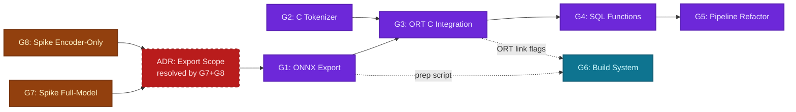
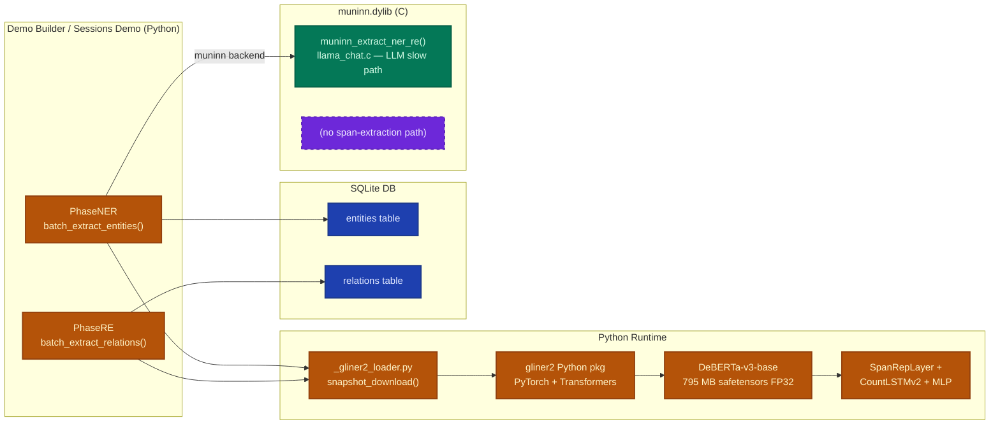
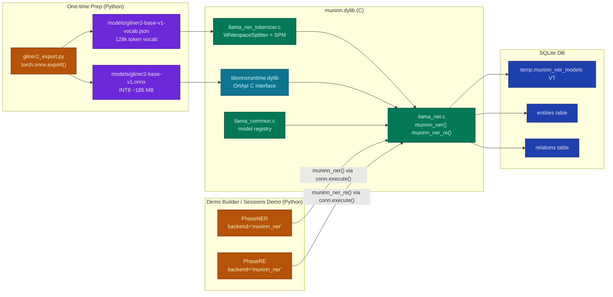
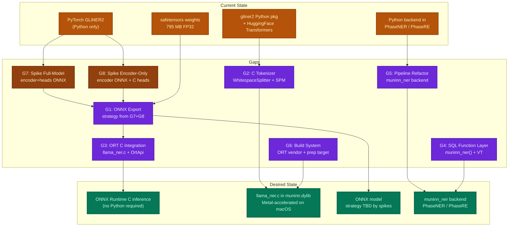
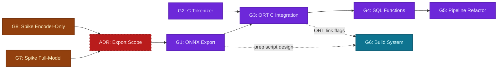

# C GLiNER2: Native NER/RE in the Muninn SQLite Extension

<!-- WARNING: External links in the Desired State section require verification before
implementation. Research was conducted without live browser access. -->

## Overview

Add native C-based NER and relation extraction to the muninn SQLite extension by
implementing GLiNER2 inference through ONNX Runtime. Today, the `demo_builder` and
`sessions_demo` pipelines depend on the Python `gliner2` package (PyTorch +
Transformers) for entity and relation extraction. This replaces that dependency with
a new `llama_ner.c` subsystem — a `muninn_ner()` SQL function family following the
same patterns as `llama_embed.c` and `llama_chat.c`.

The model (`fastino/gliner2-base-v1`) uses a DeBERTa-v3-base encoder (12 layers,
768-dim, disentangled attention) that is not supported by llama.cpp. ONNX Runtime
(already present at `.venv` as a 26 MB dylib) is the inference backend. The
tokenizer (128,011-token SentencePiece unigram, `spm.model`) is implemented in C.

**Gaps identified:**

- G7: Spike — Full-Model ONNX Path (encoder + all heads in one ONNX graph)
- G8: Spike — Encoder-Only ONNX Path (encoder ONNX + C heads)
- G1: GLiNER2 ONNX Export — one-time prep step (strategy resolved by G7/G8)
- G2: DeBERTa Tokenizer in C — WhitespaceTokenSplitter + SPM vocab + label injection
- G3: ONNX Runtime C Integration — link ORT SDK, run inference
- G4: SQL Function Layer — `muninn_ner()`, `muninn_ner_re()`, `muninn_ner_models` VT
- G5: Demo Builder & Sessions Demo Refactor — add `muninn_ner` backend, remove Python GLiNER2
- G6: Build System & Offline Prep — ORT SDK vendoring, ONNX model in `benchmarks harness prep`

**Implementation order:** G7 ∥ G8 → (ADR decision) → G1 + G2 → G3 → G4 → G5; G6 parallel to G1–G3



## Current State

GLiNER2 (`fastino/gliner2-base-v1`) runs entirely in Python. Both `demo_builder`
and `sessions_demo` load it via `_gliner2_loader.py` using a module-level process
cache. PhaseNER calls `batch_extract_entities()` and PhaseRE calls
`batch_extract_relations()` — both use the same 205M DeBERTa-v3-base model with
different schema configurations.

The "muninn" backend in PhaseNER today means LLM-based extraction via `llama_chat.c`
— slow (~2s/chunk) and lower precision than the discriminative GLiNER2 model.
There is no C/SQL path for the span-extraction approach.



**Current usage metrics:**
- Model: `fastino/gliner2-base-v1`, `counting_layer: count_lstm_v2`, `max_width: 8`
- Encoder: DeBERTa-v3-base, 12 layers, hidden=768, heads=12, vocab=128,011
- Tokenizer: SentencePiece unigram (`spm.model` = 8.2 MB)
- NER batch size: 8 chunks × ~1400 chars; RE batch size: 8
- Both NER and RE use the SAME model with different schema (label list) inputs
- `batch_extract_entities()` output: `{entities: {label: [{text, confidence}]}}`
- `batch_extract_relations()` output: `{relation_extraction: {rel_type: [{head: {text, conf}, tail: {text, conf}}]}}`
- llama.cpp **does not** support DeBERTa-v3 (disentangled p2c/c2p attention absent from `llama-arch.cpp`)

## Desired State

GLiNER2 inference runs natively in the muninn SQLite extension via `llama_ner.c`,
loaded through ONNX Runtime. SQL callers use `muninn_ner()` and `muninn_ner_re()`
identically to how `muninn_embed()` and `muninn_extract_entities()` work today.
Python pipelines gain a `muninn_ner` backend that calls these SQL functions via the
`sqlite3` connection — the same pattern as the existing "muninn" (LLM) backend, but
with discriminative span extraction.



**Target SQL surface:**
```sql
-- Load model (follows muninn_embed pattern)
INSERT INTO temp.muninn_ner_models(name, model)
  SELECT 'gliner2', muninn_ner_model('models/gliner2-base-v1.onnx', 'models/gliner2-base-v1-vocab.json');

-- NER: returns JSON array [{text, type, confidence}]
SELECT muninn_ner('gliner2', chunk_text, 'person,organization,location');

-- NER+RE combined: returns JSON {entities:[...], relations:[...]}
SELECT muninn_ner_re('gliner2', chunk_text, 'person,location', 'located_in,employs');
```

## Gap Analysis

### Gap Map



### Dependencies



**Recommended implementation order:**
1. **G7 ∥ G8** — run both spikes in parallel (each is a standalone Python script)
2. **ADR decision** — compare spike outputs on all three metrics, choose path
3. **G1 + G2 + G6-prep** (parallel) — export model using chosen strategy; design prep subcommand
4. **G3** — ORT C integration using G1 ONNX output and G2 tokenizer
5. **G4** — SQL functions on top of G3
6. **G5** — pipeline refactor consuming G4 SQL functions
7. **G6-build** — finalise build system once link flags are known from G3

---

### G7: Spike — Full-Model ONNX Path

**Current:** Unknown whether `torch.onnx.export` on the full `Extractor` model
(DeBERTa encoder + SpanRepLayer + CountLSTMv2 + MLP classifier) succeeds without
manual operator overrides. `CountLSTMv2` contains a `DownscaledTransformer` whose
loop count (`gold_count_val`) is a Python int at trace time, making dynamic shapes
uncertain.

**Gap:** Build the thinnest possible vertical slice of the full-model path and
measure all three metrics. The spike does NOT need to be production-quality C — a
Python ORT inference script is sufficient for latency and quality measurement. The
goal is to surface blockers (export failures, unsupported ops, shape errors) before
investing in the production implementation.

The spike exports the full `Extractor.encoder` + all custom heads as a single ONNX
graph, runs ORT Python inference on the test corpus, and records:
1. Export success/failure and any operator warnings
2. ONNX model file size (FP32 and INT8 after quantization)
3. Inference latency (ms/chunk) at `batch_size=1` and `batch_size=8`
4. NER F1 and RE F1 vs Python `batch_extract_entities` / `batch_extract_relations` ground truth
5. A qualitative assessment of the C inference code that would be needed (one paragraph)

**Output(s):**
- `benchmarks/scripts/spike_fullmodel_onnx.py` — export + benchmark script
- `benchmarks/results/spike_fullmodel_onnx.jsonl` — measured results in standard format
- Summary comment in this ADR section noting pass/fail on each metric

**References:**
```python
# spike_fullmodel_onnx.py — outline
# 1. Load GLiNER2, preprocess a batch using processor (labels injected into input_ids)
# 2. torch.onnx.export(extractor, dummy_batch, "models/gliner2-full.onnx",
#       input_names=[...], output_names=[...], dynamic_axes={...}, opset_version=17)
# 3. Quantize: onnxruntime.quantization.quantize_dynamic(...)
# 4. ORT Python session: session = ort.InferenceSession("models/gliner2-full.onnx",
#       providers=["CoreMLExecutionProvider", "CPUExecutionProvider"])
# 5. Time N=50 inference calls; compute F1 vs Python ground truth
# 6. Write JSONL result: {path, success, size_fp32_mb, size_int8_mb,
#       latency_bs1_ms, latency_bs8_ms, ner_f1, re_f1, export_warnings}
```

---

### G8: Spike — Encoder-Only ONNX + C Heads Path

**Current:** Unknown how complex the C implementation of the custom heads
(SpanRepLayer markerV0, CountLSTMv2 GRU + DownscaledTransformer, MLP classifier)
would be to implement correctly and maintain. The DeBERTa encoder export (standard
transformer ops only) is low-risk — the uncertainty is in the heads.

**Gap:** Build the thinnest possible vertical slice of the encoder-only path.
Export only `extractor.encoder` to ONNX. Implement the span rep and MLP classifier
heads as a Python numpy reference implementation (NOT C yet) to:
1. Verify the math is reproducible outside of PyTorch
2. Measure the latency split: ORT encoder time vs numpy head time (proxy for C head cost)
3. Count lines of numpy head code as a proxy for C maintenance burden

The spike does NOT write C code — a numpy reference implementation is sufficient to
measure quality and estimate maintenance complexity.

**Output(s):**
- `benchmarks/scripts/spike_encoderonly_onnx.py` — encoder export + numpy heads script
- `benchmarks/results/spike_encoderonly_onnx.jsonl` — measured results in standard format
- Summary comment in this ADR section noting pass/fail on each metric

**References:**
```python
# spike_encoderonly_onnx.py — outline
# 1. Export encoder only: torch.onnx.export(extractor.encoder, ...)
# 2. ORT session for encoder: outputs = session.run(["last_hidden_state"], inputs)
# 3. Implement SpanRepLayer markerV0 in numpy:
#    spans_idx = [(i, i+w) for i in range(text_len) for w in range(max_width)]
#    span_embs = np.stack([
#       np.concatenate([token_embs[s], token_embs[e]], axis=-1)  # markerV0 concatenation
#       for s, e in spans_idx
#    ])  # shape (text_len * max_width, hidden*2)
# 4. Implement CountLSTMv2 forward in numpy (GRU step by step)
# 5. MLP classifier: np.dot + relu + np.dot
# 6. einsum scoring, sigmoid, threshold
# 7. F1 vs Python ground truth, latency split, line count of numpy heads
# 8. Write JSONL result: {path, encoder_size_fp32_mb, encoder_size_int8_mb,
#       encoder_latency_ms, heads_latency_ms, ner_f1, re_f1, heads_loc}
```

---

### G1: GLiNER2 ONNX Export

**Current:** The model lives as `model.safetensors` (795 MB FP32) in the HuggingFace
cache. There is no ONNX export and no prep target for it. The model is loaded
at process start by `_gliner2_loader.py` via `snapshot_download() + GLiNER2.from_pretrained()`.

**Gap:** A one-time Python prep script must export the `Extractor` model (including
all custom heads: SpanRepLayer, CountLSTMv2, MLP classifier) to ONNX, and optionally
apply INT8 quantization. A companion JSON vocabulary file must be exported from the
tokenizer for the C tokenizer implementation.

`CountLSTMv2` contains a `DownscaledTransformer` with dynamically-sized tensors
based on `gold_count_val`. For inference (not training), this is a static integer
(the predicted count), but ONNX export requires either:
- Fixing the count to a maximum (e.g., `max_count=19`) and padding
- Using dynamic axes in `torch.onnx.export(dynamic_axes={...})`

The schema (label list) affects the sequence length — labels are tokenised and
appended to text tokens. This must be handled at preprocessing (C tokenizer) time,
not inside the ONNX graph. The ONNX graph takes `(input_ids, attention_mask)` as
inputs and produces span scores.

**Output(s):**
- `benchmarks/harness/prep/gliner2_export.py` — Python export script
- `models/gliner2-base-v1.onnx` — exported model (INT8 quantized, ~185 MB target)
- `models/gliner2-base-v1-vocab.json` — vocabulary for C tokenizer
- Addition to `benchmarks/harness/prep/ner_model.py` (or rename) — new `prep ner-model` subcommand
- Updated `benchmarks/harness/prep/__init__.py` to register `ner-model` target

**References:**
```python
# gliner2_export.py — key export logic
import torch
from gliner2 import GLiNER2
from huggingface_hub import snapshot_download

local_path = snapshot_download("fastino/gliner2-base-v1", local_files_only=True)
model = GLiNER2.from_pretrained(local_path)
extractor = model.model  # The Extractor (PreTrainedModel)

# Export with fixed max_count for CountLSTMv2
# Labels are pre-tokenized and injected into input_ids before export
dummy_input_ids = torch.zeros(1, 128, dtype=torch.long)   # (batch=1, seq=128)
dummy_attn_mask = torch.ones(1, 128, dtype=torch.long)

torch.onnx.export(
    extractor.encoder,               # Export encoder only; heads exported separately
    (dummy_input_ids, dummy_attn_mask),
    "models/gliner2-deberta-encoder.onnx",
    input_names=["input_ids", "attention_mask"],
    output_names=["last_hidden_state"],
    dynamic_axes={"input_ids": {1: "seq_len"}, "attention_mask": {1: "seq_len"}},
    opset_version=17,
)

# Export vocabulary JSON (for C tokenizer)
import json
vocab = {tok: idx for idx, tok in model.model.processor.tokenizer.get_vocab().items()}
with open("models/gliner2-base-v1-vocab.json", "w") as f:
    json.dump(vocab, f)
```

> **Note:** The full ONNX export strategy (encoder-only vs full model, head
> handling, dynamic shape for count) must be validated with an actual export run
> before finalising. The export approach above exports encoder only as a starting
> point; the span rep + classifier heads may need separate C implementations or
> a full-model export.

#### ADR: ONNX Export Scope
<!-- UNRESOLVED -->

| Option | Pros | Cons |
|--------|------|------|
| Encoder only | Smaller ONNX; standard ops only; heads re-implemented in C | More C code; must match PyTorch math exactly; C head bugs cause silent quality loss |
| Full model (encoder + all heads) | Single OrtApi::Run call; verified correct end-to-end | CountLSTMv2 dynamic shapes may block torch.onnx.export; larger graph |
| Split: encoder ONNX + heads ONNX | Modular; easier to quantize encoder separately | Two ORT sessions; tensor transfer overhead between sessions |

**Decision:** pending — resolved empirically by G7 (full-model spike) and G8 (encoder-only spike).  
The winning strategy is whichever path scores best on the weighted combination of:
- **Maintenance simplicity** — C code complexity, debug surface area
- **Inference speed** — latency per chunk (ms) at batch_size=1 and batch_size=8
- **Quality** — NER F1 and RE F1 vs Python GLiNER2 ground truth on canonical test corpus

---

### G2: DeBERTa Tokenizer in C

**Current:** The Python `SchemaTransformer` uses `WhitespaceTokenSplitter` (regex)
followed by an `AutoTokenizer` (SentencePiece unigram, vocab=128,011). Label strings
are tokenised and injected as schema tokens in the input sequence before the encoder.
This is entirely Python-only — there is no C tokenizer in muninn.

**Gap:** The C tokenizer must produce bit-identical token IDs to the Python
`processor.tokenize_and_align()` path for the same text+label inputs. It must
implement:
1. `WhitespaceTokenSplitter` regex: `(?:https?://[^\s]+|www\.[^\s]+)|[a-z0-9._%+-]+@[...]|@[a-z0-9_]+|\w+(?:[-_]\w+)*|\S` (lowercased)
2. SPM unigram lookup: each whitespace token → one or more SPM piece IDs via vocab JSON
3. Schema injection: label tokens `[P]` prepended, entity tokens encoded and appended to text tokens
4. Special tokens: [CLS]=1, [SEP]=2, [PAD]=0 (from `added_tokens.json`)

The vocabulary has 128,011 entries — fits in a sorted array or open-addressing hash
table for O(1) lookup.

**Output(s):**
- `src/llama_ner_tokenizer.c` — C tokenizer implementation
- `src/llama_ner_tokenizer.h` — public interface
- `test/test_llama_ner_tokenizer.c` — C unit tests comparing against Python outputs

**References:**
```c
/* llama_ner_tokenizer.h */

typedef struct NerVocab NerVocab;

/* Load vocab from JSON file exported by gliner2_export.py.
 * Returns NULL on error (file not found, malloc failure). */
NerVocab *ner_vocab_load(const char *vocab_json_path);
void ner_vocab_free(NerVocab *vocab);

/* Tokenize text + labels into input_ids suitable for the ONNX encoder.
 * labels_csv: comma-separated label strings, e.g. "person,location"
 * out_ids / out_mask: caller-allocated arrays of length max_seq_len
 * Returns actual sequence length, or -1 on error (sequence too long). */
int ner_tokenize(
    const NerVocab *vocab,
    const char *text,
    const char *labels_csv,
    int64_t *out_ids,      /* input_ids: (max_seq_len,) */
    int64_t *out_mask,     /* attention_mask: (max_seq_len,) */
    int max_seq_len,       /* 512 for DeBERTa-v3-base */
    int *out_schema_count, /* number of label schemas embedded */
    int *out_text_token_count /* token count of text portion only */
);
```

```c
/* SPM lookup: find the token ID for a single piece string.
 * Returns -1 if not in vocabulary. */
static int spm_lookup(const NerVocab *vocab, const char *piece, int piece_len);

/* Whitespace splitter — matches Python WhitespaceTokenSplitter regex.
 * Calls cb(token, start, end, userdata) for each match (lowercased copy). */
typedef void (*NerTokenCallback)(const char *tok, int start, int end, void *userdata);
static void whitespace_split(const char *text, NerTokenCallback cb, void *userdata);
```

#### ADR: Tokenizer Implementation Strategy
<!-- UNRESOLVED -->

| Option | Pros | Cons |
|--------|------|------|
| Custom C from exported JSON vocab | Zero new deps; matches project pattern | Must implement SPM segment merging correctly; regex engine needed |
| Vendor sentencepiece-lite C API | Official SPM support, handles edge cases | New dependency; sentencepiece requires protobuf or custom reader |
| Export pre-tokenized sequences at build time | No C tokenizer needed (prep does it) | Can't tokenize arbitrary user queries; SQL API becomes awkward |

**Decision:** pending  
**Rationale:** The custom JSON approach is preferred for dep hygiene, but requires
validating that the exported JSON vocab + C implementation produces identical IDs to
Python for all chunk texts in the test corpus. A cross-check test harness is
mandatory before accepting this approach.

---

### G3: ONNX Runtime C Integration

**Current:** There is no ONNX Runtime usage in the muninn C codebase. The ORT Python
package (1.24.2) is installed at `.venv/lib/python3.12/site-packages/onnxruntime/capi/libonnxruntime.1.24.2.dylib` (26 MB), but the C SDK headers
(`onnxruntime_c_api.h`) are not bundled with the Python package — they require the
C/C++ SDK download separately.

**Gap:** Vendor the ORT C SDK headers and link against `libonnxruntime`. Implement
`src/llama_ner.c` that:
1. Loads an ONNX model via `OrtApi::CreateSession`
2. Allocates input tensors for (input_ids, attention_mask)
3. Runs inference via `OrtApi::Run`
4. Decodes output span scores → entity/relation mentions
5. Stores the model in `MuninnModelEntry` with `type = MUNINN_MODEL_NER` (new type)

On macOS, enable CoreML execution provider for Metal acceleration. On Linux, use CPU
provider.

**Output(s):**
- `src/llama_ner.c` — ORT-based NER inference engine
- `src/llama_ner.h` — public interface
- `vendor/onnxruntime/include/onnxruntime_c_api.h` — vendored ORT C SDK header
- Updated `src/llama_common.h` — add `MUNINN_MODEL_NER = 3` to `MuninnModelType`
- `test/test_llama_ner.c` — C unit tests for ORT session lifecycle

**References:**
```c
/* llama_ner.h */
#ifndef LLAMA_NER_H
#define LLAMA_NER_H
#include "sqlite3ext.h"

/* Register muninn_ner(), muninn_ner_re(), muninn_ner_model() functions
 * and muninn_ner_models virtual table. Returns SQLITE_OK on success. */
int ner_register_functions(sqlite3 *db);

#endif /* LLAMA_NER_H */
```

```c
/* llama_ner.c — ORT session creation pattern (analogous to llama_embed.c) */
#include "onnxruntime_c_api.h"

static const OrtApi *g_ort = NULL;

static int ner_ensure_ort(char errbuf[], int errsz) {
    if (g_ort) return 0;
    g_ort = OrtGetApiBase()->GetApi(ORT_API_VERSION);
    if (!g_ort) {
        snprintf(errbuf, errsz, "muninn_ner: OrtGetApiBase failed");
        return -1;
    }
    return 0;
}

/* Called from muninn_ner_model() SQL function.
 * Loads ONNX model + vocab JSON, registers in muninn model registry. */
static void sql_ner_model(sqlite3_context *ctx, int argc, sqlite3_value **argv) {
    const char *onnx_path = (const char *)sqlite3_value_text(argv[0]);
    const char *vocab_path = (const char *)sqlite3_value_text(argv[1]);
    char errbuf[256];

    if (ner_ensure_ort(errbuf, sizeof(errbuf)) != 0) {
        sqlite3_result_error(ctx, errbuf, -1);
        return;
    }
    /* Create OrtSession, load NerVocab, register in g_models[] */
    /* ... follow llama_embed.c model loading pattern ... */
}
```

```c
/* Span decoding: ONNX output → entity list.
 * span_scores shape: (num_labels, text_len, max_width=8)
 * threshold: 0.5 default (configurable via 4th SQL arg) */
typedef struct {
    int token_start;     /* token index in text portion */
    int token_end;       /* inclusive */
    int label_idx;
    float score;
} NerSpan;

static int decode_spans(
    const float *span_scores,  /* (num_labels, text_len, max_width) */
    int num_labels,
    int text_len,
    int max_width,
    float threshold,
    NerSpan *out_spans,        /* caller allocated, max_spans */
    int max_spans
);
```

#### ADR: Inference Backend

| Option | Pros | Cons |
|--------|------|------|
| ONNX Runtime C API | DeBERTa supported; 26 MB dylib already in .venv; stable C API; CoreML on macOS | New vendor dep (C SDK headers); dynamic link (.dylib); no GGUF quantization |
| ggml from scratch (extend llama.cpp) | Zero new deps; GGUF format; Metal already wired; native quantization | Must implement DeBERTa disentangled attention (p2c/c2p buckets) in ggml ops; SpanRepLayer + CountLSTMv2 in ggml; safetensors reader needed; ~3-4x implementation effort |
| libtorch TorchScript | Exact PyTorch parity | libtorch ~500 MB; too heavy |
| dlopen ORT (optional dep) | NER degrades gracefully if ORT absent | Violates no-graceful-degradation rule in `CLAUDE.md` |

**Decision:** ONNX Runtime C API  
**Rationale:** DeBERTa-v3 disentangled attention (`pos_att_type: [p2c, c2p]`,
`position_buckets: 256`) is NOT in llama.cpp and is a multi-week ggml implementation.
The 26 MB ORT dylib is already proven on this macOS. `libonnxruntime.1.24.2.dylib`
is already installed at `.venv/lib/python3.12/site-packages/onnxruntime/capi/`.
Graceful degradation (dlopen) is explicitly forbidden by `CLAUDE.md` — ORT is a
hard link-time dependency.

---

### G4: SQL Function Layer

**Current:** No SQL-visible NER span extraction functions exist in muninn. The
nearest analogue is `muninn_extract_entities()` in `llama_chat.c` which uses LLM
generation. The embedding (`llama_embed.c`) and chat (`llama_chat.c`) subsystems
provide the naming and registration patterns to follow.

**Gap:** Implement and register the public SQL surface for NER + RE. Follows the
exact naming and registration conventions in `src/CLAUDE.md` and the patterns
established by `llama_embed.c`.

| SQL name | Signature | Returns |
|----------|-----------|---------|
| `muninn_ner_model` | `(onnx_path, vocab_path [, threshold])` | opaque model handle TEXT |
| `muninn_ner` | `(model, text, labels_csv [, threshold])` | JSON (subtype 'J') |
| `muninn_ner_re` | `(model, text, ner_labels_csv, re_labels_csv [, threshold])` | JSON (subtype 'J') |
| `muninn_ner_batch` | `(model, texts_json, labels_csv)` | JSON array (subtype 'J') |
| `muninn_ner_models` | VT: INSERT/DELETE/SELECT (follows `muninn_models`) | — |

**Output(s):**
- SQL function implementations in `src/llama_ner.c`
- `int ner_register_functions(sqlite3 *db)` called from `src/muninn.c`
- Registration added to `muninn.c` inside `#ifndef MUNINN_NO_LLAMA` guard
- Python integration tests: `pytests/test_ner.py`

**References:**
```c
/* muninn.c registration (follows existing llama subsystem pattern) */
#ifndef MUNINN_NO_LLAMA
    /* ... existing embed/chat registrations ... */
    rc = ner_register_functions(db);
    if (rc != SQLITE_OK) {
        *pzErrMsg = sqlite3_mprintf("muninn: failed to register ner functions");
        return rc;
    }
#endif
```

```python
# pytests/test_ner.py — integration test
def test_ner_basic(conn, ner_model_name):
    """Entity spans match expected GLiNER2 Python output for canonical text."""
    text = "Apple released the iPhone 15 in Cupertino."
    result = conn.execute(
        "SELECT muninn_ner(?, ?, 'company,product,location')",
        (ner_model_name, text)
    ).fetchone()[0]
    entities = json.loads(result)
    names = {e["text"].lower() for e in entities}
    assert "apple" in names
    assert "iphone 15" in names
```

```sql
-- Canonical usage pattern after model load
SELECT e.value ->> '$.text'   AS entity_text,
       e.value ->> '$.type'   AS entity_type,
       e.value ->> '$.confidence' AS score
FROM chunks c,
     json_each(muninn_ner('gliner2', c.text, 'person,organization,location')) e
ORDER BY score DESC;
```

---

### G5: Demo Builder & Sessions Demo Refactor

**Current:** Both `demo_builder` and `sessions_demo` have Python `PhaseNER` and
`PhaseRE` with `backend="gliner2"` (default) and `backend="muninn"` (LLM path).
The `_gliner2_loader.py` in each package manages the Python model cache.
Both packages are fully decoupled (no cross-imports per `feedback_no_cross_deps.md`).

**Gap:** Add `backend="muninn_ner"` to `PhaseNER` and `PhaseRE` in both packages.
This backend calls `muninn_ner()` / `muninn_ner_re()` via the SQLite connection
(analogous to the existing `backend="muninn"` LLM path). The key difference: the
model must be registered in `temp.muninn_ner_models` during `setup()` before `run()`
can call the SQL function.

This does NOT remove the `gliner2` or `muninn` backends — they remain as fallbacks
and for comparison. The `muninn_ner` backend becomes the new default once validated.

**Output(s):**
- `benchmarks/demo_builder/phases/ner.py` — add `muninn_ner` backend
- `benchmarks/demo_builder/phases/re.py` — add `muninn_ner` backend
- `benchmarks/sessions_demo/phases/ner.py` — same changes (independently)
- `benchmarks/sessions_demo/phases/re.py` — same changes (independently)
- CLI flag: `--ner-backend {gliner2,muninn_ner,muninn,gliner}` replacing `--legacy-models`
- `pytests/` integration test for muninn_ner backend end-to-end

**References:**
```python
# PhaseNER setup() for muninn_ner backend (pattern from existing muninn backend)
elif self._backend == "muninn_ner":
    log.info("  Loading muninn NER model: %s", self._ner_model_file)
    model_path = str(MUNINN_NER_MODELS_DIR / self._ner_model_file)
    vocab_path = str(MUNINN_NER_MODELS_DIR / self._ner_vocab_file)
    try:
        conn.execute(
            "INSERT INTO temp.muninn_ner_models(name, model) "
            "SELECT ?, muninn_ner_model(?, ?)",
            (self._ner_model_name, model_path, vocab_path),
        )
    except sqlite3.OperationalError as e:
        if "already loaded" not in str(e):
            raise
        log.info("  NER model %s already loaded", self._ner_model_name)
```

```python
# PhaseNER run() for muninn_ner backend
elif self._backend == "muninn_ner":
    # Identical SQLite-call pattern to muninn LLM backend
    result_json = conn.execute(
        "SELECT muninn_ner(?, ?, ?)",
        (self._ner_model_name, text, self._labels_csv),
    ).fetchone()[0]
    parsed = json.loads(result_json)
    insert_rows = [
        (ent["text"], ent["type"], "muninn_ner", chunk_id, ent.get("confidence", 1.0))
        for ent in parsed
    ]
```

---

### G6: Build System & Offline Prep

**Current:** `scripts/generate_build.py` auto-discovers `llama_*.c` sources (which
auto-excludes WASM). CMake builds llama.cpp static libs. There is no ORT dependency.
The `benchmarks/harness/prep/` module has `kg_models.py` and `kg_chunks.py` as prep
targets. GGUF model files live in `models/`.

**Gap:** Wire three new concerns into the build:
1. **ORT SDK headers**: vendor `onnxruntime_c_api.h` at `vendor/onnxruntime/include/`
2. **ORT dylib link flags**: add `-L/.../onnxruntime/lib -lonnxruntime` (macOS) or similar in Makefile / generate_build.py
3. **Prep subcommand**: `uv run -m benchmarks.harness prep ner-model` exports ONNX model and vocab JSON to `models/`

`llama_ner.c` is auto-discovered by the existing `llama_*.c` glob pattern — no
changes needed to source discovery.

**Output(s):**
- `vendor/onnxruntime/include/onnxruntime_c_api.h` — vendored ORT C API header
- `scripts/generate_build.py` — ORT detection and link flag generation
- `Makefile` — ORT library dependency, analogous to llama.cpp static lib target
- `benchmarks/harness/prep/ner_model.py` — new prep module
- `benchmarks/harness/prep/__init__.py` — register `ner-model` subcommand
- `.gitignore` update: add `vendor/onnxruntime/lib/` (dylib binaries, not headers)

**References:**

Two alternative CMake patterns — which is used depends on the ORT Linking Strategy ADR:

```cmake
# Option A: Static link — build ORT from source (self-contained muninn.dylib)
# Follows same pattern as llama.cpp but with much heavier build graph.
# ORT build time: ~30-60 min; pulls in protobuf, flatbuffers, abseil, oneDNN, re2, clog.
ExternalProject_Add(onnxruntime_static
    GIT_REPOSITORY "https://github.com/microsoft/onnxruntime.git"
    GIT_TAG        "v1.24.2"
    CMAKE_ARGS
        -DONNXRUNTIME_BUILD_SHARED_LIB=OFF    # static .a output
        -Donnxruntime_BUILD_UNIT_TESTS=OFF
        -Donnxruntime_BUILD_BENCHMARKS=OFF
        -Donnxruntime_ENABLE_PYTHON=OFF
        -DCMAKE_BUILD_TYPE=Release
    INSTALL_DIR    "${CMAKE_SOURCE_DIR}/vendor/onnxruntime"
)
# Resulting static lib: vendor/onnxruntime/lib/libonnxruntime.a
# Link into muninn.dylib: -lonnxruntime (static, no rpath needed)
```

```cmake
# Option B: Dynamic link — download prebuilt dylib (simpler build, two-file deployment)
ExternalProject_Add(onnxruntime_prebuilt
    URL "https://github.com/microsoft/onnxruntime/releases/download/v1.24.2/onnxruntime-osx-arm64-1.24.2.tgz"
    CONFIGURE_COMMAND "" BUILD_COMMAND ""
    INSTALL_COMMAND
        ${CMAKE_COMMAND} -E copy_directory <SOURCE_DIR>/include "${ORT_INSTALL_DIR}/include"
        COMMAND ${CMAKE_COMMAND} -E copy <SOURCE_DIR>/lib/libonnxruntime.1.24.2.dylib
                                         "${ORT_INSTALL_DIR}/lib/"
)
# Users must have libonnxruntime.dylib in rpath or alongside muninn.dylib
```

```python
# scripts/generate_build.py — ORT linker flags (both options share same interface)
def get_ort_flags(platform_name, static=True):
    ort_lib = PROJECT_ROOT / "vendor" / "onnxruntime" / "lib"
    if static:
        return f"-L{ort_lib} -lonnxruntime"   # static: no rpath needed
    else:
        return f"-L{ort_lib} -lonnxruntime -Wl,-rpath,{ort_lib}"
```

#### ADR: ORT Linking Strategy
<!-- UNRESOLVED -->

**Licensing note:** ORT's `ThirdPartyNotices.txt` mentions LGPL components. For
an **open-source project** like muninn, static linking LGPL code is fully compliant
because the muninn source code is publicly available — the LGPL's re-linking
requirement is satisfied. Licensing is **not** a constraint on the linking strategy.

**The real constraint:** Microsoft only ships ORT as prebuilt `.dylib`/`.so`. There
is no official prebuilt static `.a`. Static linking therefore requires **building
ORT from source**, which brings significant build complexity: ORT pulls in protobuf,
flatbuffers, abseil, oneDNN, re2, and clog — all compiled from source. Compare to
llama.cpp: it takes ~5 min to build; ORT from source takes 30–60 min with a heavier
CMake graph.

| Option | Self-contained dylib | Build complexity | Follows existing patterns |
|--------|---------------------|-----------------|--------------------------|
| Static link (build ORT from source) | Yes — single muninn.dylib | High — 30-60 min, multiple deps | Follows llama.cpp CMake pattern |
| Dynamic link (CMake downloads prebuilt dylib) | No — requires libonnxruntime.dylib at runtime | Low — downloads tarball, no compile | Same pattern but prebuilt binary |
| Dynamic link + bundle dylib alongside muninn.dylib | Effectively yes — ship both files together | Low | New pattern for this project |

**Decision:** pending  
**Rationale:** The core question is whether muninn NER **must** ship as a single
self-contained binary (same contract as current muninn.dylib + GGUF models). If yes,
static link from source is required despite the build time cost. If bundling two files
is acceptable, the CMake prebuilt download is far simpler. This should also be
evaluated alongside the G7/G8 spike outcomes — if the ggml path (G8) proves
viable, it eliminates this question entirely since ggml is already statically linked.

---

## Success Measures

### Project Quality Bar (CI Gates)

| Command | Threshold | Applies to |
|---------|-----------|------------|
| `make test` | All C unit tests pass, exit 0 | `llama_ner.c`, `llama_ner_tokenizer.c`, `test/test_llama_ner*.c` |
| `make test-python` | All pytest tests pass, exit 0 | `pytests/test_ner.py`, updated `pytests/test_embed.py` (regression) |
| `make all` | Clean build on macOS with Metal + Linux (CPU), exit 0 | All new `.c` files |
| `uvx ruff check . --line-length 120` | Zero errors | All new `.py` files |
| `uvx ruff format . --check` | Zero formatting violations | All new `.py` files |

### Domain-Specific Measures

**G7 — Full-Model Spike:**
- `benchmarks/scripts/spike_fullmodel_onnx.py` runs to completion without manual op overrides
- Results JSONL written with all required fields
- `export_warnings` field documented (empty = clean, or lists any unsupported ops)

**G8 — Encoder-Only Spike:**
- `benchmarks/scripts/spike_encoderonly_onnx.py` runs to completion
- numpy heads produce NER F1 within 2% of Python GLiNER2 on the test corpus (verifies math correctness)
- Results JSONL written with all required fields including `heads_loc` (lines of code count)

**Spike Evaluation Gate (blocks G1):**
The ADR is resolved when BOTH spikes have results and the following comparison table is filled:

| Metric | G7 Full-Model | G8 Encoder-Only | Weight |
|--------|--------------|-----------------|--------|
| Maintenance simplicity | export success + C inference LOC estimate | heads_loc (numpy proxy) | 33% |
| Inference latency bs=1 | latency_bs1_ms | encoder_latency_ms + heads_latency_ms | 33% |
| NER F1 vs Python | ner_f1 | ner_f1 | 17% |
| RE F1 vs Python | re_f1 | re_f1 | 17% |

**G1 — ONNX Export:**
- `models/gliner2-base-v1.onnx` loads cleanly in ORT Python without warnings
- INT8 model size ≤ 200 MB
- For 100 canonical test texts: entity spans from ONNX output match Python GLiNER2 output with ≥ 95% F1 on entity text extraction

**G2 — C Tokenizer:**
- Token ID sequences produced by C `ner_tokenize()` are byte-identical to Python `processor.tokenize()` for all texts in `benchmarks/texts/` test corpus (zero mismatches on 1000 random samples)
- Max sequence length handling: returns -1 (not silent truncation) when text + labels exceed 512 tokens
- C unit test in `test/test_llama_ner_tokenizer.c` covers: empty text, text-only (no labels), labels-only, multi-label, Unicode text, max-length boundary

**G3 — ORT C Integration:**
- `muninn_ner_model()` SQL call loads ONNX session, returns non-NULL handle
- `test/test_llama_ner.c` verifies OrtSession lifecycle (create → run → destroy) without memory leaks (valgrind / ASan)
- Metal CoreML provider active on macOS (verified via ORT log at `MUNINN_LOG_LEVEL=verbose`)
- CPU fallback on Linux: `make test` passes on Linux CI without Metal

**G4 — SQL Functions:**
- `muninn_ner('gliner2', 'Apple Inc. is in Cupertino.', 'company,location')` returns JSON with `apple inc.` and `cupertino` entries
- `muninn_ner_re()` returns combined JSON matching Python `batch_extract_entities` + `batch_extract_relations` output format
- JSON subtype 'J' set on return value (enables `json_each()` downstream without re-parsing)
- `pytests/test_ner.py` covers all SQL function signatures

**G5 — Pipeline Refactor:**
- `uv run -m benchmarks.demo_builder build --book-id 3300 --embedding-model MiniLM --ner-backend muninn_ner` completes successfully
- Entity count within 5% of `gliner2` backend output for book 3300
- Relation count within 10% of `gliner2` backend output
- Both `demo_builder` and `sessions_demo` refactored independently (no cross-imports)

**G6 — Build System:**
- `make all` succeeds on a clean checkout without pre-installed ORT (ORT SDK auto-downloaded)
- `uv run -m benchmarks.harness prep ner-model --status` shows download/export status
- `uv run -m benchmarks.harness prep ner-model` exports model to `models/` and prints sizes

## Negative Measures

### Quality Bar Violations

- **Spike result cherry-picking**: Choosing the winning spike path based only on the
  metric where it wins, ignoring the other two. All three metrics (maintenance, speed,
  quality) must be evaluated together using the weighted comparison table.
- **Spike declared done without JSONL**: A spike whose output is "it worked" in prose
  but has no machine-readable JSONL results cannot be compared against the other spike.
  The JSONL is the required output, not optional.
- **Graceful degradation**: Adding `try/except ImportError` around ORT or `if ort_available:` fallbacks
  violates `CLAUDE.md` rule. `muninn_ner` must hard-fail if ORT is not available.
- **Python subprocess from C**: Calling Python from within `llama_ner.c` to handle the tokenizer
  (e.g., via `popen`) — this is not a C implementation.
- **Inline Python scripts**: `python -c '...'` in Makefile or elsewhere — forbidden per
  `feedback_no_inline_scripts.md` memory entry.
- **CSV files**: Exporting vocabulary or span results as CSV rather than JSON — explicitly
  forbidden by `CLAUDE.md`.
- **Missing `llama_` prefix**: Any new `.c` file that depends on llama.cpp (including ORT,
  which is in the same WASM-excluded category) must use the `llama_` prefix or it will be
  included in WASM builds and break compilation.
- **Direct sqlite3.h include**: New C files calling SQLite API must use `sqlite3ext.h` +
  `SQLITE_EXTENSION_INIT3`, not `<sqlite3.h>`. Violating this causes NULL pointer segfaults
  outside `.load` context.
- **argvIndex gaps in TVFs**: If `muninn_ner_models` virtual table is added with xBestIndex,
  `argvIndex` values must be contiguous. Gaps cause SQLite "virtual table malfunction" errors
  that are hard to diagnose.

### Domain-Specific Failures

- **Silent tokenization mismatch**: C tokenizer produces different IDs than Python but
  the model still outputs plausible (but wrong) spans — entity F1 appears ~90% but is
  actually degraded vs Python. Mitigation: byte-identical token ID comparison test (G2 measure).
- **ONNX export vs Python divergence**: The exported model produces different spans than
  Python for edge cases (Unicode, long texts, many labels) but test corpus scores look
  fine. Mitigation: mandatory 95% F1 threshold on canonical test texts, not just a smoke test.
- **CountLSTMv2 static export bug**: The count prediction uses `gold_count_val` at runtime,
  but the ONNX export bakes in a fixed count, silently producing incorrect relation extraction
  for texts with many instances of a relation type. Mitigation: validate RE output counts
  against Python for multi-instance texts.
- **ORT CoreML provider not active**: macOS build links ORT with CoreML capability but
  the `OrtSessionOptions` doesn't actually append the CoreML provider — inference falls
  back to CPU silently. Metal is not doing work. Mitigation: verify via `MUNINN_LOG_LEVEL=verbose`
  that CoreML provider is listed in active providers.
- **muninn_ner backend cross-import**: sessions_demo imports from demo_builder to share
  the new NER backend code, recreating the cross-dependency that `feedback_no_cross_deps.md`
  prohibits. Mitigation: duplicate the `muninn_ner` backend code in each package independently.
- **Threshold calibration drift**: Python `batch_extract_entities` uses internal
  per-label thresholds tuned to the ONNX model. The C SQL function uses a single
  global threshold (0.5 default) that may differ per-label. Entity recall appears
  normal in testing but silently drops in production. Mitigation: per-label threshold
  support in `muninn_ner()` signature, validated against Python per-label outputs.
