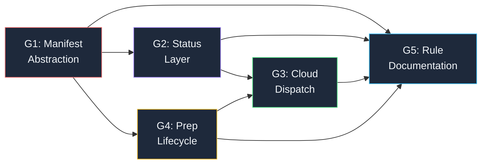
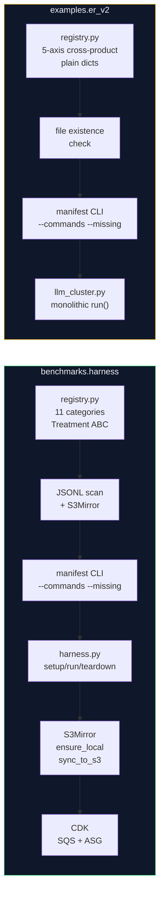
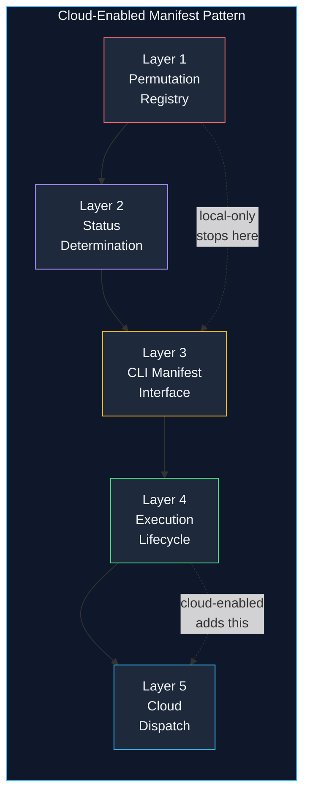
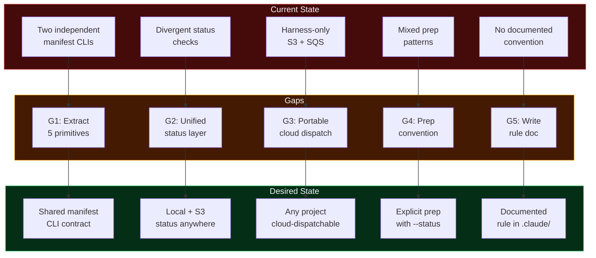

# Cloud-Enabled Manifest Pattern

## Overview

Extract the generalised "manifest pattern" from two concrete implementations (`benchmarks.harness` and `examples.er_v2`) into a documented abstraction at `.claude/rules/python/helper_scripts/cloud_enabled_manifest_pattern.md`. This pattern — define N permutations, track completion, execute the missing, optionally offload to cloud — recurs across multiple subprojects and should be codified as a reusable convention.

**Gaps identified:**

- G1: Common manifest abstraction (the five shared primitives)
- G2: Status determination layer (local + S3 hybrid)
- G3: Cloud dispatch integration (SQS worker self-selection)
- G4: Prep lifecycle pattern (explicit vs lazy)
- G5: Rule documentation output



## Current State

Two independent implementations of the same pattern exist, with no shared code or documented convention.

### benchmarks.harness (mature, cloud-enabled)

- **714 permutations** across 11 categories, generated by combinatoric registry functions in `registry.py`
- Treatment ABC (`treatments/base.py`) with `category`, `permutation_id`, `label`, `sort_key`, `setup()`, `run()`, `teardown()`
- Status via JSONL content scan (`_load_completed_permutation_ids()`) — S3-aware through `S3Mirror.list_union()`
- `manifest --commands --missing --limit N --category X --sort size` CLI
- `S3Mirror` singleton with `ensure_local()`, `sync_to_s3()`, `list_union()`
- CDK infrastructure: SQS queue, ASG, scaling, AMI, systemd worker service
- Explicit prep subcommand (`prep vectors`, `prep texts`, `prep kg-chunks`, etc.) with `--status`

### examples.er_v2 (local-only, simpler)

- **3,360 permutations** from 5-axis cross-product in `registry.py`
- No Treatment ABC — plain dicts with `permutation_id`, `sort_key`, `done`
- Status via file existence check (`out_path.exists()`) — local-only, no S3
- Same `manifest --commands --missing --limit N --sort size` CLI shape
- No S3 integration, no cloud dispatch, no heartbeat
- Implicit lazy prep — `prep_dataset()` called automatically on first `run`



## Desired State

A documented convention at `.claude/rules/python/helper_scripts/cloud_enabled_manifest_pattern.md` that any new subproject can follow to get the full manifest lifecycle — from local-only to cloud-enabled — with zero boilerplate reinvention.

The convention defines five composable layers:



## Gap Analysis

### Gap Map



### Dependencies


**Implementation order:** G1 → G2 + G4 (parallel) → G3 → G5

---

### G1: Common Manifest Abstraction

**Current:** Two implementations share the same five-flag CLI contract (`--missing`, `--done`, `--commands`, `--sort`, `--limit`) and the same permutation identity model (`permutation_id` as a deterministic slug), but have no shared documentation or convention. The harness uses a Treatment ABC; er_v2 uses plain dicts.

**Gap:** Extract the five composable primitives that both share:

1. **Permutation registry** — a function returning `list[dict]` where each dict has `permutation_id: str`, `sort_key: tuple`, `label: str`, `category: str | None`
2. **Permutation ID** — a pure function of the parameter axes, producing a valid path component (no slashes, no spaces)
3. **Sort key** — a tuple whose first element is the primary scaling dimension (enables cheapest-first execution)
4. **Manifest CLI** — the `manifest` subcommand with the 5 standard flags
5. **Command emission** — `--commands` outputs one runnable `uv run -m {module} run --id {permutation_id}` line per entry

**Output(s):**
- `.claude/rules/python/helper_scripts/cloud_enabled_manifest_pattern.md` (the rule document — created in G5)

**References:**

The five-flag contract (from both implementations):
```python
# Shared CLI flags — both harness and er_v2 implement exactly these
manifest_parser.add_argument("--missing", action="store_true", help="Show only incomplete")
manifest_parser.add_argument("--done", action="store_true", help="Show only complete")
manifest_parser.add_argument("--commands", action="store_true", help="Emit runnable commands")
manifest_parser.add_argument("--sort", choices=["size", "name"], default="size")
manifest_parser.add_argument("--limit", type=int, default=None)
manifest_parser.add_argument("--category", default=None)  # optional, if multi-category
```

The permutation identity contract:
```python
# Permutation ID: deterministic, pure function of parameters, valid path component
def permutation_id(dataset: str, *, model: str, n: int) -> str:
    return f"{dataset}_{model}_n{n}"  # e.g., "ag-news_MiniLM_n5000"
```

---

### G2: Status Determination Layer

**Current:** Harness scans JSONL content for `permutation_id` fields, layered with S3Mirror for remote state. Er_v2 checks file existence only, local-only.

**Gap:** The generalised convention should document both approaches and when to use each:

| Approach | Mechanism | Cloud-compatible | Append-safe | Example |
|----------|-----------|-----------------|-------------|---------|
| **File existence** | `result_path.exists()` | With S3Mirror | N/A | er_v2 |
| **JSONL scan** | Parse `permutation_id` from JSONL lines | With S3Mirror | Yes | harness |

Both approaches work with S3Mirror's `list_union()` — the S3 layer is orthogonal to the status check mechanism.

**Output(s):**
- Section in the rule document covering status determination patterns
- Recommendation: file-existence is simpler and sufficient for most cases; JSONL scan is for append-mode multi-run accumulation

**References:**

File-existence pattern (er_v2 style, simplest):
```python
def _check_status(results_dir: Path, permutation_id: str) -> bool:
    """Check if a permutation has been completed."""
    return (results_dir / f"{permutation_id}.json").exists()
```

JSONL-scan pattern (harness style, for multi-run accumulation):
```python
def _load_completed_ids(results_dir: Path, mirror) -> set[str]:
    """Scan JSONL files for completed permutation IDs. S3-aware via mirror."""
    completed = set()
    for filepath in mirror.list_union(results_dir, "*.jsonl"):
        if not mirror.ensure_local(filepath):
            continue
        for line in filepath.read_text(encoding="utf-8").strip().split("\n"):
            if line.strip():
                record = json.loads(line)
                pid = record.get("permutation_id")
                if pid:
                    completed.add(pid)
    return completed
```

---

### G3: Cloud Dispatch Integration

**Current:** Harness has S3Mirror, CDK (SQS + ASG), systemd worker service, S3 heartbeat monitoring, and Plotly Dash dashboard. Er_v2 has nothing.

**Gap:** Document the cloud dispatch as an optional layer that any manifest-pattern project can adopt. The key primitives are:

1. **S3 as remote result store** — `S3Mirror` with `ensure_local()`, `sync_to_s3()`, `list_union()`
2. **Worker self-selection** — workers run `manifest --commands --missing --limit 1` to pick work (or pull from SQS)
3. **S3 heartbeat** — 15-second PUTs for liveness monitoring
4. **SQS + ASG** — CDK infrastructure for parallel fan-out with spot instances
5. **AMI priming** — bake slow-to-create artifacts (OS packages, venv, compiled code) into a reusable image

The unique insight from this project: **worker self-selection via manifest is more resilient than fixed-index assignment** (like AWS Batch Array Jobs). A spot-terminated worker leaves the permutation "missing" and another worker picks it up naturally. No index tracking or reassignment logic.

**Output(s):**
- Section in the rule document covering cloud dispatch layers
- Guidance on when to adopt each layer (local-only → S3 mirror → SQS workers → CDK pipeline)

**References:**

The worker self-selection pattern (from `worker_user_data.sh`):
```bash
# Worker polls SQS, runs benchmark, deletes message
MSG=$(aws sqs receive-message --queue-url "$SQS_QUEUE_URL" --wait-time-seconds 20)
BENCH_ID=$(echo "$MSG" | jq -r '.Messages[0].Body // empty')
RECEIPT=$(echo "$MSG" | jq -r '.Messages[0].ReceiptHandle // empty')

if [ -z "$BENCH_ID" ]; then
    echo "Queue empty. Shutting down."
    shutdown -h now
fi

uv run -m benchmarks.harness --s3-bucket "$S3_BUCKET" benchmark --id "$BENCH_ID" --force
aws sqs delete-message --queue-url "$SQS_QUEUE_URL" --receipt-handle "$RECEIPT"
```

---

### G4: Prep Lifecycle Pattern

**Current:** Harness has explicit `prep` subcommand with per-target control and `--status`. Er_v2 has lazy implicit prep triggered on first `run`.

**Gap:** Document both patterns and recommend explicit prep for cloud scenarios:

| Pattern | Trigger | Visibility | Cloud-compatible |
|---------|---------|-----------|-----------------|
| **Explicit** | `prep` subcommand | `prep --status` shows what's cached | Yes — prep can run on prime instance |
| **Implicit** | First `run` call | No status visibility | Risky — prep may OOM or timeout on workers |

For cloud execution, **explicit prep during AMI priming** is strongly preferred. The AMI captures the prep artifacts, so workers never need to run prep.

**Output(s):**
- Section in the rule document covering prep lifecycle patterns

---

### G5: Rule Documentation Output

**Current:** No documented convention for the manifest pattern.

**Gap:** Write the rule document at `.claude/rules/python/helper_scripts/cloud_enabled_manifest_pattern.md` synthesising G1-G4 into a reusable convention. The document should be:

- **Agnostic** — no project-specific names (per `.claude/rules/agnostic_examples.md`)
- **Layered** — start with local-only, add cloud incrementally
- **Prescriptive** — concrete code patterns, not vague guidance

**Output(s):**
- `.claude/rules/python/helper_scripts/cloud_enabled_manifest_pattern.md` — agent-facing pattern language document. No project-specific names (per `agnostic_examples.md`). Target audience: AI agents picking up this document as a library reference when implementing the pattern in any new codebase.

## Success Measures

### Project Quality Bar (CI Gates)

| Gate | Command | Threshold | Applies to |
|------|---------|-----------|-----------|
| Python linting | `uv run ruff check .` | Zero violations | All `.py` files |
| Python formatting | `uv run ruff format --check .` | Line length 120 | All `.py` files |
| Mermaid validation | `npx mmdc -i doc.md -o /dev/null` | Exit code 0 | All diagrams in the rule doc |
| Benchmark harness tests | `make -C benchmarks/harness test` | All pass | Registry changes |

### Domain-Specific Measures

- **G1:** The rule document describes the 5 manifest primitives with concrete code examples
- **G2:** Both status approaches (file-existence and JSONL-scan) are documented with when-to-use guidance
- **G3:** Cloud dispatch layers are documented from simplest (S3 mirror) to full (CDK + SQS + ASG), with explicit prerequisites for each
- **G4:** Both prep patterns documented with cloud compatibility guidance
- **G5:** The rule document uses only generic entity names (no `muninn`, `harness`, `er_v2` references in the rule itself — per agnostic_examples.md)

## Negative Measures

### Quality Bar Violations

- Rule document contains project-specific names instead of generic examples (violates `agnostic_examples.md`)
- Mermaid diagrams in the rule document fail to render via mmdc
- Rule document recommends `print()` instead of `logging`, or `os.path` instead of `pathlib`
- Rule document suggests `click`/`typer` instead of `argparse`

### Domain-Specific Failures

- **False abstraction:** The rule describes a pattern that only works for one of the two implementations, making it look generalised but actually being harness-specific
- **Missing cloud layer:** The rule documents local-only manifest but omits the S3/SQS/ASG integration — "escalators not stairs" failure where the cloud-enabled part (the main value) is missing
- **Implicit prep recommended for cloud:** The rule suggests lazy prep is acceptable for cloud workers, leading to workers that OOM or timeout during first-run prep
- **Worker self-selection not documented:** The rule documents SQS polling but not the `manifest --missing --limit 1` self-selection pattern that provides natural retry on spot interruption
- **Status layer not S3-aware:** The rule documents local status checks but doesn't show how S3Mirror makes them work across local and remote contexts
