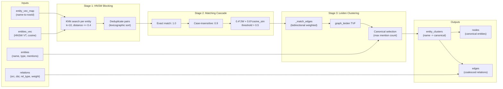
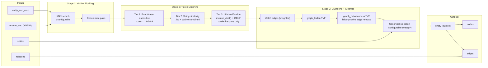
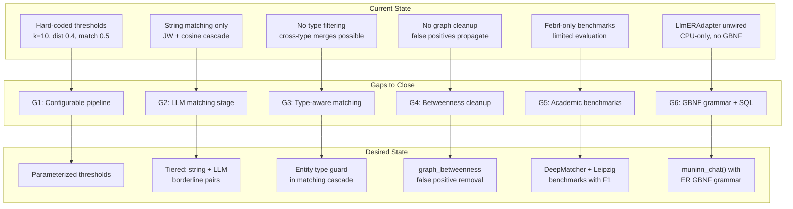

# Entity Resolution: Gap Analysis

## Overview

Gap analysis for upgrading the entity resolution (ER) subsystem in the muninn SQLite extension ecosystem. With the integration of `muninn_chat` (LLM inference via llama.cpp with GBNF grammar-constrained generation), we now have access to SOTA approaches for entity resolution that go beyond the current embedding-similarity + string-matching pipeline.

This document maps the current implementation, surveys SOTA ER techniques from the academic literature, identifies the gaps, and defines a plan to adopt the best tradeoff of speed and quality — validated against real-world academic benchmarks with F1, precision, and recall metrics.

**Scope:** The ER pipeline used by `demo_builder` and `sessions_demo` (Phase 8 of 12), plus the benchmark harness's `kg_resolve.py`. The C extension (`src/`) is in scope only for new SQL functions or GBNF grammars needed by the upgraded pipeline.

## Current State

The current ER implementation is a three-stage pipeline: **HNSW blocking** (embedding-based candidate generation), **string similarity matching cascade**, and **Leiden community clustering**. It exists in two concrete implementations that are nearly identical but diverge on canonical selection strategy.

### Architecture



### Implementation Details

**Production pipeline** (`benchmarks/demo_builder/phases/entity_resolution.py`):

| Stage | Algorithm | Parameters | Complexity |
|-------|-----------|------------|------------|
| Blocking | HNSW KNN per entity | k=10, cosine_dist <= 0.4 | O(N * k * log N) |
| Matching | Exact -> case-insensitive -> 0.4\*JW + 0.6\*cosine | threshold > 0.5 | O(candidate_pairs) |
| Clustering | Leiden on bidirectional match edges | default resolution | O(E * log N) |
| Canonical | `max(members, key=mention_count)` | - | O(cluster_size) |

All parameters are hard-coded constants (not configurable). The blocking loop issues one KNN query per entity sequentially — for a corpus with 5,000 unique entities, this is 5,000 SQL round-trips.

**Benchmark harness** (`benchmarks/harness/treatments/kg_resolve.py:94-224`):

The `_run_er_pipeline()` function is a parameterized version of the same algorithm with `k_neighbors`, `cosine_threshold`, and `match_threshold` as function arguments. However, **canonical selection diverges**: it uses `sorted(members)[0]` (first alphabetically) instead of `max(mention_count)`, because the harness lacks NER mention count data.

**LlmERAdapter** (`kg_resolve.py:227-333`):

An isolated design sketch using `llama-cpp-python` (Python binding, not the muninn SQL extension). It calls `create_chat_completion()` with a JSON schema response format asking the model to group candidates into merge groups. **Not wired into any pipeline or benchmark.** Limitations:
- `n_gpu_layers=0` (CPU-only, even on macOS with Metal)
- No batch support — one LLM call per candidate group
- Returns `list[list[str]]` (merge groups), not the `dict[str, str]` canonical map the pipeline expects
- No GBNF grammar — relies on llama-cpp-python's `response_format` (separate from muninn's grammar infrastructure)

**Benchmark evaluation** (`benchmarks/harness/treatments/kg_metrics.py`):

Two metrics are implemented:
- `_pairwise_f1()` — precision/recall over all entity pairs
- `bcubed_f1()` — per-element cluster quality (preferred for clustering-based ER)

The Febrl benchmark mode (`_run_er_dataset`) loads parquet data, derives ground truth from Febrl record IDs (`rec-N-org` and `rec-N-dup-M` with same N = same cluster), and evaluates with both metrics.

### Known Limitations

1. **No type filtering.** "London" (location) and "London" (person) can merge if embedding/string similarity is high enough. No `entity_type` guard exists.
2. **Lossy type aggregation.** When building canonical stats, the entity type is taken from the first row encountered. If "Tesla" appears as both "organization" and "product," one type is silently dropped.
3. **O(N) sequential HNSW queries.** The blocking stage is the dominant cost — no bulk ANN scan.
4. **Hard-coded thresholds.** The demo_builder phase exposes no configuration for k, distance threshold, or match threshold.
5. **Duplicate Jaro-Winkler.** `common.py:105` and `kg_resolve.py:33` are identical pure-Python implementations.
6. **Non-incremental by design.** Every re-run drops and rebuilds all output tables from scratch.
7. **No LLM integration.** The `LlmERAdapter` exists but is unwired. No `muninn_chat()`-based ER path exists.
8. **No ER-specific GBNF grammar.** The extension has grammars for NER, RE, and NER+RE but nothing for ER match/no-match decisions or merge group output.

## Desired State

A hybrid ER pipeline that uses the existing HNSW blocking and Leiden clustering infrastructure but replaces the brittle string-matching cascade with an **LLM-augmented matching stage** — using `muninn_chat()` with GBNF grammar-constrained generation for borderline pairs. Validated against academic benchmarks with measurable F1 improvements.

### Target Architecture



### Key Design Decisions Informed by Literature

**1. LLM for borderline pairs only (not all pairs)**

The MatchGPT study (Peeters & Bizer, EDBT 2025) shows GPT-4 achieves 73-98% F1 across six benchmarks at ~0.5s/pair. But calling the LLM for every candidate pair is prohibitively expensive. GoldenMatch (2025) demonstrates that using LLM scoring only for borderline pairs (where string similarity is ambiguous, e.g. combined score 0.4-0.7) boosted product matching F1 from 44.5% to 66.3% for $0.04 total cost. This is the pattern to adopt.

Source: [MatchGPT (arXiv:2310.11244)](https://arxiv.org/abs/2310.11244), [GoldenMatch (GitHub)](https://github.com/benzsevern/goldenmatch)

**2. In-context clustering over pairwise matching**

LLM-CER (ACM SIGMOD 2026) shows that grouping ~9 candidate records and asking the LLM to cluster them in one call reduces API calls by up to 5x while achieving up to 150% higher accuracy than pairwise baselines. This maps naturally to muninn's architecture: HNSW blocking produces groups of nearby entities that can be presented as a single LLM prompt.

Source: [LLM-CER (arXiv:2506.02509, SIGMOD 2026)](https://arxiv.org/abs/2506.02509)

**3. Graph cleanup via edge betweenness**

GraLMatch (EDBT 2025) addresses the false positive transitivity problem — a single false match edge can merge large groups of unrelated entities. Their solution: compute edge betweenness centrality on the match graph and remove high-betweenness bridge edges before clustering. The `graph_betweenness` TVF already exists in muninn.

Source: [GraLMatch (arXiv:2406.15015)](https://arxiv.org/abs/2406.15015)

**4. GBNF grammar for ER output**

The extension already uses GBNF grammars for NER/RE (`src/llama_constants.h`). An ER-specific grammar guaranteeing well-formed JSON output (e.g., `{"match": true, "confidence": 0.95}` for pairwise, or `{"groups": [[...], ...]}` for in-context clustering) is a natural extension. Grammar-constrained decoding for structured tasks is well-established (arXiv:2305.13971).

**5. Academic benchmark datasets**

The DeepMatcher/Magellan benchmark suite (University of Wisconsin) is the standard for ER evaluation. Key datasets ordered by difficulty:

| Dataset | Domain | Pairs | Type | SOTA F1 |
|---------|--------|-------|------|---------|
| DBLP-ACM | Citations | 12,363 | Structured | ~98-99% |
| Abt-Buy | Products | 9,575 | Textual | ~90-96% |
| DBLP-Scholar | Citations | 28,707 | Structured | ~90-96% |
| Walmart-Amazon | Electronics | 10,242 | Structured | ~86-90% |
| Amazon-Google | Software | 11,460 | Structured | ~73-76% |

Source: [DeepMatcher Datasets (GitHub)](https://github.com/anhaidgroup/deepmatcher/blob/master/Datasets.md)

Additionally, the Leipzig Entity Clustering datasets provide clustering-specific benchmarks (MusicBrainz 20K/200K/2M) that align with Leiden-based evaluation using B-Cubed F1.

Source: [Leipzig ER Benchmarks](https://dbs.uni-leipzig.de/research/projects/benchmark-datasets-for-entity-resolution)

**6. B-Cubed F1 as primary metric**

B-Cubed F1 is the preferred metric for cluster-based ER (already implemented in `kg_metrics.py`). It penalizes both over-merging (precision) and under-splitting (recall) at the element level. Pairwise F1 is reported as secondary.

## Gap Analysis

### Gap Map



### G1: Configurable Pipeline Parameters

**Current:** All thresholds are hard-coded in `PhaseEntityResolution`. The harness's `_run_er_pipeline()` exposes them as function args but the demo_builder does not.

**Gap:** Expose `k_neighbors`, `cosine_threshold`, `match_threshold`, and `canonical_strategy` as constructor parameters of `PhaseEntityResolution`. Default values remain the same (backward-compatible). This is a prerequisite for G2 and G5 — you cannot benchmark different configurations without parameterization.

**Effort:** Small. Refactor `PhaseEntityResolution.__init__()` to accept threshold kwargs.

### G2: LLM-Augmented Matching Stage (Tiered)

**Current:** Matching is purely string-based (exact -> case-insensitive -> JW + cosine). The `LlmERAdapter` exists but is unwired, CPU-only, and uses llama-cpp-python instead of `muninn_chat()`.

**Gap:** Add a third tier to the matching cascade that routes **borderline pairs** (combined score between a low and high threshold, e.g., 0.4-0.7) to `muninn_chat()` with an ER-specific GBNF grammar. High-confidence matches and rejects from tiers 1-2 skip the LLM entirely.

**Design options:**
- **Pairwise mode:** One `muninn_chat()` call per borderline pair. Simple, but O(borderline_pairs) LLM calls.
- **In-context clustering mode (preferred):** Group borderline candidates by HNSW neighborhood (up to ~9 per group per LLM-CER findings), one `muninn_chat()` call per group. Reduces calls by ~5x.

**Effort:** Medium. Requires G6 (GBNF grammar) first. Python-side orchestration in `PhaseEntityResolution.run()`. The LLM call itself is a single `SELECT muninn_chat(model, prompt, grammar)` SQL query.

### G3: Type-Aware Matching

**Current:** All entity types are matched uniformly. "London" (GPE) and "London" (PERSON) could be merged.

**Gap:** Add an optional type guard to the matching cascade: skip pairs where `entity_type_a != entity_type_b` (unless both are unknown/null). This is a precision improvement with zero cost.

**Effort:** Small. A 3-line conditional in the matching loop.

### G4: Graph Cleanup via Edge Betweenness

**Current:** Leiden clustering runs directly on all match edges. A single false positive edge can transitively merge large clusters.

**Gap:** After Leiden clustering, compute edge betweenness centrality on the match graph using the existing `graph_betweenness` TVF. Remove edges with betweenness above a threshold (bridge edges between incorrectly merged clusters). Re-cluster. GraLMatch (EDBT 2025) reports significant precision improvements with this technique.

**Effort:** Small-medium. The TVF exists. The gap is orchestration logic to identify and remove high-betweenness edges, then re-run Leiden.

### G5: Academic Benchmark Suite

**Current:** Only Febrl datasets (personal name matching). No evaluation on product, citation, or text-heavy benchmarks.

**Gap:** Add DeepMatcher benchmark datasets (DBLP-ACM, Abt-Buy, Walmart-Amazon) and optionally Leipzig MusicBrainz 20K to the harness's `_run_er_dataset` mode. These are the standard benchmarks that every ER paper reports against, enabling direct comparison to published SOTA numbers.

Create an `examples/entity_resolution/` directory with a self-contained script that:
1. Downloads a benchmark dataset (e.g., DBLP-ACM)
2. Runs the ER pipeline (current and upgraded) against it
3. Reports pairwise F1, B-Cubed F1, precision, recall, and latency
4. Compares results to published SOTA numbers

**Effort:** Medium. Dataset loading + ground truth parsing + integration with existing `bcubed_f1` and `_pairwise_f1` metrics.

### G6: GBNF Grammar and SQL Integration

**Current:** No ER-specific GBNF grammar in `src/llama_constants.h`. No `muninn_extract_matches()` or similar SQL function.

**Gap:** Two options (not mutually exclusive):

**Option A (minimal):** Define a GBNF grammar for ER match decisions and use it via the existing `muninn_chat(model, prompt, grammar)` SQL function. No C code changes — only a Python-side prompt template and grammar string.

**Option B (full integration):** Add dedicated SQL functions:
- `muninn_match_entities(model, entity_a, entity_b)` -> `{"match": bool, "confidence": float}`
- `muninn_cluster_entities(model, candidates_json)` -> `{"groups": [[...], ...]}`

With embedded GBNF grammars and batch support via `llama_batch`.

**Recommendation:** Start with Option A for the benchmark example, then graduate to Option B if the approach proves effective. Option A requires zero C code changes and can be implemented entirely in Python.

**Effort:** Option A = small (Python only). Option B = medium-large (C extension + tests).

### Dependencies

```
G1 (parameterize) ─┬──> G2 (LLM matching)
                    └──> G5 (benchmarks)
G6 (GBNF grammar) ───> G2 (LLM matching)
G3 (type guard) ──────> standalone
G4 (betweenness) ─────> standalone
G5 (benchmarks) ──────> validates G2, G3, G4
```

**Recommended implementation order:** G1 -> G3 -> G6 -> G5 -> G2 -> G4

## Success Measures

1. **Benchmark example exists at `examples/entity_resolution/`** that runs at least one DeepMatcher dataset (DBLP-ACM or Abt-Buy) through the ER pipeline and reports pairwise F1, B-Cubed F1, precision, recall, and wall-clock latency. Results must be reproducible with a single `make` or `uv run` command.

2. **Measurable F1 improvement on at least one benchmark** when comparing the upgraded pipeline (with LLM matching tier) to the current string-only pipeline. The improvement must be statistically meaningful (not within measurement noise).

3. **demo_builder `PhaseEntityResolution` updated** to use the same upgraded pipeline. The phase must remain backward-compatible (string-only mode as default, LLM tier opt-in when a chat model is registered).

4. **B-Cubed F1 and pairwise F1 reported for all benchmark runs.** No ER evaluation that only reports node count reduction or singleton ratio — those are proxy metrics, not quality metrics.

5. **LLM calls are bounded.** The LLM matching tier fires only for borderline pairs (configurable threshold band). On a typical demo_builder corpus (~1,000 entities), LLM calls must number in the tens to low hundreds, not thousands.

6. **All published SOTA numbers cited in this document are traceable to verified sources.** Every claim of "X achieves Y F1 on Z dataset" must link to a paper or repository where that number appears.

## Negative Measures

1. **Hollow benchmark.** The `examples/` script runs but uses a trivial dataset, toy thresholds, or skips the LLM tier — producing numbers that cannot be compared to published SOTA. This looks like success (script runs, metrics printed) but provides no signal about quality.

2. **Over-engineering the C extension.** Adding `muninn_match_entities()`, `muninn_cluster_entities()`, batch variants, and new virtual tables before validating the approach with a Python-only prototype using `muninn_chat()`. Premature C code is expensive to iterate on and creates rework.

3. **Graceful degradation of LLM tier.** The pipeline silently falls back to string-only matching when the LLM model is not loaded, logging a warning instead of raising an error. If the user configured LLM matching, failure to use it must be an error, not a silent downgrade.

4. **Threshold cargo-culting.** Copying thresholds from published papers (e.g., "GraLMatch uses betweenness cutoff X") without validating them on the project's own benchmark datasets. Every threshold must be empirically justified on at least one benchmark run.

5. **Citation hallucination.** Claiming "AnyMatch achieves 95% F1 on DBLP-ACM" without verifying this specific number exists in the paper. Unverified claims erode trust in the entire analysis.

6. **Unbounded LLM cost.** The LLM tier fires for all candidate pairs (not just borderline), turning a 2-second ER phase into a 20-minute LLM inference marathon. The tiered design exists specifically to avoid this — removing the tiering is a regression.

7. **Feature creep beyond ER.** Adding NER improvements, relation extraction changes, or embedding model upgrades as part of this ER work. Each of those is a separate initiative with its own gap analysis. Bundling them creates rework when any single piece needs revision.
