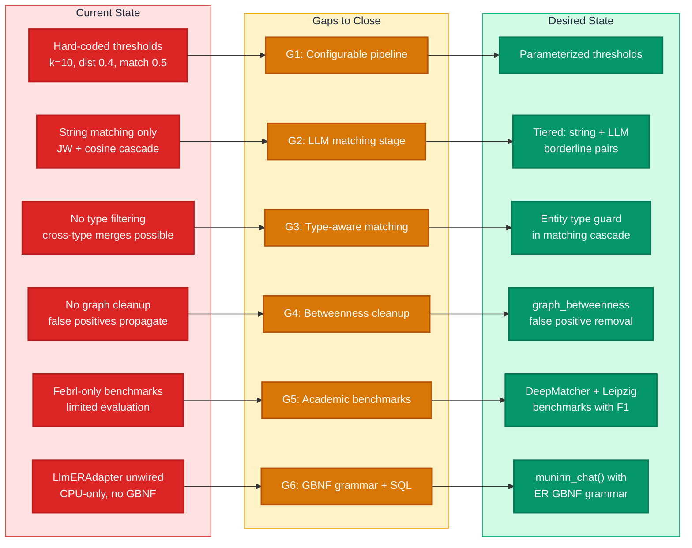
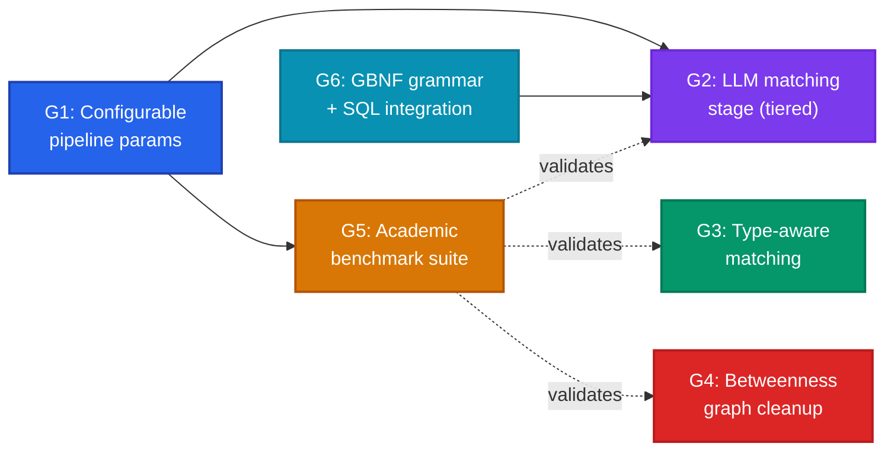

# Entity Resolution: Gap Analysis

## Overview

Gap analysis for upgrading the entity resolution (ER) subsystem in the muninn SQLite extension ecosystem. With the integration of `muninn_chat` (LLM inference via llama.cpp with GBNF grammar-constrained generation), we now have access to SOTA approaches for entity resolution that go beyond the current embedding-similarity + string-matching pipeline.

This document maps the current implementation, surveys SOTA ER techniques from the academic literature, identifies the gaps, and defines a plan to adopt the best tradeoff of speed and quality — validated against real-world academic benchmarks with F1, precision, and recall metrics.

**Scope:** The ER pipeline used by `demo_builder` and `sessions_demo` (Phase 8 of 12), plus the benchmark harness's `kg_resolve.py`. The C extension (`src/`) is in scope only for new SQL functions or GBNF grammars needed by the upgraded pipeline.

## Current State

The current ER implementation is a three-stage pipeline: **HNSW blocking** (embedding-based candidate generation), **string similarity matching cascade**, and **Leiden community clustering**. It exists in two concrete implementations that are nearly identical but diverge on canonical selection strategy.

### Architecture

```mermaid
flowchart LR
    subgraph Inputs
        EVM["entity_vec_map<br/>(name-to-rowid)"]:::sourcePrimary
        EVT["entities_vec<br/>(HNSW VT, cosine)"]:::sourcePrimary
        ENT["entities<br/>(name, type, mentions)"]:::sourceSecondary
        REL["relations<br/>(src, dst, rel_type, weight)"]:::sourceSecondary
    end

    subgraph Stage1["Stage 1: HNSW Blocking"]
        KNN["KNN search per entity<br/>k=10, distance &lt;= 0.4"]:::transformPrimary
        DEDUP["Deduplicate pairs<br/>(lexicographic sort)"]:::transformSecondary
    end

    subgraph Stage2["Stage 2: Matching Cascade"]
        EXACT["Exact match: 1.0"]:::orchPrimary
        ICASE["Case-insensitive: 0.9"]:::orchPrimary
        COMBO["0.4*JW + 0.6*cosine_sim<br/>threshold &gt; 0.5"]:::orchPrimary
    end

    subgraph Stage3["Stage 3: Leiden Clustering"]
        EDGES["_match_edges<br/>(bidirectional weighted)"]:::loadSecondary
        LEIDEN["graph_leiden TVF"]:::loadPrimary
        CANON["Canonical selection<br/>(max mention count)"]:::loadPrimary
    end

    subgraph Outputs
        EC["entity_clusters<br/>(name -> canonical)"]:::dataPrimary
        NODES["nodes<br/>(canonical entities)"]:::dataPrimary
        COALESCE["edges<br/>(coalesced relations)"]:::dataPrimary
    end

    EVM --> KNN
    EVT --> KNN
    KNN --> DEDUP
    DEDUP --> EXACT
    EXACT --> ICASE
    ICASE --> COMBO
    COMBO --> EDGES
    EDGES --> LEIDEN
    LEIDEN --> CANON
    ENT --> CANON
    CANON --> EC
    EC --> NODES
    EC --> COALESCE
    REL --> COALESCE

    classDef sourcePrimary     fill:#d97706,stroke:#b45309,color:#fff,stroke-width:2px
    classDef sourceSecondary   fill:#fde68a,stroke:#f59e0b,color:#1e293b,stroke-width:1px
    classDef transformPrimary  fill:#ea580c,stroke:#c2410c,color:#fff,stroke-width:2px
    classDef transformSecondary fill:#fed7aa,stroke:#f97316,color:#1e293b,stroke-width:1px
    classDef orchPrimary       fill:#4f46e5,stroke:#4338ca,color:#fff,stroke-width:2px
    classDef loadPrimary       fill:#059669,stroke:#047857,color:#fff,stroke-width:2px
    classDef loadSecondary     fill:#a7f3d0,stroke:#10b981,color:#1e293b,stroke-width:1px
    classDef dataPrimary       fill:#0d9488,stroke:#0f766e,color:#fff,stroke-width:2px

    style Inputs fill:#fef3c7,stroke:#f59e0b,color:#1e293b
    style Stage1 fill:#fff7ed,stroke:#f97316,color:#1e293b
    style Stage2 fill:#e0e7ff,stroke:#6366f1,color:#1e293b
    style Stage3 fill:#d1fae5,stroke:#10b981,color:#1e293b
    style Outputs fill:#ccfbf1,stroke:#14b8a6,color:#1e293b
```



### Implementation Details

**Production pipeline** (`benchmarks/demo_builder/phases/entity_resolution.py`):

| Stage | Algorithm | Parameters | Complexity |
|-------|-----------|------------|------------|
| Blocking | HNSW KNN per entity | k=10, cosine_dist <= 0.4 | O(N * k * log N) |
| Matching | Exact -> case-insensitive -> 0.4\*JW + 0.6\*cosine | threshold > 0.5 | O(candidate_pairs) |
| Clustering | Leiden on bidirectional match edges | default resolution | O(E * log N) |
| Canonical | `max(members, key=mention_count)` | - | O(cluster_size) |

All parameters are hard-coded constants (not configurable). The blocking loop issues one KNN query per entity sequentially — for a corpus with 5,000 unique entities, this is 5,000 SQL round-trips.

**Benchmark harness** (`benchmarks/harness/treatments/kg_resolve.py:94-224`):

The `_run_er_pipeline()` function is a parameterized version of the same algorithm with `k_neighbors`, `cosine_threshold`, and `match_threshold` as function arguments. However, **canonical selection diverges**: it uses `sorted(members)[0]` (first alphabetically) instead of `max(mention_count)`, because the harness lacks NER mention count data.

**LlmERAdapter** (`kg_resolve.py:227-333`):

An isolated design sketch using `llama-cpp-python` (Python binding, not the muninn SQL extension). It calls `create_chat_completion()` with a JSON schema response format asking the model to group candidates into merge groups. **Not wired into any pipeline or benchmark.** Limitations:
- `n_gpu_layers=0` (CPU-only, even on macOS with Metal)
- No batch support — one LLM call per candidate group
- Returns `list[list[str]]` (merge groups), not the `dict[str, str]` canonical map the pipeline expects
- No GBNF grammar — relies on llama-cpp-python's `response_format` (separate from muninn's grammar infrastructure)

**Benchmark evaluation** (`benchmarks/harness/treatments/kg_metrics.py`):

Two metrics are implemented:
- `_pairwise_f1()` — precision/recall over all entity pairs
- `bcubed_f1()` — per-element cluster quality (preferred for clustering-based ER)

The Febrl benchmark mode (`_run_er_dataset`) loads parquet data, derives ground truth from Febrl record IDs (`rec-N-org` and `rec-N-dup-M` with same N = same cluster), and evaluates with both metrics.

### Known Limitations

1. **No type filtering.** "London" (location) and "London" (person) can merge if embedding/string similarity is high enough. No `entity_type` guard exists.
2. **Lossy type aggregation.** When building canonical stats, the entity type is taken from the first row encountered. If "Tesla" appears as both "organization" and "product," one type is silently dropped.
3. **O(N) sequential HNSW queries.** The blocking stage is the dominant cost — no bulk ANN scan.
4. **Hard-coded thresholds.** The demo_builder phase exposes no configuration for k, distance threshold, or match threshold.
5. **Duplicate Jaro-Winkler.** `common.py:105` and `kg_resolve.py:33` are identical pure-Python implementations.
6. **Non-incremental by design.** Every re-run drops and rebuilds all output tables from scratch.
7. **No LLM integration.** The `LlmERAdapter` exists but is unwired. No `muninn_chat()`-based ER path exists.
8. **No ER-specific GBNF grammar.** The extension has grammars for NER, RE, and NER+RE but nothing for ER match/no-match decisions or merge group output.

## Desired State

A hybrid ER pipeline that uses the existing HNSW blocking and Leiden clustering infrastructure but replaces the brittle string-matching cascade with an **LLM-augmented matching stage** — using `muninn_chat()` with GBNF grammar-constrained generation for borderline pairs. Validated against academic benchmarks with measurable F1 improvements.

### Target Architecture

```mermaid
flowchart LR
    subgraph Inputs
        EVM["entity_vec_map"]:::sourcePrimary
        EVT["entities_vec (HNSW)"]:::sourcePrimary
        ENT["entities"]:::sourceSecondary
        REL["relations"]:::sourceSecondary
    end

    subgraph Stage1["Stage 1: HNSW Blocking"]
        KNN["KNN search<br/>k configurable"]:::transformPrimary
        DEDUP["Deduplicate pairs"]:::transformSecondary
    end

    subgraph Stage2["Stage 2: Tiered Matching"]
        EXACT["Tier 1: Exact/case-insensitive<br/>score = 1.0 / 0.9"]:::orchPrimary
        STRING["Tier 2: String similarity<br/>JW + cosine combined"]:::orchPrimary
        LLM["Tier 3: LLM verification<br/>muninn_chat() + GBNF<br/>borderline pairs only"]:::llmAccent
    end

    subgraph Stage3["Stage 3: Clustering + Cleanup"]
        EDGES["Match edges (weighted)"]:::loadSecondary
        LEIDEN["graph_leiden TVF"]:::loadPrimary
        BETWEEN["graph_betweenness TVF<br/>false-positive edge removal"]:::danger
        CANON["Canonical selection<br/>(configurable strategy)"]:::loadPrimary
    end

    subgraph Outputs
        EC["entity_clusters"]:::dataPrimary
        NODES["nodes"]:::dataPrimary
        COALESCE["edges"]:::dataPrimary
    end

    EVM --> KNN
    EVT --> KNN
    KNN --> DEDUP
    DEDUP --> EXACT
    EXACT --> STRING
    STRING --> LLM
    LLM --> EDGES
    EDGES --> LEIDEN
    LEIDEN --> BETWEEN
    BETWEEN --> CANON
    ENT --> CANON
    CANON --> EC
    EC --> NODES
    EC --> COALESCE
    REL --> COALESCE

    classDef sourcePrimary     fill:#d97706,stroke:#b45309,color:#fff,stroke-width:2px
    classDef sourceSecondary   fill:#fde68a,stroke:#f59e0b,color:#1e293b,stroke-width:1px
    classDef transformPrimary  fill:#ea580c,stroke:#c2410c,color:#fff,stroke-width:2px
    classDef transformSecondary fill:#fed7aa,stroke:#f97316,color:#1e293b,stroke-width:1px
    classDef orchPrimary       fill:#4f46e5,stroke:#4338ca,color:#fff,stroke-width:2px
    classDef llmAccent         fill:#7c3aed,stroke:#6d28d9,color:#fff,stroke-width:3px
    classDef loadPrimary       fill:#059669,stroke:#047857,color:#fff,stroke-width:2px
    classDef loadSecondary     fill:#a7f3d0,stroke:#10b981,color:#1e293b,stroke-width:1px
    classDef dataPrimary       fill:#0d9488,stroke:#0f766e,color:#fff,stroke-width:2px
    classDef danger            fill:#dc2626,stroke:#b91c1c,color:#fff,stroke-width:2px

    style Inputs fill:#fef3c7,stroke:#f59e0b,color:#1e293b
    style Stage1 fill:#fff7ed,stroke:#f97316,color:#1e293b
    style Stage2 fill:#e0e7ff,stroke:#6366f1,color:#1e293b
    style Stage3 fill:#d1fae5,stroke:#10b981,color:#1e293b
    style Outputs fill:#ccfbf1,stroke:#14b8a6,color:#1e293b
```



### Key Design Decisions Informed by Literature

**1. LLM for borderline pairs only (not all pairs)**

The MatchGPT study (Peeters & Bizer, EDBT 2025) shows GPT-4 achieves 76-98% F1 across six benchmarks; GPT-4o runs at ~0.5s/pair. But calling the LLM for every candidate pair is prohibitively expensive. GoldenMatch (2025) demonstrates that using LLM scoring only for borderline pairs (where string similarity is ambiguous, e.g. combined score 0.4-0.7) boosted product matching F1 from 44.5% to 66.3% for $0.04 total cost. This is the pattern to adopt.

Source: [MatchGPT (arXiv:2310.11244)](https://arxiv.org/abs/2310.11244), [GoldenMatch (GitHub)](https://github.com/benzsevern/goldenmatch)

**2. In-context clustering over pairwise matching**

LLM-CER (ACM SIGMOD 2026) shows that grouping ~9 candidate records and asking the LLM to cluster them in one call reduces API calls by up to 5x while achieving up to 150% higher accuracy than pairwise baselines. This maps naturally to muninn's architecture: HNSW blocking produces groups of nearby entities that can be presented as a single LLM prompt.

Source: [LLM-CER (arXiv:2506.02509, SIGMOD 2026)](https://arxiv.org/abs/2506.02509)

**3. Graph cleanup via edge betweenness**

GraLMatch (EDBT 2025) addresses the false positive transitivity problem — a single false match edge can merge large groups of unrelated entities. Their solution: compute edge betweenness centrality on the match graph and remove high-betweenness bridge edges before clustering. The `graph_betweenness` TVF already exists in muninn.

Source: [GraLMatch (arXiv:2406.15015)](https://arxiv.org/abs/2406.15015)

**4. GBNF grammar for ER output**

The extension already uses GBNF grammars for NER/RE (`src/llama_constants.h`). An ER-specific grammar guaranteeing well-formed JSON output (e.g., `{"match": true, "confidence": 0.95}` for pairwise, or `{"groups": [[...], ...]}` for in-context clustering) is a natural extension. Grammar-constrained decoding for structured tasks is well-established (arXiv:2305.13971).

**5. Academic benchmark datasets**

The DeepMatcher/Magellan benchmark suite (University of Wisconsin) is the standard for ER evaluation. Key datasets ordered by difficulty:

| Dataset | Domain | Pairs | Type | SOTA F1 |
|---------|--------|-------|------|---------|
| DBLP-ACM | Citations | 12,363 | Structured | ~98-99% |
| Abt-Buy | Products | 9,575 | Textual | ~90-96% |
| DBLP-Scholar | Citations | 28,707 | Structured | ~90-96% |
| Walmart-Amazon | Electronics | 10,242 | Structured | ~86-90% |
| Amazon-Google | Software | 11,460 | Structured | ~73-76% |

Source: [DeepMatcher Datasets (GitHub)](https://github.com/anhaidgroup/deepmatcher/blob/master/Datasets.md)

Additionally, the Leipzig Entity Clustering datasets provide clustering-specific benchmarks (MusicBrainz 20K/200K/2M) that align with Leiden-based evaluation using B-Cubed F1.

Source: [Leipzig ER Benchmarks](https://dbs.uni-leipzig.de/research/projects/benchmark-datasets-for-entity-resolution)

**6. B-Cubed F1 as primary metric**

B-Cubed F1 is the preferred metric for cluster-based ER (already implemented in `kg_metrics.py`). It penalizes both over-merging (precision) and under-splitting (recall) at the element level. Pairwise F1 is reported as secondary.

## Gap Analysis

### Gap Map



### Dependencies



**Recommended implementation order:** G1 -> G3 -> G6 -> G5 -> G2 -> G4

### G1: Configurable Pipeline Parameters

**Current:** All thresholds are hard-coded in `PhaseEntityResolution`. The harness's `_run_er_pipeline()` exposes them as function args but the demo_builder does not.

**Gap:** Expose `k_neighbors`, `cosine_threshold`, `match_threshold`, and `canonical_strategy` as constructor parameters of `PhaseEntityResolution`. Default values remain the same (backward-compatible). This is a prerequisite for G2 and G5 — you cannot benchmark different configurations without parameterization.

**Output(s):**
- Modified `benchmarks/demo_builder/phases/entity_resolution.py` (Python) — `PhaseEntityResolution.__init__()` accepts `k_neighbors`, `cosine_threshold`, `match_threshold`, `canonical_strategy` kwargs with current defaults
- Modified `benchmarks/demo_builder/common.py` (Python) — remove `jaro_winkler()` at line 105
- Modified `benchmarks/harness/common.py` (Python) — single canonical `jaro_winkler()` imported by both demo_builder and harness
- Modified `benchmarks/harness/treatments/kg_resolve.py` (Python) — remove duplicate `_jaro_winkler()` at lines 33-83, import from common

**References:**

Current hard-coded parameters in `entity_resolution.py`:
```python
# Line 74: blocking
neighbors = conn.execute(
    "SELECT rowid, distance FROM entities_vec WHERE vss_search(embedding, ?) LIMIT 10",  # k=10
    (vec,),
).fetchall()

# Lines 127-130: matching cascade
jw = jaro_winkler(n1.lower(), n2.lower())
combined = 0.4 * jw + 0.6 * cosine_sim  # hard-coded weights
if combined > 0.5:                        # hard-coded threshold
```

Parameterized version already exists in `kg_resolve.py:94-114`:
```python
def _run_er_pipeline(
    conn, entity_names, entity_vectors,
    k_neighbors: int = 10,
    cosine_threshold: float = 0.4,
    match_threshold: float = 0.5,
) -> dict[str, str]:
```

### G2: LLM-Augmented Matching Stage (Tiered)

**Current:** Matching is purely string-based (exact -> case-insensitive -> JW + cosine). The `LlmERAdapter` exists but is unwired, CPU-only, and uses llama-cpp-python instead of `muninn_chat()`.

**Gap:** Add a third tier to the matching cascade that routes **borderline pairs** (combined score between a low and high threshold, e.g., 0.4-0.7) to `muninn_chat()` with an ER-specific GBNF grammar. High-confidence matches and rejects from tiers 1-2 skip the LLM entirely.

**Design options:**
- ~~**Pairwise mode:** One `muninn_chat()` call per borderline pair.~~ **Rejected (2026-03-28):** 8-11x more LLM calls for equal or worse F1. See ADR: Grammar Format.
- **In-context clustering mode (selected):** Group borderline candidates by connected component (capped at ~20 entities), one `muninn_chat()` call per component. Empirically confirmed 11.5x fewer calls than pairwise at equal or higher F1.

**Output(s):**
- Modified `benchmarks/demo_builder/phases/entity_resolution.py` (Python) — new LLM matching tier inserted into the cascade at lines 108-132, routing borderline pairs (combined score 0.4-0.7) to `muninn_chat()`
- Modified `benchmarks/harness/treatments/kg_resolve.py` (Python) — retire `LlmERAdapter` class (lines 227-334) in favor of `muninn_chat()` SQL calls via the extension
- New or modified GBNF grammar string (Python constant or from `src/llama_constants.h`) for ER match/cluster output

**References:**

Current `LlmERAdapter.should_merge()` pattern (kg_resolve.py:252-329) — to be replaced:
```python
def should_merge(self, candidates: list[str]) -> list[list[str]]:
    # Uses llama-cpp-python create_chat_completion() with response_format
    # Returns merge groups: [["NYC", "New York City"], ["London"]]
```

Target pattern using `muninn_chat()` SQL function:
```python
# Single SQL call per candidate group
result = conn.execute(
    "SELECT muninn_chat(?, ?, ?, ?)",
    (model_name, prompt, gbnf_grammar, max_tokens),
).fetchone()[0]
# result is grammar-constrained JSON, e.g. {"groups": [["NYC", "New York City"], ["London"]]}
```

#### ADR: Grammar Format — Cluster Only (decided 2026-03-28)

| Format | Description | Status | Rationale |
|--------|-------------|--------|-----------|
| Format A — Pairwise | `{"match": true, "confidence": 0.95}` per pair | **Rejected** | 8-11x more LLM calls for equal or worse F1. All models underperform in pairwise mode — the format itself is the problem, not the models. |
| **Format B′ — Cluster (numbered)** | `{"groups": [[1, 3], [2]]}` per component | **Selected** | Fewer calls, better F1, transitive consistency built-in |

**Benchmark evidence (Abt-Buy, pairwise vs cluster, 1000 entities):**

| Pipeline | Best Model | B³ F1 | Delta | LLM Calls | Time |
|----------|-----------|-------|-------|-----------|------|
| string-only | - | 0.461 | - | 0 | 9s |
| pairwise | Qwen3.5-4B | 0.568 | +0.108 | 816 | 953s |
| **cluster** | **Qwen3.5-4B** | **0.581** | **+0.120** | **71** | **243s** |

Cluster achieves higher F1 with **11.5x fewer LLM calls** and **3.9x less wall time**. The connected-component batching sends one LLM call per component rather than one per pair.

**Why pairwise was rejected (not the models):** Pairwise mode makes independent per-pair decisions without transitive context. This leads to inconsistent results (A≈B, B≈C, but A≠C) and requires many more LLM calls for worse quality. Every model tested produced better results in cluster mode — the format itself is the bottleneck. Models that appeared "harmful" in pairwise (e.g., Gemma-3-4B at -0.007) performed competitively in cluster mode (+0.050).

**Known limitation:** Large components (>20 entities) can exceed the model's reliable generation length, causing truncated JSON output. G2 implementation must cap component size (split oversized components before sending to LLM).

**Pairwise format is retained** only in the grammar-debug subcommands for diagnostic purposes. It is excluded from the production pipeline and the `compare` permutation matrix.

#### ADR: Default Chat Model — Qwen3.5-4B (revised 2026-03-28)

Model evaluation based on **cluster format only** (pairwise rejected — see above).

**Cluster-mode B³ F1 delta vs string-only baseline:**

| Model | @100 | @500 | @1000 | Size | Notes |
|-------|------|------|-------|------|-------|
| **Qwen3.5-4B** | +0.023 | **+0.101** | **+0.120** | 2.7 GB | Highest delta at scale, consistent across all tiers |
| Gemma-3-1B | - | - | +0.095 | 0.8 GB | Strong value/size ratio (3.4x smaller than 4B for 79% of the delta) |
| Qwen3.5-2B | +0.016 | +0.067 | +0.090 | 1.3 GB | Reliable mid-tier option |
| Gemma-3-4B | **+0.025** | +0.035 | +0.050 | 2.5 GB | Wins at small scale (@100), trails at larger scales; some parse failures |

| Candidate | Status | Rationale |
|-----------|--------|-----------|
| Qwen3.5-0.8B | Rejected | Thinking loops, unreliable structured output (from `examples/llm_extract/` testing) |
| Qwen3.5-2B | Reserve | Solid +0.090 @1000, reliable. Good default for resource-constrained environments |
| **Qwen3.5-4B** | **Selected** | Highest B³ F1 delta at every scale tested. The quality leader |
| Gemma-3-1B | Reserve | Best delta-per-GB ratio. Consider for constrained environments or as speed-optimised alternative |
| Gemma-3-4B | Reserve | Competitive at small scale, trails at 500+. Parse failures on large components need investigation |

**Why Qwen3.5-4B:** Only model with the highest cluster delta at every scale (100, 500, 1000). At 1000 entities: +0.120 B³ F1 in 243s with 71 LLM calls.

**Why not dismiss Gemma:** In cluster mode, all Gemma variants produce positive deltas. Gemma-3-1B at 0.8 GB achieves +0.095 — within 79% of Qwen3.5-4B's delta at 30% of the model size. The negative pairwise results were a property of the pairwise format, not the model.

#### ADR: Hybrid Tuning Strategy — String-First, LLM-Minimal (decided 2026-03-28)

The benchmark data reveals that **string-only is fast and surprisingly competitive** — the precision bottleneck comes from the score floor problem (hard-coded thresholds), not from the absence of LLM. The hybrid strategy is:

1. **G1 priority: tune string-only thresholds first.** Lower `dist_threshold` and raise `match_threshold` to fix the score floor.
2. **G2: LLM only for the residual fringe.** After threshold tuning, the LLM cluster tier handles only the truly ambiguous pairs that better string matching cannot resolve.
3. **G4: betweenness cleanup as safety net.** Prunes any remaining false-positive bridge edges that slip through both string matching and LLM.

#### ADR: Default Pipeline Parameters — dist=0.15, mt=0.90 (validated 2026-03-28)

Grid search over 270 string-only permutations (3 datasets × 3 k × 6 dist × 5 mt at limit=500) identified optimal defaults:

| Parameter | Old Default | **New Default** | Rationale |
|-----------|-------------|-----------------|-----------|
| `dist_threshold` | 0.40 | **0.15** | The dominant lever. Lowering from 0.40→0.15 eliminates ~85% of false-positive candidate pairs. At dist=0.40, ALL pairs passed the cascade (score floor problem). At dist=0.15, only genuinely similar entities enter the candidate set. |
| `match_threshold` (llm_high) | 0.50 (0.70) | **0.90** | At tight blocking (dist=0.15), most candidates are genuine matches. mt=0.90 filters the remaining noise without hurting recall. |
| `k` | 10 | **10** (unchanged) | k has negligible impact when dist is tight. k=5 vs k=20 produces <0.002 B³ F1 difference. |

**Grid search results (string-only, limit=500, best config per dataset):**

| Dataset | Old B³ F1 | **New B³ F1** | Δ | Δ% | Config |
|---------|-----------|---------------|---|-----|--------|
| Abt-Buy | 0.654 | **0.799** | +0.146 | +22% | k=5 dist=0.15 mt=0.90 |
| Amazon-Google | 0.853 | **0.973** | +0.120 | +14% | k=10 dist=0.10 mt=0.90 |
| DBLP-ACM | 0.937 | **0.993** | +0.056 | +6% | k=10 dist=0.10 mt=0.90 |

**Key finding: tuned string-only (+0.146 on Abt-Buy) outperforms LLM-cluster with old defaults (+0.120 on Abt-Buy).** The LLM tier was compensating for bad thresholds, not providing genuine semantic discrimination. With proper thresholds, the LLM tier's marginal value is the residual: pairs that tight blocking + high threshold still can't resolve.

**Impact on G2:** The LLM tier's value proposition changes. With dist=0.15, the candidate set is small (~230 pairs at 500 entities vs ~1,340 with old defaults). The borderline zone (llm_low to llm_high) will contain far fewer pairs, meaning the LLM tier fires rarely but must earn its place by improving the already-high baseline.

#### ADR: LLM Marginal Value — ROI-Based Stopping (validated 2026-03-28)

Fine-grained diminishing returns analysis (0.01 step increments of `llm_low` from `llm_high` downward, Qwen3.5-4B, full datasets) quantifies the LLM tier's marginal value with tuned thresholds:

**MiniLM embeddings (dist=0.15, llm_high=0.90):**

| Dataset | Baseline B³ F1 | Peak LLM B³ F1 | Δ | LLM Calls | Time | Verdict |
|---------|---------------|----------------|---|-----------|------|---------|
| Abt-Buy | 0.662 | 0.694 (lo=0.82) | +0.032 | 255 | 503s | Marginal gain, high cost |
| Amazon-Google | 0.807 | — | -0.006 at first step | 121 | 216s | **LLM actively harmful** |
| DBLP-ACM | 0.955 | 0.956 (lo=0.84) | +0.001 | 62 | 128s | Negligible |

**Nomic embeddings (dist=0.03, llm_high=0.95):**

| Dataset | Baseline B³ F1 | Peak LLM B³ F1 | Δ | LLM Calls | Time | Verdict |
|---------|---------------|----------------|---|-----------|------|---------|
| Abt-Buy | 0.658 | 0.685 (lo=0.89) | +0.027 | 197 | 374s | Similar to MiniLM |
| Amazon-Google | 0.824 | — | -0.002 at first step | 88 | 194s | **LLM actively harmful** |

**Key insight:** On Abt-Buy, ~80% of the LLM gain comes from the first 2 steps (lo=0.94→0.93 with Nomic: +0.019 F1 from 164 calls). Below lo=0.90, the curve goes completely flat — no new borderline pairs enter the zone. On Amazon-Google, the Qwen3.5-4B model consistently makes worse ER decisions than the string cascade, adding false positives on every LLM step tested.

**Stopping criterion:** The search used "3 consecutive F1 drops" which was fragile — Amazon-Google oscillated around zero without triggering clean drops. The correct stopping criterion is **ROI-based**:

```
ROI = ΔF1 / Δ(LLM_calls)
Stop when ROI < 0.0001 per call AND absolute ΔF1 < 0.002 per step
```

This directly encodes "the LLM must earn its cost." Example from Abt-Buy Nomic:
- lo=0.93: ΔF1=0.011 / 49 calls = 0.00022/call → **continue** (good ROI)
- lo=0.91: ΔF1=0.001 / 10 calls = 0.0001/call → **stop** (marginal ROI, tiny absolute gain)

**Production recommendation:** String-only with tuned thresholds is the default. LLM tier is opt-in and dataset-dependent — only beneficial on Abt-Buy-like corpora with noisy product names, and even then the gain (+0.03 F1) may not justify ~5 minutes of inference.

#### ADR: Embedding Model — MiniLM vs Nomic Embed (validated 2026-03-28)

Nomic Embed v1.5 (768d, 140MB, `"clustering: "` prefix) compared against MiniLM (384d, 25MB, no prefix) across 3 datasets with per-model dist threshold tuning:

**At each model's optimal thresholds (full datasets):**

| Dataset | MiniLM (dist=0.15, mt=0.90) | Nomic (dist=0.03, mt=0.95) | Δ | Winner |
|---------|---------------------------|--------------------------|---|--------|
| Abt-Buy | 0.662 (P=0.74, R=0.60) | 0.668 (P=0.72, R=0.62) | +0.006 | Nomic (marginal) |
| Amazon-Google | 0.807 (P=0.82, R=0.79) | **0.824** (P=0.88, R=0.78) | **+0.018** | **Nomic** |
| DBLP-ACM | **0.955** (P=0.97, R=0.94) | 0.954 (P=0.96, R=0.95) | -0.001 | Tie |

**Critical finding: each embedding model needs its own `dist_threshold`.** At the same dist=0.15, Nomic generates 4-6x more candidate pairs (12,452 vs 2,661 on Abt-Buy) because the `"clustering: "` prefix makes the embedding space denser. Nomic's optimal dist is 0.03 — an order of magnitude tighter than MiniLM's 0.15.

**Recall advantage:** Nomic consistently finds more true matches (+2-4% recall). The `"clustering: "` prefix optimises the embedding space for grouping similar items, placing reformulated product names closer together. This addresses the #1 FN failure mode (67% of Abt-Buy FNs missed by MiniLM's blocker).

**Production recommendation:** Use Nomic for Amazon-Google-like corpora (short, abbreviated product titles). MiniLM is simpler and nearly as effective for academic titles (DBLP-ACM) and long product names (Abt-Buy). The 6x model size difference (140MB vs 25MB) favours MiniLM for resource-constrained deployments.

#### ADR: FP/FN Failure Mode Analysis (2026-03-28)

Error analysis on all 3 datasets (string-only, MiniLM, dist=0.15, mt=0.90, limit=500) reveals three systematic failure modes:

**Pattern 1 — Near-identical product variants (FP, all datasets):**
Products sharing brand + category + most of the model number but differing in a digit/suffix score >0.90 on both cosine and JW. Examples: `panasonic kxts108w` ≠ `kxts208w`, `sony vctr100` ≠ `vctr640`. **No string matcher can distinguish these — requires product knowledge or structured model-number parsing.**

**Pattern 2 — Same product, different naming conventions (FN, Abt-Buy + Amazon-Google):**
True matches where the blocker never generates the candidate pair because embeddings are too far apart. Examples: `sony turntable pslx350h` ≈ `sony ps-lx350h belt-drive turntable`, `quickbooks pos pro multistore 6.0` ≈ `qb pos 6.0 pro multi store sw`. **98 of 146 Abt-Buy FNs (67%) never entered the candidate set.** This is the embedding model's recall limit.

**Pattern 3 — Generic/shared titles (FP, DBLP-ACM):**
Papers with identical generic titles that are different papers: `editor's notes` ≈ `editor's notes` (different journal issues), `report on the 8th intl workshop...` ≈ `report on the 5th intl workshop...`. **The title alone is insufficient — needs venue/year/author disambiguation (covered by G3 type-aware matching).**

**Quantified per dataset:**

| Dataset | FP | FN | FN in candidates | FN missed by blocker | Blocking recall |
|---------|----|----|-----------------|---------------------|----------------|
| Abt-Buy | 90 | 146 | 48 (33%) | **98 (67%)** | 33% |
| Amazon-Google | 32 | 4 | 0 (0%) | **4 (100%)** | 0% |
| DBLP-ACM | 9 | 1 | 1 (100%) | 0 (0%) | 100% |

**Implication for G1-G4:**
- **G1:** Threshold tuning addresses Pattern 1 FPs (raise mt) and Pattern 2 FNs partially (lower dist to widen blocker). Fully addressing Pattern 2 requires a better embedding model (→ Nomic) or concatenating name+description for richer embeddings.
- **G3:** Type-aware matching would eliminate Pattern 3 FPs (generic titles with different entity types).
- **G4:** Betweenness cleanup addresses transitive FPs (5 FPs on Abt-Buy had `cos=? jw=?` — merged via Leiden transitivity, not direct score).

#### ADR: Methodology Reset — Full-Dataset Only, Unified Pipeline, Brute-Force Exploration (2026-03-30)

**Problem:** Early grid searches optimised on `--limit 500` subsamples. Full-dataset results were materially worse (Abt-Buy: 0.799 at limit=500 → 0.668 at full). Subsample optimisation produced overly optimistic parameters that didn't transfer to full scale. Additionally, the string-only and llm-cluster pipelines were tested separately, obscuring the interaction between threshold tuning and LLM augmentation.

**Decision:** All future trials run on **full benchmark datasets only**. The string-only pipeline is retired as a separate path — the llm-cluster pipeline subsumes it (setting `llm_low=llm_high` disables LLM processing, making it functionally identical to string-only). This gives a single unified pipeline with 4 tunable parameters that can be explored as a coherent parameter space.

**Exploration strategy — layered parameter sweep:**

Each parameter is explored from its "disabled" extreme, progressively enabling one dimension at a time:

| Layer | Parameter | Range | Step | "Disabled" Value | What it controls |
|-------|-----------|-------|------|-----------------|-----------------|
| 1 | `dist_threshold` | 0.05 – 0.40 | 0.05 | N/A (always needed) | HNSW blocking radius — how many candidate pairs enter the pipeline |
| 2 | `jw_weight` | 1.0 – 0.0 | 0.05 | 1.0 (pure lexicographic) | Balance of Jaro-Winkler (string) vs cosine (semantic) in combined score |
| 3 | `llm_high` | 1.0 – 0.80 | 0.01 | 1.0 (nothing auto-accepted) | Match threshold — pairs above this score are accepted without LLM |
| 4 | `borderline_delta` | 0.0 – 0.20 | 0.01 | 0.0 (no borderline zone) | LLM window width — `llm_low = llm_high - borderline_delta` |

**Rationale for exploration order:**
1. **dist_threshold first:** Controls candidate generation — everything downstream depends on which pairs enter the pipeline. No other parameter can recover pairs the blocker misses.
2. **jw_weight second:** Determines the scoring function applied to candidates. At jw_weight=1.0, scoring is pure string similarity (no embedding signal in the score — embeddings only used for blocking). At 0.0, scoring is pure cosine similarity. The optimal balance is an empirical question.
3. **llm_high third:** The acceptance threshold. At 1.0, nothing is auto-accepted (all pairs either go to LLM or are rejected). Lowering it progressively auto-accepts high-confidence pairs. Expected to show a log-normal response: rapid F1 gain as obvious matches get accepted, then long-tail degradation as weaker matches pollute clusters.
4. **borderline_delta last:** Controls how wide the LLM window is below llm_high. At delta=0.0, no LLM processing. At delta=0.20, pairs in a 20-point band below llm_high get LLM evaluation. This measures the marginal ROI of LLM intervention at each operating point.

**Key change from previous approach:** We no longer separately tune "string-only" and "llm-cluster" pipelines. The unified pipeline with `llm_low=llm_high` (delta=0) IS the string-only baseline at every threshold combination. Adding delta>0 measures the LLM's marginal value on top of that specific baseline.

**Embedding model:** NomicEmbed only (with `"clustering: "` prefix). MiniLM is retired from the exploration. Nomic showed equal or better recall on all datasets, and the `dist_threshold` sweep accounts for its different distance scale.

**Expected output:** A 4D parameter surface (visualised as 2D slices) showing B-Cubed F1 as a function of each parameter while holding others constant. This maps the entire tradespace and identifies the Pareto frontier of quality vs LLM cost.

### G3: Type-Aware Matching

**Current:** All entity types are matched uniformly. "London" (GPE) and "London" (PERSON) could be merged.

**Gap:** Add an optional type guard to the matching cascade: skip pairs where `entity_type_a != entity_type_b` (unless both are unknown/null). This is a precision improvement with zero cost.

**Output(s):**
- Modified `benchmarks/demo_builder/phases/entity_resolution.py` (Python) — type guard conditional inserted at line ~113 in the matching loop, before string/cosine scoring
- Modified `benchmarks/harness/treatments/kg_resolve.py` (Python) — same guard in `_run_er_pipeline()`, optional `type_map` parameter

**References:**

Type data is already loaded (entity_resolution.py:51):
```python
rows = conn.execute(
    "SELECT name, entity_type, count(*) as mention_count FROM entities GROUP BY name, entity_type"
).fetchall()
self._entity_name_to_type: dict[str, str] = {r[0]: r[1] for r in rows}
```

Guard insertion point (entity_resolution.py, inside the `for n1, n2, cosine_dist in unique_pairs:` loop at line 108):
```python
# Type guard — skip cross-type pairs (unless either is unknown/null)
t1 = self._entity_name_to_type.get(n1)
t2 = self._entity_name_to_type.get(n2)
if t1 and t2 and t1 != t2:
    continue
```

### G4: Graph Cleanup via Edge Betweenness

**Current:** Leiden clustering runs directly on all match edges. A single false positive edge can transitively merge large clusters.

**Gap:** After Leiden clustering, compute edge betweenness centrality on the match graph using the existing `graph_betweenness` TVF. Remove edges with betweenness above a threshold (bridge edges between incorrectly merged clusters). Re-cluster. GraLMatch (EDBT 2025) reports significant precision improvements with this technique.

**Output(s):**
- Modified `benchmarks/demo_builder/phases/entity_resolution.py` (Python) — post-Leiden cleanup step after line ~164: query `graph_betweenness` on `_match_edges`, remove high-betweenness bridge edges, re-run `graph_leiden`
- Modified `benchmarks/harness/treatments/kg_resolve.py` (Python) — same cleanup in `_run_er_pipeline()`, optional `betweenness_threshold` parameter

**References:**

Leiden clustering call (entity_resolution.py:157-164):
```python
leiden_results = conn.execute(
    "SELECT node, community_id FROM graph_leiden"
    " WHERE edge_table = '_match_edges'"
    "   AND src_col = 'src'"
    "   AND dst_col = 'dst'"
    "   AND weight_col = 'weight'"
).fetchall()
```

Post-Leiden betweenness cleanup pattern:
```python
# Compute edge betweenness on match graph
betweenness = conn.execute(
    "SELECT src, dst, centrality FROM graph_betweenness"
    " WHERE edge_table = '_match_edges'"
    "   AND src_col = 'src' AND dst_col = 'dst'"
    "   AND weight_col = 'weight'"
).fetchall()
# Remove bridge edges (high betweenness = false positive connectors)
for src, dst, bc in betweenness:
    if bc > betweenness_threshold:
        conn.execute("DELETE FROM _match_edges WHERE src=? AND dst=?", (src, dst))
# Re-cluster without false positive bridges
leiden_results = conn.execute("SELECT node, community_id FROM graph_leiden ...")
```

### G5: Academic Benchmark Suite

**Current:** Only Febrl datasets (personal name matching) via `_run_er_dataset()` in `kg_resolve.py:465-568`. No evaluation on product, citation, or text-heavy benchmarks. Metrics (`bcubed_f1` in `kg_metrics.py:81-131`, `_pairwise_f1` in `kg_resolve.py:571-615`) exist but are only exercised on Febrl data.

**Gap:** Add the **Abt-Buy** dataset (9,575 pairs, product descriptions, SOTA ~90-96% F1) as the primary benchmark. This is a textual/noisy dataset where string matching alone is weaker, making the LLM tier's contribution clearly measurable. DBLP-ACM may be added later as a secondary sanity check.

**Output(s):**
- New `examples/entity_resolution/` directory (does not exist yet)
- New `examples/entity_resolution/er_benchmark.py` (Python) — argparse CLI with three composable subcommands: `string-only`, `llm-tiered`, `compare`
- New `examples/entity_resolution/README.md` — usage examples and expected output
- Dataset cached in `tmp/er_benchmark/abt_buy/` after first download

**References:**

Composable CLI modes (each testable in isolation):
```bash
# Individual modes
uv run examples/entity_resolution/er_benchmark.py string-only --limit 100
uv run examples/entity_resolution/er_benchmark.py llm-tiered --limit 100
# Combined comparison
uv run examples/entity_resolution/er_benchmark.py compare --limit 100
```

Each mode independently: (1) downloads Abt-Buy (cached), (2) runs its ER pipeline variant, (3) reports pairwise F1, B-Cubed F1, precision, recall, and wall-clock latency. The `compare` mode composes both individual modes and adds the delta.

Logarithmic scale-up for fast iteration:

| Tier | Pairs | Purpose | Expected runtime |
|------|-------|---------|-----------------|
| `--limit 10` | 10 | Smoke test — schema, I/O, metric plumbing | < 1s |
| `--limit 100` | 100 | Algorithm correctness — verify blocking, matching, clustering produce sane F1 | ~seconds |
| `--limit 1000` | 1,000 | Performance profiling — LLM call count, latency breakdown, threshold tuning | ~minutes |
| (no limit) | 9,575 | Full evaluation — publishable F1 numbers for comparison to SOTA | ~minutes-tens of minutes |

Existing metrics to reuse:
```python
# kg_metrics.py:81 — primary metric
def bcubed_f1(predicted_clusters: dict[str, int], gold_clusters: dict[str, int]) -> dict[str, float]:
    """Compute B-Cubed F1 for clustering evaluation."""
    # Returns {"precision": float, "recall": float, "f1": float}

# kg_resolve.py:571 — secondary metric
def _pairwise_f1(predicted: dict[str, int], gold: dict[str, int]) -> dict[str, float]:
```

### G6: GBNF Grammar and SQL Integration

**Current:** No ER-specific GBNF grammar in `src/llama_constants.h` (existing grammars: `GBNF_NER` at line 35, `GBNF_RE` at line 44, `GBNF_NER_RE` at line 54). No `muninn_extract_matches()` or similar SQL function. The `LlmERAdapter` in `kg_resolve.py` uses llama-cpp-python's `response_format` instead of GBNF.

**Gap:** ~~Two grammar formats to evaluate empirically~~ **Resolved (2026-03-28):** Empirical evaluation via `examples/entity_resolution/er_benchmark.py` across 25 permutations (4 models × 2 formats × 4 scales) confirmed Format B′ (numbered cluster) as the clear winner. See ADR above. Pairwise format retained only in grammar-debug subcommands for diagnostics.

**Output(s):**
- New Python constants for ER GBNF grammars (Format A: pairwise, Format B: clustering) — defined in the benchmark script, not in `src/llama_constants.h` (Python-only prototyping phase)
- New subcommands in `examples/entity_resolution/er_benchmark.py` (Python) — 6 test configurations (2 formats x 3 debug tiers) as individual subcommands
- No C code changes — grammars passed as runtime strings to `muninn_chat()`

**References:**

#### Format A — Pairwise

```json
{"match": true, "confidence": 0.95}
```
- One LLM call per borderline pair, tiny output (< 20 tokens)
- Independent decisions — easy to debug, failure affects one pair
- Risk: no transitive consistency (A=B, B=C, but A≠C possible)

#### Format B — Clustering (SOTA-recommended)

```json
{"groups": [["NYC", "New York City"], ["London"]]}
```
- One LLM call per HNSW neighborhood (~9 candidates)
- ~5x fewer total calls (per LLM-CER findings)
- Holistic grouping — transitive consistency built-in
- Risk: larger output tokens, failure affects ~9 entities per bad call

#### Empirical evaluation plan

Both formats tested at three scales on Abt-Buy:

| Scale | Pairs | Purpose |
|-------|-------|---------|
| 10 | 10 | Grammar correctness — does Qwen3.5-2B produce valid JSON for each format? |
| 50 | 50 | Quality signal — pairwise F1 and B-Cubed F1 per format, compare to string-only baseline |
| 100 | 100 | Latency profile — total LLM time, calls/sec, output tokens per call |

#### Debug methodology (proven in `examples/llm_extract/`)

Three debug tiers per grammar format (6 total configurations):

1. **No grammar** — `muninn_chat(model, prompt)` — see raw LLM output, diagnose understanding
2. **With grammar** — `muninn_chat(model, prompt, grammar)` — validate grammar constrains correctly
3. **With grammar + one-shot** — add example in prompt if tier 2 fails — fix generation stalls

Existing GBNF pattern to follow (`src/llama_constants.h:29-41`):
```c
#define GBNF_COMMON_RULES \
    "string ::= \"\\\"\" [^\"\\\\]* \"\\\"\" \n" \
    "number ::= \"-\"? [0-9]+ (\".\" [0-9]+)? \n" \
    "ws     ::= \" \"? \n"

#define GBNF_NER \
    "root   ::= \"{\" ws ... "  // pattern for ER grammars to follow
```

## Success Measures

### Project Quality Bar (CI Gates)

These are the project's existing quality gates enforced in CI. All deliverables from this gap analysis must pass every applicable gate. This is the floor, not the ceiling.

| Gate | Command | Threshold | Applies to |
|------|---------|-----------|------------|
| C compilation | `make all` | Zero warnings (`-Wall -Wextra -Wpedantic -Werror -std=c11`) | Any C changes (GBNF grammars in `llama_constants.h`) |
| C unit tests | `make test` | 50% line coverage (gcovr), ASan+UBSan clean | Any C changes |
| C formatting | `make lint-c` | clang-format `--dry-run --Werror` on `src/*.c src/*.h test/*.c test/*.h` | Any C changes |
| Python linting | `make lint-python` | ruff rules `E,W,F,I,B,C4,UP`, 120-char lines | All Python deliverables |
| Python formatting | `make format-python` | ruff format | All Python deliverables |
| Python type checking | `make typecheck-python` | Strict mode (relaxed for `benchmarks.*` modules — no untyped defs/calls required) | All Python deliverables |
| Python test coverage | `make test-python` | **90% line coverage** (`--cov-fail-under=90`) | New/modified code in `sqlite_muninn/`, `pytests/` |
| demo_builder tests | `make -C benchmarks/demo_builder test` | All pass | Modified `PhaseEntityResolution`, consolidated `jaro_winkler` |
| Documentation | `make docs-build` | `mkdocs build --strict` (valid links) | If docs updated |

**Minimum pre-merge check:** `make ci` + `make -C benchmarks/demo_builder ci` + `make dist`

**Python conventions (enforced by ruff + code review):**
- No `unittest.mock`, `pytest-mock`, or `@patch` — test real code or skip the test
- All imports at module top level — no nested imports
- Use `pathlib` — never `os.path`
- Use `logging` — never `print()` for program output
- Type annotations on all public interfaces (benchmark modules may omit internal annotations)

### Domain-Specific Measures

1. **Benchmark example exists at `examples/entity_resolution/`** with three composable modes: `string-only`, `llm-tiered`, and `compare`. Each runs the Abt-Buy dataset and reports pairwise F1, B-Cubed F1, precision, recall, and wall-clock latency. Supports `--limit N` for logarithmic scale-up (10/100/1000/full). Individual modes must work in isolation; `compare` composes both.

2. **Measurable F1 improvement on at least one benchmark** when comparing the upgraded pipeline (with LLM matching tier) to the current string-only pipeline. The improvement must be statistically meaningful (not within measurement noise).

3. **demo_builder `PhaseEntityResolution` updated** to use the same upgraded pipeline. The phase must remain backward-compatible (string-only mode as default, LLM tier opt-in when a chat model is registered). Must pass `make -C benchmarks/demo_builder ci` including existing phase tests.

4. **B-Cubed F1 and pairwise F1 reported for all benchmark runs.** No ER evaluation that only reports node count reduction or singleton ratio — those are proxy metrics, not quality metrics.

5. **LLM calls are bounded.** The LLM matching tier fires only for borderline pairs (configurable threshold band). On a typical demo_builder corpus (~1,000 entities), LLM calls must number in the tens to low hundreds, not thousands.

6. **All published SOTA numbers cited in this document are traceable to verified sources.** Every claim of "X achieves Y F1 on Z dataset" must link to a paper or repository where that number appears.

7. **`PhaseEntityResolution` accepts configurable thresholds.** `k_neighbors`, `cosine_threshold`, `match_threshold`, and `canonical_strategy` are constructor parameters with backward-compatible defaults. The duplicate Jaro-Winkler implementation is consolidated into `benchmarks/harness/common.py` — one function, two importers.

8. **Type-aware matching prevents cross-type merges.** On a corpus with entities of different types sharing the same name (e.g., "London" as GPE and PERSON), the type guard prevents their merger. Testable on the benchmark suite by injecting synthetic cross-type pairs.

9. **Edge betweenness cleanup improves precision on at least one benchmark.** Comparing Leiden-only vs Leiden+betweenness-cleanup on the same dataset shows a measurable reduction in false-positive merges (higher B-Cubed precision) without significant recall loss.

## Negative Measures

### Quality Bar Violations

These Type 2 failures occur when the deliverables appear to work but silently violate the project's own quality standards.

1. **Tests pass but coverage drops.** New code in `entity_resolution.py` or `er_benchmark.py` is exercised by a single happy-path test but untested branches drop coverage below the 90% floor (`--cov-fail-under=90`). The CI gate catches this, but the signal is "tests pass locally" while the PR fails.

2. **Mocking the extension.** Tests use `unittest.mock` to patch `conn.execute()` or `muninn_chat()` instead of loading the real extension. Tests pass, but they test the mock, not the pipeline. The project explicitly forbids mocking.

3. **Implicit print debugging.** The benchmark script uses `print()` instead of `logging`. Output looks correct in the terminal but breaks structured log collection and violates the project's `logging`-only convention.

4. **Untyped benchmark code.** New functions in `benchmarks/demo_builder/phases/entity_resolution.py` omit type annotations, relying on the relaxed mypy override for `benchmarks.*`. The code works, but downstream consumers (the benchmark script, tests) lose type safety at call boundaries.

### Domain-Specific Failures

5. **Hollow benchmark.** The `examples/` script runs but uses a trivial dataset, toy thresholds, or skips the LLM tier — producing numbers that cannot be compared to published SOTA. This looks like success (script runs, metrics printed) but provides no signal about quality.

6. **Over-engineering the C extension.** Adding `muninn_match_entities()`, `muninn_cluster_entities()`, batch variants, and new virtual tables before validating the approach with a Python-only prototype using `muninn_chat()`. Premature C code is expensive to iterate on and creates rework.

7. **Graceful degradation of LLM tier.** The pipeline silently falls back to string-only matching when the LLM model is not loaded, logging a warning instead of raising an error. If the user configured LLM matching, failure to use it must be an error, not a silent downgrade.

8. **Threshold cargo-culting.** Copying thresholds from published papers (e.g., "GraLMatch uses betweenness cutoff X") without validating them on the project's own benchmark datasets. Every threshold must be empirically justified on at least one benchmark run.

9. **Citation hallucination.** Claiming "AnyMatch achieves 95% F1 on DBLP-ACM" without verifying this specific number exists in the paper. Unverified claims erode trust in the entire analysis.

10. **Unbounded LLM cost.** The LLM tier fires for all candidate pairs (not just borderline), turning a 2-second ER phase into a 20-minute LLM inference marathon. The tiered design exists specifically to avoid this — removing the tiering is a regression.

11. **Feature creep beyond ER.** Adding NER improvements, relation extraction changes, or embedding model upgrades as part of this ER work. Each of those is a separate initiative with its own gap analysis. Bundling them creates rework when any single piece needs revision.
