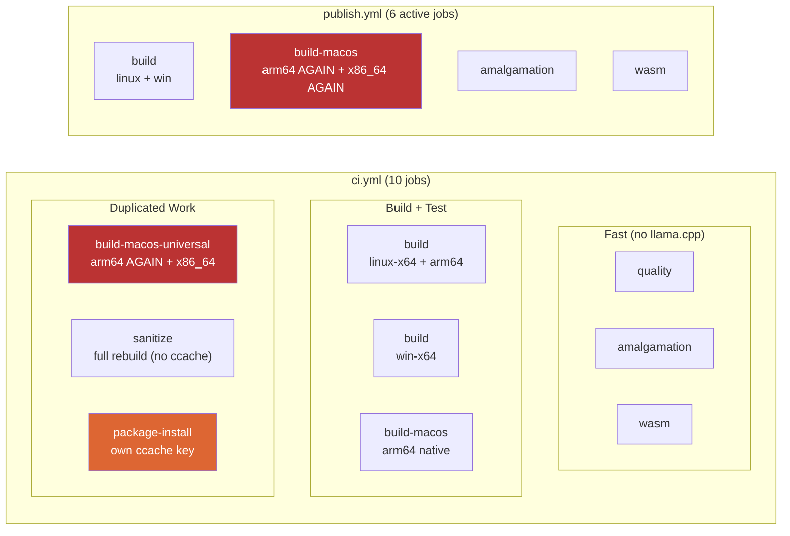
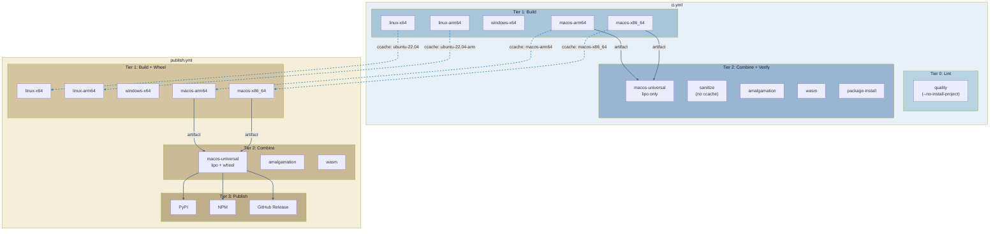

# CI/CD Pipeline Optimisation

## Problem

Cross-workflow analysis of `ci.yml` (10 jobs) and `publish.yml` (6 active + 3 blocked) reveals duplicated compilation, wasted cache, silent invalidation risks, and unnecessary dependency installation.

## Current State



## Findings

### F1: macOS arm64 compiled 3x, x86_64 compiled 2x

| Build | ci build-macos | ci universal | publish | Total |
|-------|---------------|-------------|---------|-------|
| arm64 | 1x | 1x dup | 1x dup | **3x** |
| x86_64 | - | 1x | 1x dup | **2x** |

**Fix:** Split into `macos-arm64`, `macos-x86_64`, `macos-universal` (lipo-only). Per-arch ccache keys shared across workflows.

### F2: package-install has its own ccache key

`package-install` uses ccache key `package-install` while the Linux x86_64 build uses `ubuntu-22.04`. Both compile the same code on the same OS. The package-install job gets a cold cache every time.

**Fix:** Change key to `ubuntu-22.04` to share cache with the build job.

### F3: Dead WASM cache

```yaml
# ci.yml line 410-413
- uses: actions/cache@v5
  with:
    path: vendor/llama.cpp/build-wasm     # never created by lite build
    key: llama-wasm-${{ hashFiles('.gitmodules') }}
```

`make build-wasm-lite` does NOT build llama.cpp. This cache stores an empty or nonexistent directory. The `hashFiles('.gitmodules')` key is meaningless — wasm-lite depends on emscripten + muninn source only.

**Fix:** Remove the `actions/cache` step entirely from the WASM job.

### F4: quality job installs full ML dependency tree

`uv sync --group dev` installs the project's main dependencies (gliner, spacy, sentence-transformers, torch) just to run ruff + mypy. These are ~2GB of packages the quality job never uses.

**Fix:** `uv sync --group dev --no-install-project` skips the project and its main dependencies, keeping only dev tools.

### F5: gguf-test-models cache never invalidates (silent failure risk)

```yaml
key: gguf-test-models    # no hash — serves stale models forever
```

If the test changes which model it downloads (URL change, version bump), the cache still serves the old model. Tests pass/fail based on cached state, not current code.

**Fix:** `key: gguf-models-${{ hashFiles('pytests/test_embed_gguf.py') }}`

### F6: pysqlite3 dynamic link risk in .venv cache

The macOS `.venv` cache key is `venv-macos-${{ hashFiles('uv.lock') }}`. pysqlite3 is compiled from source against Homebrew SQLite. If Homebrew updates SQLite between runs but `uv.lock` doesn't change, the cached pysqlite3 may be linked against a removed `.dylib`. Failure mode: `ImportError` at test time — **visible, not silent**, so low priority.

## Proposed DAG



### Cache invalidation triggers

| Cache | Key | Invalidates when | Scope |
|-------|-----|-----------------|-------|
| **ccache** (hendrikmuhs) | `macos-arm64`, `macos-x86_64`, `ubuntu-22.04`, `ubuntu-22.04-arm` | Source files change (per-object hash) | Shared across ci.yml and publish.yml |
| **uv cache** (setup-uv) | `uv.lock` glob | `uv.lock` changes | Per-workflow |
| **.venv cache** (actions/cache) | `venv-{os}-{hash(uv.lock)}` | `uv.lock` changes | Per-workflow |
| **gguf models** (actions/cache) | `gguf-models-{hash(test_embed_gguf.py)}` | Test file changes model URL | Per-workflow |
| **WASM** | None (removed) | N/A | N/A |

## Implementation Priority

| # | Finding | Impact | Effort | Fix |
|---|---------|--------|--------|-----|
| 1 | F1: macOS 3-job split | High (save ~18 min/run) | Medium | Rewrite macOS jobs in both workflows |
| 2 | F2: package-install key | Medium (save ~3 min) | Trivial | Change `package-install` to `ubuntu-22.04` |
| 3 | F3: Dead WASM cache | Low (cleanup) | Trivial | Delete `actions/cache` step |
| 4 | F4: quality deps | Medium (save ~30s) | Trivial | Add `--no-install-project` |
| 5 | F5: gguf cache key | High (prevent silent) | Trivial | Add hashFiles to cache key |
| 6 | F6: pysqlite3 link | Low (visible failure) | N/A | Monitor only |
