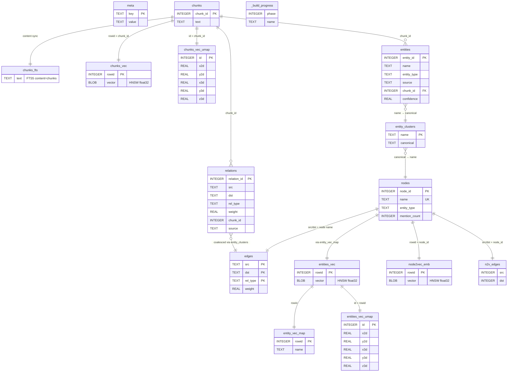

# Plan: WASM Integration + Dynamic DB Selector

> Merge the standalone `wasm/` demo into `viz/` so that both the server-side
> React+FastAPI implementation and the client-side WASM implementation share the
> same databases, CI pipeline, and visual layout — enabling side-by-side
> comparison of two fundamentally different architectures.

## Motivation

The core goal is **side-by-side comparison**: the same knowledge-graph query UI
rendered in two implementations:

| | `/kg/query/` | `/wasm/` |
|---|---|---|
| **SQLite runs** | Server-side (Python `sqlite3` via FastAPI) | Client-side (Emscripten WASM in browser) |
| **Embeddings** | Pre-computed server-side | Computed in-browser (Transformers.js) |
| **Stack** | React + TypeScript + Tailwind + shadcn | Vanilla HTML/JS + CDN libs |
| **Layout & interactions** | **Near-identical** | **Near-identical** |

By co-locating them under `viz/`, we get:

- **Shared demo databases** — both load from the same `viz/public/demos/` folder
- **Shared CI** — `make -C viz ci` runs linting, formatting, typechecking, unit tests, and Playwright E2E across both implementations
- **Single `make -C viz dev`** — starts the FastAPI backend, Vite dev server, and builds the WASM artifacts into Vite's static asset directory

## Status Quo

| Component | Stack | DB loading |
|-----------|-------|------------|
| `wasm/` | Vanilla HTML/JS, CDN libs (Deck.GL, Cytoscape, Transformers.js) | Hardcoded `fetch("assets/3300.db")` → Emscripten FS |
| `viz/` | FastAPI + React (Vite/TS/Tailwind v4/shadcn), 3 explorer modes | Singleton connection via `MUNINN_DB_PATH` env var (default `benchmarks/kg/3300.db`) |
| `demo_builder` | Python package under `benchmarks/demo_builder/` | Outputs `{book_id}_{model}.db` files to a configurable `--output-folder` (default `wasm/assets/`, hardcoded in 3 argparse defaults in `cli.py`) |

### Key Observations

- The WASM demo runs SQLite **entirely in the browser** (Emscripten WASM build of muninn) — no server needed.
- The viz tool runs SQLite **server-side** via FastAPI — browser never touches SQLite directly.
- Both share similar visualizations (Deck.GL point clouds, Cytoscape graphs) but with completely different implementations (vanilla JS vs React components).
- `wasm/assets/` already contains multiple DBs (`3300_MiniLM.db`, `3300_NomicEmbed.db`, `39653_MiniLM.db`, etc.) but the WASM demo ignores all but `3300.db`.
- **Chunking is model-dependent.** The pre-built `{id}_chunks.db` files use a fixed chunk size (~1,485 chars avg) regardless of model. This is wrong — MiniLM truncates at 256 tokens (~800 chars), losing ~30%+ of each chunk, while Nomic Embed v1.5 supports 8,192 tokens and could handle much larger passages. The demo_builder should chunk from raw text per-model, not reuse a shared chunks DB.

  | Model | Max tokens | Ideal chunk target | Current chunks (~1485 chars) |
  |-------|-----------|-------------------|------------------------------|
  | MiniLM L6 v2 | 256 | ~200 tokens (~800 chars) | Truncated — loses info |
  | Nomic Embed v1.5 | 8,192 | ~512-2048 tokens (~2-8K chars) | Underutilized |

---

## Goals

1. **Model-aware chunking** — chunk raw text per embedding model's context window, not a one-size-fits-all pre-built DB.
2. **Side-by-side comparison** — `/kg/query/` (React+FastAPI) and `/wasm/` (vanilla JS+WASM) have near-identical layouts, visualisations, and interactions, but two completely different implementations.
3. **Dynamic DB selection** — both implementations let users pick from any database the demo_builder produces.
4. **Unified CI** — `make -C viz ci` covers linting, formatting, typechecking, unit tests, and Playwright E2E for both implementations.
5. **Single dev command** — `make -C viz dev` starts everything (backend, frontend, WASM build) and serves at `localhost:5280`.
6. **Retire `wasm/` as a standalone app** — all demo UX lives under viz/.

---

## Architecture

### URL Layout

```
localhost:5280/
├── embeddings/          ← React: VSS Explorer (Deck.GL)
├── graph/               ← React: Graph Explorer (Cytoscape)
├── kg/                  ← React: KG Pipeline overview
│   └── query/           ← React: KG three-panel search (FTS + HNSW + Graph)
├── wasm/                ← Static: WASM three-panel search (same layout as /kg/query/)
│   ├── index.html
│   ├── script.js
│   ├── styles.css
│   ├── a.out.js         ← Emscripten JS glue
│   └── a.out.wasm       ← Emscripten WASM binary
└── demos/               ← Static: shared demo databases
    ├── manifest.json
    ├── 3300_MiniLM.db
    └── ...
```

The WASM demo is a **static HTML page** served from `viz/frontend/public/wasm/`, not a React route. Vite copies `public/` contents verbatim to the build output, so `localhost:5280/wasm/index.html` just works — no bundling, no React hydration.

### Database Discovery

A `manifest.json` generated by demo_builder provides the database listing to both implementations.

```
demo_builder build --output-folder viz/frontend/public/demos/
                         │
                         ▼
            viz/frontend/public/demos/
            ├── manifest.json          ← generated by demo_builder
            ├── 3300_MiniLM.db
            ├── 3300_NomicEmbed.db
            ├── 39653_MiniLM.db
            └── ...
```

**`manifest.json`** schema:

```json
{
  "databases": [
    {
      "id": "3300_MiniLM",
      "book_id": 3300,
      "model": "MiniLM",
      "dim": 384,
      "file": "3300_MiniLM.db",
      "size_bytes": 32059392,
      "label": "Wealth of Nations + MiniLM (384d)"
    }
  ]
}
```

### Two Consumption Paths

| Path | Who reads manifest | How DB is loaded |
|------|-------------------|------------------|
| **Server-side** (`/kg/query/`) | FastAPI reads `manifest.json` from disk, exposes `GET /api/databases` | User selects DB → `POST /api/databases/select` → server reopens SQLite connection |
| **Client-side** (`/wasm/`) | JS fetches `/demos/manifest.json` directly (static file) | User selects DB → browser `fetch()`es the `.db` file → writes to Emscripten FS |

### Build Pipeline

```
make -C viz dev
  ├── wasm build (a.out.js + a.out.wasm → viz/frontend/public/wasm/)
  ├── FastAPI backend (port 8200)
  └── Vite dev server (port 5280, proxies /api → 8200)
        ├── React app (/, /embeddings/, /graph/, /kg/)
        └── Static files (public/ → /wasm/, /demos/)
```

### CI Pipeline

```
make -C viz ci
  ├── format         (ruff + prettier — covers both Python and wasm/ JS? or just Python+TS)
  ├── lint           (ruff + eslint)
  ├── typecheck      (mypy + tsc)
  ├── test-api       (pytest)
  ├── test-frontend  (vitest)
  └── test-e2e       (Playwright)
        ├── /kg/query/ E2E scenarios
        └── /wasm/ E2E scenarios     ← NEW: same test scenarios, different URL
```

### Output Schema (ERD)

The demo_builder produces a single `.db` file per (book, model) permutation. The following ERD shows all tables created across the 8 build phases.

This diagram should be added to `benchmarks/demo_builder/README.md` as part of Phase 1.



---

## Implementation Phases

### Phase 0: Model-Aware Chunking in demo_builder

**Goal:** Replace the dependency on pre-built `{id}_chunks.db` with inline chunking from raw text, sized per embedding model.

**Problem:** The current pipeline reads chunks from `benchmarks/kg/{id}_chunks.db` (built by `harness prep kg-chunks`) which uses a single fixed window size (~1,485 chars). MiniLM silently truncates at 256 tokens (~800 chars), losing ~30% of each chunk. Nomic Embed could handle 8K+ chars but gets unnecessarily short passages.

**Changes:**
- `benchmarks/demo_builder/constants.py` — add `max_tokens` (and derived `chunk_chars` target) to each entry in `EMBEDDING_MODELS`:
  ```python
  EMBEDDING_MODELS = {
      "MiniLM": {
          "st_name": "sentence-transformers/all-MiniLM-L6-v2",
          "dim": 384,
          "max_tokens": 256,
          "chunk_chars": 768,   # ~3 chars/token, leave headroom
      },
      "NomicEmbed": {
          "st_name": "nomic-ai/nomic-embed-text-v1.5",
          "dim": 768,
          "max_tokens": 8192,
          "chunk_chars": 4096,  # practical sweet spot, not full context
          "trust_remote_code": True,
      },
  }
  ```
- `benchmarks/demo_builder/phases/chunks.py` — replace the `SELECT ... FROM text_chunks` import with:
  1. Read raw text from `benchmarks/texts/gutenberg_{id}.txt`
  2. Split into chunks using a sliding window sized by `model_config["chunk_chars"]` with ~10% overlap
  3. Insert directly into the `chunks` table
- `benchmarks/demo_builder/discovery.py` — relax `discover_book_ids()` to no longer require `{id}_chunks.db`; only require `gutenberg_{id}.txt` exists
- `benchmarks/demo_builder/tests/` — update tests that assert on chunk counts (counts will now vary by model)
- Remove the `harness prep kg-chunks` prerequisite from the demo_builder workflow

**Chunking strategy:** Simple character-level sliding window with sentence-boundary snapping. No need for a tokenizer in the loop — `chunk_chars` is calibrated conservatively (~3 chars/token) so the model's tokenizer won't exceed `max_tokens`. Overlap ensures no information falls between cracks at chunk boundaries.

### Phase 1: Database Manifest Generation + Default Output Path + README

**Goal:** demo_builder outputs a `manifest.json` alongside the `.db` files, defaults to the shared viz location, and has proper documentation.

**Changes:**
- `benchmarks/demo_builder/README.md` — create with:
  - Overview of the 8-phase build pipeline
  - CLI usage examples (updated to new default output path)
  - MermaidJS ERD diagram of the output database schema (from the Output Schema section above)
  - Prerequisites (ML model downloads, spaCy model, etc.)
- `benchmarks/demo_builder/manifest.py` — add `write_manifest_json(output_folder)` function that scans for completed `.db` files and writes `manifest.json` with metadata (book title, model, dim, size, chunk count)
- `benchmarks/demo_builder/cli.py`:
  - Call `write_manifest_json()` after every successful build
  - **Change default `--output-folder`** from `wasm/assets` → `viz/frontend/public/demos` in all three subcommand parsers (`manifest`, `build`, `clean`). The default is currently hardcoded in argparse `add_argument()` calls at lines 174, 198, and 227
  - Update docstring examples at top of file to reflect new default path
- `benchmarks/demo_builder/constants.py` — add `DEFAULT_OUTPUT_FOLDER = "viz/frontend/public/demos"` constant so the default lives in one place instead of three argparse strings
- `benchmarks/demo_builder/tests/test_cli.py` — update test invocations that pass `--output-folder wasm/assets` to use the new default path
- `benchmarks/demo_builder/tests/test_manifest.py` — update `output_folder = PROJECT_ROOT / "wasm" / "assets"` references (lines 12, 18, 26) to `PROJECT_ROOT / "viz" / "frontend" / "public" / "demos"`
- Add `demos/` to `viz/frontend/public/.gitignore` (DBs are build artifacts, not checked in)

### Phase 2: Server-Side DB Switching

**Goal:** The viz FastAPI backend can switch databases at runtime.

**Changes:**
- `viz/server/config.py` — add `DEMOS_DIR` pointing to `viz/frontend/public/demos/`
- `viz/server/routes/databases.py` — new router:
  - `GET /api/databases` — returns manifest (list of available DBs with metadata)
  - `POST /api/databases/select` — accepts `{ "id": "3300_MiniLM" }`, closes current connection, reopens with new DB path
- `viz/server/services/db.py` — refactor `get_connection()` to support runtime reconnection (close old conn, open new one, re-discover schema)
- Frontend: `DatabaseSelector` component (shadcn Select/Combobox) in the header, shared across all modes

### Phase 3: Move WASM Demo into viz/

**Goal:** The WASM demo lives at `localhost:5280/wasm/index.html`, served as a static page by Vite, sharing demo databases with the React app.

**This is NOT a React rewrite.** The vanilla HTML/JS implementation stays vanilla — that's the whole point (comparing two implementations of the same UI).

**Changes:**
- Move `wasm/index.html`, `wasm/script.js`, `wasm/styles.css` → `viz/frontend/public/wasm/`
- `wasm/script.js`:
  - Replace hardcoded `fetch("assets/3300.db")` with dynamic loading from `/demos/{id}.db`
  - Add DB selector dropdown that reads `/demos/manifest.json`
  - Ensure the WASM module loads from `/wasm/a.out.js` (relative path update)
- `wasm/Makefile` — update build targets to output `a.out.js` + `a.out.wasm` into `viz/frontend/public/wasm/`
- `viz/Makefile` — add a `wasm` target that invokes the WASM build, wire it into `dev` and `ci`:
  ```makefile
  wasm:                                              ## Build WASM artifacts
  	$(MAKE) -C ../wasm build WASM_OUTPUT=../viz/frontend/public/wasm/

  dev: install wasm                                  ## Start dev servers
  ```
- **Layout alignment:** Update the WASM HTML/CSS to match the `/kg/query/` layout:
  - Same header, search bar, three-panel layout (FTS left, HNSW center, Graph right)
  - Same color scheme, spacing, typography (Tailwind CDN classes matching viz's design tokens)
  - Same interactions: search triggers all three panels, click-to-expand, entity highlighting

### Phase 4: Shared Playwright E2E Tests

**Goal:** The same E2E test scenarios run against both `/kg/query/` and `/wasm/`, validating that both implementations produce equivalent results.

**Changes:**
- `viz/frontend/e2e/` — add WASM-specific E2E specs alongside existing ones:
  - `wasm-search.spec.ts` — mirrors the existing KG query E2E: type query → verify FTS results → verify HNSW cloud → verify graph panel
  - `wasm-db-selector.spec.ts` — switch databases, verify schema rediscovery
- Both `/kg/query/` and `/wasm/` E2E tests share a test helper for search assertions (same expected results for same DB + query)
- `viz/Makefile` `ci` target already runs `test-e2e` which picks up all Playwright specs — no change needed there

### Phase 5: Cleanup & Migration

**Goal:** Retire standalone `wasm/` app; everything lives under viz/.

**Changes:**
- Remove `wasm/index.html`, `wasm/script.js`, `wasm/styles.css`, `wasm/e2e/`, `wasm/screenshots/` (now in `viz/frontend/public/wasm/`)
- Remove `wasm/assets/` (DBs now in `viz/frontend/public/demos/`)
- Keep `wasm/Makefile` and `wasm/build/` (WASM compilation still happens here, just outputs to viz/)
- Update `wasm/README.md` — note that the demo now lives at `viz/frontend/public/wasm/` and is accessed via `make -C viz dev`
- Update root `Makefile` if it references `wasm/` demo targets

---

## Key Decisions to Make

1. **DB file serving for WASM mode** — Vite's `public/` folder serves static files directly. For large DBs (30-50MB), this is fine for local dev. For deployment, may want a CDN or lazy-loading strategy. Punt for now?

2. **Transformers.js bundling** — The WASM demo uses CDN `<script type="module">` imports. Keep this as-is since the WASM page is vanilla HTML (not bundled by Vite). No change needed.

3. **Layout parity enforcement** — How strict should "near-identical" be? Options:
   - **Visual comparison:** Playwright screenshots of both pages, manual review
   - **Shared CSS:** Extract a shared stylesheet that both implementations import
   - **Shared design tokens:** Both use Tailwind CDN with the same custom config

4. **Shared vs separate DB selection** — When user switches DB on one page, should it persist if they navigate to the other? A shared `localStorage` key (`muninn-selected-db`) would make this seamless.

---

## Out of Scope

- Deploying to a public URL (local dev only for now)
- Streaming/chunked DB loading for very large databases
- Multi-database comparison views (split-screen showing both implementations simultaneously)
- Authentication or access control on the DB selector
- Rewriting the WASM demo in React (the whole point is two different implementations)
