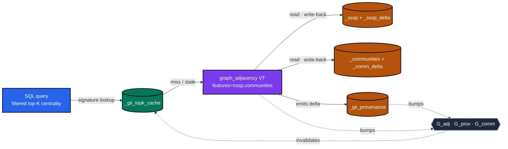
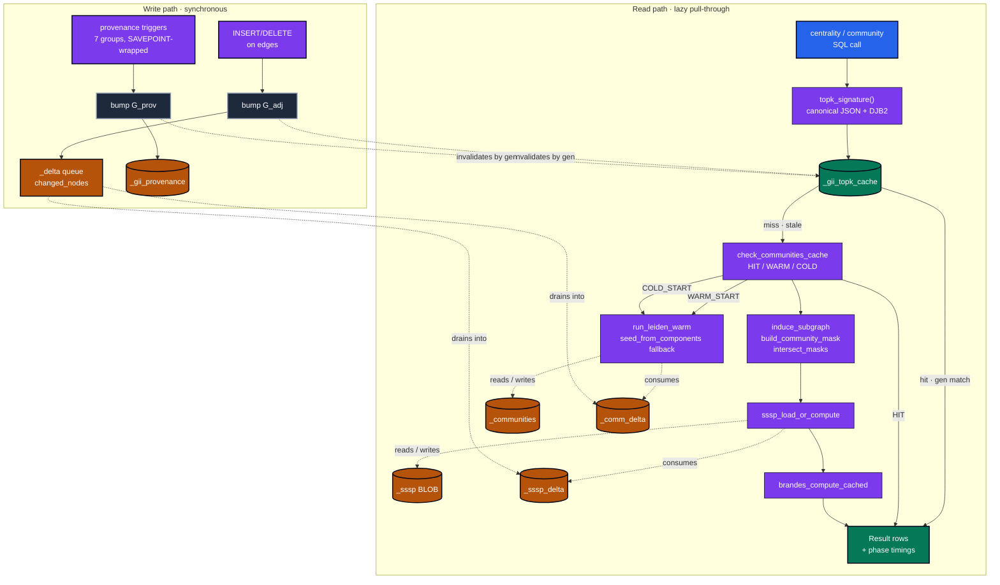

# PR #30 Review — Advanced Incremental Betweenness & Filtering

**Branch:** `feat/advanced-incremental-betweenness-metrics`
**Plan:** [`docs/plans/adv-centrality-filtering.md`](../plans/adv-centrality-filtering.md) — 41 tickets across 7 gaps (G1–G7)
**Size:** +13 456 / −661 across 65 files

The plan was: make filtered, top-K centrality queries on the GII fast enough that the *non-Brandes* phases stop hiding behind Brandes. The approach is **per-shadow-table caches keyed by generation counters**, populated lazily on read and invalidated by a single integer compare. Five new shadow tables, three generation counters, one threshold constant, and a per-gap test gate to keep the loop honest.

---

## TL;DR — What changed

| Gap | Theme | New surface |
|---|---|---|
| **G1** | Provenance triggers | `_gii_provenance` shadow table + 7 trigger groups, bumps `G_prov` |
| **G2** | Top-K result cache | `_gii_topk_cache` keyed by canonical-JSON DJB2 signature |
| **G3** | Brandes share telemetry | `MUNINN_BRANDES_SHARE_THRESHOLD = 0.30` + `PhaseTimings.brandes_share()` |
| **G4–G5** | SSSP shadow + induction | `_sssp` (BLOB dist/sigma), `_sssp_delta` queue, `induce_subgraph()` |
| **G6** | Communities shadow | `_communities` partition + 4 config keys, HIT / WARM_START / COLD_START state machine |
| **G7** | Communities consume | `_comm_delta` cascade, `seed_from_components`, `community_filter` hidden col |

Two new C modules (`provenance.c`, `graph_topk_cache.c`), four extended modules (`graph_adjacency`, `graph_centrality`, `graph_community`, `graph_load`), six new C test files, one new pytest gate, and a `--filter=<prefix>` flag on the test runner so `make test-g1`..`test-g7` work.

---

## Architecture overview (simplified)



**Reading it:** every query hits the top-K cache first (emerald). On miss or generation-stale, the GII (violet) reconstructs the answer using the SSSP and communities shadow tables (amber), each of which is itself a generation-gated cache. Provenance triggers (amber) and write-time edge mutations (violet → slate) bump generation counters; the comparison-on-read in every cache layer makes invalidation O(1) per entry instead of O(n) cache-wipe.

---

## Detailed cache cascade

<details>
<summary>📋 Write-time emit → lazy consume across all five shadow tables (24 nodes)</summary>



</details>

**Reading it:** the left subgraph (`Writes`) is what happens inside a single SAVEPOINT-wrapped trigger fire — counters get bumped, deltas queue up, but no centrality math runs. The right subgraph (`Read`) is what the next centrality query does: signature, generation compare, three-state cache decision (HIT / WARM_START / COLD_START), then the actual induced-subgraph Brandes / warm-started Leiden if needed. The dotted arrows from `Bump*` to `_gii_topk_cache` are the load-bearing simplification — invalidation is *one integer compare per row*, not a wipe.

The `_delta → _sssp_delta` and `_delta → _comm_delta` drains are what makes the cache *incremental* rather than just memoized. A hot edge churn doesn't invalidate every cached SSSP source; it queues the affected sources, and the next read pays only for those.

---

## Hot-spot file map

| File | LoC | Role |
|---|---:|---|
| `src/graph_centrality.c` | 1 941 | Brandes / Dijkstra / closeness — extended with `sssp_load_or_compute`, `brandes_compute_cached`, hidden cols `community_filter` and `community_resolution` |
| `src/graph_adjacency.c` | 2 133 | GII vtab — extended with `features='sssp'/'communities'`, shadow-table lifecycle, `config_get_double`/`config_set_double` |
| `src/graph_community.c` | 1 189 | Leiden — extended with `check_communities_cache`, `run_leiden_warm`, `comm_cascade_emit`, `seed_from_components` |
| `src/provenance.c` | 511 | **NEW** — 7 trigger groups, `_gii_provenance` schema, `G_prov` bumps |
| `src/graph_topk_cache.c` | 318 | **NEW** — canonical-JSON DJB2 signature, lazy `CREATE TABLE`, generation-gated `put`/`get` |
| `src/graph_load.c` | 360 | Shared loader — extended with `build_community_mask`, `induce_subgraph`, `intersect_masks` |

---

## Test surface

The runner gained a `--filter=<prefix>` flag (`test/test_main.c`), and the `RUN_TEST` macro in `test/test_common.h` now consults a `test_should_run()` predicate. That unlocks per-gap gates:

```bash
make test-g1   # provenance triggers
make test-g2   # top-K cache
make test-g3   # Brandes share threshold (C + pytest)
make test-g4   # SSSP shadow
make test-g5   # induced subgraph + delta drain
make test-g6   # communities shadow + state machine
make test-g7   # communities consume + cascade
make test-all-gates   # all of the above, sequenced
```

| File | Tests | Gap |
|---|---:|---|
| `test/test_provenance.c` | 8 | G1 |
| `test/test_topk_cache.c` | 5 | G2 |
| `test/test_brandes_share.c` | 1 | G3 |
| `test/test_gii_sssp_shadow.c` | 6 + 5 | G4 + G5 |
| `test/test_gii_communities_shadow.c` | 7 | G6 |
| `test/test_gii_communities_consume.c` | 7 | G7 |
| `pytests/test_g3_brandes_share.py` | 4 | G3 (Python) |

---

## Two non-obvious design choices worth a second look

1. **Canonical JSON before hashing (`graph_topk_cache.c`).** The signature is `DJB2(canonicalize(filter_predicate))` — yyjson sorts object keys recursively before the hash. This means `{"days":7,"project":"acme"}` and `{"project":"acme","days":7}` collide intentionally; arrays do *not* get reordered (order is semantic). xxh3 was deferred per ADR — DJB2 is fine for a 32-bit cache key inside one process.

2. **Brandes share threshold is a constant, not a tuning knob.** `MUNINN_BRANDES_SHARE_THRESHOLD = 0.30` (`graph_centrality.h`). Above 30 % wall-clock spent in the centrality call, the optimization deferral triggers fire — i.e., the rest of the pipeline is fast enough that further work has to attack Brandes directly (induced-subgraph sampling, sparsifiers, etc.). The pytest gate (`pytests/test_g3_brandes_share.py`) is what captures the "three consecutive runs over threshold" un-defer trigger.

---

## Open follow-ups (deferred from the plan, intentionally)

- **xxh3 hash primitive** — DJB2 is enough for in-process cache keys; xxh3 would be needed if signatures were ever serialized cross-process.
- **TGII (Temporal GII)** — interval math, multi-validity edges, R-tree backing. Out of scope for this PR per `docs/plans/graph/00_gap_analysis.md`.
- **Sparsifier-backed Brandes** — only un-defers if the G3 telemetry sweep crosses 30 % three runs in a row.
