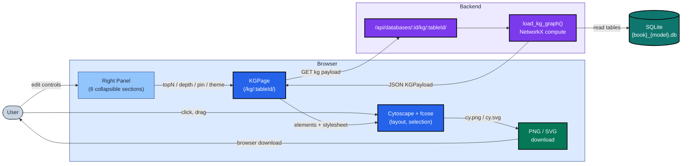
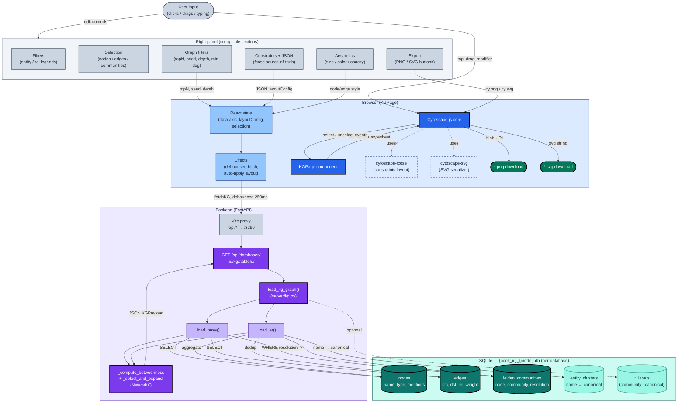

# `/kg/er/` Cytoscape Visualization — Architecture

Architecture reference for the entity-resolved knowledge-graph view served at
`/<database_id>/kg/er/` (and `/<database_id>/kg/base/`). Two diagrams: a
narrative overview that fits the page, and a detailed reference that traces
every layer from a user click to a SQLite query.

## What this view does

For each demo database, the page renders the knowledge graph as a
Cytoscape.js canvas. Nodes are entities (or canonical clusters when
`tableId === 'er'`); edges are typed relations; community parents are
compound nodes from the Leiden clustering. The right panel exposes
collapsible sections for filters, selection inspection, server-side graph
parameters, fcose layout constraints, aesthetic styling, and PNG/SVG
export.

---

## Architecture overview

**Read-it-as:** the user drives Cytoscape clicks and the right-panel
controls; the panel and KGPage between them own all client state; data
flows once per parameter change from Cytoscape's host page → FastAPI →
the per-database SQLite file → back to Cytoscape as a JSON payload that
becomes elements; PNG/SVG export goes straight from the in-browser
Cytoscape instance to the user's filesystem (no round-trip).

---

## Detailed reference

Full pipeline — every component, every read path

### How to read the detailed view

- **Solid arrows** are runtime data flow (request, response, render).
- **Dashed `.uses.` arrows** mean "registered as a Cytoscape plugin" —
  no data flows along them at request time.
- **Dotted arrows** mark read-only inspection paths
  (`Selection` reads from `KGPage`; it doesn't drive state changes).
- **Subgraph color** keys the layer: blue = Browser, slate = Right
  Panel, violet = Backend, teal = SQLite.

### Critical paths to remember

- **`base` vs `er`** — only the loader branch (`_load_base` /
  `_load_er`) differs. `base` returns raw NER entities; `er` returns
  cluster heads with edges deduplicated and node metadata aggregated.
  Everything downstream (centrality, BFS expansion, payload assembly)
  is identical.
- **All graph computation is in-memory NetworkX**, not SQL. Betweenness
  centrality is computed on the *full* loaded graph, then BFS-expansion
  + min-degree pruning narrow the result to seeds × depth before the
  payload is sent.
- **Constraints are JSON-resident.** The `Constraints` panel section
  mutates `layoutConfig` (a string) directly; the `parsedConstraints`
  view derives from it each render. This is why a Pin click immediately
  appears in the JSON textarea — the JSON is the source of truth, not a
  shadowed React state.
- **Export bypasses the backend.** Cytoscape's `cy.png()` and
  `cy.svg()` operate on the live in-browser graph; PNG and SVG
  downloads do not call any API endpoint.
